### **nature computational science**

**Supplementary information**

**Article** <https://doi.org/10.1038/s43588-026-00957-3>

# **Self-optimized spectral distance for lowlight high-throughput Raman hyperspectral imaging**

In the format provided by the authors and unedited

#### Contents

| 1 | Optimization process of SSD (Supplementary Algorithm 1)                                                                                  | 3  |
|---|------------------------------------------------------------------------------------------------------------------------------------------|----|
| 2 | Architecture of the designed network (Supplementary Table 1 and Supplementary Table 2)                                                | 4  |
| 3 | Effectiveness of the Spectral Distance Transformer (SDTrans) module (Supplementary Figure 1)                                          | 6  |
| 4 | Effectiveness of the Spatial-Aware Attention (SAA) mechanism (Supplementary Figure 2)                                                 | 8  |
| 5 | Optical configuration of Raman HSI                                                                                                       | 10 |
| 6 | Method for generating simulated Raman hyperspectral images (Supplementary Figure 3)                                                   | 11 |
| 7 | Supplemental unmixing results on the 'HN URVC' character pattern Raman hyperspectral images (Supplementary Figure 4)               | 13 |
| 8 | Supplemental reconstruction results on the Gaussian distribution like pattern Raman hyperspectral images (Supplementary Fig ure 5) | 15 |
| 9 | Visualization of prior images and optimized spectral distance (Supplementary Figure 6)                                                | 17 |
|   | 10 Evaluation on cellular Raman hyperspectral images (Supple mentary Figure 7)                                                        | 19 |
|   | 11 Simulated Raman hyperspectral images for detection of tiny polystyrene microparticles (Supplementary Figure 8)                     | 21 |
|   | 12 Evaluation of SSD performance limit on the polystyrene mi croparticles dataset (Supplementary Figure 9)                            | 22 |
|   | 13 Supplemental results on Raman hyperspectral images of polystyrene microparticles (Supplementary Figure 10)                         | 24 |
|   | 14 Results of classification polystyrene microparticles (Supplemen tary Figure 11)                                                    | 26 |
|   | 15 Evaluation of SSD performance on PS/PMMA microsphere mixtures (Supplementary Figure 12)                             | 28 |
|   | 16 Validation of SSD across multiple Raman systems (Supplemen tary Figure 13)                                                         | 30 |
|   | 17 Evaluation of SSD performance under varying spectral band widths (Supplementary Figure 14)                                         | 32 |

| 18 Evaluation of SSD performance under spatial undersampling conditions (Supplementary Figure 15)                                   | 34 |
|----------------------------------------------------------------------------------------------------------------------------------------|----|
| 19 Supplemental results on Raman hyperspectral images of phar maceuticals (Supplementary Figure 16 and Supplementary Fig ure 17) | 36 |
| 20 Discussion about solo utilization of SSD (Supplementary Figure 18)                                                               | 39 |
| 21 Discussion about the difference between SSD prior and typical deep image prior (Supplementary Figure 19 and Figure 20)           | 42 |
| 22 Evaluation of warm-starting SSD with pretrained weights (Sup plementary Figure 21)                                               | 45 |
| 23 Evaluation of stability and initialization sensitivity of SSD (Sup plementary Figure 22)                                         | 47 |
| 24 Discussion about the hyperparameter setting (Supplementary Table 3)                                                              | 49 |
| 25 Discussion about constraints on the network output (Supple mentary Table 4)                                                      | 51 |
| 26 Quantitative comparison on stimulated Raman hyperspectral images (Supplementary Table 5)                                         | 53 |
| 27 Quantitative comparison on real-captured Raman hyperspec tral images (Supplementary Table 6 and Supplementary Table 7)        | 55 |
| 28 Visualization of reconstruction results on the chessboard pat tern Raman hyperspectral images (Supplementary Video 1)            | 57 |
| 29 Unmixing results on the volumetric cellular Raman hyperspec tral images (Supplementary Video 2)                                  | 57 |
| 30 Reconstruction results on the cellular Raman hyperspectral im ages (Supplementary Video 3)                                       | 57 |
| 31 Reconstruction results on the polystyrene microparticles Ra man hyperspectral images (Supplementary Video 4)                     | 57 |

#### Supplementary Section 1 Optimization process of SSD (Supplementary Algorithm [1\)](#page-3-1)

Here, we provide details of the process of optimization for reconstructing highquality Raman hyperspectral images. As described in the Methods Section 4.1, the optimization problem is divided into multiple subproblems. The solution of the Z-subproblem is presented in the main paper. Below, we outline the solution for the variables X, S, and U.

X-subproblem. At the k-th iteration (1 ≤ k ≤ K), given Y, S k−1 , Z k−1 , and Uk−1 , the X-subproblem has a closed-form solution

$$\mathbf{X}^{k} = \left(\mathbf{I} + \rho \mathbf{I}\right)^{-1} \left[\mathbf{Y} - \mathbf{S}^{k-1} + \rho \left(\mathbf{Z}^{k-1} - \mathbf{U}^{k-1}\right)\right],\tag{1}$$

where I + ρI represents a scaled identity matrix.

S-subproblem. At the k-th iteration, given Y and X k , the solution for S can be obtained via a soft-shrinkage thresholding function SλS (·)

$$S_{\lambda_S}(\boldsymbol{\beta}) = \begin{cases} \boldsymbol{\beta} - \lambda_S, & \text{if } \boldsymbol{\beta} - \lambda_S \ge 0 \& \boldsymbol{\beta} \ge 0, \\ \boldsymbol{\beta} + \lambda_S, & \text{if } \boldsymbol{\beta} - \lambda_S \le 0 \& \boldsymbol{\beta} \le 0, \\ 0, & \text{otherwise.} \end{cases}$$
 (2)

Thus, we update S k as

$$\mathbf{S}^k = S_{\lambda_S}(\mathbf{Y} - \mathbf{X}^k). \tag{3}$$

U-subproblem. Given X k and Z k , the Lagrange multiplier Uk is updated using the dual ascent method,

$$\mathbf{U}^k = \mathbf{U}^{k-1} + (\mathbf{X}^k - \mathbf{Z}^k). \tag{4}$$

The complete SSD optimization process is summarized in Algorithm [1](#page-3-1) below.

#### Supplementary Algorithm 1 SSD for fast Raman hyperspectral imaging

Require: Y and parameters (K, T, ρ, λS, and λR)

Initial X, Z, S, and U.

while not converged or k ≤ K do

- 1: Update X k by Eq. [\(1\)](#page-3-2)
- 2: Update Z k

while t ≤ T do

Update parameters of the untrained neural network Wt

t = t + 1.

end while

- 3: Update S k by Eq. [\(3\)](#page-3-3)
- 4: Update Uk by Eq. [\(4\)](#page-3-4)
- 5: k = k + 1

end while

Output: X or Z

## Supplementary Section 2 Architecture of the designed network (Supplementary Table 1 and Supplementary Table 2)

The architecture of the proposed network and the Spectral Distance Transformer (SDTrans) are detailed in Supplementary Table 1 and Table 2, respectively.

**Supplementary Table** 1: Architecture of designed untrained neural network. Here, Conv, Act, Up, and Concat refer to the convolutional layer, activation function, upsampling layer, and concatenation operation, respectively.

| Layer  | Specification                                                                      | Spatial size of feature maps                |
|--------|------------------------------------------------------------------------------------|---------------------------------------------|
| Input  | Initial spectral distance                                                          | $B\times H\times W$                         |
| E1     | 2D Conv + Act + SDTrans + Act (Filters: 3, Stride: 2, Padding: 1)               | $N_c \times \frac{H}{2} \times \frac{W}{2}$ |
| S1     | 2D Conv + Act + SDTrans + Act (Filters: 3, Stride: 1, Padding: 1)               | $N_c \times H \times W$                     |
| E2     | 2D Conv + Act + SDTrans + Act (Filters: 3, Stride: 2, Padding: 1)               | $N_c \times \frac{H}{4} \times \frac{W}{4}$ |
| S2     | 2D Conv + Act + SDTrans + Act (Filters: 3, Stride: 1, Padding: 1)               | $N_c \times \frac{H}{2} \times \frac{W}{2}$ |
| E3     | 2D Conv + Act + SDTrans + Act (Filters: 3, Stride: 2, Padding: 1)               | $N_c \times \frac{H}{8} \times \frac{W}{8}$ |
| S3     | 2D Conv + Act + SDTrans + Act (Filters: 3, Stride: 1, Padding: 1)               | $N_c \times \frac{H}{4} \times \frac{W}{4}$ |
| D3     | Up + Concat + 2D Conv + Act + SDTrans + Act (Filters: 3, Stride: 1, Padding: 1) | $N_c \times \frac{H}{4} \times \frac{W}{4}$ |
| D2     | Up + Concat + 2D Conv + Act + SDTrans + Act (Filters: 3, Stride: 1, Padding: 1) | $N_c \times \frac{H}{2} \times \frac{W}{2}$ |
| D1     | Up + Concat + 2D Conv + Act + SDTrans + Act (Filters: 3, Stride: 1, Padding: 1) | $N_c \times H \times W$                     |
| Output | Optimized Spectral Distance                                                        | $B\times H\times W$                         |

The network architecture includes three encoder blocks (E1 to E3), three skip-connection blocks (S1 to S3), and three decoder blocks (D1 to D3). The input spectral distance, with dimensions  $B \times H \times W$ , is processed sequentially through encoder layers E1 to E3. Each encoder block is paired with a corresponding skip-connection block that transfers feature maps to the decoder block. Specifically, the S1 block receives the initial spectral distance, while S2 and S3 process the feature maps from E1 and E2, respectively. During the encoding phase, the spatial dimensions of the feature maps are progressively reduced, from  $N_c \times \frac{H}{2} \times \frac{W}{2}$  in E1, to  $N_c \times \frac{H}{4} \times \frac{W}{4}$  in E2, and further to  $N_c \times \frac{H}{8} \times \frac{W}{8}$  in E3.

In the decoding phase, feature maps from E3 are first upsampled and concatenated with the corresponding skip-connection feature maps. These combined features are then passed through decoder blocks. The final output, representing optimized spectral distance, matches the input dimensions  $(B \times H \times W)$ . Each convolutional layer in the encoder and decoder blocks has a kernel size of 3, with specified stride and padding. Leaky Rectified Linear Unit (ReLU) activation functions [1] are applied at each stage to enhance learning efficiency.

The input feature maps, with dimensions of  $c \times h \times w$ , are first processed through two sequential Transformer layers. Each Transformer layer includes a multi-head attention mechanism, which enables the model to capture the long-range dependencies. Following the attention mechanism, a residual connection is applied to preserve information from previous layers, and layer normalization

**Supplementary Table** 2: Architecture of the designed spectral difference transformer (SDTrans), where FC, Conv, Add, LN, BN, Act, and AP represent the full-connected layer, convolutional layer, residual connection, layer normalization, batch normalization, activation function, and adaptive average pooling, respectively.

| Layer                                   | Specification                                                                                                                      | Spatial size of feature maps |
|-----------------------------------------|------------------------------------------------------------------------------------------------------------------------------------|------------------------------|
| Input                                   | Input features                                                                                                                     | $c \times h \times w$        |
| Transformer- Multi-head attention | FC for transformation (Number of attention heads: 8) 2D Conv for positional embedding (Filters: 3, Stride: 2, Padding: 1) | $c \times h \times w$        |
|                                         | $\mathrm{Add} + \mathrm{LN}$                                                                                                       |                              |
| Transformer- Projection layer 1   | 2D Conv for feature embedding (Filters: 1, Stride: 1, Padding: 0)                                                                  | $c \times h \times w$        |
|                                         | Add + BN + Act                                                                                                                     |                              |
| Transformer- Projection layer 2   | 2D Conv for feature embedding (Filters: 1, Stride: 1, Padding: 0)                                                                  | $c \times h \times w$        |
|                                         | Add input features                                                                                                                 |                              |
| Spatial-aware attention                 | AP for reducing the size (Output size: 8 × 8) FC for transformation (Reduction ratio: 16)                                          |                              |
| Transformer- Projection layer 3   | 2D Conv for feature embedding (Filters: 1, Stride: 1, Padding: 0)                                                                  | $c \times h \times w$        |
| Output Output features                  |                                                                                                                                    | $c \times h \times w$        |

(LN) is performed to stabilize training. The multi-head attention mechanism utilizes fully-connected (FC) layers to map the input features into queries, keys, and values, in addition to 2D convolutional layers for positional embedding. The convolutional layers in the Transformer projection layers are configured with a kernel size of 1, a stride of 1, and no padding.

After the Transformer layers, batch normalization (BN) and a Leaky ReLU activation function are applied to increase the non-linearity and stabilize training. A second projection layer then processes the feature maps before the spatial-aware attention mechanism. The spatial-aware attention mechanism uses adaptive average pooling (AP) to reduce spatial dimensions to  $8\times 8$ , creating a more compact representation for calculating the relationship among channels. Then, a channel attention mechanism is implemented via FC layers to enhance the model's ability to capture dependencies across channels. Finally, a projection layer outputs the processed features.

#### Supplementary Section 3 Effectiveness of the Spectral Distance Transformer (SDTrans) module (Supplementary Figure [1\)](#page-7-0)

Supplementary Figure [1](#page-7-0) demonstrates the effectiveness of the proposed Spectral Distance Transformer (SDTrans) module by comparing the performance of the SSD method both with and without the SDTrans. In the SSD configuration without the SDTrans module, a standard convolutional layer is used instead. The experimental setup remains consistent across both configurations to ensure fairness. Specifically, we compare the two configurations on two simulated Raman hyperspectral image datasets: one with a Gaussian distribution-like pattern and the other with a chessboard pattern. The performance is evaluated using PSNR, SSIM [\[2\]](#page-58-1), and SAM metrics. As shown in the following figure, the SSD method with the SDTrans module consistently outperforms the version without SDTrans, achieving higher PSNR and SSIM values, indicating superior image reconstruction quality, and lower SAM values, which reflect enhanced spectral fidelity. These results underscore the crucial role of the SDTrans module in improving both spatial and spectral accuracy in the SSD method.

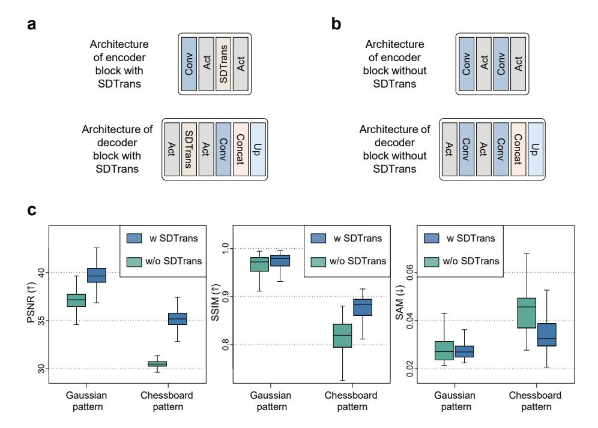

Supplementary Figure 1: Performance comparison between the SSD method with and without the proposed Spectral Distance Transformer (SDTrans) module. a, The architecture of the encoder and decoder blocks in the SSD method incorporating the SDTrans module. b, The architecture of the SSD method without the SDTrans module, replaced by a common convolutional layer. c, Performance comparison of the SSD method with (blue) and without (green) the SDTrans module on the Gaussian distributionlike pattern, and chessboard pattern Raman hyperspectral image datasets. The evaluation metrics include PSNR, SSIM, and SAM. In all box plots, the central line denotes the median; the bounds of the box represent the interquartile range from the 25th percentile to the 75th percentile; the whiskers extend to the minimum and maximum non-outlier values (PSNR and SSIM plots: n = 500 spectral bands; SAM plot: n = 32400 pixels).

#### Supplementary Section 4 Effectiveness of the Spatial-Aware Attention (SAA) mechanism (Supplementary Figure [2\)](#page-9-0)

To evaluate the impact of the proposed Spatial-Aware Attention (SAA) mechanism, Supplementary Figure [2](#page-9-0) presents a detailed comparison of the SSD algorithm's performance across three configurations: SDTrans with the Spatial-Aware Attention mechanism (w SAA), with the Channel Attention mechanism (w CA) [\[3\]](#page-58-2), and without any attention mechanism (w/o SAA). The evaluation was conducted on the Gaussian distribution-like pattern Raman hyperspectral image dataset. Each configuration is illustrated in Supplementary Figure [2a](#page-9-0) to [2c.](#page-9-0)

Specifically, Supplementary Figure [2d](#page-9-0) compares the performance of these configurations using three evaluation metrics: PSNR, SSIM, and SAM. The results indicate that the SSD model with the SAA mechanism consistently outperforms the other configurations. In terms of PSNR, SSD with SAA achieves the highest values, reflecting superior image reconstruction quality. For SSIM, both SSD with SAA and CA show high values, with SAA providing a notable improvement. Furthermore, the SAM metric-assessing spectral fidelity by comparing the spectral angle between the ground truth and reconstructed imagesshows that SSD with SAA considerably outperforms SSD without any attention mechanism.

Overall, Supplementary Figure [2](#page-9-0) highlights the superior performance of the spatial-aware attention mechanism in enhancing both image quality and spectral fidelity in hyperspectral imaging. While the channel attention mechanism also provides some performance improvement, spatial-aware attention delivers more comprehensive benefits, particularly in preserving both spatial and spectral integrity. In contrast, the model without any attention mechanisms shows substantially lower performance across all metrics, emphasizing the critical role of attention mechanisms, especially the proposed spatial-aware attention, in enhancing the SSD method's Raman hyperspectral image reconstruction capabilities.

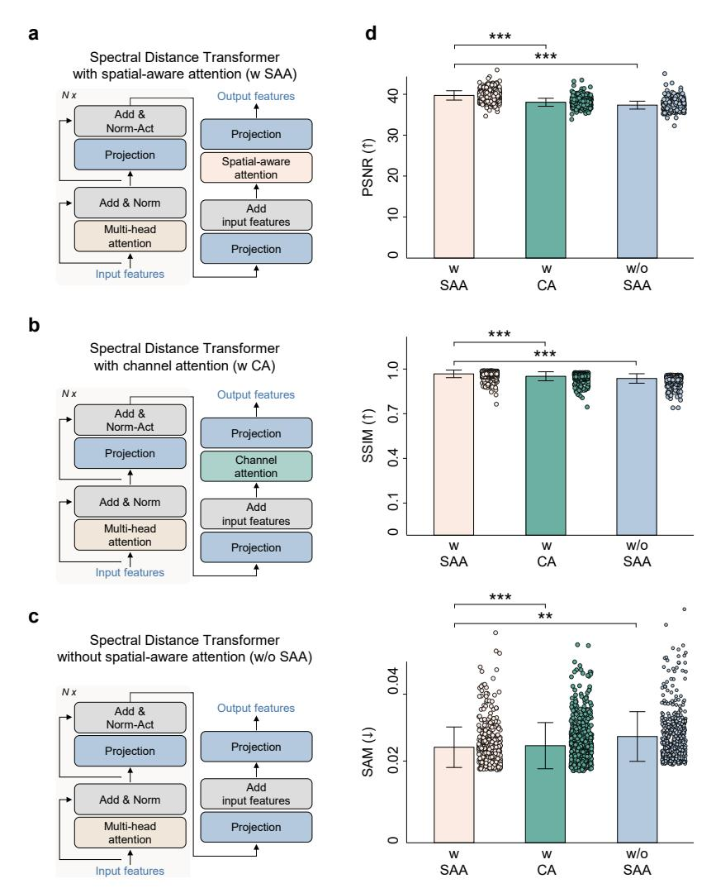

Supplementary Figure 2: Comparison of performance of the SSD algorithm with the proposed Spatial-Aware Attention mechanism (w SAA), with Channel Attention mechanism (w CA), and without attention mechanism (w/o SAA). a, The architecture of the SDTrans with the proposed SAA mechanism. b, The architecture of the SDTrans with the CA mechanism. c, The architecture of the SDTrans without any attention mechanism. d, Quantitative comparison of SSD with different configurations using PSNR, SSIM, and SAM metrics on the Gaussian distribution-like pattern Raman hyperspectral images. P-values were calculated using a two-sided unpaired t-test (PSNR and SSIM plots: n = 500 spectral bands; SAM plot: n = 500 pixels). P = 1.83 × 10−106, 2.32 × 10−177 between w SAA and w CA, and w/o SAA in PSNR plot, respectively. P = 3.05 × 10−6 , 3.69 × 10−6 between w SAA and w CA, and w/o SAA in SSIM plot, respectively. P = 1.95 × 10−6 , 1.68 × 10−3 between w SAA and w CA, and w/o SAA in SAM plot, respectively. Error bar denotes standard deviation.

#### Supplementary Section 5 Optical configuration of Raman HSI

Here, we provide a detailed description of the optical configuration of the spontaneous Raman hyperspectral imaging (HSI) system used for capturing Raman spectra. As shown in Fig. 1a, the system consists of several key components, including a laser source, sample stage, detector, and various optical elements. The system begins with the laser source, where the laser beam is first purified using a clean-up filter (F1) to eliminate any unwanted wavelengths, ensuring that only the desired laser wavelength is directed toward the sample. The purified beam then passes through two lenses (L1 and L2), which expand the beam to the required size. A reflection mirror (M) redirects the expanded beam toward a dichroic mirror (DM), which further guides the laser to the sample. The laser is focused onto the sample using an objective lens (OB), and the scattered photons are collected back through the same lens. To block Rayleigh scattering and isolate the Raman signal, a notch or long-pass filter (F2) is used. The filtered Raman signal is then focused onto a slit (S) by lens L3, ensuring both spatial and spectral resolution. Subsequently, the signal is collimated by lens L4, passed through a diffraction grating (G) to disperse the signal into its spectral components, and finally focused onto the detector by lens L5. This optical setup enables the accurate collection of Raman spectra, facilitating high-resolution hyperspectral imaging. This configuration is implemented in the Renishaw inVia Raman microscope, used to capture Raman hyperspectral images of paramecia (Fig. 1e), GES-1 human gastric epithelial cells (Fig. 3), polystyrene microspheres (Fig. 4a), and pharmaceutical tablets (Fig. 5b).

In addition to the microscope-based setup, we also employ a line-scan-based Raman HSI system for capturing large-view images of pharmaceutical tablets (Fig. 5a). Our system uses a 532 nm laser with a maximum power of 500 mW. For laser beam shaping, a customized cylindrical lens with a divergence angle of 110 is paired with a 19 mm achromatic doublet (AC127-019-A, Thorlabs). A protected aluminum mirror (PF10-03-G01, Thorlabs) and a long-pass dichroic mirror (DMLP550, Thorlabs) direct the laser beam onto the sample stage for imaging. Four 50 mm f/2.8 camera lenses (MVL50M23, NAVITAR) serve as the objective lens and for lenses L3, L4, and L5 in the optical configuration. The long-pass filter (F2) has a cut-on wavelength of 550 nm (FELH0550, Thorlabs), effectively blocking Rayleigh scattering while transmitting the Raman signal. A 30 µm wide, 3 mm long slit (S30K, Thorlabs) is used to ensure proper resolution. The diffraction grating is a 1200 lines/mm ruled reflective grating (Edmund Optics), dispersing the Raman signal into its constituent spectral lines. Finally, the signal is captured by a 1280×1024 camera (MV-CA013-A0GM, HIKROBOT), which records the Raman hyperspectral data. This line-scan configuration is optimized for capturing large-area Raman images, making it ideal for analyzing pharmaceutical tablets and other large sample areas.

#### Supplementary Section 6 Method for generating simulated Raman hyperspectral images (Supplementary Figure [3\)](#page-12-0)

Supplementary Figure [3](#page-12-0) illustrates the endmembers and corresponding abundance maps used to generate the three simulated Raman hyperspectral datasets. The endmembers, generated using RamanSpy [\[4\]](#page-58-3), exhibit distinct spectral characteristics. These endmembers are then combined with different abundance maps to create the simulated Raman images. Supplementary Figure [3b](#page-12-0) shows the manually created abundance maps for the 'HNURVC' character pattern dataset, where each letter corresponds to a specific endmember. Abundance maps for the Gaussian distribution-like (Supplementary Figure [3c\)](#page-12-0) and chessboard (Supplementary Figure [3d\)](#page-12-0) pattern datasets were generated using RamanSpy. The Gaussian distribution-like data features smooth gradients, while the chessboard pattern consists of block-like structures.

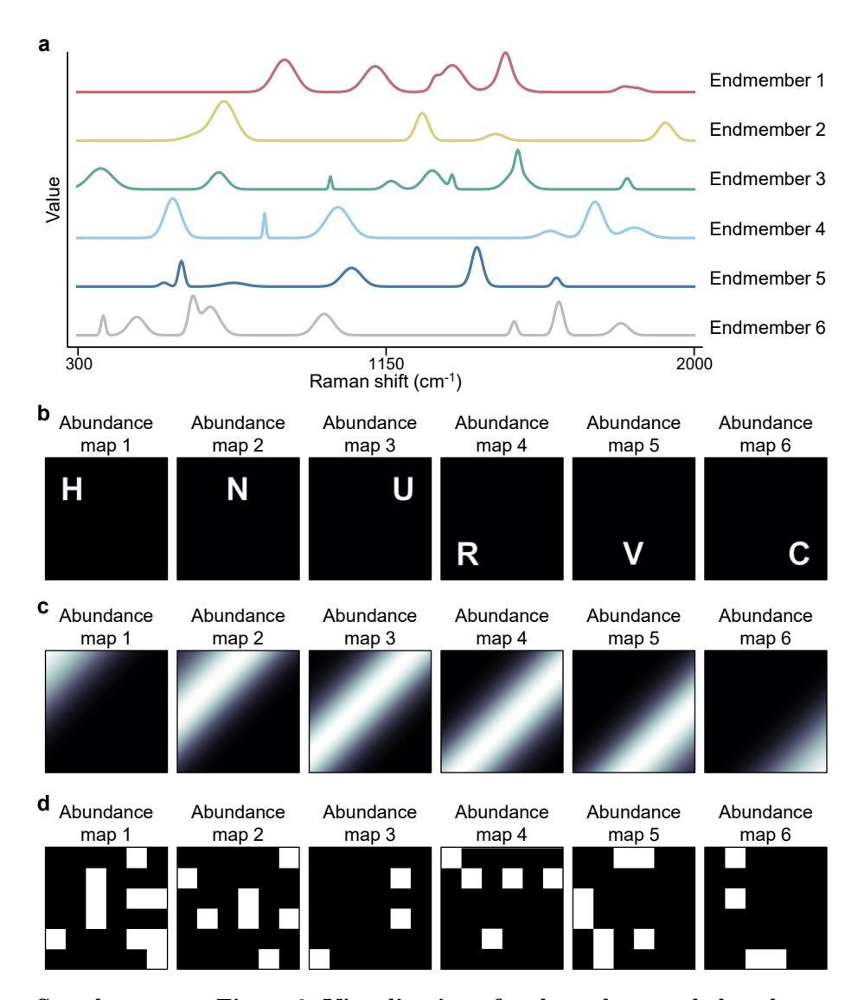

Supplementary Figure 3: Visualization of endmembers and abundance maps used to generate simulated Raman hyperspectral images. a, Spectral signatures of the six endmembers. b, Abundance maps corresponding to the six endmembers used for generating the 'HNURVC' character pattern Raman hyperspectral images. c, Abundance maps used for generating the Gaussian distribution-like pattern dataset. d, Abundance maps used for generating the chessboard pattern Raman hyperspectral images.

#### Supplementary Section 7 Supplemental unmixing results on the 'HN URVC' character pattern Raman hyperspectral images (Supplementary Figure [4\)](#page-14-0)

Supplementary Figure [4](#page-14-0) compares the unmixing results of SLNet-, AUNet-, and SSD-reconstructed 'HNURVC' character pattern Raman hyperspectral data. In Supplementary Figure S[4a,](#page-14-0) the unmixing results from the SLNet-reconstructed data are shown. The top part of the figure presents the spectra of endmembers extracted using the N-FINDR algorithm [\[5\]](#page-58-4) on the SLNet-reconstructed data (yellow lines), compared to the reference spectra (red lines). Substantial deviations from the reference spectra are observed, suggesting that SLNet struggles to preserve accurate spectral information. Below the spectra, the corresponding abundance maps generated using the Fully Constrained Least Squares (FCLS) method [\[6\]](#page-58-5), reveal that SLNet fails to accurately reconstruct both spectral and spatial details.

Supplementary Figure [4b](#page-14-0) presents the unmixing results for the AUNet reconstructed data. The endmember spectra extracted from the AUNet-reconstructed data (green lines) are compared to the reference endmembers (red lines). AUNet also shows notable discrepancies. The corresponding abundance maps indicate that the shapes of the 'HNURVC' characters are less defined compared to the reference maps, suggesting that AUNet still struggles to preserve both spectral and spatial fidelity.

In Supplementary Figure [4c,](#page-14-0) the unmixing results for the SSD-reconstructed data are displayed. The extracted endmember spectra (blue lines) closely align with the reference spectra (red lines), demonstrating SSD's ability to preserve critical spectral features. The corresponding abundance maps exhibit high spatial accuracy, with sharply defined 'HNURVC' characters that match the reference maps almost perfectly. These results highlight the SSD method's effectiveness in reconstructing both spectral and spatial details, even from noisy raw data. In conclusion, Supplementary Figure [4](#page-14-0) underscores the considerable improvements achieved using the SSD method.

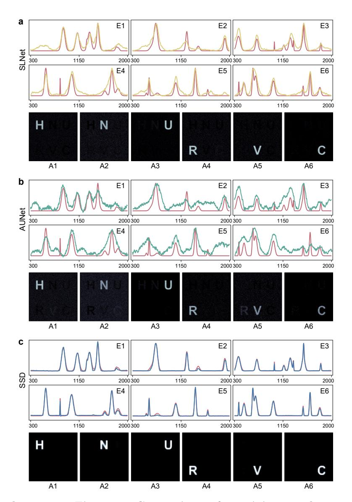

Supplementary Figure 4: Comparison of unmixing results on the SLNet-, AUNet-, and SSD-reconstructed 'HNURVC' character pattern Raman hyperspectral images. a, Spectra of extracted endmembers by applying the N-FINDR algorithm on SLNet-reconstructed data (yellow lines), compared with spectra of reference endmembers (red lines). Below, the corresponding abundance maps were generated using the FCLS method. b, Spectra of endmembers extracted from AUNet-reconstructed data (green lines), along with spectra of reference endmembers (red lines). The corresponding decomposed abundance maps are shown below. c, Spectra of endmembers extracted from SSD-reconstructed data (blue lines) and spectra of reference endmembers, along with corresponding decomposed abundance maps.

#### Supplementary Section 8 Supplemental reconstruction results on the Gaussian distribution-like pattern Raman hyperspectral images (Supplementary Figure [5\)](#page-16-0)

Supplementary Figure [5](#page-16-0) showcases the reconstruction results for Gaussian distribution like pattern Raman hyperspectral images, comparing raw data with reconstructions from SLNet, AUNet, and SSD. Supplementary Figure [5a](#page-16-0) presents the raw Raman hyperspectral data, displaying four selected spectral bands (120th, 220th, 350th, and 440th). The intensity profiles along four white dashed lines (denoted as 'i' to 'vi'), spanning across the image, are also provided to illustrate the spatial variations in the spectral data more clearly.

Supplementary Figure [5b](#page-16-0) shows the SLNet reconstruction. The left part displays the four selected spectral bands, while the right part presents the intensity profiles along the same four dashed lines. Although the SLNet reconstruction improves upon the raw data, some spatial inconsistencies remain, particularly in the intensity profiles. Supplementary Figure [5c](#page-16-0) presents the AUNet reconstruction, with the same layout as the SLNet results. AUNet's reconstruction also shows poor results, with pronounced spatial inconsistencies in the intensity profiles.

Finally, Supplementary Figure [5d](#page-16-0) presents the SSD reconstruction, which demonstrates the most considerable improvement. The SSD reconstruction preserves spectral details and spatial accuracy well, with intensity profiles that accurately reflect spectral information compared to the other methods. This confirms SSD's superior reconstruction capabilities. In summary, Supplementary Figure [5](#page-16-0) emphasizes the outstanding performance of SSD in reconstructing Gaussian distribution-like pattern Raman hyperspectral images, preserving both spectral and spatial information effectively. While SLNet and AUNet show some improvement over the raw data, SSD consistently outperforms both methods in terms of spectral fidelity and spatial accuracy.

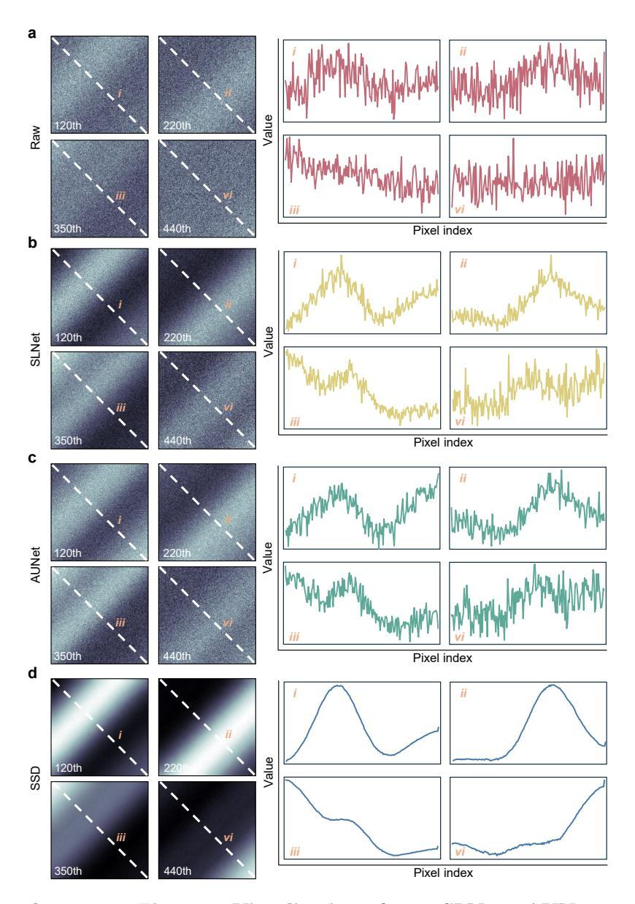

Supplementary Figure 5: Visualization of raw, SLNet-, AUNet-, and SSD-reconstructed Gaussian distribution-like pattern Raman hyperspectral images. a, The selected four bands of the raw Raman hyperspectral data (left). Intensity profiles along four white dashed lines (right). b, The selected four bands of the SLNet-reconstruction data (left). Intensity profiles along four white dashed lines (right). c, The selected four bands of the AUNet-reconstruction data (left). Intensity profiles along four white dashed lines (right). d, The selected four bands of the SSD-reconstruction data (left). Intensity profiles along four white dashed lines (right).

#### Supplementary Section 9 Visualization of prior images and optimized spectral distance (Supplementary Figure [6\)](#page-18-0)

Supplementary Figure [6](#page-18-0) provides a detailed comparison of prior images and the spectral distances between the prior image and key Raman bands. Supplementary Figure [6a](#page-18-0) presents the prior image of the ground truth (GT) chessboard pattern Raman hyperspectral data on the left, with the corresponding spectral distances at key Raman bands (ranging from 21st to 452nd) shown on the right. Supplementary Figure S[6b](#page-18-0) displays the prior image and spectral distances for the SLNet-reconstructed data. It is evident that the spectral distance of the SLNet-reconstructed data exhibits notable noise and discrepancies compared to the GT. Supplementary Figure [6c](#page-18-0) presents the prior image and spectral distance for the AUNet-reconstructed data. AUNet performs worse than SLNet in terms of spectral alignment, with substantial variations in the spectral distance when compared to the GT.

Finally, Supplementary Figure [6d](#page-18-0) shows the prior image and spectral distance for the SSD-reconstructed data. Notably, the spectral distance closely matches the GT across all key Raman bands, demonstrating that SSD achieves highly accurate spectral reconstruction. This highlights the advantages of SSD in capturing fine spectral details and delivering high-fidelity reconstructions when compared to both SLNet and AUNet.

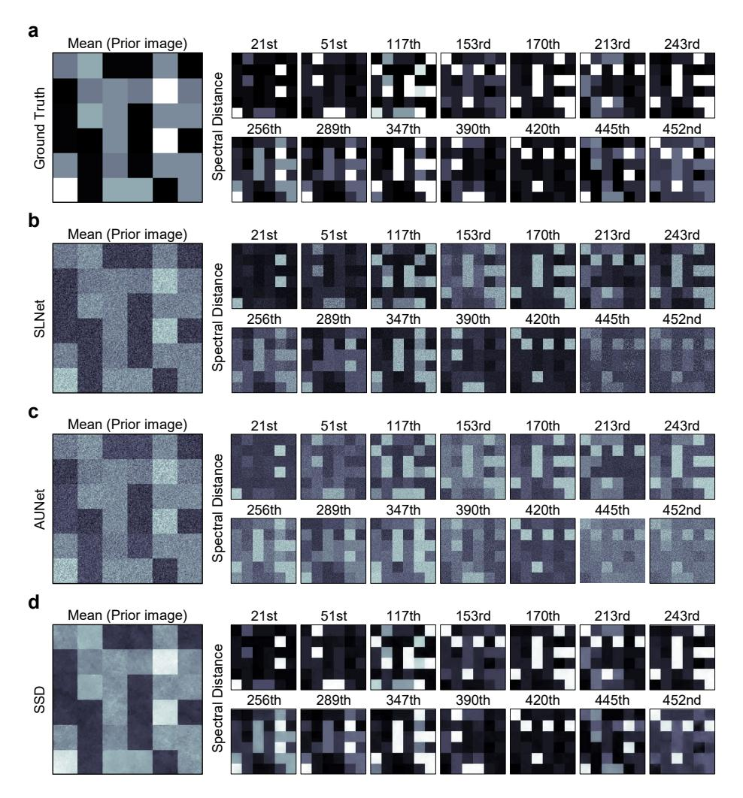

Supplementary Figure 6: Visualization of prior images and spectral distance between the prior image and key Raman bands. a, Comparison of the prior image (mean) and spectral distance at key Raman bands (from 21st to 452nd) of the Ground Truth (GT) chessboard pattern Raman hyperspectral images. b, Comparison of the prior image and spectral distance at key Raman bands of the SLNet-reconstructed data. c, Comparison of the prior image and spectral distance of the AUNet-reconstructed data. d, Comparison of the prior image and spectral distance of the SSD-reconstructed data.

#### Supplementary Section 10 Evaluation on cellular Raman hyperspectral images (Supplementary Figure [7\)](#page-20-0)

We present a comprehensive evaluation of the proposed SSD method on cellular Raman hyperspectral images and compares it with existing techniques. First, we collect Raman hyperspectral images of another paramecium using a Renishaw inVia Raman microscope. The laser power, step size, and spectral range were set to the same one used in capturing data of Fig. 1e. And the integration time was set to 0.01 s. The obtained low-SNR paramecium Raman hyperspectral images dataset has a dimension of 240 × 120 × 1015, where 240 and 120 denote the spatial height and width, and 1015 is the number of Raman bands. Supplementary Figure [7a](#page-20-0) compares the unmixing results on the raw Raman hyperspectral images of paramecium and the SSD-reconstructed data. It is obvious SSD greatly improves the data fidelity. Supplementary Figure [7b](#page-20-0) visualizes the raw data alongside the reconstructed data using the SavGol, SVD, and SSD methods at three key Raman bands: 1003.2 cm−1 , 1252.8 cm−1 , and 1551.5 cm−1 . The SSD method shows superior reconstruction quality, preserving spectral features while effectively reducing noise. In addition, Supplementary Figure [7b](#page-20-0) compares Raman spectra at specific points 'A' and 'B' within the Paramecium Raman image. The spectra derived from raw data and the reconstructed data using SavGol, SVD, and SSD methods are presented. The SSD-reconstructed spectra exhibit improved clarity and fidelity, highlighting the advantages of the SSD method in spectral reconstruction.

Supplementary Figure [7c](#page-20-0) shows the unmixing results of human gastric epithelial cells Raman hyperspectral images reconstructed by SavGol, SVD, and SSD method. The decomposed abundance maps (A1, A2, A3) and endmember spectra are compared across the methods. The SSD method provides more accurate and distinct abundance maps, demonstrating its ability to distinguish cellular components with higher precision. The endmember spectra further confirm the improved spectral resolution achieved by SSD. In conclusion, the SSD method outperforms traditional techniques in reconstructing and analyzing cellular Raman hyperspectral images, offering enhanced spectral fidelity and more precise unmixing results. This advancement holds promise for detailed cellular analysis and biomedical applications.

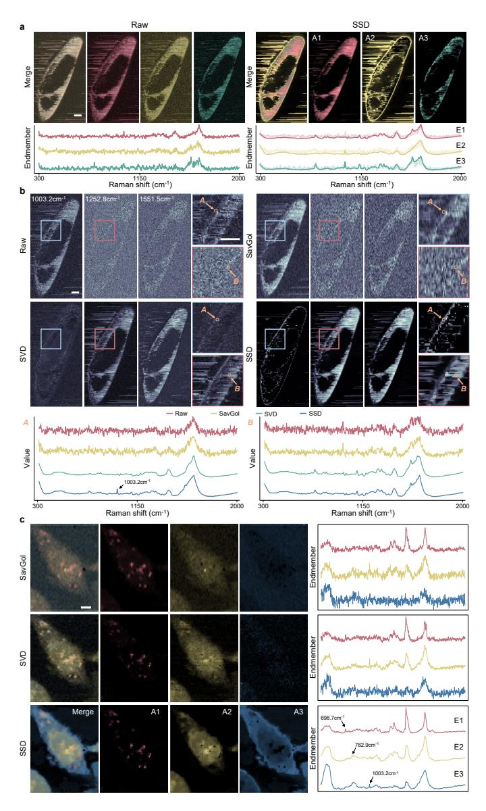

Supplementary Figure 7: Comparison of SSD with existing methods on cellular Raman hyperspectral images. a, Comparison of unmixing results on raw paramecium Raman hyperspectral images and SSD reconstructed data. A1-A3 denote three decomposed abundance maps and the corresponding solved endmembers (E1-E3) are displayed below. b, Visualization of raw, SavGol-, SVD-, and SSD reconstructed data at three Raman bands. Raman spectra at points 'A' and 'B' of raw and different methods reconstructed Paramecium Raman image. c, Unmixing results of SavGol-, SVD-, and SSD-reconstructed Raman data of human gastric epithelial cells. Decomposed abundance maps and endmember of different methods are compared. Scale bar, 20  $\mu$ m (a, b) and 5  $\mu$ m (c).

#### Supplementary Section 11 Simulated Raman hyperspectral images for detection of tiny polystyrene microparticles (Supplementary Figure [8\)](#page-21-1)

Supplementary Figure [8](#page-21-1) illustrates the methodology for generating simulated Raman hyperspectral images to assess the detection capability of tiny polystyrene microparticles. Supplementary Figure [8a](#page-21-1) shows high-quality Raman spectra of two endmembers obtained using a long exposure time and high-power laser. Supplementary Figure [8b](#page-21-1) presents the binary abundance maps that simulate the spatial distribution of the tiny polystyrene microparticles within the sample. In these maps, abundance map 1 represents the distribution of polystyrene microparticles, and abundance map 2 corresponds to the background (glass slide). Supplementary Figure [8c](#page-21-1) details the process for generating both high signalto-noise ratio (SNR) reference data and low-SNR raw data. The high-SNR reference data is generated by computing the matrix product of the endmember spectra and the abundance maps. To replicate realistic noise conditions, a baseline signal, Gaussian noise, and Poisson noise are sequentially added to the reference data, creating low-SNR raw data that emulates typical experimental conditions.

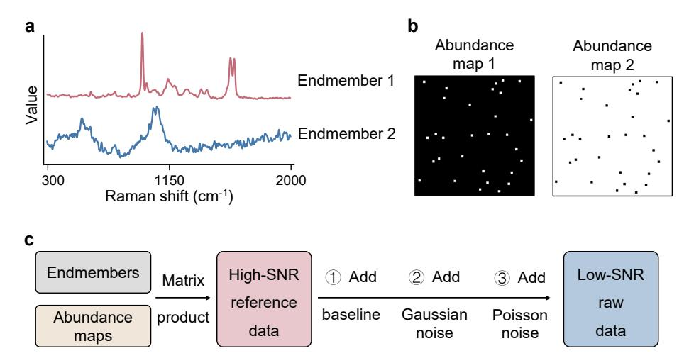

Supplementary Figure 8: Methodology for generating simulated Raman hyperspectral images of tiny polystyrene microparticles. a, Highquality Raman spectra of polystyrene (endmember 1) and a glass slide (endmember 2). b, Binary abundance maps depicting the spatial distribution of the two endmembers in the simulated dataset. Abundance 1 represents polystyrene microparticles (white dots), while Abundance 2 corresponds to the background (glass slide). c, Process for generating high-SNR reference data and low-SNR raw Raman hyperspectral data. The high-SNR reference is produced by multiplying the endmember spectra with the abundance maps (matrix product). To simulate real-world conditions, a baseline signal, Gaussian noise, and Poisson noise are sequentially added to the high-SNR data to create the final low-SNR raw Raman hyperspectral images.

#### Supplementary Section 12 Evaluation of SSD performance limit on the polystyrene microparticles dataset (Supplementary Figure [9\)](#page-23-0)

To investigate the performance limit of the proposed SSD method, we conducted Raman imaging experiments on polystyrene (PS) microspheres under progressively reduced photon budgets (Supplementary Figure [9a\)](#page-23-0). Raman spectra were first acquired under the following acquisition conditions, and their corresponding SNR values were measured:

- Reference: 1 s integration time, 50 mW laser power (SNR ≈ 308).
- 10× reduction: 1 s integration time, 5 mW laser power (SNR ≈ 20).
- 100× reduction: 0.1 s integration time, 5 mW laser power (SNR ≈ 6).
- 1000× reduction: 0.01 s integration time, 5 mW laser power (SNR ≈ 4).

Based on these measurements, we further simulated raw hyperspectral data by adding Poisson-Gaussian mixed noise to the reference dataset, generating inputs spanning SNR levels from 4 to 20.

The corresponding SSD reconstructions are shown in Supplementary Figure [9b](#page-23-0) and Supplementary Figure [9c.](#page-23-0) SSD faithfully reconstructs both spatial morphology and spectral signatures of PS microspheres even when the raw SNR is as low as ∼4 (equivalent to a 0.01 s exposure at 5 mW). Representative spectra from points 'A'-'C' confirm that Raman peaks are preserved with high fidelity. Quantitative evaluation (Supplementary Figure [9c\)](#page-23-0) further demonstrates consistent SNR improvements across all tested conditions. These results indicate that SSD can reliably preserve both spatial and spectral fidelity under photon budgets reduced by 10-1000×. Below this regime, spectral peaks become indistinguishable from noise, and reconstruction may not be stable.

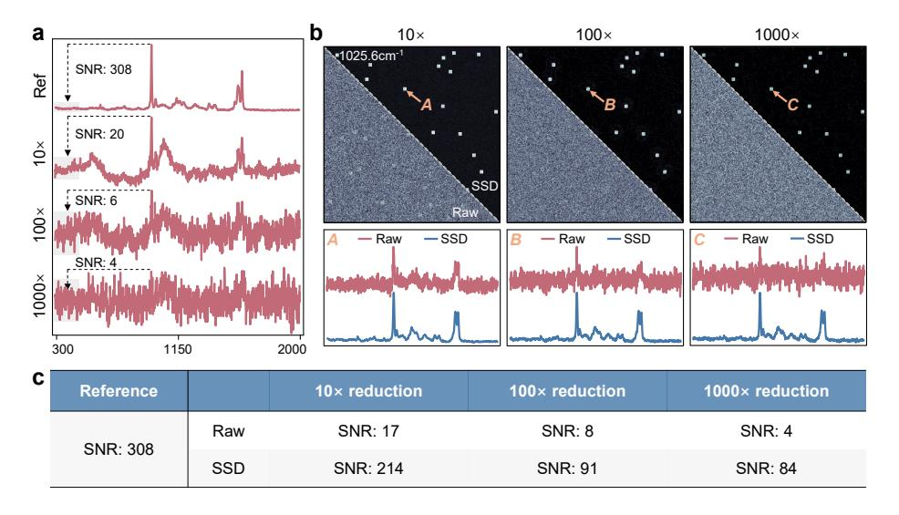

Supplementary Figure 9: Evaluation of SSD performance under different photon budgets. a, Experimentally acquired Raman spectra of polystyrene microspheres under different acquisition conditions, with measured SNR values indicated. b, Simulated Raman hyperspectral images of PS microspheres at varying SNR levels, together with the corresponding SSD reconstructions. Representative spectra at points 'A', 'B', and 'C' are shown for comparison between raw and SSD reconstructed results. c, Quantitative SNR comparison of the simulated raw spectra and the corresponding SSD results.

#### Supplementary Section 13 Supplemental results on Raman hyperspectral images of polystyrene microparticles (Supplementary Figure [10\)](#page-25-0)

Supplementary Figure [10](#page-25-0) presents a thorough comparison of the reconstruction and unmixing results on the simulated Raman hyperspectral images of tiny polystyrene microparticles. In Supplementary Figure [10a,](#page-25-0) the indices for the 30 microparticles are labeled. Supplementary Figure [10b](#page-25-0) compares the Raman spectra of the labeled microparticles from the SLNet-, AUNet-, and SSD-reconstructed data. The SSD-reconstructed spectra (blue lines) exhibit the highest fidelity, with well-defined peaks and minimal noise, closely matching the Raman signatures of polystyrene. In contrast, the SLNet-reconstructed spectra (yellow lines) show moderate accuracy, with some spectral distortions and noise. The AUNet-reconstructed spectra (green lines) reveal substantial noise and distortions, with several spectral features poorly captured. This comparison highlights SSD's superior ability to recover accurate spectral information, even from noisy data, which is crucial for identifying small and sparsely distributed particles.

Supplementary Figure [10c](#page-25-0) visualizes the abundance maps obtained using unmixing methods combining the N-FINDR algorithm and the FCLS method. The results for the Ground Truth (GT), raw data, and data reconstructed by SLNet, AUNet, and SSD are shown. The abundance maps illustrate the spatial distribution of the microparticles, where black pixels represent the background (glass slide), and white pixels represent the polystyrene particles. The GT abundance map provides a clear baseline with distinct particle boundaries and accurate spatial positions. The raw data abundance map, however, is noisy and lacks clear separation between particles and background, reflecting the challenges of unmixing directly from noisy data. In the abundance maps of SLNet-reconstructed data, the polystyrene microparticles are partially recovered, but pronounced noise and artifacts remain, making the spatial distribution unclear. The AUNet abundance map shows a worse separation between particles and background. In contrast, the abundance map of SSD-reconstructed data exhibits a sharp, clean separation between the microparticles and the background, closely resembling the GT distribution. The particles are clearly delineated with minimal noise, demonstrating SSD's effectiveness in recovering spatial details from noisy hyperspectral data.

Overall, Supplementary Figure [10](#page-25-0) emphasizes the advantages of SSD over SLNet and AUNet in both spectral and spatial recovery for Raman hyperspectral imaging, particularly in detecting small particles in noisy environments.

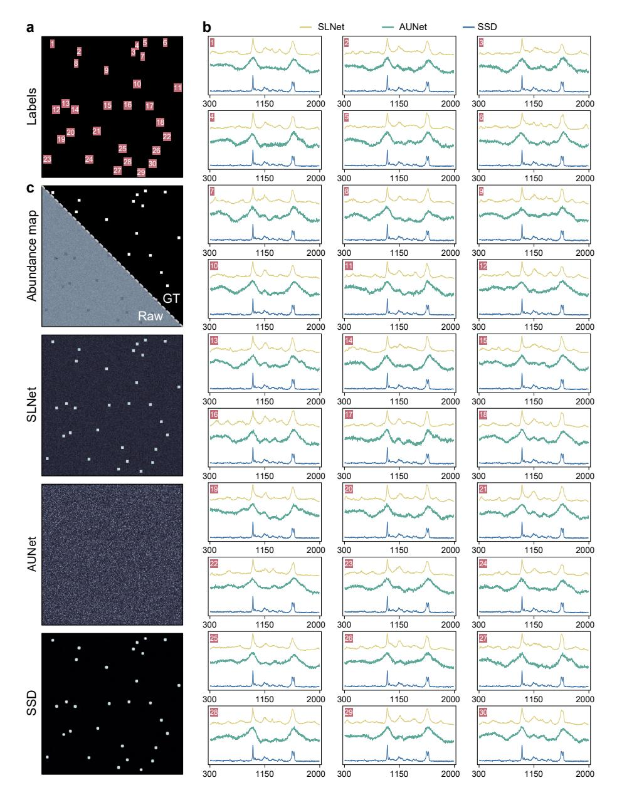

Supplementary Figure 10: Comparison of reconstruction and unmixing results on stimulated polystyrene microparticles Raman hyperspectral images. a, Indices labeling 30 individual polystyrene microparticles. b, Comparison of the reconstructed Raman spectra of the labeled 30 microparticles. Spectra of SLNet-, AUNet-, and SSD-reconstructed data are shown in yellow, green, and blue lines, respectively. c, Visualization of abundance maps obtained by blind unmixing the ground truth, raw, SLNet-, AUNet-, and SSDreconstructed Raman hyperspectral images.

#### Supplementary Section 14 Results of classification polystyrene microparticles (Supplementary Figure [11\)](#page-27-0)

Supplementary Figure [11](#page-27-0) demonstrates the process and outcomes of classifying tiny polystyrene microparticles using a Random Forest classifier applied to raw data and images reconstructed by various methods. Supplementary Figure [11a](#page-27-0) illustrates the training process for the classifier. The training dataset includes two classes: high-quality Raman spectra of polystyrene microparticles, labeled as 1, and spectra of the glass slide background, labeled as 0. Before classification, the data undergoes min-max normalization to ensure consistent scaling, thereby enhancing the classifier's performance and stability. Supplementary Figure [11b](#page-27-0) presents the classification results. For the raw data, high noise levels hinder classification, as the model struggles to distinguish microparticles from the background. In the SavGol-reconstructed images, classification improves slightly, but noise artifacts still lead to numerous false positives. SVDreconstructed data show further improvements, with clearer boundaries and fewer false classifications. However, compared to these existing methods, our proposed SSD-reconstructed data yield the most accurate classification results, demonstrating the superior performance of SSD in accurately identifying the polystyrene microparticles.

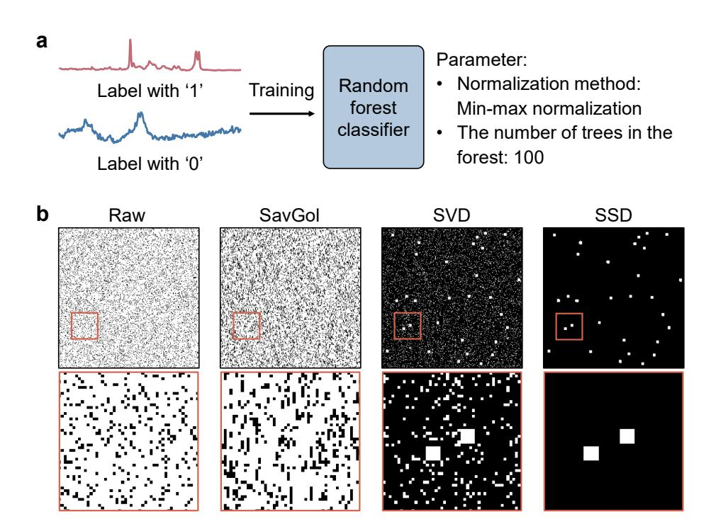

Supplementary Figure 11: Process of training the Random forest classifier and the classification results. a, Illustration of the process used to train the Random forest classifier. The training dataset includes high-quality Raman spectra of the polystyrene microparticles (labeled with 1) and glass slide spectra (labeled with 0). b, Classification results of applying the trained Random forest model to raw, SavGol-, SVD-, and SSD-reconstructed Raman hyperspectral images of tiny polystyrene microparticles, with a zoomed-in region for better visualization.

#### Supplementary Section 15 Evaluation of SSD performance on PS/P-MMA microsphere mixtures (Supplementary Figure [12\)](#page-29-0)

To evaluate the chemical specificity of SSD beyond single-component samples, additional Raman imaging experiments were conducted on mixtures of polystyrene (PS) and polymethyl methacrylate (PMMA) microspheres, which exhibit partially overlapping Raman bands. Two imaging experiments were designed to test the ability of SSD to distinguish chemically distinct species under low-SNR conditions and different spatial sampling regimes. In the fine sampling condition, a 60 × 40 spatial grid with a 2 µm step size was acquired using a 0.1 s exposure time and 5 mW laser power, providing high spatial resolution over a relatively small field of view. In the coarse sampling condition, a 90 × 70 grid with a 4 µm step size was acquired under the same exposure and power, yielding a larger field of view at the expense of reduced spatial resolution and mimicking a faster detection scenario. All datasets were collected using a Renishaw inVia Raman microscope equipped with a 532 nm excitation laser, a Leica N PLAN 10×/0.25 objective lens, and an 1800 lines/mm grating.

The results are presented in Supplementary Figure [12.](#page-29-0) Under the fine sampling condition, SSD substantially enhanced image contrast and spectral quality (Supplementary Figure [12a](#page-29-0) and Supplementary Figure [12b\)](#page-29-0), enabling reliable discrimination between PS and PMMA microspheres. Representative spectra from points 'A' (PMMA) and 'B' (PS) show that SSD preserved sharp Raman peaks that were obscured in the raw noisy data. Furthermore, t-SNE visualization and hierarchical clustering of the decomposed data demonstrated that SSD processing produced two clearly separated clusters corresponding to PS and PMMA, confirming its ability to preserve chemical specificity.

Under the coarse sampling condition (Supplementary Figure [12c-e\)](#page-29-0), despite the lower spatial resolution, SSD successfully restored chemically specific Raman spectra and maintained accurate classification of PS and PMMA microspheres across the larger field of view. Representative spectra from points 'C' (PMMA) and 'D' (PS) again confirmed that SSD recovered Raman peaks otherwise buried in noise. Data visualization in t-SNE space and clustering maps showed improved separation and classification reliability compared with raw data.

Overall, these experiments demonstrate that SSD not only improves spatial clarity and spectral fidelity under low-SNR conditions but also preserves chemical specificity in multi-component mixtures, thereby strengthening its applicability to realistic Raman imaging scenarios involving complex samples.

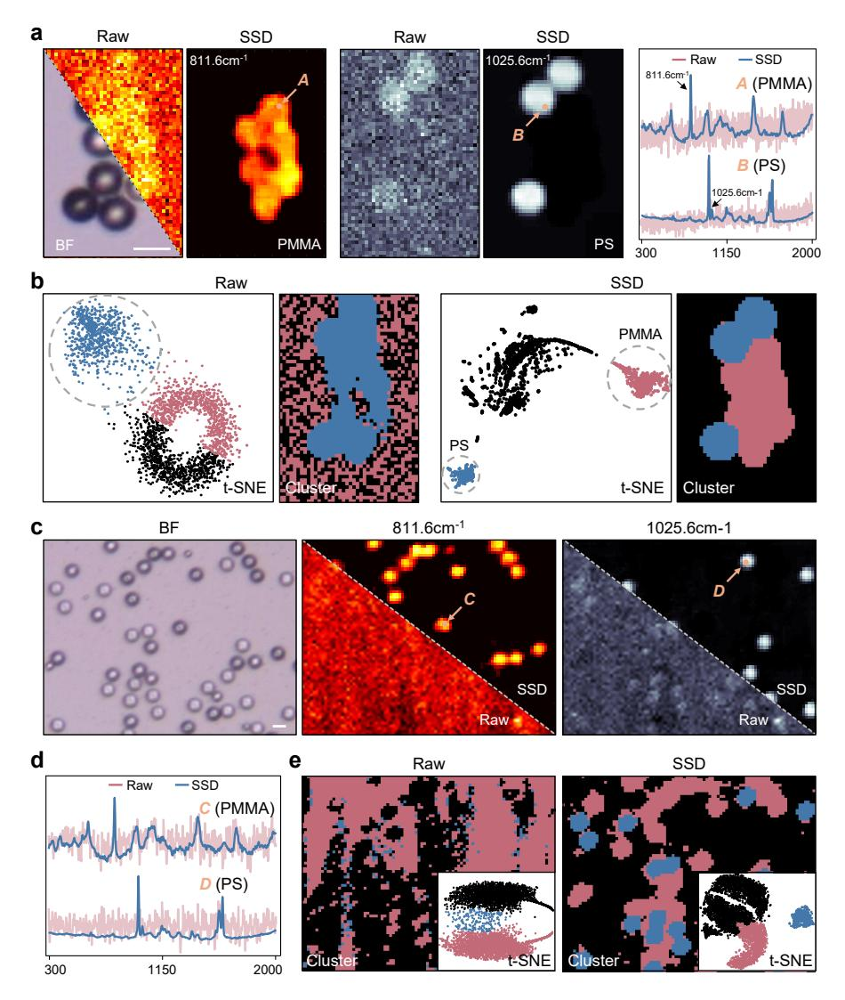

Supplementary Figure 12: SSD reconstruction results for PS/PMMA microsphere mixtures under different sampling conditions. a, Brightfield (BF) image and Raman intensity maps at 811.6 cm−1 and 1025.6 cm−1 comparing raw and SSD results under fine sampling (2 µm step). The right plot presents spectra from point 'A' (PMMA) and 'B' (PS). b, Data visualization and clustering results. t-SNE embedding of raw spectra shows overlap between PS and PMMA, whereas SSD processing produces two well-separated clusters. Hierarchical clustering of the t-SNE decomposed data yields clearer classification maps, further confirming SSD's preservation of chemical specificity. c, BF image and Raman intensity maps at 811.6 cm−1 and 1025.6 cm−1 at lower spatial sampling density (4 µm step). d, Representative spectra from point 'C' (PMMA) and 'D' (PS). e, t-SNE visualization and hierarchical clustering results at the larger field of view scene. Scale bar, 20 µm.

#### Supplementary Section 16 Validation of SSD across multiple Raman systems (Supplementary Figure [13\)](#page-31-0)

The general applicability of SSD across different Raman instruments and experimental conditions is critical to its practical utility. To systematically evaluate its robustness, we conducted additional experiments on three distinct Raman systems that vary in excitation wavelength, spectrometer configuration, and optical setup. Supplementary Figure [13a](#page-31-0) summarizes the three experimental setups.

- System I used a Renishaw inVia spectrometer with 532 nm excitation, a 10× objective, a 1 µm step size, and a spectral range of 266-2005 cm−1 .
- System II used a WITec alpha300 system with 488 nm excitation, a 50× objective, a 0.7 µm step size, and a spectral range of 388-3280 cm−1 .
- System III used the same WITec alpha300 but with 633 nm excitation, a 50× objective, a 0.7 µm step size, and a spectral range of 583-3138 cm−1 .

Laser powers were set to 5 mW, 15 mW, and 33 mW for Systems I-III, respectively. These configurations cover a diverse range of instrument types, excitation conditions, and spectral windows.

The reconstruction results are shown in Supplementary Figure [13b-d.](#page-31-0) Despite substantial differences across the three setups, SSD consistently produced high-quality reconstructions. For all systems, bead morphology was recovered with sharper boundaries compared to the noisy raw inputs, and Raman peaks were faithfully preserved with improved spectral clarity. Intensity profiles further confirmed the fine spatial details of SSD, showing enhanced SNR and accurate reconstruction independent of the acquisition system.

These findings demonstrate that SSD is not limited to a specific Raman setup but generalizes robustly across diverse platforms, under multiple excitation wavelengths and spectral configurations. Such adaptability confirms the potential of SSD as an instrument-independent solution for Raman hyperspectral image restoration.

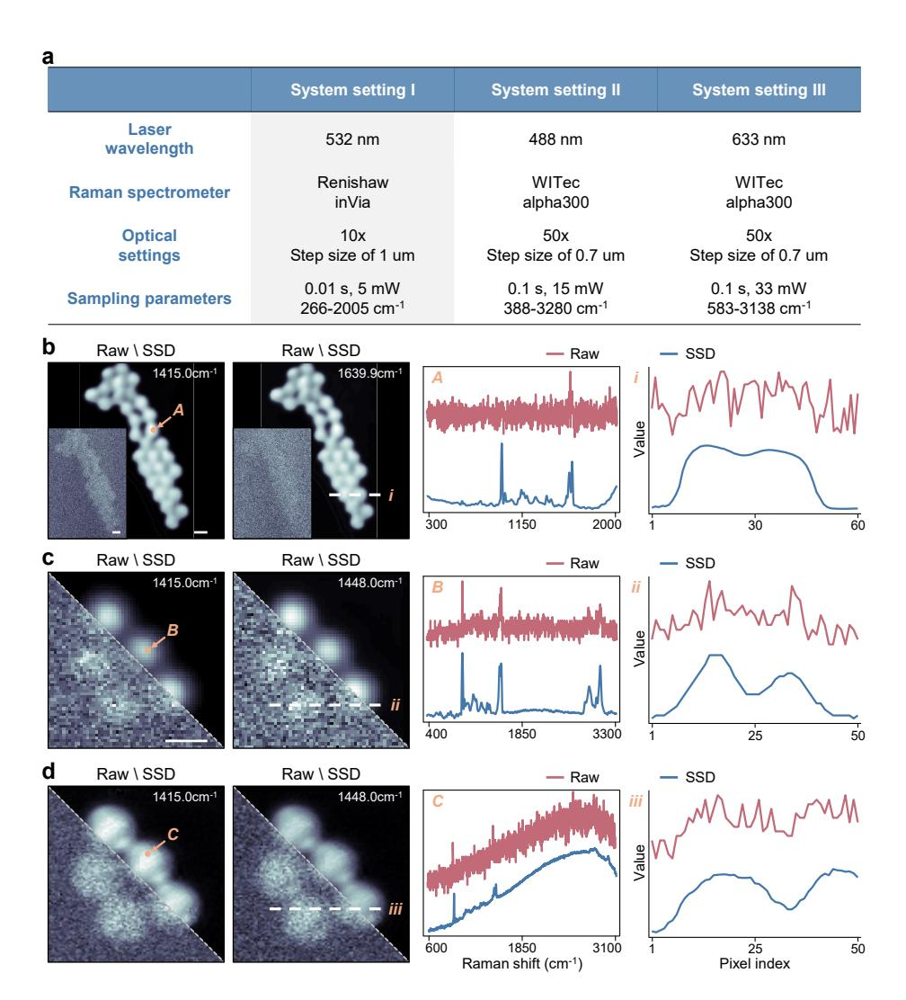

Supplementary Figure 13: Validation of SSD across different Raman systems and excitation wavelengths. a, Summary of three experimental configurations: System I (Renishaw inVia, 532 nm,  $10\times$  objective, 1  $\mu$ m step, 266-2005 cm-1), System II (WITec alpha300, 488 nm,  $50\times$  objective, 0.7  $\mu$ m step, 388-3280 cm-1), System III (WITec alpha300, 633 nm,  $50\times$  objective, 0.7  $\mu$ m step, 583-3138 cm-1). b-d, SSD reconstructions on Systems I-III. Across all platforms, SSD restores bead morphology with sharp boundaries and preserves Raman peak fidelity while substantially improving spectral clarity compared to raw inputs. Scale bars, 20  $\mu$ m.

#### Supplementary Section 17 Evaluation of SSD performance under varying spectral bandwidths (Supplementary Figure [14\)](#page-33-0)

To investigate the influence of working spectral bandwidth on SSD performance, we performed additional evaluations on both simulated and experimentally acquired Raman hyperspectral datasets. These experiments were designed to determine whether SSD can maintain high performance when only a subset of bands is available.

We first examined SSD using a simulated PS microsphere Raman hyperspectral dataset covering the spectral range of 266-2005 cm−1 (details of dataset generation are provided in Supplementary Figure [8\)](#page-21-1). Reconstructions were performed using the full spectral range, the lower range (266-1100 cm−1 ), and the upper range (1100-2005 cm−1 ). As shown in Supplementary Figure [14a](#page-33-0) and Supplementary Figure [14b,](#page-33-0) SSD produced consistent reconstructions across all cases. The restored spectra at points 'A' and 'B' obtained from partial ranges nearly overlapped with those from the full range, demonstrating that SSD is robust even when limited to partial spectral coverage. Quantitative metrics (PSNR, SSIM, and SAM) further confirmed that SSD maintained high reconstruction quality under all tested ranges.

We then validated these findings on experimentally acquired Raman hyperspectral images of PS microspheres, obtained using a WITec alpha300 system with a 600 lines/mm grating, a Zeiss LD EC Epiplan-Neofluar 50× objective lens, a 633 nm excitation laser (33 mW), and a 0.1 s integration time. The measured spectral range was 583-3138 cm−1 , encompassing both fingerprint and high-wavenumber regions, with a 100 × 100 spatial grid sampled at 0.7 µm step size. SSD was applied to the full spectral range as well as three sub-ranges. As shown in Supplementary Figure [14c,](#page-33-0) reconstructions from partial ranges closely matched those from the full range, faithfully preserving bead morphology and Raman peak features. Spectra extracted from point 'C' (red: full range, blue: partial range) further illustrate that SSD produces consistent and chemically specific reconstructions regardless of bandwidth.

Overall, these results confirm that SSD achieves stable and accurate performance across different spectral bandwidths. While full-range data provide higher stability, SSD remains effective when only partial bands are available. This property is particularly advantageous for practical Raman imaging applications that target specific spectral windows, such as the fingerprint or C-H stretching regions.

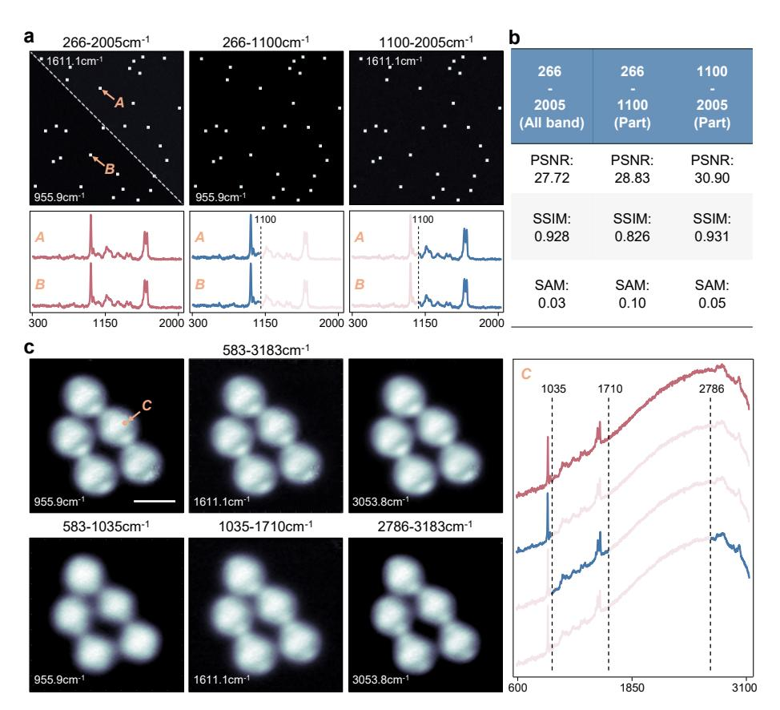

Supplementary Figure 14: Effect of spectral bandwidth on SSD performance. a, Raman intensity maps reconstructed by SSD using the full spectral range (266-2005 cm−1 ) and two partial ranges (266-1100 cm−1 and 1100-2005 cm−1 ). Representative spectra at points 'A' and 'B' show close overlap between full- and partial-range reconstructions. b, Quantitative evaluation (PSNR, SSIM, and SAM) demonstrating that SSD maintains high reconstruction performance across all spectral ranges. c, Real Raman hyperspectral dataset of PS microspheres acquired over the 583-3138 cm−1 range. Top row: SSD reconstruction using the full spectral range. Bottom row: reconstructions using three sub-ranges. Spectra extracted from point C confirm consistency between full and partial reconstructions. Scale bar, 20 µm.

#### Supplementary Section 18 Evaluation of SSD performance under spatial undersampling conditions (Supplementary Figure [15\)](#page-35-0)

To investigate the role of spatial and spectral total variation (TV) in the SSD optimization process, particularly under undersampled imaging conditions, we conducted experiments using downsampling from high-resolution data and upsampling from low-resolution acquisitions. In the first set of experiments, undersampling was performed by column down-sampling a low-SNR Raman hyperspectral image of polystyrene (PS) microspheres originally acquired at a 2 µm step size. As shown in Supplementary Figure [15a-d,](#page-35-0) the downsampled raw data (Raw (D)) exhibited a clear loss of fine structural details. By contrast, SSD with both spatial and spectral TV constraints successfully recovered bead morphology and high-fidelity spectra. When the spatial TV term was removed, reconstructions displayed severe distortions in morphology and degraded spectral accuracy, highlighting the critical role of spatial constraints under incomplete sampling. Removing the spectral TV term also impaired performance, although the degradation was less pronounced than when spatial TV was absent. Representative spectra extracted from points 'A'-'C' confirmed that SSD without spatial or spectral TV can still recover Raman peaks, but with notable fluctuations and residual noise. These results demonstrate the benefit of jointly leveraging spatial and spectral regularization in SSD optimization.

In the second set of experiments, SSD was applied to Raman hyperspectral images of PS/PMMA mixtures acquired at a coarser 4 µm step size. To mimic finer sampling, the raw data were upsampled to 2 µm resolution by zero-filling missing rows and columns. As shown in Supplementary Figure [15e,](#page-35-0) despite the incomplete inputs, SSD with spatial and spectral TV successfully restored bead distribution with sharp boundaries and preserved chemical specificity.

Overall, these experiments indicate that spatial features and total variation regularization are essential for stable optimization in undersampled settings. By jointly enforcing spatial smoothness and spectral consistency, SSD effectively regularizes the self-supervised learning process, ensuring robust denoising, accurate intensity profile recovery, and faithful spectral reconstruction even when acquisition speed is prioritized over spatial sampling density.

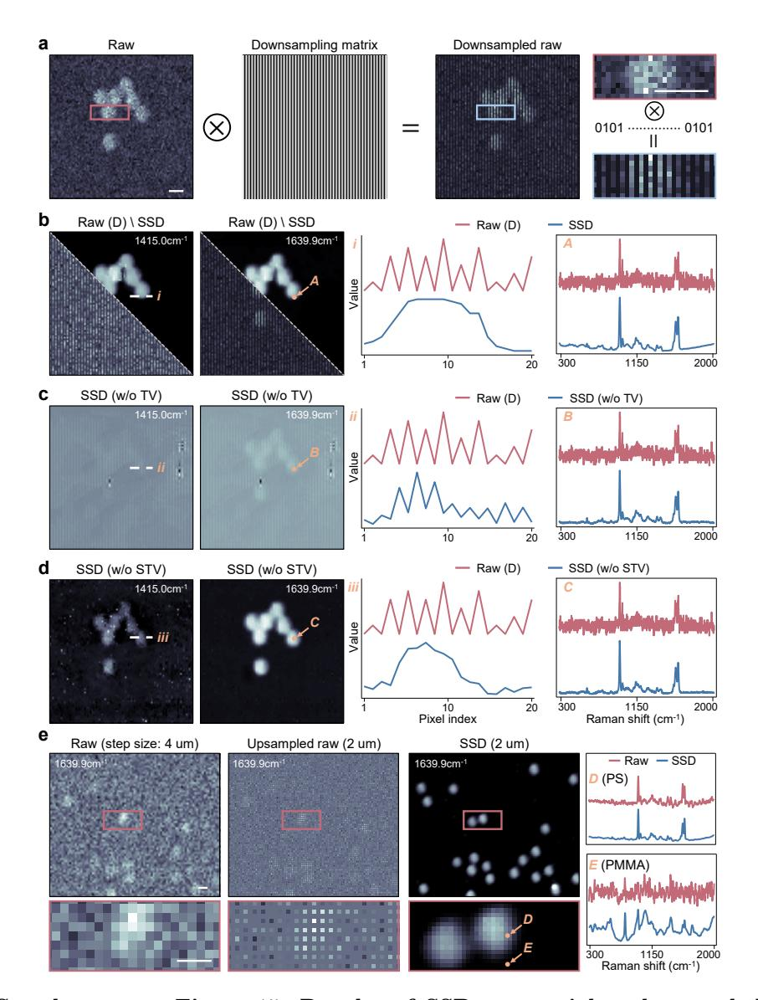

Supplementary Figure 15: Results of SSD on spatial undersampled datasets. a, Illustration of column down-sampling from a Raman image of PS microspheres originally acquired at a 2  $\mu$ m step size. b-d, Reconstruction results of the undersampled data. Downsampled raw input (Raw (D)) loses fine structural details. SSD with spatial and spectral TV constraints restores morphology and spectra with high fidelity. Removing spatial TV (w/o TV) leads to strong degradation in morphology, whereas removing spectral TV (w/o STV) also impairs performance. Representative spectra from points 'A'-'C' and intensity profiles along 'i'-'iii' are compared. e, Reconstruction results for a PS/PMMA mixture dataset originally acquired at a 4  $\mu$ m step size and upsampled to 2  $\mu$ m with zero-filling. Scale bar, 20  $\mu$ m.

#### Supplementary Section 19 Supplemental results on Raman hyperspectral images of pharmaceuticals (Supplementary Figure [16](#page-37-0) and Supplementary Figure [17\)](#page-38-0)

In addition to the data captured with a 50× objective lens as presented in Fig. 5b, here, we provide a broader field of view using a 10× objective lens (Leica N PLAN 10×/0.25) to capture the tablet's overall composition and structure. The reference (high-quality) Raman hyperspectral images in Supplementary Figure [16](#page-37-0) and Supplementary Figure [17](#page-38-0) were acquired using an exposure time of 0.1 s and a 50 mW laser, while the raw (low-quality) data were captured with a shorter exposure time of 0.01 s and a reduced laser power of 2.5 mW. This setting is leveraged for evaluating reconstruction results when integration time is reduced ten-fold and laser power is decreased twenty-fold. Both the high- and low-quality Raman images consist of 16,384 spectra, covering a 256 µm × 256 µm area with a step of 2 µm. The range of measured Raman shift is from 210 to 1960 cm−1 , resulting in hyperspectral images with dimensions of 128 × 128 × 1015.

In Supplementary Figure [16b,](#page-37-0) pie charts summarize the proportions of aspirin, paracetamol, and caffeine based on the average of their abundance maps for each reconstruction method. The pie charts clearly illustrate the relative concentrations of each compound. The reference data shows a well-defined distribution of the three ingredients, while the raw data has a high bias due to the noise. The SavGol-filtered and SVD-reconstructed data show moderate improvement but still present discrepancies in the proportions. In contrast, the SSD-reconstructed data closely mirrors the reference proportions, accurately representing the relative concentrations of each compound.

Moreover, Supplementary Figure [17](#page-38-0) compares the Raman spectra of the reference, raw, and SSD-reconstructed data at 15 selected points, labeled 'A' to 'O'. The light blue lines represent the high-quality reference spectra, while the red lines show the raw data spectra, which are heavily contaminated by noise and exhibit obscured spectral features, particularly in the low Raman shift regions critical for molecular identification. The dark blue lines representing SSD-reconstructed spectra closely align with the reference spectra at all points, showing that SSD considerably reduces noise in the raw data and preserves key spectral features. Overall, the spatial and spectral analysis presented in Supplementary Figure [17](#page-38-0) underscores the effectiveness of SSD in reconstructing high-fidelity hyperspectral images from noisy raw Raman data.

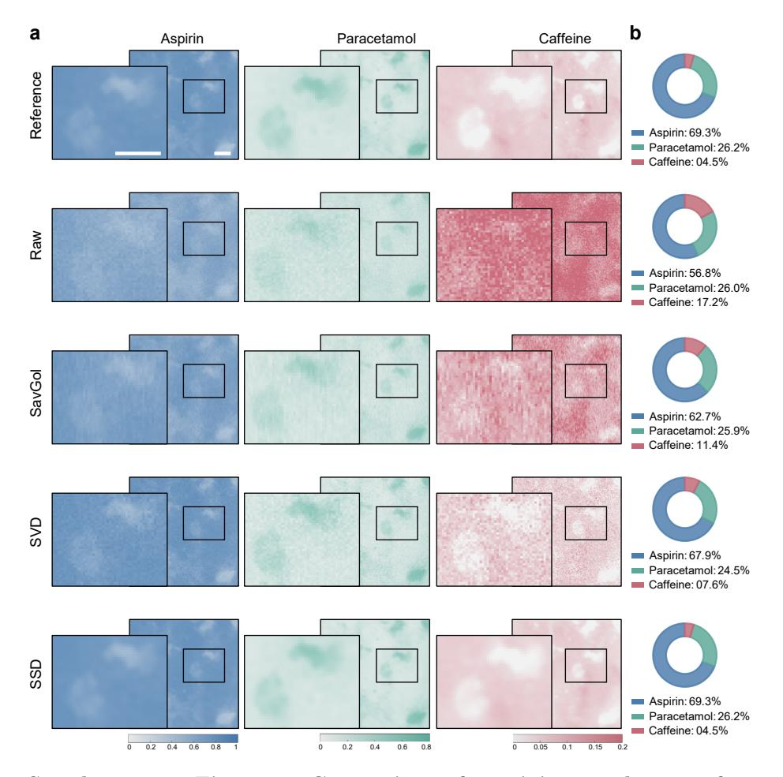

Supplementary Figure 16: Comparison of unmixing results on reference, raw, SavGol-, SVD-, and SSD-reconstructed pharmaceuticals Raman hyperspectral images. a, Visualization of decomposed abundance maps of aspirin, paracetamol, and caffeine. b, Pie charts summarizing the proportions of the three ingredients calculated based on the average of abundance maps. Scale bar, 40 µm.

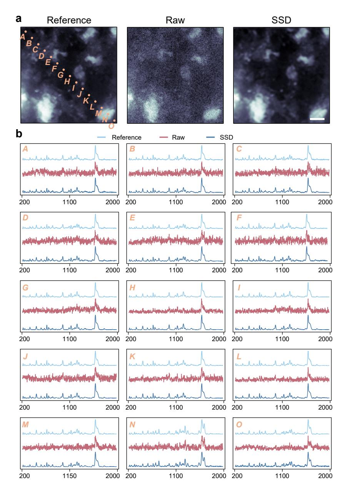

Supplementary Figure 17: Visualization of unmixing and reconstruction results. a, Comparison of abundance maps of paracetamol generated by the FCLS method applied to high-quality reference data, low-quality raw data, and SSD-reconstructed Raman hyperspectral images. b, Comparison of Raman spectra at 15 points (denoted as 'A' to 'O') across the reference, raw, and SSDreconstructed data. The reference spectra are shown in light blue, the raw data in red, and the SSD-reconstructed spectra in dark blue. Scale bar, 40 µm.

#### Supplementary Section 20 Discussion about solo utilization of SSD (Supplementary Figure [18\)](#page-41-0)

As illustrated in our paper, SSD is an optimization-based method, which iteratively solves the following problems

$$\begin{cases}
\mathbf{X}^{k} = \underset{\mathbf{X}}{\operatorname{arg min}} \frac{1}{2} ||\mathbf{Y} - \mathbf{X} - \mathbf{S}^{k-1}||_{F}^{2} + \frac{\rho}{2} ||\mathbf{X} - \mathbf{Z}^{k-1} + \mathbf{U}^{k-1}||_{F}^{2}, \\
\mathbf{Z}^{k} = \underset{\mathbf{Z}}{\operatorname{arg min}} R(\mathbf{Z}) + \frac{\rho}{2\lambda} ||\mathbf{Z} - \mathbf{X}^{k} - \mathbf{U}^{k-1}||_{F}^{2}, \\
\mathbf{S}^{k} = \underset{\mathbf{S}}{\operatorname{arg min}} \lambda_{S} ||\mathbf{S}||_{1} + \frac{1}{2} ||\mathbf{Y} - \mathbf{X}^{k} - \mathbf{S}||_{F}^{2}, \\
\mathbf{U}^{k} = \mathbf{U}^{k-1} + (\mathbf{X}^{k} - \mathbf{Z}^{k}).
\end{cases} (5)$$

In addition, the SSD prior, namely decomposing hyperspectral images into a prior image and spectral distance, can be utilized on its own to generate high-SNR images. Specifically, high-quality Raman hyperspectral images X are obtained by directly optimizing the following loss function

$$\mathbf{X} = \underset{\mathbf{X}}{\operatorname{arg\,min}} \lambda R(\mathbf{X}) + \frac{1}{2} ||\mathbf{X} - \mathbf{Y}||_F^2.$$
 (6)

While this simplified approach is computationally more efficient, it lacks the iterative refinement. As a result, its performance in recovering fine spectral and spatial details is diminished. Supplementary Figure [18](#page-41-0) illustrates the performance of SSD and the solo-utilization of SSD prior on reconstructed Raman hyperspectral images of the 'HNURVC' character pattern, Gaussian distribution-like pattern, and chessboard pattern datasets.

In Supplementary Figure [18a,](#page-41-0) visualizations of the reconstructed spectral images at several key Raman bands are presented. The top row shows the results obtained using the SSD method, while the bottom row shows the results from the solo-utilization of the SSD prior. Both methods provide clearer reconstructions with high fidelity; however, the solo-SSD approach shows slight blurring and a loss of fine details, particularly at higher spatial frequencies, compared to the SSD method. This highlights the superior resolution and precision of the full SSD method over the solo-SSD prior.

Supplementary Figure [18b](#page-41-0) provides a quantitative comparison of the SSD and solo-SSD prior methods using three metrics: PSNR, SSIM, and SAM, applied to the Gaussian distribution-like pattern Raman hyperspectral images. The PSNR metric demonstrates that SSD achieves higher values than the solo-SSD prior approach, indicating that SSD produces cleaner, less noisy reconstructions. This is further supported by the SSIM and SAM comparisons. Finally, Supplementary Figure [18c](#page-41-0) visualizes the abundance maps obtained by applying the unmixing method to both the SSD- and solo-SSD-reconstructed chessboard pattern dataset. Both methods yield highly accurate abundance maps, closely matching the ground truth distribution.

In conclusion, both the SSD method and the solo utilization of the SSD prior demonstrate superior performance in reconstructing high-quality Raman hyperspectral images and accurately extracting abundance maps. The choice between SSD and solo-SSD depends on the specific requirements of the task. The solo-SSD prior is ideal for situations where computational efficiency is crucial and a slight reduction in detail recovery is acceptable. On the other hand, SSD is better suited for applications that require the highest possible spectral and spatial accuracy, making it the preferred method for complex and noisy hyperspectral imaging tasks.

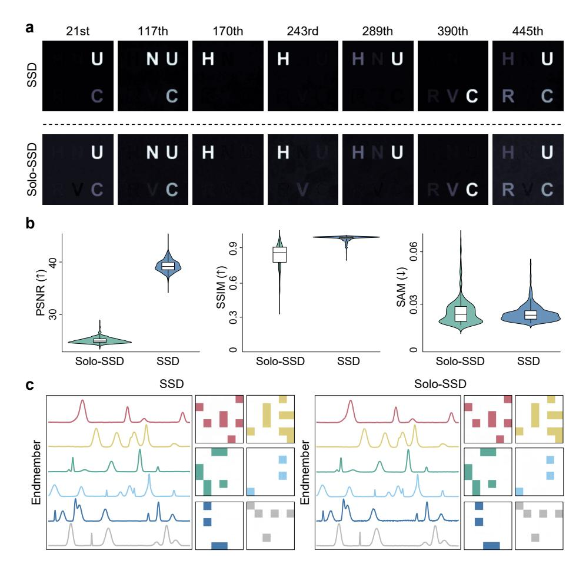

Supplementary Figure 18: Comparison of the performance SSD and solo-utilization of SSD prior on the 'HNURVC' character, Gaussian distribution-like pattern, and chessboard pattern Raman hyperspectral images. a, Visualization of spectral images reconstructed using SSD and solo-utilization of SSD prior at key Raman bands (from 21st to 445th). b, Quantitative comparison of PSNR, SSIM, and SAM metrics between SSD and the solo-utilization of SSD methods on the Gaussian distribution-like pattern Raman hyperspectral images. In violin plots, the central horizontal line within the box represents the median (50th percentile), the upper and lower edges of the box correspond to the 75th percentile (Q3) and 25th percentile (Q1), respectively, and the whiskers extend to the minimum and maximum non-outlier values. The surrounding violin shape illustrates the kernel density estimation of the data distribution (PSNR and SSIM plots: n = 500 spectral bands; SAM plot: n = 500 pixels). c, Visualization of six abundance maps obtained by applying the unmixing method on the SSD- and solo-SSD reconstructed chessboard pattern Raman hyperspectral images.

Supplementary Section 21 Discussion about the difference between SSD prior and typical deep image prior (Supplementary Figure [19](#page-43-0) and Figure [20\)](#page-44-0)

Supplementary Figure [19](#page-43-0) compares the SSD prior method with the typical deep image prior (DIP) [\[7\]](#page-58-6) for reconstructing Raman hyperspectral images. Both methods utilize an untrained neural network (UNN) with the same architecture and parameters, allowing for a direct comparison of their respective principles. The key difference lies in how each method generates high-SNR data: the SSD prior decomposes Raman hyperspectral images into a prior image and spectral distance, with the UNN optimized to generate only the spectral distance. In contrast, the typical DIP approach directly generates the full hyperspectral image from random noise via the UNN. The setups for the solo-utilization of the SSD prior and the typical deep image prior are illustrated in Supplementary Figure [19a](#page-43-0) and Supplementary Figure [19b,](#page-43-0) respectively.

Supplementary Figure [19c](#page-43-0) shows the unmixing results for 'HNURVC' character pattern Raman hyperspectral images reconstructed using the SSD prior and DIP. The left panel presents the spectral signatures of six endmembers, which exhibit clean and well-defined peaks, reflecting high spectral fidelity. The merged abundance map on the right accurately captures the spatial distribution of each endmember, with minimal noise and clear spatial delineation. In contrast, the spectral signatures extracted from the DIP method (left panel) show substantial noise and lack the clean separation of peaks seen in the SSD prior results. The merged abundance map (right panel) is less precise, with more distortion in the spatial distribution compared to the SSD prior results. These observations suggest that the typical deep image prior faces difficulties in recovering high-quality spectral and spatial details from complex and noisy data. In addition, Supplementary Figure [19d](#page-43-0) compares the Raman images from the 21st to the 445th band reconstructed by solo-SSD and solo-DIP. The results highlight the advantages of the SSD prior over the typical deep image prior for reconstructing Raman hyperspectral images from noisy raw data.

Moreover, we compare SSD with other recently published self-supervised methods (DeepTensor [\[8\]](#page-58-7) and Flex-DLD [\[9\]](#page-58-8)) on the chessboard-pattern Raman hyperspectral dataset. As shown in Supplementary Figure [20a,](#page-44-0) DeepTensor and Flex-DLD introduce noticeable reconstruction artifacts. In contrast, SSD faithfully preserves sharp boundaries and clean structures, leading to high-fidelity spatial and spectral recovery. Supplementary Figure [20b](#page-44-0) further summarizes the quantitative results in terms of PSNR, SSIM, and SAM, where SSD consistently achieves the best performance with the smallest variance, confirming both its accuracy and robustness relative to existing self-supervised approaches.

Overall, by learning only the spectral distance rather than directly generating the full hyperspectral cube, SSD provides superior fidelity in both spatial and spectral reconstructions. This design makes SSD a more robust and effective self-supervised prior for Raman hyperspectral imaging compared with conventional deep image prior approaches.

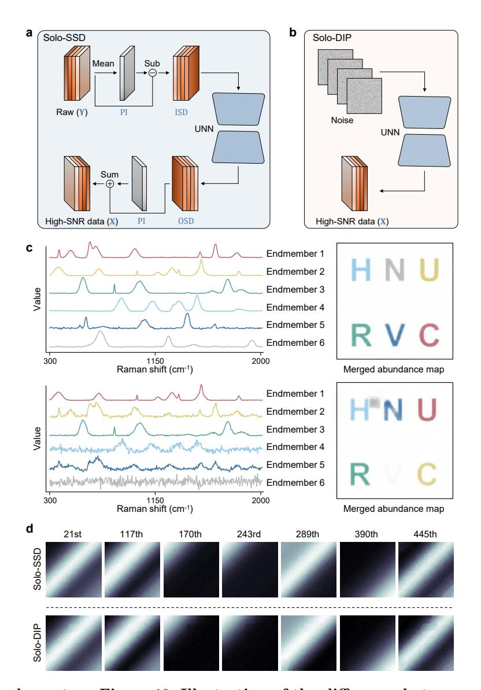

Supplementary Figure 19: Illustration of the difference between soloutilization of SSD prior and typical deep image prior. a, The setup for the solo-utilization of SSD prior, where an untrained neural network (UNN) is optimized to generate spectral distance. In this way, the high-SNR image (X) is obtained by summing the prior image and optimized spectral distance (OSD). b, The setup for the solo-utilization of the typical deep image prior, where the inputs to the UNN are random noise, and outputs are generated data. c, Unmixing results of the 'HNURVC' character pattern Raman hyperspectral images reconstructed using the solo-utilization of the SSD prior. d, Comparison of the Gaussian distribution-like pattern Raman hyperspectral images reconstructed by solo-SSD and solo-DIP.

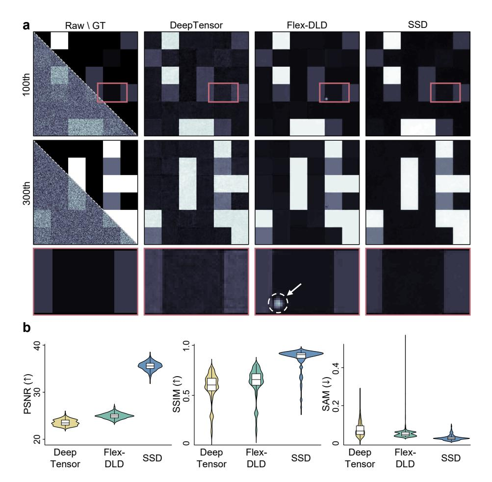

Supplementary Figure 20: Comparison of SSD with self-supervised denoising methods on the chessboard-pattern Raman hyperspectral image. a, Raw input, Ground Truth (GT), and reconstructions by DeepTensor, Flex-DLD, and SSD at the 100th and 300th Raman bands. Zoom-in views highlight that existing methods suffer from blurred edges or reconstruction artifacts (arrow), whereas SSD preserves sharp boundaries and clean structures. b, Quantitative evaluation in terms of PSNR, SSIM, and SAM. SSD consistently achieves the best performance across all three metrics with smaller variance, confirming both its accuracy and robustness compared with previous self-supervised denoising approaches. In violin plots, the central horizontal line within the box represents the median (50th percentile), the upper and lower edges of the box correspond to the 75th percentile (Q3) and 25th percentile (Q1), respectively, and the whiskers extend to the minimum and maximum non-outlier values. The surrounding violin shape illustrates the kernel density estimation of the data distribution (PSNR and SSIM plots: n = 500 spectral bands; SAM plot: n = 500 pixels).

#### Supplementary Section 22 Evaluation of warm-starting SSD with pretrained weights (Supplementary Figure [21\)](#page-46-0)

To examine whether warm-starting with pretrained weights can shorten convergence and improve reconstruction, we systematically compared SSD performance under two transfer scenarios: i) transfer between similar datasets with shared spectral characteristics, and ii) transfer across distinct biological samples with different spectral features. In the first scenario, SSD was initially trained on a Gaussian-pattern Raman hyperspectral dataset and the resulting weights were used to initialize reconstruction of a chessboard-pattern dataset, which shares the same endmembers as the Gaussian-pattern dataset. As shown in Supplementary Figure [21a](#page-46-0) and Supplementary Figure [21c,](#page-46-0) warm-starting accelerated convergence and improved final reconstruction quality compared to training from scratch. Specifically, PSNR values increased more rapidly, while SAM decreased earlier, indicating that pretrained weights provided a useful spectral prior when the underlying chemical signatures were consistent across datasets.

In the second scenario, SSD was pretrained on the follicular thyroid carcinoma and normal thyroid (FTC&NT) co-culture cell dataset [\[10\]](#page-58-9) and then applied to the adult rat ventricular cardiomyocytes (rCM) dataset [\[11\]](#page-58-10). The raw FTC&NT data have relatively low SNR, whereas the rCM data exhibit high SNR. To generate ground truth for the rCM dataset, Savitzky-Golay smoothing was applied to the raw data, and Poisson-Gaussian noise was subsequently added to simulate realistic low-SNR conditions. As shown in Supplementary Figure [21b](#page-46-0) and Supplementary Figure [21d,](#page-46-0) warm-starting in this cross-biology case provided no measurable benefit and even led to degraded reconstructions. At 1061.4 cm−1 , reconstructions from pretrained initialization were inferior to those obtained from scratch, and PSNR/SAM results also showed no consistent improvement.

These results indicate that warm-starting is effective only when the source and target datasets share highly similar spectral signatures, for example, overlapping endmembers, comparable spectral resolution, and acquisition conditions. In such cases, pretraining can shorten optimization and improve accuracy. However, when transferring across distinct biological systems with different spectral characteristics, the benefit is limited or even negative. Thus, in practice, warm-starting SSD is recommended only under spectrally consistent conditions, while training from scratch remains the more general and reliable strategy.

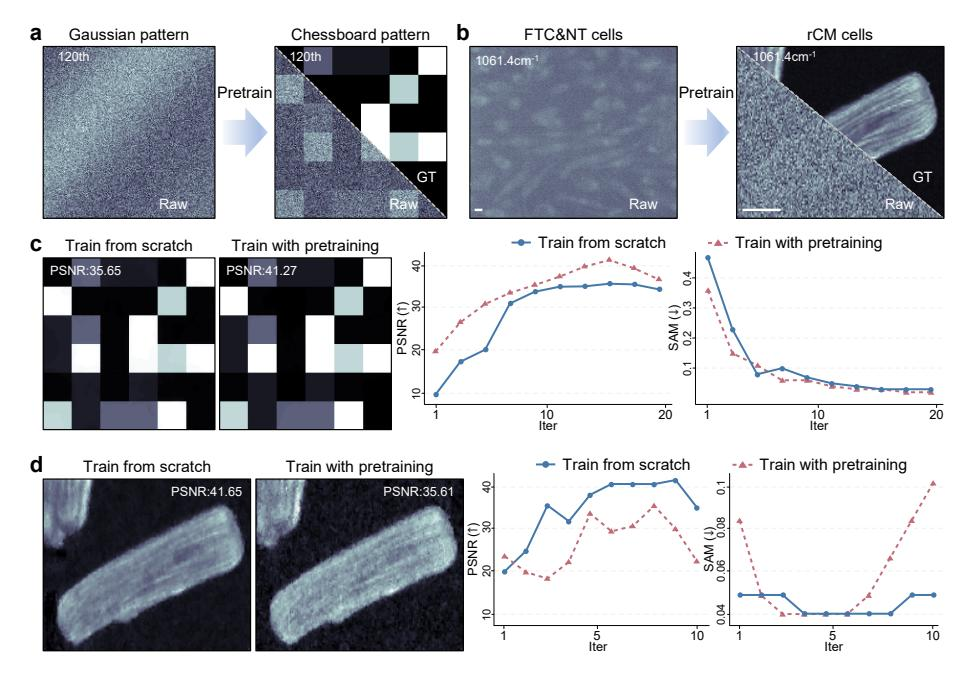

Supplementary Figure 21: Effect of warm-starting SSD with pretrained weights. a, Pretraining on the Gaussian distribution-like pattern Raman HSI followed by transfer to the chessboard pattern dataset. b Pretraining on the follicular thyroid carcinoma and normal thyroid (FTC&NT) co-culture cells followed by transfer to the adult rat ventricular cardiomyocytes (rCM) dataset. c Reconstructions at the 120th band for the chessboard dataset, showing faster convergence and higher final PSNR/SAM with pretrained initialization compared to training from scratch. d Reconstructions at 1061.4 cm−1 for rCM cells, showing no improvement with pretrained initialization. PSNR and SAM curves confirm the lack of speed or accuracy gain from pretraining in this case. Scale bar, 20 µm.

#### Supplementary Section 23 Evaluation of stability and initialization sensitivity of SSD (Supplementary Figure [22\)](#page-48-0)

The reproducibility and stability of untrained neural networks (UNNs) are essential for ensuring the broad applicability of SSD in Raman hyperspectral imaging. To evaluate these aspects, we conducted experiments on both real cellular data and simulated pattern datasets. The detailed procedure of cell preparation and hyperspectral imaging has been described in the main paper. Briefly, high-SNR reference data were obtained using a long integration time (1.0 s), while low-SNR input data were acquired under a short integration time (0.1 s). For this dataset, we first assessed reproducibility by running SSD optimization for 10 independent trials with different random seeds. As shown in Supplementary Figure [22a,](#page-48-0) the reconstructions across trials are highly consistent, with performance fluctuations smaller than 0.2 dB in PSNR. This demonstrates the stability of SSD. We next evaluated the effect of weight initialization schemes on SSD performance. Six widely used initialization methods were tested, including Kaiming uniform, Kaiming normal, Xavier uniform, Xavier normal, orthogonal, and normal. As illustrated in Supplementary Figure [22b,](#page-48-0) SSD achieves stable and comparable results across all initialization strategies, with only marginal differences in PSNR and SAM values. These findings further suggest that SSD maintains robust convergence.

To further confirm reproducibility under different conditions, we extended the analysis to three representative simulated Raman hyperspectral datasets: the 'HNURVC' character pattern (Scene 1), a Gaussian distribution-like pattern (Scene 2), and a chessboard pattern (Scene 3). As shown in Supplementary Figure [22c,](#page-48-0) the variations across trials were very small, with PSNR fluctuations less than 1.8 dB and SAM fluctuations less than 0.01. These results confirm that SSD converges stably and reproducibly. Importantly, since SSD reconstructions are highly consistent across repeats, one can further mitigate overfitting by averaging multiple independent runs, which suppresses stochastic noise while preserving stable spectral features. This repeat-and-average strategy provides an additional safeguard for reliable Raman imaging.

Similarly, when comparing initialization schemes (Supplementary Figure [22d\)](#page-48-0), SSD consistently converged to high-quality reconstructions across all initializations. In Scene 2, for example, SSD achieved PSNR values in the range of 34-39 dB and SAM values between 0.02-0.04 across all tested schemes. Convergence curves on Scene 3 (Supplementary Figure [22e\)](#page-48-0) further demonstrate that different initialization methods follow similar iterative trajectories and eventually reach stable optima. In practice, we adopted Kaiming uniform initialization as the default setting due to its robust and reproducible performance across diverse datasets. These results confirm that SSD is reproducible and stable. Together with the iterative nature of ADMM optimization, which provides intermediate reconstructions that can be visually inspected, SSD offers users practical flexibility to obtain reliable results even in the absence of ground-truth references.

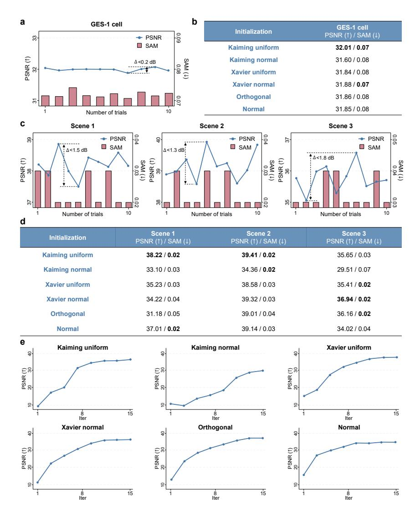

Supplementary Figure 22: Stability of SSD across random seeds and the effect of initialization strategies. a, Stability evaluation of SSD with 10 repeated trials on the GES-1 cell dataset. b, Quantitative comparison of different initialization strategies (Kaiming uniform, Kaiming normal, Xavier uniform, Xavier normal, Orthogonal, Normal) on the GES-1 cell dataset, evaluated by PSNR and SAM metrics. c, Results from 10 repeated trials on three representative Raman hyperspectral image datasets: character pattern (Scene 1), Gaussian distribution-like pattern (Scene 2), and chessboard pattern (Scene 3). d, Quantitative evaluation under different initialization schemes on simulated three scenes. SSD consistently achieves high-quality reconstructions across all cases. e, Convergence analysis on Scene 3 showing PSNR evolution across iterations for each initialization scheme. All methods follow similar convergence speed and eventually reach stable optima.

#### Supplementary Section 24 Discussion about the hyperparameter setting (Supplementary Table [3\)](#page-50-0)

Supplementary Table [3](#page-50-0) provides a comprehensive analysis of the effect of hyperparameter settings on the three Raman hyperspectral imaging datasets. The performance is measured using PSNR and SAM.

First, we examined the impact of the number of feature map channels Nc on reconstruction performance. This parameter controls the representational capacity of the untrained neural network (UNN) for capturing fine spectral details. Performance improves as Nc increases, reaching optimal results at Nc = 48, where both PSNR and SAM achieve the best balance across benchmark scenes. Larger values, such as 64 or 80, offer no consistent gain while increasing computational cost and risk of overfitting. Conversely, smaller values (16 or 32) underfit the data due to insufficient representational capacity. In practice, Nc = 48 is recommended as a robust default, with Nc = 32 sufficient for simpler datasets.

Next, we evaluated the effect of the number of training epochs T. As expected, increasing T generally improves reconstruction performance. The best performance was observed around T = 300, where PSNR and SAM reached optimal levels across multiple datasets. Further increases in training epochs, such as T = 400 − 500 provided only marginal improvements, while too few epochs (T = 100) resulted in underfitting. A practical choice is T = 300. We then investigated the influence of the number of ADMM iterations K. Reconstruction accuracy improves with increasing K, reaching optimal performance around K = 15, where PSNR is maximized and SAM minimized. Further increases to K = 20 or 25, however, degraded performance, likely due to noise amplification and over-optimization. Thus, K = 15 represents the best trade-off between accuracy and stability.

In addition, the ADMM penalty parameter ρ was examined. This parameter balances different terms in the optimization. Results show that ρ = 1 consistently yields optimal performance across datasets. Too small values (0.01-0.1) under-constrain the optimization, while excessively large values (10-20) overly restrict flexibility, leading to degraded spectral fidelity. The effect of the sparse noise weight λS was also tested. This parameter controls robustness against sparse corruption such as spikes or cosmic rays. Optimal performance was achieved in the range λS=0.01-0.1. Smaller values insufficiently suppress sparse noise, whereas larger values oversmooth fine spectral structures. Finally, we investigated the spectral-spatial regularization weight λR. This parameter governs the degree of smoothness enforced in both spectral and spatial domains. The best performance was observed at λR = 5. Smaller values (1-3) underregularized the reconstructions, while larger values (7-9) introduced oversmoothing and loss of structural details.

In practical Raman imaging, where high-SNR ground truth data are typically unavailable, reliable reconstructions can still be obtained by the guidelines presented above and following strategies. As the ADMM-based optimization framework produces a sequence of intermediate reconstructions, users can select the iteration that best retains Raman peaks while suppressing noise. Moreover, most hyperparameters can remain fixed across datasets, with only the weights of spatial and spectral TV requiring adjustment according to the characteristics of the acquired samples. Together, these experimental results and strategies enable SSD to adapt robustly to diverse SNR levels and sample types, without the need for reference data.

Supplementary Table 3: Effect of the number of feature map channels Nc, the training epochs T, the number of iterations K, and hyperparameters ρ, λS, λR on reconstruction performance. Experiments are conducted on the 'HNURVC' character pattern Raman hyperspectral images (Scene 1), Gaussian distribution-like pattern Raman hyperspectral images (Scene 2), and chessboard pattern Raman hyperspectral images (Scene 3) are presented.

|            | Scene 1            | Scene 2            | Scene 3            |
|------------|--------------------|--------------------|--------------------|
| Parameters | PSNR (↑) / SAM (↓) | PSNR (↑) / SAM (↓) | PSNR (↑) / SAM (↓) |
| Nc = 16    | 28.84 / 0.03       | 34.20 / 0.12       | 30.37 / 0.04       |
| Nc = 32    | 32.47 / 0.02       | 36.45 / 0.09       | 31.31 / 0.03       |
| Nc = 48    | 38.22 / 0.02       | 39.41 / 0.02       | 35.65 / 0.03       |
| Nc = 64    | 34.01 / 0.02       | 37.18 / 0.05       | 33.69 / 0.04       |
| Nc = 80    | 28.05 / 0.04       | 34.28 / 0.06       | 35.65 / 0.08       |
| T = 100    | 14.48 / 0.05       | 30.89/ 0.12        | 33.27 / 0.03       |
| T = 200    | 35.20 / 0.03       | 33.12 / 0.10       | 31.01 / 0.04       |
| T = 300    | 38.22 / 0.02       | 38.05 / 0.02       | 35.65 / 0.03       |
| T = 400    | 36.15 / 0.02       | 39.41 / 0.02       | 34.40 / 0.04       |
| T = 500    | 36.82 / 0.04       | 39.21 / 0.03       | 33.56 / 0.06       |
| K = 5      | 07.83 / 0.123      | 25.82 / 0.59       | 20.17 / 0.08       |
| K = 10     | 32.01 / 0.10       | 33.52 / 0.21       | 33.84 / 0.09       |
| K = 15     | 38.22 / 0.02       | 39.41 / 0.02       | 35.65 / 0.03       |
| K = 20     | 26.35 / 0.05       | 29.07 / 0.06       | 33.56 / 0.04       |
| K = 25     | 15.47 / 0.09       | 18.53 / 0.08       | 21.07 / 0.14       |
| ρ = 0.01   | 27.90 / 0.08       | 34.10 / 0.03       | 33.09 / 0.04       |
| ρ = 0.1    | 30.57 / 0.05       | 38.76 / 0.02       | 34.21 / 0.04       |
| ρ = 1      | 38.22 / 0.02       | 39.41 / 0.02       | 35.65 / 0.03       |
| ρ = 10     | 30.92 / 0.04       | 38.84 / 0.02       | 35.62 / 0.03       |
| ρ = 20     | 23.47 / 0.09       | 34.24 / 0.03       | 34.50 / 0.04       |
| λS = 10−4  | 35.69 / 0.04       | 39.35 / 0.03       | 30.86 / 0.07       |
| λS = 10−3  | 31.88 / 0.05       | 39.11 / 0.02       | 34.91 / 0.04       |
| λS = 10−2  | 38.22 / 0.02       | 39.41 / 0.02       | 35.65 / 0.03       |
| λS = 10−1  | 37.83 / 0.02       | 39.75 / 0.02       | 35.57 / 0.03       |
| λS = 1     | 34.49 / 0.03       | 38.91 / 0.03       | 34.97 / 0.03       |
| λR = 1     | 31.24 / 0.03       | 34.10 / 0.03       | 32.79 / 0.05       |
| λR = 3     | 34.13 / 0.03       | 38.39 / 0.03       | 33.75 / 0.04       |
| λR = 5     | 38.22 / 0.02       | 39.41 / 0.02       | 35.65 / 0.03       |
| λR = 7     | 36.04 / 0.02       | 39.23 / 0.02       | 34.74 / 0.03       |
| λR = 9     | 36.76 / 0.02       | 39.16 / 0.03       | 32.38 / 0.04       |

#### Supplementary Section 25 Discussion about constraints on the network output (Supplementary Table [4\)](#page-52-0)

Supplementary Table [4](#page-52-0) evaluates the SSD algorithm with different regularization settings on the three Raman hyperspectral imaging scenes. As discussed previously, the regularization in SSD is formulated as follows

$$R(\mathbf{Z}_{t+1}) = ||\mathbf{Y} - \mathbf{Z}_{t+1}||_1 + \lambda_R ||\mathbf{Z}_{t+1}||_{SSTV}, \tag{7}$$

where ||Y −Zt+1||1 acts as the data-driven prior (DP), ensuring that the reconstruction remains close to the noisy input data and ||Zt+1||SSTV represents the spectral-spatial total variation constraint (SSTV), enforcing smoothness both across the spectral and spatial dimensions. To explore the influence of different regularization settings, we test:

- SSD without data-driven prior (w/o DP): R(Zt+1) = λR||Zt+1||SSTV,
- SSD without spectral-spatial total variation prior (w/o SSTV): R(Zt+1) = ||Y − Zt+1||1.
- SSD without total variation prior (w/o TV): R(Zt+1) = ||Y − Zt+1||1 + λR||Zt+1||STV,
- SSD without spectral total variation prior (w/o STV): R(Zt+1) = ||Y − Zt+1||1 + λR||Zt+1||TV,

The first row in Supplementary Table [4](#page-52-0) shows the importance of incorporating prior knowledge from raw measurements. The SSD method without the data-driven prior (w/o DP) shows poorer performance, with lower PSNR and higher SAM values. The second row demonstrates the SSD without SSTV regularization still fails to achieve satisfactory performance. In the third row, SSD without TV regularization (w/o TV) leads to deterioration in PSNR value. This indicates that total variation regularization is essential for preserving smooth spatial features in the data. The results in the fourth row show SSD without STV regularization. In conclusion, the results in Supplementary Table [4](#page-52-0) emphasize the substantial impact of different regularization settings on the performance of SSD. The combination of DP and SSTV yields the best performance across all scenes, ensuring high fidelity in both spectral and spatial reconstruction.

Supplementary Table 4: Comparison of performance of SSD with different regularizations. DP, TV, STV, and SSTV denote data-driven prior, total variation, spectral total variation, and spectral-spatial total variation prior, respectively.

|             | Scene 1            | Scene 2            | Scene 3            |
|-------------|--------------------|--------------------|--------------------|
| Constraints | PSNR (↑) / SAM (↓) | PSNR (↑) / SAM (↓) | PSNR (↑) / SAM (↓) |
| w/o DP   | 19.49 / 0.10       | 22.05 / 0.55       | 22.18 / 0.12       |
| w/o SSTV | 14.49 / 0.37       | 19.12 / 0.30       | 18.01 / 0.27       |
| w/o TV   | 12.41 / 0.04       | 17.14 / 0.14       | 18.61 / 0.19       |
| w/o STV  | 35.98 / 0.07       | 35.05 / 0.12       | 31.96 / 0.07       |

#### Supplementary Section 26 Quantitative comparison on stimulated Raman hyperspectral images (Supplementary Table [5\)](#page-54-0)

We conducted a comprehensive quantitative comparison of SSD against both traditional baselines and recent deep learning-based methods on three representative simulated Raman hyperspectral datasets: the 'HNURVC' character pattern, a Gaussian distribution-like pattern, and a chessboard pattern. The evaluation metrics include peak signal-to-noise ratio (PSNR) and spectral angle mapper (SAM), which together provide a balanced assessment of spatial fidelity, structural similarity, and spectral accuracy. The competing methods include Savitzky-Golay (SavGol) filtering and singular value decomposition (SVD), as well as supervised deep networks such as SLNet [\[12\]](#page-58-11) and AUNet [\[13\]](#page-58-12). In addition, we compared SSD with two representative self-supervised-learning methods designed for hyperspectral denoising, namely DeepTensor [\[8\]](#page-58-7) and Flex-DLD [\[9\]](#page-58-8).

The results in Supplementary Table [5](#page-54-0) demonstrate that SSD consistently outperforms all other methods across all metrics and datasets. In the 'HNURVC' character pattern dataset, SSD achieves the highest PSNR (38.22 dB) and the lowest SAM (0.02), substantially surpassing DeepTensor (22.63 dB PSNR, SAM 0.08) and Flex-DLD (27.58 dB PSNR, SAM 0.06). In the Gaussian distributionlike pattern dataset, SSD again achieves the best results, with PSNR = 39.41 dB and SAM = 0.02. In the chessboard pattern dataset, SSD maintains its advantage, reaching PSNR = 35.65 dB and SAM = 0.03. These findings confirm that SSD not only surpasses traditional baselines (SavGol, SVD) and supervised networks (SLNet, AUNet), but also clearly outperforms advanced self-supervised methods (DeepTensor, Flex-DLD).

Finally, we have included a quantitative runtime comparison in Supplementary Table [5.](#page-54-0) Since supervised methods (SLNet, AUNet) require multi-day offline training, Supplementary Table [5](#page-54-0) reports only their inference (testing) time. In contrast, self-supervised methods (Solo-DIP, DeepTensor, Flex-DLD, Solo-SSD, SSD) have no offline training; their reported times are the per-image self-supervised optimization time to convergence. Under the same hardware/ software settings, the supervised networks AUNet and SLNet needs 207 s and 285 s inference time respectively. The self-supervised baselines Solo-DIP takes 177 s, DeepTensor 261 s, and Flex-DLD 425 s per image. Our Solo-SSD is the fastest at 96 s (≈1.8× faster than Solo-DIP, 2.7× than DeepTensor, 4.4× than Flex-DLD). Our full SSD model requires 320 s per image, comparable to DeepTensor and far below Flex-DLD, while achieving the best overall accuracy (highest PSNR / lowest SAM across all three scenes).

Supplementary Table 5: Quantitative results of SSD and other compared algorithms on 'HNURVC' character pattern Raman hyperspectral images (Scene 1), Gaussian distribution-like pattern Raman hyperspectral images (Scene 2), and chessboard pattern Raman hyperspectral images (Scene 3).

| Method     | Scene 1            | Scene 2            | Scene 3            | Time  |
|------------|--------------------|--------------------|--------------------|-------|
|            | PSNR (↑) / SAM (↓) | PSNR (↑) / SAM (↓) | PSNR (↑) / SAM (↓) |       |
| Raw        | 09.25 / 0.67       | 10.75 / 0.65       | 10.74 / 0.84       | /     |
| SavGol     | 09.18 / 0.64       | 11.17 / 0.55       | 10.31 / 0.75       | 0.6 s |
| SVD        | 15.83 / 0.22       | 19.76 / 0.12       | 18.46 / 0.21       | 44 s  |
| SLNet      | 22.72 / 0.46       | 19.71 / 0.43       | 24.51 / 0.44       | 285 s |
| AUNet      | 29.53 / 0.63       | 22.28 / 0.51       | 22.51 / 0.69       | 207 s |
| Solo-DIP   | 19.78 / 0.08       | 26.25 / 0.06       | 23.97 / 0.08       | 177 s |
| DeepTensor | 22.63 / 0.13       | 32.68 / 0.04       | 23.58 / 0.08       | 261 s |
| Solo-SSD   | 23.55 / 0.08       | 25.01 / 0.03       | 24.84 / 0.03       | 96 s  |
| Flex-DLD   | 27.58 / 0.10       | 35.18 / 0.05       | 25.01 / 0.05       | 425 s |
| SSD        | 38.22 / 0.02       | 39.41 / 0.02       | 35.65 / 0.03       | 320 s |

#### Supplementary Section 27 Quantitative comparison on real-captured Raman hyperspectral images (Supplementary Table [6](#page-55-1) and Supplementary Table [7\)](#page-56-0)

To assess the effectiveness of our SSD method in practical biological imaging scenarios, we performed quantitative comparisons on two real Raman hyperspectral datasets, namely GES-1 human gastric epithelial cells and MDA-MB-231 breast cancer cells.

For the GES-1 dataset, details of sample preparation and hyperspectral imaging conditions are described in the main paper. In brief, high-SNR reference data were obtained with a long integration time (1.0 s), while low-SNR measurements were acquired using a short integration time (0.1 s). Quantitative results are summarized in Supplementary Table [6.](#page-55-1) Among all compared methods, the proposed SSD approach consistently achieves the best performance, with a PSNR of 32.01 dB and a SAM of 0.07. Compared with conventional signal processing methods such as Savitzky-Golay filtering (PSNR = 21.67 dB, SAM = 0.27) and SVD-based denoising (PSNR = 27.50 dB, SAM = 0.11), SSD provides higher fidelity and superior spectral preservation. Similarly, compared to deep-learning-based algorithms including SLNet and AUNet and self-supervised learning baselines, SSD delivers a clear improvement in both image fidelity and spectral accuracy. These improvements highlight the superior performance of SSD in handling complex real biological samples.

Supplementary Table 6: Quantitative results of SSD and other compared algorithms on real GES-1 cellular Raman hyperspectral imaging scenes.

| Metric   | Raw   | SavGol | SVD   | SLNet | AUNet | Deep Tensor | Flex DLD | SSD   |
|----------|-------|--------|-------|-------|-------|----------------|-------------|-------|
| PSNR (↑) | 18.39 | 21.67  | 27.50 | 24.31 | 20.16 | 30.67          | 31.06       | 32.01 |
| SAM (↓)  | 0.39  | 0.27   | 0.11  | 0.39  | 0.32  | 0.09           | 0.09        | 0.07  |

To further examine robustness across different datasets and cell types, we extended the evaluation to the DeepeR dataset [\[14\]](#page-58-13), which provides Raman hyperspectral images of cultured MDA-MB-231 breast cancer cells. Here, paired datasets were similarly constructed using high-SNR images (1.0 s integration time) as ground truth and low-SNR images (0.1 s integration time) as inputs. We leverage the first eight cell samples for quantitative testing. The comparative results are provided in Supplementary Table [7.](#page-56-0) SSD consistently achieves the best quantitative performance, with PSNR ranging from 30.74 dB to 34.72 dB and SAM values between 0.06 to 0.08, outperforming existing self-supervised learning methods across all samples. Taken together, the results from both GES-1 and MDA-MB-231 datasets provide strong evidence that SSD generalizes effectively beyond simulated data and is highly effective for real-world biological Raman hyperspectral imaging.

Supplementary Table 7: Quantitative results of SSD and other selfsupervised learning-based algorithms on real MDA-MB-231 cellular Raman hyperspectral imaging scenes.

|        | Method   | Cell 1 | Cell 2 | Cell 3 | Cell 4 | Cell 5 | Cell 6 | Cell 7 | Cell 8 |
|--------|----------|--------|--------|--------|--------|--------|--------|--------|--------|
| Deep   | PSNR (↑) | 30.17  | 31.56  | 27.77  | 31.90  | 29.45  | 30.69  | 30.58  | 31.12  |
| Tensor | SAM (↓)  | 0.13   | 0.09   | 0.11   | 0.08   | 0.10   | 0.10   | 0.08   | 0.07   |
| Flex   | PSNR (↑) | 30.56  | 31.99  | 29.01  | 32.37  | 30.96  | 30.42  | 31.48  | 32.79  |
| DLD    | SAM (↓)  | 0.10   | 0.08   | 0.09   | 0.07   | 0.09   | 0.09   | 0.07   | 0.07   |
| SSD    | PSNR (↑) | 32.83  | 33.44  | 30.74  | 33.57  | 31.93  | 31.71  | 33.62  | 34.72  |
|        | SAM (↓)  | 0.08   | 0.07   | 0.08   | 0.07   | 0.08   | 0.08   | 0.06   | 0.07   |

#### Supplementary Section 28 Visualization of reconstruction results on the chessboard pattern Raman hyperspectral images (Supplementary Video 1)

The visualization of the reconstruction results on the chessboard pattern Raman hyperspectral images, shown in Supplementary Video 1, demonstrates the effectiveness of the proposed method in accurately reconstructing both spatial and spectral details. The video showcases how the reconstructed hyperspectral images preserve the sharp edges and distinct spatial features of the chessboard pattern, while also maintaining the integrity of the spectral information.

#### Supplementary Section 29 Unmixing results on the volumetric cellular Raman hyperspectral images (Supplementary Video 2)

Supplementary Video 2 compares the unmixing results on the raw and SSDreconstructed volumetric cellular Raman hyperspectral images, highlighting the effectiveness of the proposed method in handling complex, three-dimensional hyperspectral data. Scale bar 5 µm.

#### Supplementary Section 30 Reconstruction results on the cellular Raman hyperspectral images (Supplementary Video 3)

Supplementary Video 3 showcases the reconstruction results on the cellular Raman hyperspectral images, highlighting the algorithm's ability to restore highquality spectral and spatial information from noisy, low-SNR data. Scale bar 5 µm.

#### Supplementary Section 31 Reconstruction results on the polystyrene microparticles Raman hyperspectral images (Supplementary Video 4)

Supplementary Video 4 presents the reconstruction results on the polystyrene microparticles Raman hyperspectral images, demonstrating the algorithm's capability to handle complex particle-based data. The video illustrates the improved clarity and resolution of the reconstructed Raman images, underscoring the potential of the method for high-precision particle analysis in hyperspectral imaging. Scale bar 20 µm.

#### References

- [1] Maas, A. L., Hannun, A. Y. & Ng, A. Y. Rectifier nonlinearities improve neural network acoustic models. in Proc. Int. Conf. Mach. Learn. (ICML) 30, 3 (2013).
- [2] Wang, Z., Bovik, A. C., Sheikh, H. R. & Simoncelli, E. P. Image quality assessment: from error visibility to structural similarity. IEEE Trans. Image Process. 13, 600–612 (2004).
- [3] Hu, J., Shen, L. & Sun, G. Squeeze-and-excitation networks. in Proc. IEEE Conf. Comput. Vis. Pattern Recognit. (CVPR) 7132–7141 (2018).
- [4] Georgiev, D. et al. RamanSPy: An open-source Python package for integrative Raman spectroscopy data analysis. Anal. Chem. 96, 8492–8500 (2024).
- [5] Winter, M. E. N-FINDR: an algorithm for fast autonomous spectral endmember determination in hyperspectral data. in Proc. SPIE 3753, 266–275 (1999).
- [6] Heinz, D. C. et al. Fully constrained least squares linear spectral mixture analysis method for material quantification in hyperspectral imagery. IEEE Trans. Geosci. Remote Sens. 39, 529–545 (2001).
- [7] Ulyanov, D., Vedaldi, A. & Lempitsky, V. Deep image prior. in Proc. IEEE Conf. Comput. Vis. Pattern Recognit. (CVPR) 9446–9454 (2018).
- [8] Saragadam, V., Balestriero, R., Veeraraghavan, A. & Baraniuk, R. G. DeepTensor: Low-rank tensor decomposition with deep network priors. IEEE Trans. Pattern Anal. Mach. Intell. (2024).
- [9] Chen, Y., Zhang, H., Wang, Y., Yang, Y. & Wu, J. Flex-DLD: Deep lowrank decomposition model with flexible priors for hyperspectral image denoising and restoration. IEEE Trans. Image Process. 33, 1211–1226 (2024).
- [10] Pelissier, A. et al. Beyond the Nucleus: Cytoplasmic Dominance in Follicular Thyroid Carcinoma Detection Using Single-Cell Raman Imaging across Multiple Devices. Anal. Chem. (2025).
- [11] Kallepitis, C. et al. Quantitative volumetric Raman imaging of three dimensional cell cultures. Nat. Commun. 8, 14843 (2017).
- [12] Woo, S., Park, J., Lee, J.-Y. & Kweon, I. S. Cbam: Convolutional block attention module. in Proc. Eur. Conf. Comput. Vis. (ECCV) 3–19 (2018).
- [13] He, H. et al. Noise learning of instruments for high-contrast, high-resolution and fast hyperspectral microscopy and nanoscopy. Nat. Commun. 15, 754 (2024).
- [14] Horgan, C. C. et al. High-throughput molecular imaging via deep-learningenabled Raman spectroscopy. Anal. Chem. 93, 15850–15860 (2021).