[www.adpr-journal.com](http://www.adpr-journal.com)

# Review of Coherent Anti-Stokes Raman Scattering Nonresonant Background Removal and Phase Retrieval Approaches: From Experimental Methods to Deep Learning Algorithms

Rajendhar Junjuri\* and Thomas Bocklitz\*

Coherent anti-Stokes Raman spectroscopy (CARS) is a nonlinear optical technique widely utilized for vibrational imaging and molecular characterization in fields such as chemistry, biology, medicine, and materials science. Despite the high signal intensity provided by CARS, the nonresonant background (NRB) can obscure valuable molecular fingerprint information. Therefore, effective NRB removal and phase retrieval are essential for achieving precise spectral analysis and accurate material characterization. This review provides a comprehensive overview of the evolution of CARS-NRB removal and phase retrieval methods, tracing the transition from classical experimental techniques and numerical algorithms to cutting-edge deep learning models. The discussion evaluates the strengths and limitations of each approach and explores future directions for integrating deep learning to improve phase retrieval accuracy and NRB removal efficiency in CARS applications.

# 1. Introduction

Spontaneous Raman (SR) spectroscopy is a widely utilized vibrational spectroscopic technique that offers detailed insights into molecular vibrations by analyzing the inelastic scattering of

R. Junjuri, T. Bocklitz

Member of Leibniz Health Technologies

Leibniz Institute of Photonic Technology

Member of the Leibniz Centre for Photonics in Infection Research (LPI) Albert-Einstein-Strasse 9, 07745 Jena, Germany

E-mail: [rajendhar.j2008@gmail.com](mailto:rajendhar.j2008@gmail.com); [Thomas.bocklitz@uni-jena.de](mailto:Thomas.bocklitz@uni-jena.de)

R. Junjuri

Institute of Physical Chemistry (IPC) and Abbe Center of Photonics (ACP) Friedrich Schiller University Jena

Member of the Leibniz Centre for Photonics in Infection Research (LPI) Helmholtzweg 4, 07743 Jena, Germany

R. Junjuri, T. Bocklitz Government Junior College (Boys) Nirmal, Telangana 504105, India

The ORCID identification number(s) for the author(s) of this article can be found under<https://doi.org/10.1002/adpr.202500035>.

© 2025 The Author(s). Advanced Photonics Research published by Wiley-VCH GmbH. This is an open access article under the terms of the [Creative](http://creativecommons.org/licenses/by/4.0/) [Commons Attribution](http://creativecommons.org/licenses/by/4.0/) License, which permits use, distribution and reproduction in any medium, provided the original work is properly cited.

DOI: 10.1002/adpr.202500035

light.[1] It identifies characteristic vibrational modes of molecules and offers a "molecular fingerprint" that reflects the chemical composition and structure of the sample without the need for external labeling (Figure 1a). SR spectroscopy is advantageous due to its nondestructive nature, minimal sample preparation, and versatility, making it applicable to a broad range of materials, including solids, liquids, and gases. Despite these benefits, SR spectroscopy suffers from significant limitations: the inherently low-scattering cross section leads to weak signal intensities, necessitating long acquisition times. Moreover, fluorescence interference can obscure Raman signals, and the incoherent nature of the signal reduces its sensitivity. The limited depth penetration of SR fur-

ther restricts its utility in probing thicker samples.[2] However, coherent Raman scattering (CRS) techniques have been developed to address these challenges. Among these, coherent anti-Stokes Raman spectroscopy (CARS) is a prominent variant of CRS, known for its effectiveness in spectroscopic and imaging applications.[3–5]

In CARS, the signal is generated through a four-wave mixing process involving the interaction of photons from a pump beam (ωp), a Stokes beam (ωs), and a probe beam (ωpr) with the sample (Figure 1b).[6] The interaction produces coherent anti-Stokes photons at the frequency ωaS, which is given by

$$\omega_{\rm aS} = \omega_{\rm p} + \omega_{\rm pr} - \omega_{\rm s} \tag{1}$$

However, in many typical experimental setups, the probe beam would be a part of the pump beam (ωp), thus simplifying the anti-Stokes frequency to

$$\omega_{\rm aS} = 2\omega_{\rm p} - \omega_{\rm s} \tag{2}$$

The intensity of the CARS signal is highly sensitive to the vibrational modes of the sample and reaches its maximum when the frequency difference between the pump and Stokes beams (ωp – ωS) matches the resonant frequency of the vibrational mode being probed. In Broadband CARS (BCARS), a broad Stokes pulse (Figure 1c) is employed, allowing simultaneous probing of all vibrational modes within the fingerprint and CH band

26999293, 2025, 9, Downloaded from https://advanced.onlinelibary.wiley.com/doi/10.1002/adpt.202500035, Wiley Online Library on [12022026]. See the Terms and Conditions (https://onlinelibary.wiley.com/terms-and-conditions) on Wiley Online Library for tales of use; OA articles are governed by the applicable Creative Commons Licensea

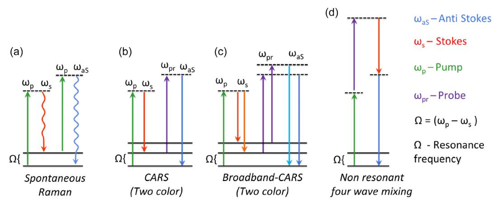

Figure 1. a) Schematic of energy levels and fields involved in SR, b) CARS, c) BCARS, and d) nonresonant four-wave mixing process, which is responsible for the NRB in CARS/BCARS process. Reproduced with permission: [16] Copyright 2018, John Wiley & Sons, Inc.

region.[7] This capability enables the acquisition of a comprehensive BCARS spectrum, making BCARS a powerful tool for chemical analysis. The enhanced signal strength and vibrational specificity of BCARS have established it as an invaluable tool across a broad range of fields.

CARS was originally introduced to study reaction flows and gas dynamics in combustion applications due to its high sensitivity to molecular vibrations. [8,9] Since then, CARS technology has undergone significant advancements that have expanded its application range.[10] Improvements in sensitivity, resolution, and signal-to-noise ratio (SNR), along with the development of more sophisticated detection methods, instrumentation, and enhanced signal-processing techniques, have facilitated its successful use across various fields. [5,6,10-14] In materials science, CARS contributes to the analysis of molecular composition and structure, supporting the development of new materials.[15] In chemical analysis, BCARS provides detailed insights into molecular vibrations[5] and chemical bonds, [16] enabling precise identification and quantification of various substances.[4,17,18] Moreover, these technological advancements have led to the adoption of BCARS in biomedical imaging, where it enables noninvasive visualization of biological tissues and cells with high contrast and resolution, facilitating advanced diagnostic[13,19–21] and research applications.[9,22-26]

Despite its many advantages, CARS spectra often exhibit asymmetry, characterized by a shift of the peak to lower frequencies and the appearance of a dip at higher frequencies (**Figure 2**). This behavior arises from the interference between resonant and non-resonant contributions, which affects the intensity and line shape of the CARS signal. The intensity of the CARS signal (*S*) is proportional to the square of the third-order polarization,  $p^{(3)}(\omega_{aS})$ .

$$S(\omega_{\rm aS}) \propto |P^{(3)}(\omega_{\rm aS})|^2 \tag{3}$$

The third-order polarization is given by

$$P^{(3)}(\omega_{aS}) = \chi^{(3)}(\omega_{aS}) E_{p}(\omega_{p}) E_{p}(\omega_{p}) E_{s}^{*}(\omega_{s})$$

$$\tag{4}$$

where  $\chi^{(3)}(\omega_{aS})$  is the third-order nonlinear susceptibility of the material,  $E_p(\omega_p)$  is the electric field of the pump beam, and

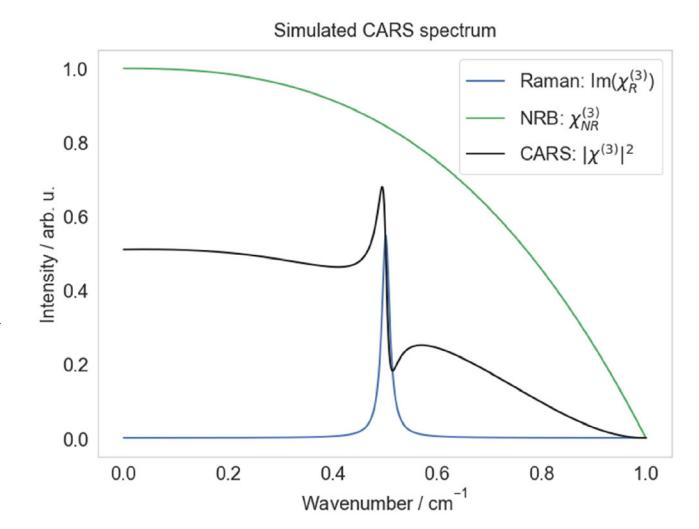

**Figure 2.** Schematic of the simulated CARS spectrum and corresponding imaginary part (equivalent to SR signal). The NRB was simulated with a fourth-order polynomial function.

 $E_s^*(\omega_s)$  is the complex conjugate of the Stokes beam's electric field. The third-order susceptibility  $\chi^{(3)}$  consists of both resonant and nonresonant components[27] as given in Equation (5).

$$\chi^{(3)}(\omega_{aS}) = \chi_{R}^{(3)}(\omega_{aS}) + \chi_{NR}^{(3)} = \text{Re}[\chi_{R}^{(3)}(\omega_{aS})] + \text{Im}[\chi_{R}^{(3)}(\omega_{aS})] + \chi_{NR}^{(3)}$$

$$+ \chi_{NR}^{(3)}$$
(5)

Here,  $\chi_{\rm R}^{(3)}$  corresponds to the resonant Raman signal that provides vibrational information, which has real and imaginary parts. The real part has a dispersive line shape, whereas the imaginary part mirrors the SR signal, which has a Lorentzian shape, as shown in Figure 2. Further, the  $\chi_{\rm NR}^{(3)}$  represents the nonresonant background (NRB), which arises from electronic contributions that are not in resonance with the vibrational modes of interest through a four-wave mixing process. The presence of the NRB often results in either constructive or destructive

interference with the resonant signal, causing asymmetry in the CARS spectrum and diminishing its vibrational specificity (Figure 2). As a result, the direct CARS signal is not readily interpretable, necessitating the minimization of NRB components to improve the SNR and extract resonant fingerprint information.

To address this issue, various experimental configurations, such as heterodyne CARS, [28–34] polarization CARS (P-CARS), [35–38] time-resolved CARS (TR-CARS), [39-43] Fourier-transform CARS (FT-CARS), [44,45] dual-pump CARS (DP-CARS), [46] differential frequency CARS, [47] frequency modulated CARS, [48] phase shaping CARS, [49,50] wide-field CARS, [51] and many more methods, [52-61] have been developed to reduce the NRB. These approaches have successfully demonstrated the reduction of NRB and the direct provision of resonant molecular fingerprint information. Although the proposed experimental methodologies have made progress in suppressing NRB, most approaches do so at the cost of reducing the resonant signal. Additionally, their experimental complexity, sensitivity to optical misalignments, and phase instability make them challenging to implement while also increasing costs. Furthermore, these methods require careful optimization for different sample types and applications. Also, there are situations where these experimental NRB reduction techniques may result in a loss of the desired multiplex CARS (MCARS) signal.[62]

On the other hand, the interaction between the resonant and nonresonant components introduces a phase shift, complicating phase retrieval. Also, the phase information in CARS, which encodes critical details about the sample, is not directly measurable and must be inferred from the intensity of the detected signals. Hence, accurate phase retrieval is crucial for reconstructing highfidelity images and spectra, which are essential for precise molecular and structural analysis. [63,64] In literature, numerical phase retrieval methods, such as maximum entropy method (MEM), [65-67] Kramers-Kronig approach (KK), [63,68] wavelet prism (WP) analysis, [69,70] and Hilbert transform (HT), [71] have been developed to address this challenge. Also, various correction methods have been demonstrated to improve the efficacy of these methods.[17,18,72–74] Even though these numerical approaches retrieve phase information, they often require reference NRB spectra and parameter optimization and may struggle with noise and experimental imperfections.

However, the emergence of computational techniques and, more recently, deep learning (DL) algorithms has brought significant advancements in phase retrieval and paved the way for new

research. Various DL algorithms such as convolutional neural networks (CNN), [75–79] long short-term memory (LSTM) networks, [80] bidirectional LSTM (Bi-LSTM) networks, [81] autoencoders, [82] physics-informed neural networks (PINs), [83] and generative adversarial network (GAN), [84] have been proposed to remove NRB and retrieve resonant Raman information from the CARS spectra in the last four years. These modern methods offer improved accuracy, efficiency, and robustness, addressing many limitations of traditional approaches, see **Figure 3**.

Numerous reviews are available in the literature describing the CARS theory, [6,85] applications, [15,19,86–88] and instrumentation. [89–91] Only a recent review explored the application of DL algorithms for denoising CARS images, NRB removal, and classification. However, a comprehensive overview specifically addressing various approaches to reduce NRB and extract resonant information is still lacking. Therefore, in this review, we aim to provide a thorough examination of recent experimental approaches and phase retrieval methods that are dedicated to obtaining resonant fingerprint information. This review will also detail the advantages and limitations of each method and highlight future research directions to advance the field.

## 2. Different Phase Retrieval Methods

## 2.1. Experimental Methods

This section discusses the most commonly employed experimental approaches, along with recent advancements, for minimizing the NRB in CARS.

### 2.1.1. Polarization CARS

P-CARS is a technique introduced in the late 1970s to suppress the NRB in the CARS signal using the polarization difference between the resonant and nonresonant contributions. [92] Muller et al. briefly discussed about the polarized and TR-CARS techniques. [12] The use of polarized pump and Stokes beams selectively excites molecular vibrations, resulting in a more significant signal from the targeted analyte compared to the NRB, which typically does not exhibit polarization-dependent behavior. The schematic of the polarization vector geometry is presented in Figure 4.

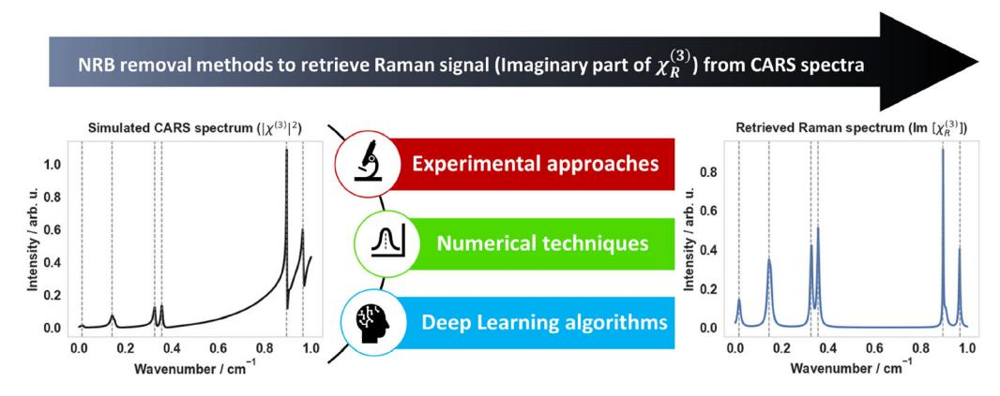

Figure 3. Different approaches are utilized for removing the NRB and retrieving resonant Raman information.

www.advancedsciencenews.com

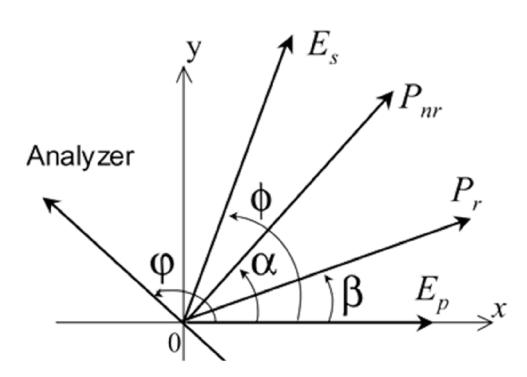

**Figure 4.** Polarization vector geometry for the pump  $(E_p)$ , Stokes  $(E_S)$  fields, nonresonant CARS polarization  $(P_{nr})$ , resonance Raman CARS polarization  $(P_r)$ , and the unit vector indicating the direction of analyzer transmission. Adapted with permission. [119] Copyright 2002, American Chemical Society.

In P-CARS, the maximum suppression of NRB is achieved by keeping the analyzer direction perpendicular to nonresonant CARS polarization ( $P_{\rm nr}^{(3)}$ ), i.e., for  $\varepsilon=90^\circ$  as shown in Figure 4.[90] In this configuration,  $P_{\rm nr}^{(3)}$  vanishes, and only the contribution that comes from the projection of  $P_{\rm r}^{(3)}$  onto the analyzer is detected. However, this approach has a limitation if the resonant and nonresonant depolarization ratios are equal to 1/3, where  $P_{\rm r}^{(3)}$  and  $P_{\rm nr}^{(3)}$  are parallel to each other. Also, complete background removal is prevented in actual experiments due to optical imperfections. Furthermore, a significant portion of the resonant signal is rejected when the polarization difference between the resonant and nonresonant signals is small.

Further, it is demonstrated that the contrast is maximized for  $\alpha = 45^{\circ}$ , which corresponds to the optimal value for the angle  $\varphi$ formed by the pump and Stokes field,  $\approx 71.6^{\circ}$ . [92] This configuration has been successfully used for suppressing NRB in collinear two-beam CARS microscopy by Cheng et al.[35] Figure 5 illustrates MCARS spectra of the same DSPC(1,2-distearoyl-snglycero-3-phosphocholine) vesicle at different polarization directions of the analyzer  $(\varphi)$ . The NRB is effectively suppressed (Figure 5a) when the analyzer polarization is set perpendicular relative to the nonresonant field. Further, with the analyzer polarized along the y-axis ( $\varphi = 90^{\circ}$ ), the 2882 cm-1 band is enhanced while the 2847 cm-1 band disappears; in contrast, when polarized along the x-axis ( $\varphi = 0^{\circ}$ ), the 2847 cm-1 band becomes prominent. It visually conveys that varying the orientation of the analyzer allows selective detection of these spectrally overlapped vibrational modes based on their different depolarization ratios.

Cole et al. proposed a variant of P-CARS, named spectral-focusing-based P-CARS (SFP-CARS), to accurately determine depolarization ratios for strong Raman resonances and suppress NRB. [36] They first demonstrated that the detected CARS signals were more elliptically polarized than expected, likely due to distortions in polarization caused by the microscope and collection optics in the setup. Additionally, they successfully measured and validated the depolarization ratios of various Raman modes in benzonitrile. Finally, they showed that suppressing NRB using the SFP-CARS system is most effective for imaging specific Raman modes that generate resonant signals polarized in

**Figure 5.** Polarization-resolved MCARS spectra of a DSPC vesicle at different angles of the polarization analyzer ( $\varphi$ ). A) 135°, B) 0°, C) 45°, D) 90°.The average powers of the pump and the Stokes beam were 1.2 and 0.6 mW, respectively. Adapted with permission. [119] Copyright 2002, American Chemical Society.

directions far from that of the NRB rather than obtaining background-free CARS spectra.

In spite of its advantages, polarization CARS faces limitations, primarily due to the differential polarization behavior between resonant and nonresonant signals, which may not always be prominent. Optical imperfections and depolarization effects can also restrict the effectiveness of NRB suppression. However, recent developments, such as SFP-CARS, offer improved control over polarization geometries and enhance background suppression.

#### 2.1.2. Time-Resolved CARS

The resonant and nonresonant contributions to the CARS signal not only exhibit different polarization properties but also show different temporal behavior. This can be used to discriminate between the two. TR-CARS is another technique demonstrated for suppressing the NRB in CARS signal by exploiting the differences in lifetimes or dephasing times of resonant and nonresonant contributions, which involve vibrational and virtual states, respectively. While the virtual electronic state itself is extremely short-lived (on the order of attoseconds), in laboratory measurements, the effective temporal resolution of TR-CARS is primarily

ADVANCED
PHOTONICS
RESEARCH

www.advancedsciencenews.com www.adpr-journal.com

limited by the duration of the excitation pulse, typically in the range of 20–100 fs. In contrast, the vibrational state has a lifetime on the scale of nanoseconds and a dephasing time in the range of picoseconds (ps).

In standard CARS, the pump and Stokes pulse pair impulsively polarize the molecular vibrations in the sample, and the relaxation of induced third-order polarization is sampled by the probe pulse. However, in TR-CARS, the laser pulse sequence is arranged such that the probe pulse is delayed by a time interval  $\Delta t$  to avoid temporal overlap with the other two pulses, as depicted in Figure 4a in the publication.[90] This temporal delay ensures that the resonant nonlinear susceptibility, which decays on a ps timescale, is selectively probed, allowing the characterization of vibrational dephasing in the target molecules. In contrast, the NRB, generated through a four-wave mixing and mediated by the instantaneous nonresonant nonlinear susceptibility, is effectively eliminated, as it requires the temporal overlap of the pump, Stokes, and probe pulses. [39] However, this time delay has a trade-off: the probe pulse interacts with a vibrational coherence that may have decayed, characterized by a dephasing time  $(T_{2\nu})$ . As a result, the effective CARS signal is reduced by a factor of  $e^{(-2\Delta t/T_{2\nu})}$ .

The first work on TR-CARS was demonstrated by Kamga et al. using mode-locked lasers. They named it as pulse-sequenced CARS, and an experimental investigation was presented on a toluene sample.[93] Volkmer et al. (2002) demonstrated effective removal of NRB using the TR-CARS technique by recording the Raman-free induction decay of molecular vibrations of benzaldehyde and extended to imaging of polystyrene beads in water. [40] They validated the experimental observations with numerical simulations and showed that the background signal is suppressed by a factor of 570. Pestov et al. reported that the combination of shaped preparation pulses and an ultrashort time-delayed probe pulse decreases background contribution and maximizes the CARS signal. This approach is named as the femtosecond adaptive spectroscopic technique via CARS (FAST-CARS). The efficacy of the approach was demonstrated on the spore detection problem as shown in Figure 6.[41] Upputuri et al. demonstrated improved TR-CARS imaging using pump or Stokes pulses as chirped square pulses. [39] This configuration achieved high spectral resolution even with the fs excitation pulses and named it as chirped T-CARS technique. This study demonstrated the reduction of NRB by 2000 times, whereas the resonant signal decayed by only a factor of 2.3. It is also used to study the collisional decay of neat N2 gas and with mixtures for accurately estimating temperature for combustion applications.[94]

Despite its limitations, with innovations such as chirped pulses and FAST-CARS, TR-CARS has significantly improved in both background suppression and spectral resolution.

# 2.1.3. Heterodyne CARS

It is an interferometric technique where the CARS signal is combined with a reference beam (local oscillator (LO)), which is typically a continuous wave laser. The LO is phase controlled, and through this phase modulation, the technique allows for the separation of the resonant Raman signal from the NRB. The key

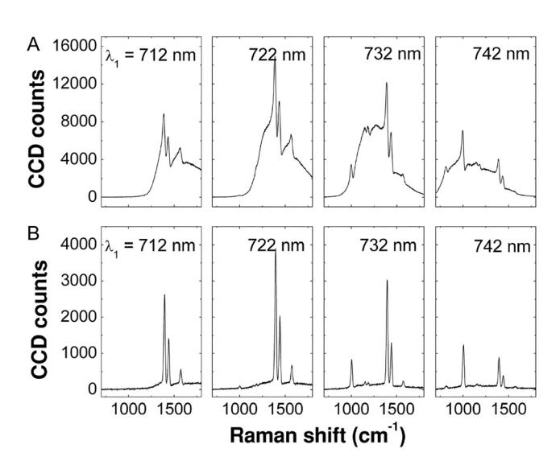

**Figure 6.** CARS spectra of NaDPA were recorded at two probe delays, A) 0 ps and B) 1.5 ps.  $\lambda_1$  is the pump wavelength. At a 1.5 ps delay, the NRB is suppressed, and direct resonant Raman information is attained. Adapted with permission.[41] Copyright 2007, American Association for the Advancement of Science.

advantage of this approach is its ability to produce background-free images by precisely adjusting the phase of the LO without sacrificing any resonant signal across the vibrational spectrum. The CARS signal can be written as[28,32]

$$S(\omega_{aS}) = |E_{LO}|^2 + |E_{aS}|^2 + 2 E_{LO} E_{EX} \left\{ \chi_{NR}^{(3)} + \text{Re}[\chi_{R}^{(3)}] \cos \phi + \text{Im}[\chi_{R}^{(3)}] \sin \phi \right\}$$
(6)

where  $E_{\rm EX}$  is the effective excitation field and equal to  $E_{\rm P}^2 E_{\rm S}$ .  $E_{\rm LO}$  is the electrified of the LO beam, and ø is the phase difference between the CARS and LO fields. The last two elements in Equation (6) are the interferometric mixing terms, which exhibit varying dependences on phase ø. If ø is set to 90°, the mixing term containing the NRB vanishes to zero, whereas the resonant imaginary contributions are maximized. Therefore, it is possible to selectively probe the imaginary response of  $\chi^{(3)}$  without NRB in a heterodyne method by appropriately suppressing the homodyne terms. Moreover, instead of attenuation, it enables linear amplification of the detected signal by increasing the amplitude of the LO.

One more benefit of this method is that the detected signal varies linearly with the concentration of vibrational modes and enables direct quantitative measurements. As a result, heterodyne CARS facilitates precise and reliable concentration measurements, which are critical for applications such as chemical analysis, material characterization, and biological imaging. Evans et al. demonstrated the heterodyne CARS method using broadband pulses with relatively long integration times. [28] Thus, it is not optimized for rapid point-by-point imaging. On the other hand, Potma et al. used narrowband picosecond pulses and demonstrated rapid vibrational imaging of NIH3T3 cells, as shown in **Figure 7**. [32] Jurna et al. demonstrated the same on lipid

www.adpr-journal.com

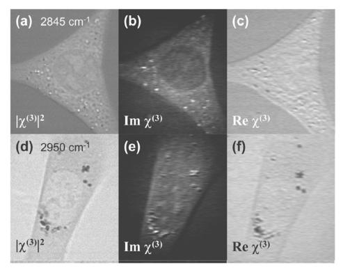

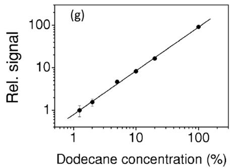

**Figure 7.** Comparison of heterodyne CARS with noninterferometric CARS imaging of live NIH 3T3 cells. a) Noninterferometric image of the cell acquired at 2845 cm-1. b,c) The measured imaginary and real responses, respectively. d–f) The image of the CH stretching band acquired at 2950 cm-1. g) Dependence of the heterodyne signal on the scatterer concentration. The signal was measured at 2845 cm-1 (filled circles). Adapted with permission.[32] Copyright 2006, Optical Society of America.

suspension imaging but based on a controlled and stable phase-preserving chain.  $^{[29]}$ 

Furthermore, various researchers have introduced different variants of heterodyne CARS. Kolesnichenko et al. demonstrated that the combination of pulse shaping with an interferometric heterodyne detection method provides the CARS spectra with Raman shifts down to  $\approx 30 \text{ cm}^{-1}$ .[30] Further, dual-polarization balanced heterodyne CARS detection enabled background-free chemical imaging of nanoparticles and interfaces in epigeometry. [31] Suzuki et al. demonstrated improved heterodyne CARS measurements using rapid phase modulation and temporal displacement of the background. This approach enables the reduction of the NRB while maintaining resonant signal enhancement.[34] Further, the single-beam heterodyne FAST-CARS microscopy technique was also proposed and demonstrated on Si and MoS2 microstructures. It provides rapid CARS imaging without NRB subtraction and data postprocessing in a simple setup using real-time piezo modulation of the probe delay.[33]

While heterodyne CARS offers several advantages, it does have some limitations. For example, phase modulation for NRB suppression is highly sensitive to imperfections, which can limit its effectiveness if not controlled precisely. Furthermore, the technique's performance may be compromised for rapid, point-by-point imaging when using broadband pulses with long integration times. However, ongoing developments, such as the use of narrowband pulses and dual-polarization detection, continue to enhance Heterodyne CARS efficiency.

## 2.1.4. Fourier-Transform CARS

FT-CARS technique integrates the coherent generation of vibrational signals with Fourier-transform analysis. Unlike traditional MCARS or TR-CARS, FT-CARS captures the time-domain evolution of molecular vibrations by scanning the delay between the femtosecond pump and probe pulses. The pump pulse impulsively excites coherent molecular vibrations, while the probe pulse samples this oscillating coherence at various time delays. Applying a Fourier transform to the recorded anti-Stokes signal

as a function of delay reconstructs the vibrational spectrum with high spectral resolution.

A major advantage of FT-CARS is its inherent suppression of the NRB. As the NRB is an instantaneous electronic response, it decays rapidly and does not contribute significantly to the time-domain interferogram. In contrast, resonant vibrational coherences persist on the picosecond timescale, allowing selective detection of molecular vibrations. This time-domain approach not only enhances chemical specificity but also provides access to vibrational dephasing times, offering insight into the molecular environment. Additionally, FT-CARS enables the acquisition of the full vibrational spectrum, including both the fingerprint and C-H stretching regions in a single measurement. Its rapid acquisition and spectral breadth have enabled applications in broadband spectroscopy, high-resolution imaging, and the study of molecular dynamics.

FT-CARS has seen substantial technological evolution since its inception and recently, Nishiyama et al. reported an overview of the FT-CARS technique and its advancements. [95] Early demonstrations by Ogilvie et al. (2006) employed Ti:sapphire lasers and mechanical scanning stages, achieving high spectral resolution ( $\approx 3 \text{ cm}^{-1}$ ), albeit with low spectral acquisition rates (<1 Hz). [44] To address this limitation, resonant scanning systems were introduced by Hashimoto et al. enabling acquisition rates of up to 24 kHz with moderate resolution ( $\approx$ 10–13 cm-1), significantly advancing real-time imaging capabilities. [96] Subsequent innovations such as polygonal scanners, rotating arms, and fiber-based lasers further pushed acquisition speeds while maintaining acceptable spectral resolution. For instance, Coluccelli et al. achieved a 6.25 kHz acquisition rate with 4 cm-1 resolution using a Yb-fiber laser and a rotating arm. [97] More recently, dual-source configurations combining Ti:sapphire and Yb-fiber lasers enabled extended spectral coverage from 200 to 3200 cm-1, encompassing both fingerprint and C-H stretching regions.[98]

Spectral sensitivity has also improved. Initial detection limits were around 0.28 mol L $^{-1}$  for toluene, but heterodyne-enhanced FT-CARS achieved up to 5  $\times$  SNR improvement. [99] Spectral resolution in FT-CARS is fundamentally governed by the Fourier uncertainty principle and is inversely proportional to the scanned

**ADVANCED** SCIENCE NEWS ADVANCED
PHOTONICS
RESEARCH

www.adpr-journal.com

www advancedsciencenews com

time delay. While scanning stages allowed delays up to 12 ps (yielding  $\approx\!3\,\text{cm}^{-1}$  resolution), resonant scanners are often limited to 3 ps (resulting in  $10\text{--}22\,\text{cm}^{-1}$  resolution). Trade-offs exist between speed, resolution, and bandwidth, and systems are optimized based on target applications. For instance, the two-laser technique demonstrated an SNR >1000 in the C–H region with acquisition times  $<100\,\mu\text{s}$ , whereas the broadband single-laser approach offers wider coverage at the expense of sensitivity.  $^{[98]}$ 

In spite of these advancements, challenges remain regarding phase stability across delays, sensitivity limitations for weak vibrational modes, and complexity in data acquisition for large field of view imaging. However, ongoing developments in laser stabilization, adaptive sampling strategies, and advanced signal processing continue to enhance the practicality of FT-CARS for chemical imaging and spectroscopy applications.

#### 2.1.5. Dual-Comb CARS

Dual-comb CARS (DC-CARS) is a modern variant of CARS that leverages two optical frequency combs with slightly different repetition rates to capture high-resolution, broadband vibrational spectra without mechanical delay scanning. By exploiting the asynchronous sampling of molecular vibrations through dualfrequency combs, DC-CARS achieves time-domain sampling of the vibrational coherence, which is then converted into spectral information via the Fourier transformation. This technique provides access to both the fingerprint and high-wavenumber (e.g., C-H stretching) regions with high acquisition speeds. The DC-CARS concept builds on the coherent time-domain detection scheme similar to FT-CARS, but instead of physically scanning the time delay between pump and probe pulses, the time delays are electronically encoded through the slight repetition rate difference between the two combs. This enables rapid and continuous data acquisition at rates much higher than those attainable with mechanical scanning systems, making DC-CARS ideal for real-time, high-throughput molecular analysis.

Early implementations of dual-comb spectroscopy in coherent Raman imaging demonstrated its promise but suffered from significant drawbacks.[102-104] Specifically, the extremely low duty cycle, often <1%, meant that over 99% of laser energy was not utilized for the CARS process, resulting in low signal efficiency and high sensitivity to noise. Additionally, complex synchronization between the two combs and susceptibility to phase noise presented technical challenges that limited practical deployment. To address these issues, Kameyama et al. introduced a quasidualcomb approach in which the repetition rate of one comb is dynamically modulated.[105] This method achieved a near 100% duty cycle, effectively aligning pulse timing with molecular vibrational lifetimes and boosting the SNR by over 100 x. Their system also enabled a remarkable spectral acquisition rate of 100 000 spectra s-1, demonstrating real-time hyperspectral imaging capabilities with improved sensitivity and efficiency. However, this gain in speed came at the expense of spectral resolution, which was limited to 117 cm-1 due to intrinsic trade-offs in Fourier-transform spectroscopy.

Further developments in DC-CARS have extended to SF CARS, a time-domain hyperspectral technique. [106,107] In such implementations, two 100 MHz frequency combs are used, with

the repetition rate of one comb modulated via an intracavity electro-optic (EO) modulator. This configuration enables the acquisition of coherent Raman spectra with bandwidths exceeding 200 cm-1 and high spectral resolution ( $\approx$ 10 cm-1), achieving refresh rates up to 40 kHz—suitable for high-throughput applications such as flow cytometry. However, the speed of such systems is ultimately constrained by the response bandwidth of the EO modulator. [107] A more fundamental limitation of many dualcomb systems lies in their dependence on mode-locked lasers with fixed optical cavities, which are highly sensitive to environmental fluctuations and offer limited tunability in repetition rate. To address these challenges, EO comb (EO comb) generation presents a compelling alternative, offering simple, robust, and highly tunable light sources. DC-CARS systems based on EO combs have demonstrated acquisition rates between 10 and 50 kHz, operating at much higher repetition frequencies (≈10 GHz). [108] Despite these advances, the full potential of EO combs, especially their flexibility and configurability, has yet to be fully leveraged for ultrafast CARS measurements. Further, Lv et al. proposed a hybrid dual-comb approach, which combines the broadband fiber lasers with EO modulation to improve repetition rate stability and acquisition fidelity. In one such system, a 1 MHz acquisition rate was achieved with a 30 cm-1 resolution in the CH stretching region.[109]

Despite its many advantages, DC-CARS faces certain challenges. The synchronization of two frequency combs requires complex control electronics and stabilization methods, making the system less accessible compared to conventional CARS setups. In addition, the spectral resolution is ultimately limited by the repetition rate and mutual coherence between combs, and environmental perturbations can introduce phase noise that degrades performance. Nevertheless, with ongoing developments in comb technology, photonic integration, and data processing, DC-CARS holds strong promise for becoming a standard method in next-generation spectroscopic instrumentation.

#### 2.2. Numerical Algorithms

This section provides an overview of the various numerical algorithms proposed to retrieve resonant Raman information from the CARS spectrum. Among all, the MEM and KK approaches are popular and widely used in research. Even the recently explored DL algorithms utilized either of these approaches as a standard to evaluate their model's performance. So, in this section, we focus on describing these techniques along with the proposed corrections in the literature.

#### 2.2.1. Kramers-Kronig (KK) Approach and its Correction Methods

The KK method relies on the causality of the physical process. It uses the mathematical relationship between the real and imaginary parts of the CARS signal, as governed by the KK relations. These relations couple the dispersion (real part) and absorption (imaginary part) components of a system's response function, enabling the separation of the resonant signal from the NRB. Peiponen et al. briefly presented the application of KK in nonlinear optical processes. [68] They have considered the classical anharmonic oscillator model to realize the basic properties that

ADVANCED
PHOTONICS
RESEARCH

www.adpr-journal.com

www.advancedsciencenews.com

are required for the existence of the KK relations for nonlinear susceptibilities. The KK relation is frequently utilized to acquire the phase  $\varphi(v)$  information from the modulus of susceptibility. [63] This relationship can be written as

$$\varphi(v) = -\frac{1}{\pi} P \int_{-\infty}^{+\infty} \frac{\ln \sqrt{S(v')}}{v' - v} dv' \tag{7}$$

where P is the Cauchy principal value. In practice, the Hilbert transform  $(\widehat{\mathcal{H}})$  is used as a numerical implementation of this integral. It is a linear operator that allows the estimation of the imaginary (or real) part of a complex function when only one component is known. For causal systems, this operation ensures the analyticity of the signal in the frequency domain. Thus, the Hilbert transform facilitates phase retrieval by computing the spectral phase from the intensity of the measured CARS signal. Once the phase is computed, the complex susceptibility  $\chi^3(v')$  can be reconstructed using the following equation.

$$\chi^{3}(v') = |S(v')|^{\frac{1}{2}} \times e^{i\varphi(v')}$$
 (8)

Further, the real and imaginary parts of the  $\chi^3(v')$  can be calculated using the following equations.

$$\operatorname{Re}[\chi^{3}(v')] = |S(v')|^{\frac{1}{2}} \times \cos(\varphi(v')) \tag{9}$$

$$Im[\chi^{3}(v')] = |S(v')|^{\frac{1}{2}} \times \sin(\varphi(v'))$$
(10)

The Im  $[\chi^3(v')]$  term provides the same information as the SR and thus can be used for further analysis. Despite its theoretical significance, the practical implementation of the KK method is associated with several limitations. One of the major challenges arises from the need for integration over an infinite frequency range. However, this theoretical requirement cannot be fulfilled in real measurements where the experimental CARS spectra are only recorded over finite ranges, leading to truncation errors that can affect the accuracy of the calculated phase. Additionally, the KK approach assumes ideal physical conditions, such as linearity, causality, and smooth spectral features, which may not hold in systems with non-Lorentzian line shapes, nonlinear effects, or significant contributions from the NRB. Moreover, the numerical implementation of the KK relations through the HT assumes smooth spectral features. However, noise or abrupt changes in spectral features introduce artifacts into the estimated phase. This is further compounded by finite spectral resolution in actual experiments, which reduces the accuracy of phase retrieval.

These challenges necessitate careful experimental design and robust preprocessing of spectra. Hence, correction procedures are proposed to enhance the accuracy and reliability of the KK approach in practical CARS spectroscopy applications. In order to solve the finite integration problem, extrapolation or zero-padding techniques are often employed to approximate behavior at the limits, though these methods are prone to inaccuracies. Also, these approaches have been developed by approximating the missing data to deal with a finite data range, but these are often difficult to apply. [110] For instance, Liu et al. introduced a time-domain KK transform that offers a closed-form solution for retrieving the phase and, consequently, the resonant imaginary component of the CARS signal. [63] This method is designed

to handle a broadband CARS spectrum with a nonflat NRB. The approach involves transforming the frequency-domain data into the time domain, performing operations that satisfy the causality criterion, and then transforming the data back into the frequency domain. By addressing causality directly in the time domain, this method effectively accounts for the spectrally varying NRB as a response function with a finite rise time. They have also demonstrated that phase errors introduced by the finite frequency range result in small (< 1%) errors in the retrieved resonant spectra, underscoring the method's robustness.

Francesco et al. developed two modified versions of the KK method to address spectral distortions and achieve accurate phase retrieval.[18] Both methods incorporate normalization of the CARS signal using the system response or a reference sample, such as glass, which serves as a ubiquitous calibration standard often included in microscope setups. This step minimizes the errors introduced by the spectral variations and provides accurate phase retrieval followed by susceptibility estimation. The first method, iterative Kramers-Kronig (IKK), employs the causality principle by iteratively solving for the real and imaginary components of normalized susceptibility. It uses a sequence of Fourier transforms, applies noise filtering with a Gaussian time filter, and iteratively updates the nonresonant component to achieve convergence. The second method, phase-corrected Kramers-Kronig (PCKK), simplifies the process by directly applying KK relationships to the logarithmic representation of the normalized susceptibility. This approach eliminates iterative steps. Also, to reduce the error caused by the infinite spectral range, a rigid phase shift correction is considered. Moreover, both methods employ time-domain filtering to suppress noise, maintaining spectral fidelity while effectively reconstructing phase information. The efficacy of their methods is demonstrated on bulk polystyrene and GTO samples, and results are compared with the MEM method and the SR spectra recorded on the same sample as shown in Figure 8.

Camp et al. proposed a new error-correction approach for the KK method. [72] This method is for processing the CARS spectra that suppresses errors resulting from the use of inexact reference NRB spectra. It also aims to eliminate baseline fluctuations and provide spectra that are independent of the reference material. They have introduced a "windowed" HT  $(\mathcal{H}_w)$ , which considers a limited spectral range instead of an infinite to estimate the phase. **Figure 9** presents the application of the proposed methodology.

In order to apply it, they considered two conditions based on Equation (3), and (4), that is, the Raman peaks inside this window are unaffected by those outside of it, and any resonances of  $\chi_{NR}$  are far removed from those of  $\chi_{R}$ . Finally, the windowed and analytic HT is related as

$$\widehat{\mathcal{H}_{w}}\left\{\frac{1}{2}\ln|\tilde{\chi}^{3}(v)|^{2}\right\} = \widehat{\mathcal{H}}\left\{\frac{1}{2}\ln|\tilde{\chi}^{3}(v)|^{2}\right\} + \varepsilon(v) \tag{11}$$

where  $\varepsilon(\omega)$  is an additive error term,  $\tilde{\chi}^3(v) = \chi^{(3)}(v) * E_{\rm pr}(v_{\rm pr})$ , and '\*' is the convolution operator. However, this retrieved phase not only contains the contribution from the nonlinear susceptibility but also the windowing error and the effective stimulation profile  $(E_{\rm s}(v_{\rm S}) \star E_{\rm p}(v_{\rm p}))$ , where ' $\star$ ' is the cross-correlation operator). Further, by modifying the above equations with the assumption

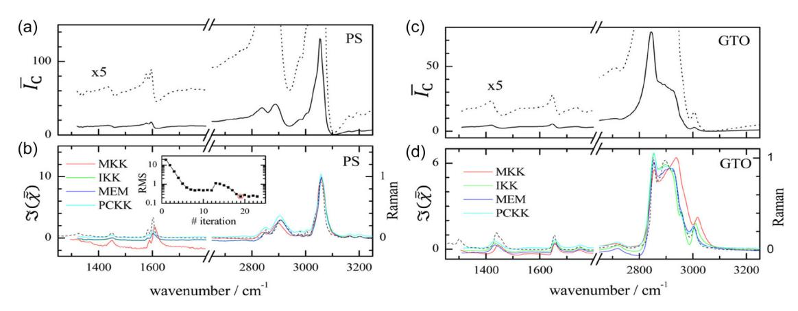

Figure 8. CARS intensity ratio Ic CARS spectrum divided by reference NRB spectrum) measured on bulk samples: a) PS and c) GTO. b) and d) Imaginary part retrieved using different methods for both samples, respectively. The dotted lines represent the normalized Raman spectra measured on the same samples. The inset in Figure b represents the RMS error in Ic of the IKK method versus the iteration number. Adapted with permission.[18] Copyright 2002, American Chemical Society.

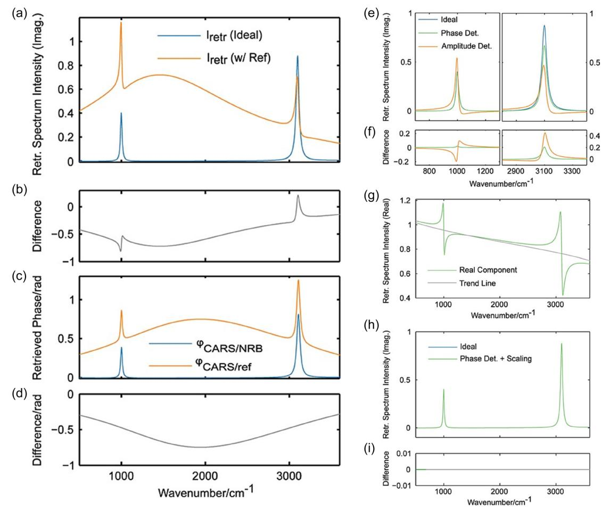

Figure 9. Comparison of retrieved Raman-like spectra using the KK method. a) When the NRB is exactly known (Ideal) and a reference is utilized (Ref ) and b) is their difference. c) The KK-retrieved phase, when the NRB is known (φCARS/NRB) and using a reference (φCARS/ref ) and d) is their difference. Comparing the retrieved spectra with the proposed methods. e) KK-retrieved spectra when the NRB is known (Ideal) and using a reference material with phase and amplitude detrending. f ) The difference between the ideal and corrected spectra. g) The real component of the retrieved spectrum and its trend line. h) Phase-detrended and scaled spectrum. It is identical to the ideal retrieval (Ideal) and i) is their difference, which is zero. Adapted with permission.[72] Copyright 2016, John Wiley & Sons, Inc.

ADVANCED PHOTONICS RESEARCH

www advancedsciencenews com

www.adpr-journal.com

of accurate measurement of NRB without any Raman resonances, it is shown that the retrieved Raman-like spectrum is proportional to the SR spectrum multiplied by the nonresonant component. However, due to the limitations of accurate measurement of NRB, errors are introduced in the retrieved signal, and the authors proposed two steps for proper correction. The first step involves removing the phase error via phase detrending and correcting for part of the amplitude error via the KK relation. The second step corrects for the scaling error, and the error originated from the windowed HT via the unity centering of the real component of the retrieved spectrum. They have developed an open-source Python-based framework to easily implement all these correction steps for the accurate retrieval of the Raman-like spectrum.[111]

Arnica et al. used NaCl as an NRB standard for the accurate retrieval of Raman-like spectra using the PCKK approach.[17] Typically, glass is used as a standard, but it shows a vibrational resonance spectrum in the 500–750 cm-1 region, which depends on the specific chemical composition of the glass. Thus, NaCl serves as an alternative reference to avoid this issue. Finally, accurate volumetric quantitative measurements were demonstrated on polystyrene bead samples using PCKK combined with the factorization into susceptibilities and concentrations of the chemical components method. Notably, the IKK method can also benefit from the use of NaCl, as it requires normalization against a reference NRB spectrum. Further, Camp et al. developed a series of new methods, which is collectively named as "factorized Kramers-Kronig and error correction" (fKK-EC).[73] The proposed method decomposes the CARS spectral data into a small set of basis vectors, and various sequential processing steps are performed on it. First, it starts with Raman signal retrieval, followed by denoising and phase- and scale-error correction. This limited operation on a small number of basis vectors increases the processing speed without losing the desired spectral information compared to conventional methods. Thus, the results on chicken cartilage imaging (703 026 spectra) have demonstrated that processing speed is 70 times faster than the conventional approaches, as shown in Figure 10.[73] Further, they have also demonstrated that the machine learning (ML)-assisted fKK-EC method speeds up tissue image processing by more than 150 times compared with the conventional workflow.

Camp et al. also introduced a new method of performing the HT on the KK relation to extract Raman information from the CARS spectra.[71] The proposed learnt discrete HT (LeDHT) method is aimed at addressing the limitations of the traditional method, which gives errors when spectral peaks appear beyond the recorded window, leading to distorted line shapes and artifacts. The LeDHT method learns/trains on a synthetic dataset (300 000 spectra), which contains a single-Gaussian peak to learn a matrix representation of the HT. After learning/training, it transforms the arbitrary new input spectra via matrix multiplication, which is computationally efficient and fast. Results showed that the LeDHT outperforms both the traditional Discrete HT(DHT) and padded DHT methods. It reduced the mean squared errors by several orders of magnitude on the simulated data, demonstrated stability near spectral window edges, and delivered consistent performance on different spectra. Further, experimental validation on glycerol spectra underscores its robustness, with reduced variability in phase and Raman: NRB ratio calculations compared to competing methods. All these modifications to the KK method have made it a powerful tool for extracting valuable phase and susceptibility information, and it has become an integral part of CARS signal analysis.

### 2.2.2. Maximum Entropy Method (MEM)

Maximum entropy is another method first used by Vartiainen et al. to extract the phase information from the CARS spectrum[66] without any iterative process. This method provides the real and imaginary parts of the susceptibility from its squared modulus. Also,  $|\chi^3(v)|^2$  can be approximated by the MEM function as given in Equation (12).

$$|\chi^3(v)|^2 = \frac{b_o}{\left|1 + \sum_{n=1}^M a_n e^{-i2\pi nv}\right|^2} = \left|\frac{\beta}{A_M(v)}\right|^2$$
 (12)

where  $|\beta|^2 = \beta \beta^* = b_0$  and  $A_M(v) = 1 + \sum_{n=1}^M a_n e^{-i2\pi nv}$ . The coefficients  $b_0$  and  $\{a_n\}$  can be retrieved from the matrix equation as shown in Equation (13).

$$\begin{bmatrix} R(0) & R(-1) & \dots & R(-M) \\ R(1) & R(0) & \dots & R(1-M) \\ \vdots & \vdots & \ddots & \vdots \\ R(M) & R(M-1) & \dots & R(0) \end{bmatrix} \begin{bmatrix} 1 \\ a_1 \\ \vdots \\ a_M \end{bmatrix} = \begin{bmatrix} b_0 \\ 0 \\ \vdots \\ 0 \end{bmatrix}$$
(13)

Here, M is limited by the number of sampled/data points, that is, the order of N, as  $M \le N/2$ . Further, the autocorrelation values R(m),  $(|m| \le M)$  can be determined from the measured squared modulus data by a Fourier transform as given in Equation (14).

$$R(m) = \int_0^1 |\chi^3(v)|^2 * e^{i2\pi mv} dv, |m| \le M$$
 (14)

The MEM approximation Equation (13) and (14) provides the values of coefficient  $\{a_n\}$  and  $b_0$  and allows for defining the susceptibility function. However, one should consider that MEM only gives the modulus  $|\beta|$  and not the real and imaginary parts of  $\beta$ . Also, the assumption of the conjugate form of  $\chi$  as the correct one leads to the following approximations.

$$\chi^{3}(v) = \frac{\beta^{*}}{A_{M}^{*}(v)'} \tag{15}$$

$$\text{Real}[\chi^{3}(v)] \frac{\beta' A'_{M}(v) + \beta'' A''_{M}(v)}{|A_{M}(v)|^{2}}$$
(16)

$$Im[\chi^{3}(v)] = \frac{\beta' A'_{M}(v) - \beta'' A''_{M}(v)}{|A_{M}(v)|^{2}}$$
(17)

The task of determining the real and imaginary components of the function  $\chi$  simplifies to finding the corresponding parts of the complex number  $\beta$  from its modulus,  $|\beta|$ . While numerous values of  $\beta$  share the same modulus, the issue is resolved because  $\beta$  is constant (unaffected by the variable v). This becomes manageable if at least one condition/constraint is imposed on  $\chi^3(v)$ . For instance, if there is a frequency v' where the imaginary part equals zero, the solution becomes straightforward, as given in

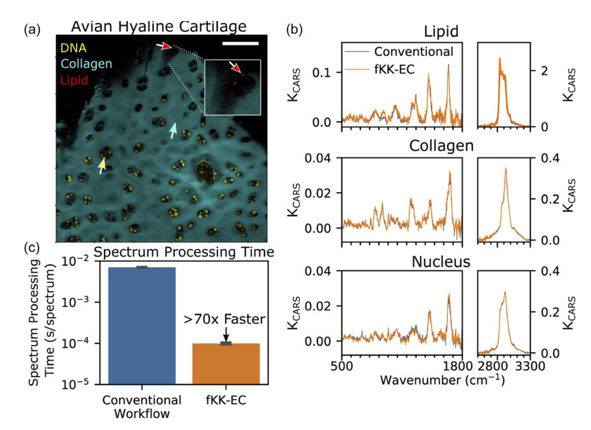

Figure 10. a) The pseudocolor image was constructed from the fKK-EC processed CARS image. It highlights the DNA (yellow), collagen (cyan), and lipids (red). The inset represents the zoomed-in region with a scale bar of 100 μm. b) The single-pixel spectra correspond to the locations represented by the arrows in (a). c) Comparison of spectrum processing time between the fKK-EC and conventional workflow. Adapted with permission.[73] Copyright 2020, Optical Society of America.

Equation (18). Also, in reality, this assumption is valid when v is far from any resonances.

$$\beta' = |\beta| * \cos(\varphi(v')), \ \beta'' = |\beta| * \sin(\varphi(v'))$$
(18)

where  $\varphi$  is the constant phase, and it can be obtained by Equation (19).

$$\tan\left(\varphi(v')\right) = \beta''/\beta' \tag{19}$$

Also, the phase information can be obtained by considering another constraint where the imaginary part of  $\chi^3(v)$  has a local maximum at a resonance. The accuracy of the estimated phase and imaginary part depends on the MEM approximation of  $|\chi^3(v)|^2$ , which needs to be as close as possible to the original spectrum. However, the method has the following drawbacks. First, the MEM approximation is based on a periodic function, but the actual spectrum does not satisfy this condition. In order to overcome this, the spectrum can be squeezed on both ends by adding constant values at the ends, and thus, the middle part of the spectrum contains the maximum resonant peaks. Also, the order of M (number of poles) needs to be correctly chosen for efficient performance, and at least prior information on the single resonance is required.

Vartiainen et al. further extended their studies on MEM. The new method provides quantitative information from the MCARS spectra in congested spectral regions without the need for any a priori information on the resonance structure of the sample. [67] It is demonstrated that the coefficients in Equation (13) and  $\beta$  can

be solved from a (Toeplitz) set of linear equations, [67] and introducing the phase error term reduces the phase retrieval problem to background correction. Figure 11 presents the results of the proposed method, which are in good agreement with the ground truth SR spectra. Cicerone et al. reported that the TDKK and MEM methods are functionally equivalent for CARS microscopy and only have minor differences, as shown in Figure 12. [112] They evaluated the performance of MEM and TDKK methods to retrieve resonant information under a variety of conditions. Also, it is mentioned that either algorithm can be performed in submillisecond times for spectra with several hundred points, albeit the MEM algorithm requires 1.5X of the computational time required by TDKK.

# 2.2.3. Other Numerical Approaches

Even though TDKK and MEM are the most used phase retrieval techniques, various researchers have proposed different mythologies to remove NRB and extract resonant information. Kan et al. proposed WP decomposition analysis for accurate and quantitative estimation of resonant vibrational responses. [69] The prime benefit of the proposed methodology is that the spectral phase and amplitude corrections are circumvented in the retrieved Raman-like spectrum. Hence, it significantly simplifies the quantitative measurement of a normalized CARS spectrum in the presence of experimental artifacts. This method provides the corrected CARS line shape by estimating and eliminating the slowly varying modulation error function in the measured normalized CARS spectrum, as given in Equation (20).

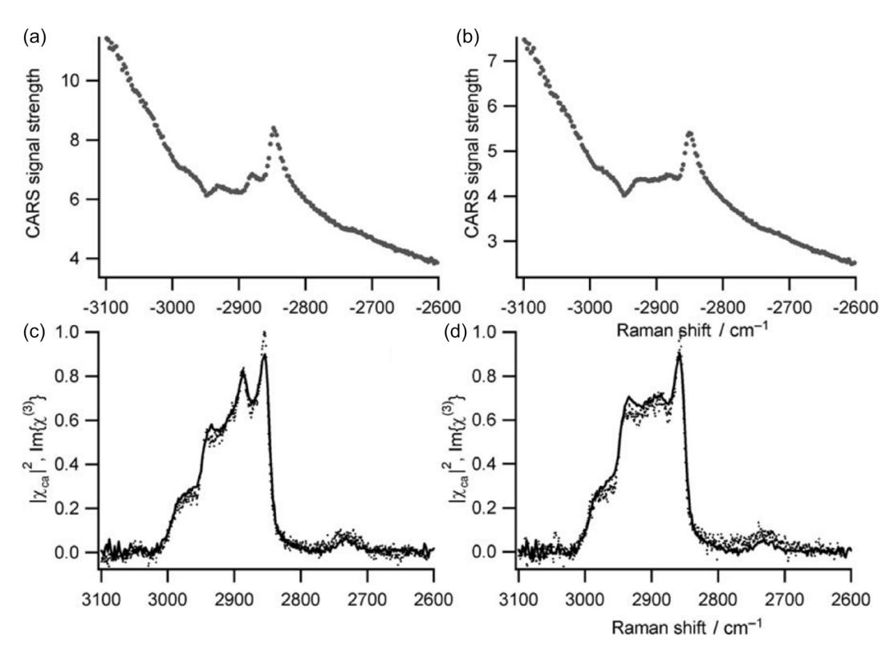

Figure 11. a,b) MCARS spectra of a 75 mm DMPC SUV suspension in water acquired at 15.8 and 38 °C, respectively. c,d) The corresponding retrieved imaginary part (solid line). The dotted lines represent the separately measured SR spectrum. Adapted with permission. [65] Copyright 2007, John Wiley & Sons, Inc.

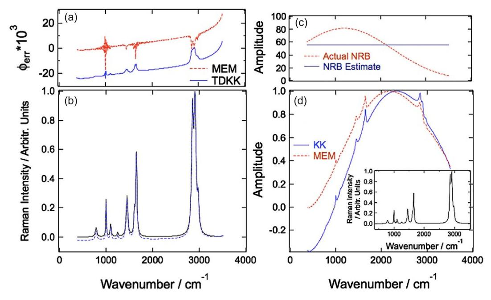

Figure 12. a) The phase error for the MEM and TDKK methods with exactly known NRB. b) Retrieved Raman-like spectrum using TDKK (dashed line) and referenced Raman spectrum (solid line). c) The NRB vector is used as input to simulate the CARS signal (solid line) and estimated NRB (dashed line). d) The imaginary part of  $\chi_R^{(3)}$  retrieved using the TDKK (solid line) and MEM method (dashed line). The inset represents the retrieved Im  $[\chi_R^{(3)}]$  part from TDKK and MEM after phase error correction. Adapted with permission. [112] Copyright 2012, John Wiley & Sons, Inc.

ADVANCED

www.advancedsciencenews.com

www.adpr-iournal.com

$$\operatorname{Im}[\chi_{R}^{(3)}(v)] = \sqrt{S(v)} \sin(\varphi(v) - \phi_{err}(v)) \tag{20}$$

where S(v) normalized CARS spectrum,  $\varphi(v)$  is the retrieved phase spectrum, and  $\phi_{err}(v)$  is an error-phase estimation. Thus, the  $(\varphi(v) - \phi_{err}(v))$  represents the vibrational resonance phase spectrum that corresponds to  $\chi_{\rm R}^{(3)}(\nu)$ . However, in reality, an ideal reference NRB spectrum will not be available. Thus, they have introduced a total slowly varying modulation error function  $(\varepsilon(v))$ , as given in Equation (21).

$$S_{\text{exp}}(v) = S(v) \times \varepsilon(v)$$
 (21)

By applying the WP method, the CARS line shape can be decomposed into various terms as given in Equation (22).

$$lnS_{\exp}(v) = \left[ \ln S_{\exp}(v) \right]_{\text{noise}} + \left[ \ln S_{\exp}(v) \right]_{\text{signal}} + ln\epsilon(v) + \left[ lnS_{\exp}(v) \right]_{\text{DC}}$$
(22)

where the terms with subscript noise, signal, and DC represent the noise spectrum, the informative signal part, and the approximation component, respectively.  $\ln \varepsilon(v)$  corresponds to the slowly varying modulation error spectrum. Finally, the correct normalized CARS line shape can be obtained as given in Equation (23).

$$S(v) = \exp\{\left[\operatorname{In}S_{\exp}(v)\right]_{\text{noise}} + \left[\operatorname{In}S_{\exp}(v)\right]_{\text{signal}} + \left[\operatorname{In}S_{\exp}(v)\right]_{\text{DC}}\}$$
(23)

The WP analysis was performed on various samples, and the results are presented in Figure 13. It is demonstrated that the retrieved  $\operatorname{Im}[\chi_{R}^{(3)}(v)]$  spectra are in good agreement with the SR spectrum measured on the same sample.

Expanding on wavelet-based methods, a related approach was introduced by Härkönen et al. It emphasizes the use of interpolated inverse discrete wavelet transforms (IIDWT) to effectively correct spectral backgrounds in both additive and nonadditive scenarios.[70] It provides an unsupervised way of calculating the optimal wavelet basis and the model parameters. This method also addresses the issue of varying background behaviors, including oscillatory and linear components, which are generally present in CARS spectra analysis. Key advantages of the IIDWT approach include its ability to handle boundary effects adaptively, often seen in experimental CARS spectra, and its minimal dependence on predefined parameters. This flexibility makes it a robust tool for analyzing the complex datasets that appear in different biomedical applications. They have also demonstrated the efficacy of their methodology on the CARS spectra of fructose, adenosine phosphate, glucose, and sucrose samples. [70]

Even though all these phase retrieval methods and their correction approaches have demonstrated NRB removal, their effectiveness is often constrained by sensitivity to noise and inaccuracies in measured data. Also, the reliability of these methods strongly depends on the reference NRB spectra, which makes them susceptible to experimental inconsistencies. Moreover, the parameters need to be fine tuned, such as the number of poles in MEM, the number of wavelets in WP, etc., especially when dealing with complex or highly variable samples. As a result, these methods may not always provide a universally robust solution across diverse experimental and application settings. To address

these challenges, DL methods offer a promising alternative by leveraging data-driven models that can adapt to different NRB conditions without the need for explicit phase correction or complex parameter tuning. The next section explores the implementation of DL techniques for NRB removal.

# 2.3. Deep Learning (DL) Methods

DL methods can overcome the limitations of experimental approaches and traditional phase retrieval algorithms. Once the model training is completed, it can be directly used for efficient NRB removal. However, their performance depends on various factors like the selection of simulation parameters (NRB type, no of resonances, range of resonances, and their widths and amplitudes), model architecture, its optimization, etc. Here, we have primarily focused on reviewing/comparing the performance and limitations of each DL method reported in the literature instead of describing its architecture, as it is already optimized for better performance. Only very recently have DL algorithms been explored for NRB removal in the CARS research community, and an overview of all the methods is presented in chronological order in Table 1. It contains the details of the network, NRB type, training data, and analysis performed.

Valensise et al. first used the DL model to extract resonant information from the CARS data. [79] Their model is based on the CNN (SpecNet) architecture and trained on 30 000 simulated spectra. After training, the performance was evaluated not only on simulated but also on four real solvents, as shown in Figure 14. It has been demonstrated that the predictions agree with the SR spectra, and processing (Raman signal retrieval) time is only  $\approx$ 0.1 ms (obtained by averaging over 10 000 test spectra), which is much faster than the time required to collect one spectrum. The trained SpecNet model weights, along with code to simulate the CARS spectra, were made available in an opensource repository.[113] Thus, it paved the way for the subsequent research on NRB removal and served as a benchmark for other models' evaluation.

Also in 2020, Houhou et al. introduced the LSTM network, which has a simple architecture, as shown in Figure 15c. [80] They have simulated the CARS data in two ways. In the first case, the Raman resonances were considered only in the region where the NRB is strong. In the second case, the Raman resonances were constructed in both the strong and the weak NRB regions. Both scenarios were chosen to evaluate the model's efficiency. They also assumed NRB to be a Gaussian function multiplied by 0.5. The results demonstrated that the root mean square error (RMSE) for their model was  $\approx$ 0.01, while it was  $\approx$ 0.11 and  $\approx$ 0.10 for the MEM and KK methods, respectively.

Even though the performance of both the SpecNet and LSTM methods was found to be better on solvent spectra, they were not evaluated on the complex CARS spectra. Further, Junjuri et al. retrained the SpecNet CNN model with the combination of simulated and semisynthetic data without modifying its architecture. [76] The same simulation parameters were used to generate the training data. The Pearson correlation analysis on the simulated data showed that a correlation of more than 0.9 was observed for the retrained model. In contrast, it was 0.6-0.9 for the original model. Also, the results on complex biological

2699993, 2025, 9, Downloaded from https://advanced.onlinelibary.wiley.com/doi/10.1002/abpt.202500035, Wiley Online Library on [12/02/2026]. See the Terms and Conditions (https://onlinelibary.wiley.com/terms-and-conditions) on Wiley Online Library for rules of user, OA articles are governed by the applicable Creative Commons Licensea

**4DVANCED** 

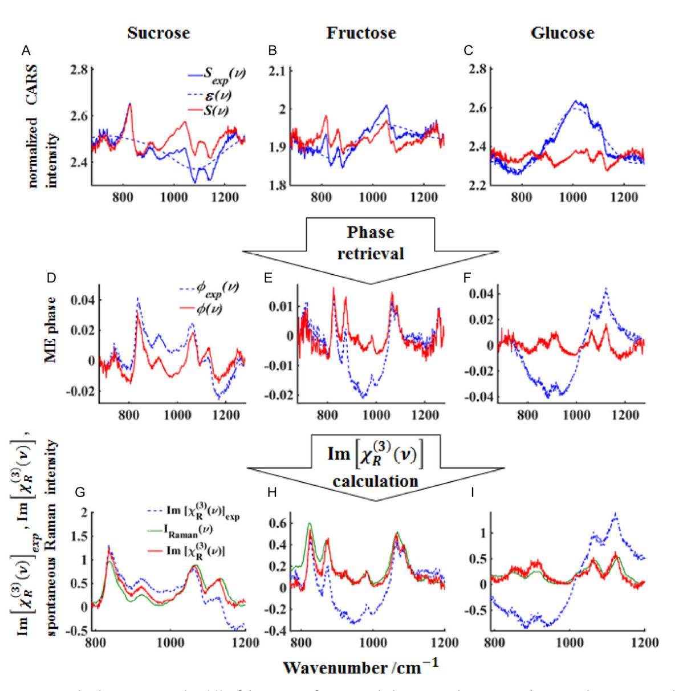

Figure 13. a-c) Normalized CARS spectra  $(S_{exp}(v))$  of the sucrose, fructose, and glucose samples, respectively.  $\varepsilon(v)$  and s(v) correspond to the WP-extracted slowly varying modulation error spectrum and the error-corrected normalized CARS line shape. d,e)  $\phi_{exp}(v)$  and  $\phi(v)$  represent the corresponding ME phase spectra retrieved from  $S_{exp}(v)$  and S(v) spectra, respectively. g-i) Corresponding reconstructed  $\operatorname{Im}[\chi_8^{(3)}(v)]_{exp}$  and  $\operatorname{Im}[\chi_8^{(3)}(v)]_{exp}$ spectra. The results are compared with the SR spectra  $I_{raman}(v)$ . Adapted with permission. [69] Copyright 2016, Optical Society of America.

samples like yeast, DMPC, and ATP mixture were found to be superior for the retrained model compared to the original model. A similar performance was observed with their fine-tuned[77] and optimized SpecNet models.[78]

In the case of fine tuning, first, the model was trained on the simulated data, and then it was fine tuned with semisynthetic data. The simulation parameters (resonances, widths, and heights) were selected based on real experimental data. Meanwhile, in optimized CNN, all the hyperparameters were optimized, including the number of layers, nodes in each layer, convolution filter size, regularizes, batch size, etc. They also individually retrained the SpecNet model by considering CARS spectra simulated with three different types of NRB functions as input.[75] However, the remaining spectral simulation parameters were the same. Out of three NRBs, the first one is a product of 2 Sigmoid (P2S), which was used in SpecNet. The second one is a single sigmoid function, and the third one is a fourth-order polynomial function. Among the three, the model trained with polynomial NRB has shown superior performance on 300 unknown simulated test spectra compared to the other two. It is attributed to the fact that the NRB generated with the P2S function has a bias toward producing a Gaussian-like distribution instead of creating different NRB shapes for generalization, as observed for the polynomial function. Also, the results of the experimental CARS spectra have proven that the predictive capability is best for the polynomial NRB model compared to the other two, as shown in Figure 16. It has clearly

**Table 1.** Overview of the DL models used for NRB removal in the literature in chronological order. The "NRB type" column specifies the type of NRB function used to simulate the CARS spectra. "Polynomial" represents the fourth-order polynomial function, while "CNN" refers to the SpecNet model.

| Year [Reference]   | Networks/ Models                           | NRB types                                                                  | Training data                                                                               | Analysis/evaluation                                                                                                                                                                                                                          |
|-----------------------|-----------------------------------------------|----------------------------------------------------------------------------|---------------------------------------------------------------------------------------------|----------------------------------------------------------------------------------------------------------------------------------------------------------------------------------------------------------------------------------------------|
| 2020 [79]  | CNN                                           | Product of 2 Sigmoid (P2S)                                                 | 30 000 Simulated spectra                                                                    | Evaluated on four real solvents and results compared with SR.                                                                                                                                                                                |
| 2020 [80]  | LSTM                                          | Gaussian multiplied by 0.5                                                 | 2666 Simulated spectra                                                                      | Tested on two solvents and performance is compared with MEM and KK results.                                                                                                                                                                  |
| 2022 [76]  | Retrained CNN                                 | P2S                                                                        | 50 000 Simulated $+$ 1024 Semi synthetic spectra                                            | Achieved ${\approx}10{\times}$ lower RMSE than original CNN on complex biological samples                                                                                                                                                    |
| 2022 [77]  | Fine-tuned CNN                                | P2S                                                                        | 50 000 Simulated + 199 Semi synthetic spectra                                            | Shown better performance on protein droplet and yeast spectra                                                                                                                                                                                |
| 2022 [75]  | Retrained CNN-2                               | Trained individually with P2S, Sigmoid, and Polynomial NRB functions | 50 000 Simulated spectra for each NRB type. Total 3 different CNN models retrained.         | The polynomial NRB model gave a higher Pearson correlation coefficient (PCC) of $\approx$ 0.95 compared to the SpecNet model (0.89) on simulated data, and similar results were obtained on experimental CARS spectra (Yeast, protein, ATP). |
| 2022 [82]  | Autoencoders (VECTOR1)                     | P2S                                                                        | Nine datasets, each has 200 000 simulated Spectra                                           | An average of $4\times$ lower mean absolute error (MAE) was demonstrated compared to SpecNet.                                                                                                                                                |
| 2023 [81]  | Bi-LSTM                                       | Polynomial                                                                 | 50 000 Simulated spectra                                                                    | Demonstrated $\approx\!60\times$ lower MSE and higher PCC (94% of spectra with PCC $>$ 0.99) compared to LSTM, CNN, and VECTOR on synthetic data; also achieved the highest average PCC (0.94 $\pm$ 0.014) on experimental CARS spectra      |
| 2023 [83]  | Physics informed Autoencoders (VECTOR2) | Gaussian                                                                   | 1 000 000 simulated spectra by including laser stimulation profile                          | Evaluated on six chemical and results matches with the independently measured SR spectrum.                                                                                                                                                   |
| 2024 [78]  | Optimized CNN                                 | P2S                                                                        | 100 000 Simulated spectra                                                                   | Optimized CNN has shown two orders lower MSE on synthetic data and demonstrated better performance on experimental data.                                                                                                                     |
| 2024 [116] | CNN - GRU                                     | Trained with the combinations of P2S, Sigmoid, and Polynomial functions    | 200 000 Simulated spectra                                                                   | Evaluated on the BCARS spectra and images. Results compared with Bi-LSTM, LSTM, Specnet, and VECTOR                                                                                                                                          |
| 2024 [84]  | GAN (focused on CH region)                 | P2S                                                                        | 60 000 Simulated spectra (Only 70 datapoints taken for each spectrum to focus on CH region) | The model is evaluated on the CH region of the tissue images of mice brains and pork belly. Results compared with Specnet, LSTM, VECTOR, and Bi-LSTM.                                                                                        |
| 2024 [116] | GAN                                           | Trained with the combinations of P2S, Sigmoid, and Polynomial functions    | 200 000 Simulated spectra                                                                   | Evaluated on the BCARS spectra and images. Results compared with Bi-LSTM, LSTM, Specnet, and VECTOR. It has shown superior performance in terms of MAE.                                                                                      |
| 2024 [74]  | BNNs                                          | Log-Gaussian gamma                                                         | 100 000 Simulated spectra                                                                   | Result is demonstrated on experimental CARS spectra of ADP, fructose, glucose, and sucrose samples.                                                                                                                                          |
| 2024 [118] | Decision-tree                                 | Polynomial                                                                 | 80 000 Simulated spectra                                                                    | Performance evaluated on the two solvents and BCARS images of pharmaceutical tablets                                                                                                                                                         |

demonstrated that the MSE is in the order of  $\approx 10^{-4}$  for the polynomial model, whereas it was up to  $\approx 0.05$  for the other two.

Wang et al. proposed a new model based on autoencoders and named it as VECTOR (Very dEep Convolutional auTOencodeRs). [82] The training datasets were generated by various combinations of peak widths (2–75 cm-1) and number of peaks per spectrum (1–50). These parameters significantly differed from those used in SpecNet and its derivatives. A total of nine different simulated datasets, each comprising 200 000 spectra, were generated and separately used as input to train their VECTOR model, accounting for various experimental conditions and sample types. Further, the VECTOR architecture was designed with different layers, and 16 was found to be the optimum (named VECTOR 16). After training, the model performance was evaluated on 30 000 simulated

spectra for each dataset, and the results were compared with SpecNet. The code with model weights can be found here. [114] It has been observed that VECTOR16 consistently performed well and gave a low MAE on all nine datasets, as shown in **Figure 17a**. The results of the experimental glycerol spectra are presented in Figure 17b, where the retrieved Raman signal matches the KK retrieved signal.

They have also extended their work by exploring PINS (VECTOR2) for NRB removal and phase retrieval. [83] They simulated the training data by integrating experimental measurements of the laser system's spectral and temporal properties with the simulated susceptibilities. Also, two different datasets (dense and sparse) were generated by varying the number of resonance peaks and their widths and correspondingly modifying the loss

26999293, 2025, 9, Downloaded from https://advanced.onlinelibrary.wiley.com/doi/10.1002/adpr.202500035, Wiley Online Library on [12/02/2026]. See the Terms and Conditions (https://onlinelibrary.wiley.com/terms-and-conditions) on Wiley Online Library for rules of use; OA articles are governed by the applicable Creative Commons License

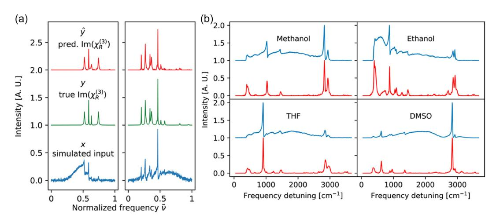

Figure 14. Performance of SpecNet on a) simulated spectra. The blue curve represents input spectra, and the red curve is the corresponding prediction. b) Prediction of the four solvents CARS spectra. Adapted with permission.[79] Copyright 2020, Royal Society of Chemistry.

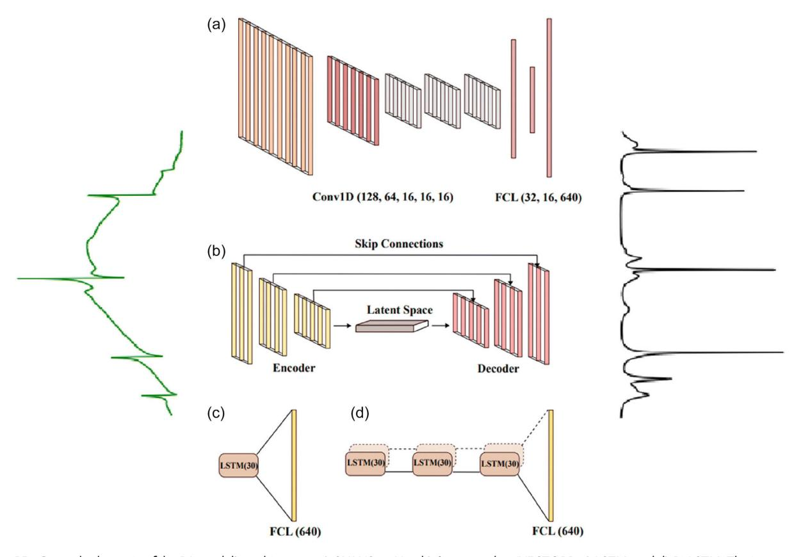

Figure 15. General schematic of the DL model's architecture: a) CNN/SpecNet, b) Autoencoders/VECTOR1, c) LSTM, and d) Bi-LSTM. The input to each model is a CARS spectrum, and the output is the corresponding Raman signal retrieved by the trained model. Adapted with permission.[81] Copyright 2023, Royal Society of Chemistry.

function. Finally, the VECTOR2 model was tested on six chemicals (glycerol, ethanol, benzonitrile, a proprietary polymer slide, PMMA, and polystyrene). The results demonstrated a good agreement with the relative peak heights, widths, and locations observed in the independently measured SR spectrum.

However, all the SpecNet models (Original,[79] retrained,[76] retrained 2,[75] fine-tuned[77]), LSTM, and VECTOR have shown higher MSE on either end of the spectra and are unable to retrieve some peaks with lower intensity. This limitation was resolved using the Bi-LSTM network, as reported by Junjuri

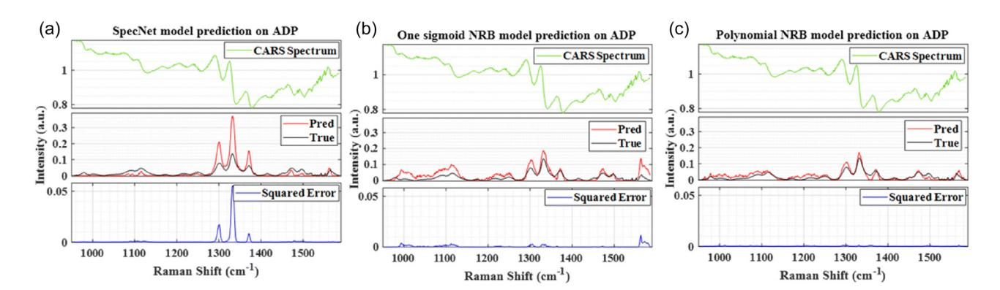

Figure 16. Predictions of CNN models retrained with three different NRB types: a) Original CNN/SpecNet, b) retrained with One Sigmoid function, c) retrained model with Polynomial NRB. The input is ADP CARS spectra. True & Pred represent the true and predicted imaginary parts. Adapted with permission.[75] Copyright 2022, Royal Society of Chemistry.

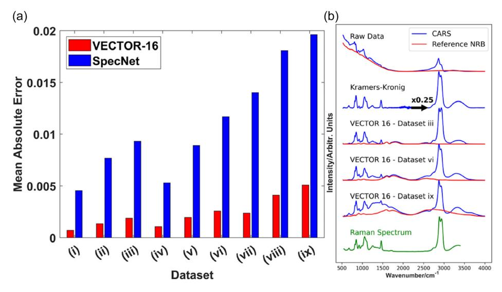

**Figure 17.** a) Average MAE obtained for each of the datasets for the VECTOR 16 and SpecNet models. b) Comparing the results on experimental spectra of glycerol. The reference NRB spectrum was obtained from glass. The successive spectra are the recovered Raman-like spectra from the KK method, followed by VECTO-16 trained on different datasets, all shown in blue. Adapted with permission.[82] Copyright 2022, John Wiley & Sons, Inc.

et al.[81] It has retrieved the spectra lines on both ends of the spectra compared to the SpecNet, LSTM, and VECTOR, as shown in Figure 18a1-a4, and the MSE is estimated over 300 simulated test spectra presented in Figure 18b1-b4. A similar performance was observed on the experimental spectra, as shown in Figure 18c1-c4, and four model weights are available here. [115] Even though it reduced the MSE, the prediction time is one order higher compared to the VECTOR, which has comparable performance. Further, Vernuccio et al. introduced two new models, that is, 1. CNN with gated recurrent units (CNN-GRU) and 2. GAN. They have also improved the training dataset (3 NRB functions), which can account for different BCARS experimental configurations observed in practical applications.[116] The code to generate the training data and trained model weights can be found here. [117] They evaluated the performance of their proposed models by comparing them with the other models (SpecNet, LSTM, VECTOR, and Bi-LSTM) after training them on the same simulated dataset. The results estimated from over 1000 simulated test data are presented in **Figure 19**.

The box plot distribution (Figure 19a) of the coefficient of determination ( $R^2$ ) shows that the highest median with low dispersion was achieved for VECTOR (0.9958), followed by the CNN + GRU architecture (0.9938). The corresponding MSE estimated for each model has shown similar performance as presented in Figure 19b. The results of the prediction times demonstrated that the GAN (1.6 ms), SpecNet model (5 ms), and VECTOR (3.6 ms) models are most suitable for real-time CARS processing of images. The remaining models contain recurrent units and need a longer time, thus making them suitable for single-spectrum prediction. Further, the proposed model's performance was evaluated on experimental spectra, and results were compared with SR spectra and KK retrieved spectra. The results demonstrated that the highest number of true-positive peaks in a single spectrum was observed for GAN (13),

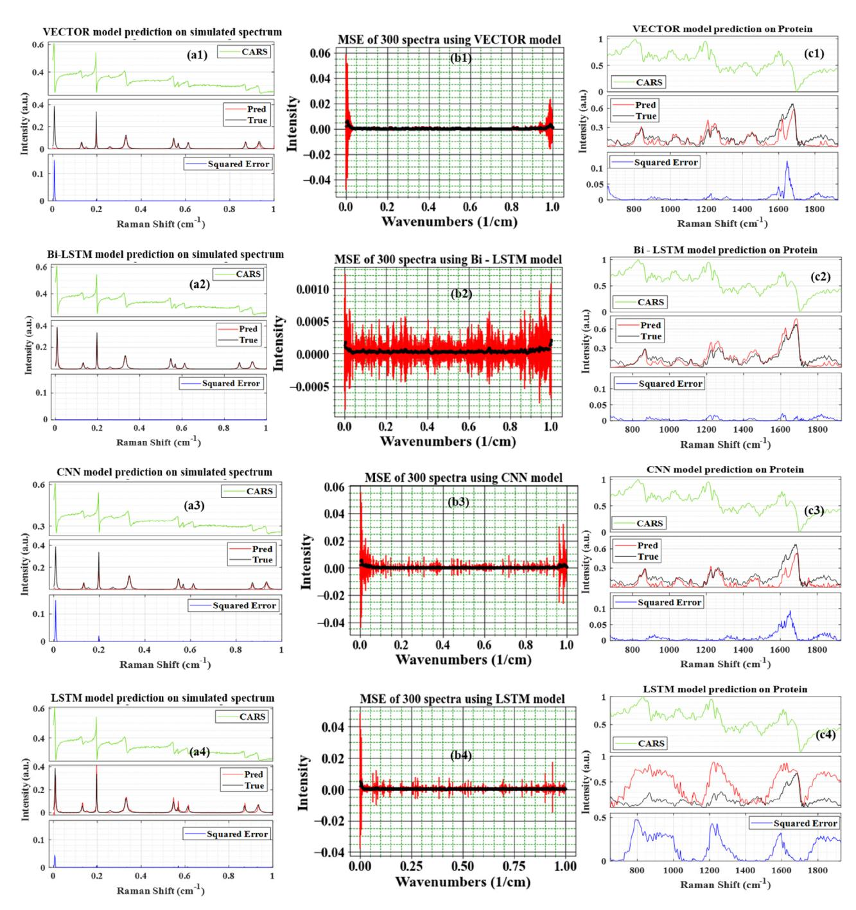

Figure 18. a1–a4) VECTOR, Bi-LSTM, CNN, and LSTM model predictions on the simulated CARS spectra, respectively. b1–b4) MSE estimated over 300 simulated test spectra for the four models, respectively. c1–c4) Four model's predictions on the experimental CARS spectra protein droplet of FUS-LC (low-complexity domain of fused in sarcoma). Adapted with permission.[81] Copyright 2023, Royal Society of Chemistry.

followed by Bi-LSTM (12) and TDKK (12). Also, for the first time, they have demonstrated NRB removal in BCARS images using DL models as shown in Figure 20. Based on the processing time and performance, GAN and VECTOR were further selected to analyze BCARS images, and the results were compared with TDKK, as shown in Figure 20. Overall, the results demonstrated that GAN is the one enabling the prediction of the highest

number of relevant Raman peaks, whereas GAN and VECTOR are the most suitable for real-time processing of BCARS images.

Further, Luo et al. proposed another GAN model (named GANRB) with a different architecture.[84] However, it was mainly aimed at analyzing the CH region of the spectra. The results on simulated spectra have shown improved performance compared to SpecNet and LSTM, whereas it is limited compared to

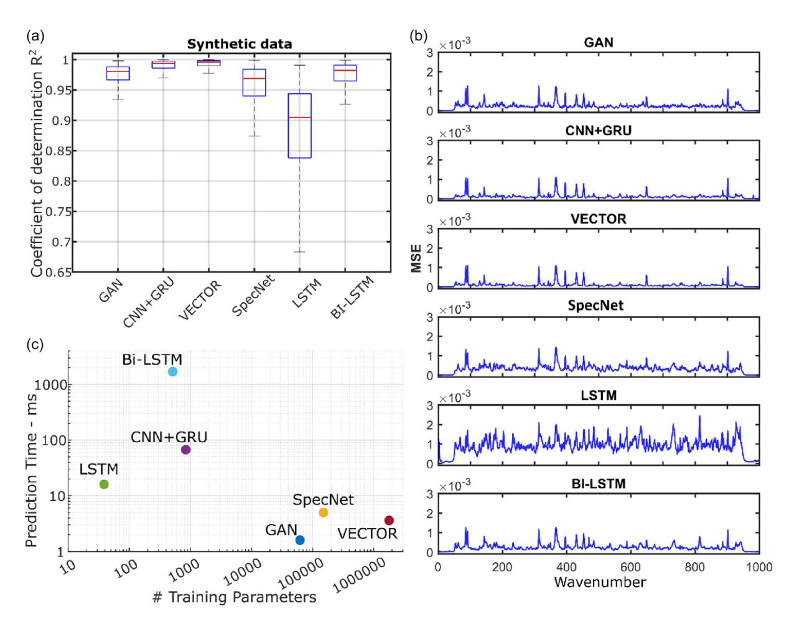

Figure 19. Performances of the six models (1.GAN, 2. CNN + GRU, 3. VECTOR, 4. SpecNet, 5. LSTM, and 6. Bi-LSTM) were evaluated on a synthetic test dataset comprising 1000 spectra. a) Coefficient of determination R2. b) Average MSE of each model. c) The number of training parameters versus the mean prediction time for each model on a single-test spectrum. Adapted with permission. [116] Copyright 2024, from Nature Publications.

VECTOR and Bi-LSTM models. Nevertheless, it demonstrated superior performance in analyzing the CARS images (CH region  $2800-3000\,\mathrm{cm}^{-1}$ ) of pork belly and living Alzheimer's disease (AD) mice brains.

Härkönen et al. recently employed a novel Bayesian neural network (BNN) framework to extract Raman spectra from CARS spectra. [74] The model integrates a partially Bayesian architecture that incorporates a gamma-distributed output layer to represent the underlying Raman spectra as stochastic processes. The network was trained on extensive synthetic data generated via log-Gaussian gamma processes for Raman peaks and Gaussian processes for CARS backgrounds. This robust training approach allowed the BNN to estimate not only the Raman spectra but also their associated uncertainties. The methodology was validated on synthetic test data and experimental samples, such as CARS spectra of adenosine phosphate and glucose. Results showed strong agreement between BNN predictions and known Raman signatures, with uncertainty estimates providing additional reliability for spectral retrieval tasks. Shafe-Purcell et al. very recently proposed a shallow ML approach based on gradient-boosted decision trees for NRB removal.[118]

Their model is built using the open-source gradient-boosting framework XGBoost, which is named distributed gradient-boosted decision tree. The model was trained with 80 000 simulated spectra, and 1000 spectra were independently used for testing. Finally, the model performance was evaluated on the two solvents (toluene and acetone) and BCARS images of pharmaceutical tablets.

Overall, the DL models described above vary considerably in their architectural design, interpretability, practical utility, and performance. Early CNN-based models, such as SpecNet and its retrained variants, leveraged simple convolutional layers to capture spectral features and offered fast inference, making them suitable for initial studies. However, their generalization was limited when trained on narrow datasets, especially when tested on complex biological samples. While convolutional filters provide some degree of interpretability (e.g., feature activation maps), deeper layers make it challenging to understand what features contribute to specific predictions. Subsequent models like VECTOR introduced a very deep convolutional autoencoder with skip connections, enhancing spectral feature reconstruction by preserving information across layers. The symmetric

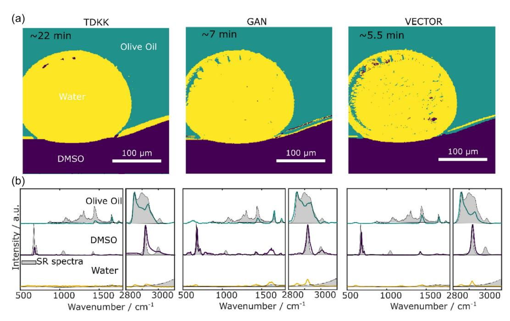

Figure 20. Evaluation of TDKK, GAN, and VECTOR models on experimental BCARS images. a) Prediction on a CARS image of oil, DMSO, and water clustered using K-means cluster analysis. b) Spectra related to the three images in a corresponding to the average spectrum of each cluster, and comparison with the SR spectra of oil and DMSO (gray area). The time reported in each image is the time required to perform the denoising (SVD only for the TDKK case) and NRB removal (TDKK, GAN, VECTOR) steps for all the pixels. Adapted with permission.[116] Copyright 2024, Nature Publications.

encoder–decoder configuration reconstructs the spectra in a "squeeze-and-unsqueeze" manner. Thus, it not only improved performance on synthetic data but also proved robust on experimental spectra. Further, training on nine different datasets with varied peak structures contributed significantly to its generalization across unseen spectra.

The LSTM model, employing a unidirectional recurrent architecture with a single layer, has also been evaluated for NRB removal in CARS spectra. While it offers a foundational approach to sequential modeling, its shallow design limits the ability to capture long-range dependencies, resulting in reduced accuracy, particularly in predicting spectral features near the edges. Building on this foundation, Bi-LSTM extended the modeling capabilities by capturing temporal (sequential) dependencies in both directions of the spectrum, enabling more accurate retrieval, particularly at spectral edges where traditional CNNs and LSTM struggled. Its superior performance in metrics such as MSE and Pearson correlation stemmed from its ability to model longrange contextual relationships, although it comes at the cost of slower inference and reduced interpretability due to the opaque nature of recurrent layers. More recently, GANs have emerged as a promising alternative for NRB removal in CARS microscopy. These models, especially those employing U-Net generators and patch-based discriminators, use adversarial training to ensure spectral outputs are both accurate and perceptually realistic. GANs have demonstrated strong generalization and fidelity to sharp Raman peaks with the highest peak detection rates in experimental datasets. However, they require more data and careful training to avoid instability and mode collapse, and their interpretability remains limited.

In summary, while Bi-LSTM achieved the highest accuracy, VECTOR and GANs offer a compelling balance of reconstruction quality, speed, and generalization for real-time and hyperspectral imaging. The choice of model should be guided by applicationspecific needs, such as interpretability, speed, or data availability, and a clear trade-off exists between model complexity and practical deployment in imaging workflows.

Despite these achievements, several critical research challenges remain.

## 2.3.1. Data Requirements and Generalization

Most DL models require large, diverse, and high-quality training datasets to generalize well across sample types and experimental conditions. Models trained solely on simulated data may underperform when applied to real-world CARS spectra, especially in biomedical contexts where weak vibrational signals are modulated by strong NRB. Future research should focus on generating hybrid training datasets that combine realistic simulations with limited experimental spectra.

#### 2.3.2. Simulation Accuracy

Current simulation methods often assume simplified NRB profiles (e.g., double sigmoid or Gaussian functions), which may not reflect the complex NRB arising from pigments, metabolites, or varying excitation profiles. Incorporating realistic modeling of laser systems, including two-color and three-color CARS configurations, will improve NRB modeling and, in turn, training set

fidelity. Modeling the spectrometer impulse response and stimulation profiles during data generation could also enhance spectral resolution and retrieval accuracy.

# 2.3.3. Domain-Informed DL

Purely data-driven models are prone to overfitting and may lack physical interpretability. Integrating domain knowledge through PINNs, regularization based on Raman line shapes, or deconvolution layers matched to spectrometer characteristics could significantly improve model reliability and robustness.

# 2.3.4. Architectural Enhancements

Although Bi-LSTM, GAN, and VECTOR have outperformed traditional models, further improvements could arise from adopting emerging architectures like transformers, diffusion models, or hybrid encoder–decoder schemes. These may offer better handling of dense spectral regions or improved peak deconvolution, particularly in the fingerprint region.

# 2.3.5. Application-Specific Training

Tailoring network design and training strategies to specific domains (e.g., sparse vs. dense spectra, biological vs. chemical samples) can improve efficiency and performance. Lightweight models trained on sparse datasets may offer faster convergence and inference times, while deeper models can be reserved for dense or noisy spectra.

## 2.3.6. NRB Scaling and Interpretation

In some experimental systems, models fail to recover correct scaling in regions with low excitation efficiency (e.g., two-color regions), likely due to insufficient dynamic range in the training data. Addressing these limitations through laser optimization or system-aware simulation can yield more accurate spectral retrieval.

In conclusion, the integration of DL with physical modeling presents a promising path toward more interpretable, accurate, and generalizable NRB removal methods in CARS. Future studies should prioritize multidomain datasets, physics-constrained architectures, and experimental validation across different imaging systems. Bridging data-driven learning with theory will be key to advancing CARS spectroscopy for clinical diagnostics, materials analysis, and beyond.

# 3. Conclusions

CARS has established itself as a powerful nonlinear optical technique for molecular characterization and vibrational imaging. However, the persistent challenge of the NRB continues to limit the extraction of precise resonant Raman information, necessitating the development of effective NRB removal and phase retrieval approaches. This review has systematically outlined the progression of methodologies, from classical experimental techniques to advanced numerical algorithms and cutting-edge

DL approaches, illustrating how computational innovations have transformed the field. The advancements in the KK method have promoted it as a robust method for modern DL algorithms, including CNNs, LSTM networks, and GANs, which have demonstrated significant potential in improving the accuracy, efficiency, and robustness of NRB removal and phase

retrieval. While these advancements address many of the limitations of traditional methods, challenges such as the need for large training datasets, model generalizability, and interpretability remain. Future research should focus on the development of hybrid approaches that combine the physical principles of traditional methods with the adaptability of DL, as well as physics-informed neural networks that embed domain knowledge into model architectures. Moreover, expanding the scope of these methodologies to handle diverse experimental conditions, complex sample environments, and multimodal data integration will be pivotal. Also, effects of noise and NRB functions need to be evaluated to account for variations in sample types, especially in view of biomedical imaging applications.

By bridging the gap between classical and modern approaches and addressing the current limitations, the next generation of NRB removal and phase retrieval methods has the potential to unlock the full capabilities of CARS spectroscopy. This will enable more precise molecular imaging and characterization, advancing applications across chemistry, biology, materials science, and medicine and solidifying the role of CARS as an indispensable analytical technique.

# Acknowledgements

This work was supported by the EU funding program with grant number 101016923 (CRIMSON). This work was supported by the BMBF, funding program Photonics Research Germany (13N15466 (LPI-BT1-FSU), 13N15706 (LPI-BT2-FSU)), and is integrated into the Leibniz Center for Photonics in Infection Research (LPI). The LPI initiated by Leibniz-IPHT, Leibniz-HKI, UKJ, and FSU Jena is part of the BMBF national roadmap for research infrastructures.

Open Access funding enabled and organized by Projekt DEAL.

# Conflict of Interest

The authors declare no conflict of interest.

# Keywords

broadband coherent anti-Stokes Raman spectroscopies, deep learning, microscopies, nonresonant background removal, phase retrieval

> Received: February 14, 2025 Revised: May 5, 2025 Published online: June 25, 2025

- [1] C. V. Raman, K. S. Krishnan, Nature 1928, 121, 501.
- [2] P. Matousek, N. Stone, J. Biophoton. 2013, 6, 7.
- [3] C. Krafft, J. Popp, Anal. Bioanal. Chem. 2015, 407, 699.
- [4] J. P. Day, K. F. Domke, G. Rago, H. Kano, H. O. Hamaguchi, E.M. Vartiainen, M. Bonn, J. Phys. Chem. B, 2011, 115, 7713.

- [5] M. Cicerone, Curr. Opin. Chem. Biol. 2016, 33, 179.
- [6] D. Polli, V. Kumar, C. M. Valensise, M. Marangoni, G. Cerullo, Laser Photonics Rev. 2018, 12, 1800020.
- [7] F. Vernuccio, R. Vanna, C. Ceconello, A. Bresci, F. Manetti, S. Sorrentino, S. Ghislanzoni, F. Lambertucci, O. Motino, I. Martins, ˜ J. Phys. Chem. B 2023, 127, 4733.
- [8] R. Hall, Combust. Flame 1979, 35, 47.
- [9] S. Roy, J. R. Gord, A. K. Patnaik, Prog. Energ. Combust 2010, 36, 280.
- [10] F. El-Diasty, Vib. Spectrosc. 2011, 55, [https://doi.org/10.1016/j.](https://doi.org/10.1016/j.vibspec.2010.09.008) [vibspec.2010.09.008](https://doi.org/10.1016/j.vibspec.2010.09.008).
- [11] A. M. Zheltikov, J. Raman. Spectrosc. 2000, 31, 653.
- [12] M. Müller, A. Zumbusch, ChemPhysChem 2007, 8, 2156.
- [13] L. G. Rodriguez, S. J. Lockett, G. R. Holtom, Cytom. Part A 2006, 69, 779.
- [14] T. Gottschall, T. Meyer, M. Schmitt, J. Popp, J. Limpert, A. Tünnermann, Anal. Chem. 2018, 102, 103.
- [15] S. Xu, C. H. Camp, Y. J. Lee, J. Polym. Sci. 2022, 60, 1244.
- [16] H. Zhu, X. Deng, V. Yakovlev, D. Zhang, Chem. Sci. 2024, 15, 14344.
- [17] A. Karuna, F. Masia, P. Borri, W. Langbein, J. Raman. Spectrosc. 2016, 47, 1167.
- [18] F. Masia, A. Glen, P. Stephens, P. Borri, W. Langbein, Anal. Chem. 2013, 85, 10820.
- [19] E. O. Potma, X. S. Xie, Opt. Photonics News 2004, 15, 40.
- [20] T. T. Le, S. Yue, J. X. Cheng, J. Lipid Res. 2010, 51, 3091.
- [21] I. W. Schie, C. Krafft, J. Popp, Analyst 2015, 140, 3897.
- [22] C. Zhang, D. Zhang, J. X. Cheng, Annu. Rev. Biomed. Eng. 2015, 17, 415.
- [23] C. Zhang, J. A. Aldana-Mendoza, J. Phys. Photonics 2021, 3, 032002.
- [24] T. Chen, A. Yavuz, M. C. Wang, J. Cell Sci. 2022, 135, jcs252353.
- [25] R. Junjuri, T. Meyer-Zedler, J. Popp, T. Bocklitz, Opt. Continuum 2024,
- 3, 2244. [26] R. Junjuri, M. Calvarese, M. Vafaeinezhad, F. Vernuccio, M. Ventura,
- T. Meyer-Zedler, B. Gavazzoni, D. Polli, R. Vanna, I. Bongarzone, Analyst 2024, 149, 4395.
- [27] H. Rigneault, P. Berto, APL Photonics 2018, 3.
- [28] C. L. Evans, E. O. Potma, X. S. Xie, Opt. Lett. 2004, 29, 2923.
- [29] M. Jurna, J. Korterik, C. Otto, J. Herek, H. Offerhaus, Opt. Express 2008, 16, 15863.
- [30] P. V. Kolesnichenko, J. O. Tollerud, J. A. Davis, APL Photonics 2019, 4.
- [31] W. Langbein, D. Regan, I. Pope, P. Borri, APL Photonics 2018, 3.
- [32] E. O. Potma, C. L. Evans, X. S. Xie, Opt. Lett. 2006, 31, 241.
- [33] Y. Shen, D. V. Voronine, A. V. Sokolov, M. O. Scully, Opt. Express 2016, 24, 21652.
- [34] T. Suzuki, K. Misawa, Opt. Express 2011, 19, 11463.
- [35] J.-X. Cheng, L. D. Book, X. S. Xie, Opt. Lett. 2001, 26, 1341.
- [36] R. Cole, A. Slepkov, Continuum 2020, 3, 2766.
- [37] F. Lu, W. Zheng, Z. Huang, Opt. Lett. 2008, 33, 2842.
- [38] F. Lu, W. Zheng, C. Sheppard, Z. Huang, Opt. Lett. 2008, 33, 602.
- [39] P. K. Upputuri, L. Gong, H. Wang, Opt. Express 2014, 22, 9611.
- [40] A. Volkmer, L. D. Book, X. S. Xie, Appl. Phys. Lett. 2002, 80, 1505.
- [41] D. Pestov, R. K. Murawski, G. O. Ariunbold, X. Wang, M. Zhi, A. V. Sokolov, V. A. Sautenkov, Y. V. Rostovtsev, A. Dogariu, Y. Huang, Science 2007, 316, 265.
- [42] V. Kumar, R. Osellame, R. Ramponi, G. Cerullo, M. Marangoni, Opt. Express 2011, 19, 15143.
- [43] R. Selm, M. Winterhalder, A. Zumbusch, G. Krauss, T. Hanke, A. Sell, A. Leitenstorfer, Opt. Lett. 2010, 35, 3282.
- [44] J. P. Ogilvie, E. Beaurepaire, A. Alexandrou, M. Joffre, Opt. Lett. 2006, 31, 480.
- [45] M. Lu, Y. Zhang, J. Li, Y. Li, H. Wei, Opt. Express 2023, 31, 25571.
- [46] O. Burkacky, A. Zumbusch, C. Brackmann, A. Enejder, Opt. Lett. 2006, 31, 3656.
- [47] I. Rocha-Mendoza, W. Langbein, P. Watson, P. Borri, Opt. Lett. 2009, 34, 2258.

- [48] F. Ganikhanov, C. L. Evans, B. G. Saar, X. S. Xie, Opt. Lett. 2006, 31, 1872.
- [49] F. Gao, F. Shuang, J. Shi, H. Rabitz, H. Wang, J.-X. Cheng, J. Chem. Phys. 2012, 136.
- [50] S. O. Konorov, M. W. Blades, R. F. Turner, Appl. Spectrosc. 2010, 64, 767.
- [51] J. Zheng, D. Akimov, S. Heuke, M. Schmitt, B. Yao, T. Ye, M. Lei, P. Gao, J. Popp, Opt. Express 2015, 23, 10756.
- [52] L. Ren, H. Frostig, S. Kumar, I. Hurwitz, Y. Silberberg, Opt. Express 2017, 25, 28201.
- [53] B. C. Chen, J. Sung, X. Wu, S. H. Lim, J. Biomed. Opt. 2011, 16, 021112.
- [54] S. O. Konorov, M. W. Blades, R. F. Turner, Opt. Express 2011, 19, 25925.
- [55] Y. Jong Lee, M. T. Cicerone, Opt. Express 2008, 17, 123.
- [56] D. S. Choi, C. H. Kim, T. Lee, S. Nah, H. Rhee, M. Cho, Opt. Express 2019, 27, 23558.
- [57] B. Littleton, P. Shah, T. Kavanagh, D. Richards, J. Raman Spectrosc. 2019, 50, 1303.
- [58] B. Li, K. Charan, K. Wang, T. Rojo, D. Sinefeld, C. Xu, Opt. Express 2016, 24, 26687.
- [59] K. Chen, T. Wu, H. Wei, Y. Li, Opt. Lett. 2016, 41, 2628.
- [60] D. Oron, N. Dudovich, Y. Silberberg, Phys. Rev. Lett. 2002, 89, 273001.
- [61] Y. J. Lee, M. T. Cicerone, Appl. Phys. Lett. 2008, 92.
- [62] S. D. Roberson, P. M. Pellegrino, Chemical, Biological, Radiological, Nuclear, and Explosives (CBRNE) Sensing XVI,Society of Photo-Optical Instrumentation Engineers (SPIE), USA 2015, pp. 117–125.
- [63] Y. Liu, Y. J. Lee, M. T. Cicerone, Opt. Lett. 2009, 34, 1363.
- [64] E. M. Vartiainen, K.-E. Peiponen, T. Asakura, Appl. Spectrosc. 1996, 50, 1283.
- [65] H. A. Rinia, M. Bonn, M. Müller, E. M. Vartiainen, ChemPhysChem 2007, 8, 279.
- [66] E. M. Vartiainen, JOSA B 1992, 9, 1209.
- [67] E. M. Vartiainen, H. A. Rinia, M. Müller, M. Bonn, Opt. Express 2006, 14, 3622.
- [68] K.-E. Peiponen, V. Lucarini, J. J. Saarinen, E. Vartiainen, Appl. Spectrosc. 2004, 58, 499.
- [69] Y. Kan, L. Lensu, G. Hehl, A. Volkmer, E. M. Vartiainen, Opt. Express 2016, 24, 11905.
- [70] T. Harkönen, E. Vartiainen, ¨ Continuum 2023, 2, 1068.
- [71] C. H. Camp Jr, Opt. Express, 2022, 30, 26057.
- [72] C. H. Camp Jr, Y. J. Lee, M. T. Cicerone, J. Raman Spectrosc. 2016, 47, 408.
- [73] C. H. Camp Jr, J. S. Bender, Y. J. Lee, Opt. Express, 2020, 28, 20422.
- [74] T. Harkönen, E. M. Vartiainen, L. Lensu, M. T. Moores, L. Roininen, ¨ Phys. Chem. Chem. Phys. 2024, 26, 3389.
- [75] R. Junjuri, A. Saghi, L. Lensu, E. M. Vartiainen, RSC Adv. 2022, 12, 28755.
- [76] R. Junjuri, A. Saghi, L. Lensu, E. M. Vartiainen, Continuum 2022, 1, 1324.
- [77] A. Saghi, R. Junjuri, L. Lensu, E. M. Vartiainen, Continuum 2022, 1, 2360.
- [78] A. Saghi, L. Lensu, E. M. Vartiainen, Continuum 2024, 3, 1461.
- [79] C. M. Valensise, A. Giuseppi, F. Vernuccio, A. De la Cadena, G. Cerullo, D. Polli, APL Photonics, 2020, 5.
- [80] R. Houhou, P. Barman, M. Schmitt, T. Meyer, J. Popp, T. Bocklitz, Opt. Express 2020, 28, 21002.
- [81] R. Junjuri, A. Saghi, L. Lensu, E. M. Vartiainen, Phys. Chem. Chem. Phys. 2023, 25, 16340.
- [82] Z. Wang, K. O'Dwyer, R. Muddiman, T. Ward, J. Raman Spectrosc. 2022, 53, 1081.
- [83] R. Muddiman, K. O'Dwyer, C. H. Camp, B. Hennelly, Anal. Methods 2023, 15, 4032.
- [84] Z. Luo, X. Xu, D. Lin, J. Qu, F. Lin, J. Li, Appl. Phys. Lett. 2024, 124.

- [85] W. M. Tolles, J. W. Nibler, J. McDonald, A. B. Harvey, Appl. Spectrosc. 1977, 31, 253.
- [86] J. F. Verdieck, R. J. Hall, J. A. Shirley, A. C. Eckbreth, J. Chem. Educ. 1982, 59, 495.
- [87] N. Djaker, D. Marguet, H. Rigneault, Med. Sci. 2006, 22, 853.
- [88] J. Zeng, W. Zhao, S. Yue, Front. Pharmacol. 2021, 12, 630167.
- [89] P. C. Chen, Nonlinear Raman Spectroscopy, Instruments, in: J.C. Lindon (Ed.) Encyclopedia of Spectroscopy and Spectrometry, Elsevier, Oxford 1999, pp. 1624–1631.
- [90] A. Volkmer, J. Phys. D Appl. Phys. 2005, 38, R59.
- [91] S. Brustlein, P. Ferrand, N. Walther, S. Brasselet, C. Billaudeau, D. Marguet, H. Rigneault, J. Biomed. Opt. 2011, 16, 021106.
- [92] J. L. Oudar, R. W. Smith, Y. Shen, Appl. Phys. Lett. 1979, 34, 758.
- [93] F. M. Kamga, M. G. Sceats, Opt. Lett. 1980, 5, 126.
- [94] P. J. Wrzesinski, H. U. Stauffer, W. D. Kulatilaka, J. R. Gord, S. Roy, J. Raman Spectrosc. 2013, 44, 1344.
- [95] R. Nishiyama, K. Furuya, T. Tamura, R. Nakao, W. Peterson, K. Hiramatsu, T. Ding, K. Goda, Anal. Chem. 2024, 96, 18322.
- [96] K. Hashimoto, M. Takahashi, T. Ideguchi, K. Goda, Sci. Rep. 2016, 6, 21036.
- [97] N. Coluccelli, E. Vicentini, A. Gambetta, C. R. Howle, K. Mcewan, P. Laporta, G. Galzerano, Opt. Express 2018, 26, 18855.
- [98] K. Hiramatsu, T. Tajima, K. Goda, ACS Photonics 2022, 9, 3522.
- [99] K. Hiramatsu, Y. Luo, T. Ideguchi, K. Goda, Opt. Lett. 2017, 42, 4335.
- [100] M. Cui, M. Joffre, J. Skodack, J. P. Ogilvie, Opt. Express 2006, 14, 8448.
- [101] M. Tamamitsu, Y. Sakaki, T. Nakamura, G. K. Podagatlapalli, T. Ideguchi, K. Goda, Vib. Spectrosc. 2017, 91, 163.
- [102] T. Ideguchi, T. Nakamura, S. Takizawa, M. Tamamitsu, S. Lee, K. Hiramatsu, V. Ramaiah-Badarla, J. W. Park, Y. Kasai, T. Hayakawa, Opt. Lett. 2018, 43, 4057.
- [103] K. J. Mohler, B. J. Bohn, M. Yan, G. Mélen, T. W. Hansch, N. Picqué, ¨ Opt. Lett. 2017, 42, 318.

- [104] T. Ideguchi, S. Holzner, B. Bernhardt, G. Guelachvili, N. Picqué, T. W. Hansch, ¨ Nature 2013, 502, 355.
- [105] R. Kameyama, S. Takizawa, K. Hiramatsu, K. Goda, ACS Photonics 2020, 8, 975.
- [106] K. Chen, T. Wu, T. Chen, H. Wei, H. Yang, T. Zhou, Y. Li, Opt. Lett. 2017, 42, 3634.
- [107] Y. Zhang, M. Lu, T. Wu, K. Chen, Y. Feng, W. Wang, Y. Li, H. Wei, ACS Photonics 2022, 9, 1385.
- [108] D. R. Carlson, D. D. Hickstein, S. B. Papp, Opt. Express 2020, 28, 29148.
- [109] T. Lv, B. Han, M. Yan, Z. Wen, K. Huang, K. Yang, H. Zeng, ACS Photonics 2023, 10, 2964.
- [110] V. Lucarini, J. J. Saarinen, K.-E. Peiponen, E. M. Vartiainen, Kramers-Kronig relations in optical materials research, Springer Science & Business Media, New York, USA 2005.
- [111] C. Charles, CRIKit2: Hyperspectral imaging toolkit, [https://github.](https://github.com/CCampJr/CRIkit2) [com/CCampJr/CRIkit2](https://github.com/CCampJr/CRIkit2) (accessed: December 2024).
- [112] M. T. Cicerone, K. A. Aamer, Y. J. Lee, E. Vartiainen, J. Raman Spectrosc. 2012, 43, 637.
- [113] C. M. Valensise 2020,<https://github.com/Valensicv/SpecNet> (accessed: December 2024).
- [114] Z. Wang, VECTOR-CARS 2022, [https://github.com/villawang/](https://github.com/villawang/VECTOR-CARS) [VECTOR-CARS](https://github.com/villawang/VECTOR-CARS) (accessed: December 2024).
- [115] R. Junjuri 2023, [https://github.com/Junjuri/Four-DL-models](https://github.com/Junjuri/Four-DL-models-comparison-for-evaluating-CARS)[comparison-for-evaluating-CARS](https://github.com/Junjuri/Four-DL-models-comparison-for-evaluating-CARS) (accessed: December 2024).
- [116] F. Vernuccio, E. Broggio, S. Sorrentino, A. Bresci, R. Junjuri, M. Ventura, R. Vanna, T. Bocklitz, M. Bregonzio, G. Cerullo, Sci. Rep. 2024, 14, 23903.
- [117] F. Vernuccio 2024, [https://github.com/crimson-project-eu/NRB\\_removal.](https://github.com/crimson-project-eu/NRB_removal)
- [118] A. Slepkov, J. Shafe-Purcell, Decision-tree-based non-resonant background removal for enhancing chemical-selective contrast in hyperspectral CARS microscopy, preprint, OPTICA OPEN, Submitted: Nov. 2024.
- [119] J.-X. Cheng, A. Volkmer, L. D. Book, X. S. Xie, J. Phys. Chem. B 2002, 106, 8493.

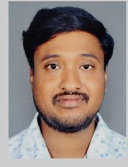

Rajendhar Junjuri received his Ph.D. in Physics from the University of Hyderabad, India, where he focused on laser-induced breakdown spectroscopy (LIBS) and machine learning for material identification. He has held postdoctoral research positions in Finland and Germany, working on European and German-funded projects involving coherent Raman imaging, CARS, and SRS techniques. His research integrates deep learning with vibrational spectroscopy for biomedical and environmental applications. He has authored several peer-reviewed articles and developed open-source tools for CARS data analysis. He is currently serving as a Junior Lecturer in Physics at Government Junior College, Nirmal, Telangana, India.

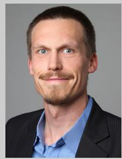

Thomas Bocklitz studied Physics at the University of Jena and received his PhD in Physical Chemistry/ Chemometrics in 2011. Since 2024 he holds a professorship for "Photonic Data Science" at the University of Jena and the Leibniz-IPHT. He investigates the photonic data lifecycle, which includes machine learning and chemometrics based modelling of photonic data. He has published more than 160 papers in peer-reviewed journals (WOS) and has given more than 50 invited talks at conferences. Thomas Bocklitz's work has been honored with prestigious awards, such as the Bruce Kowalski Award in 2015 and he received an ERC Consolidator Grant in 2023.