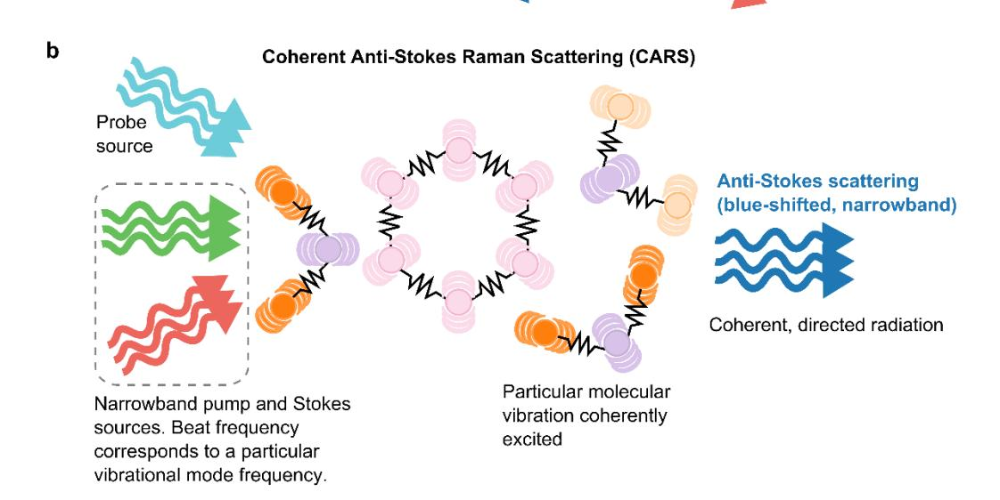
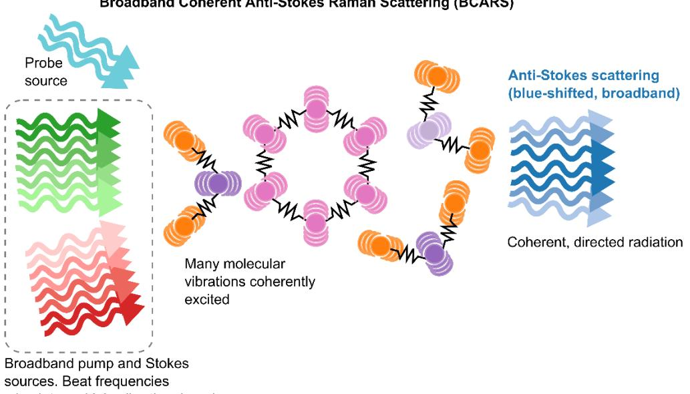
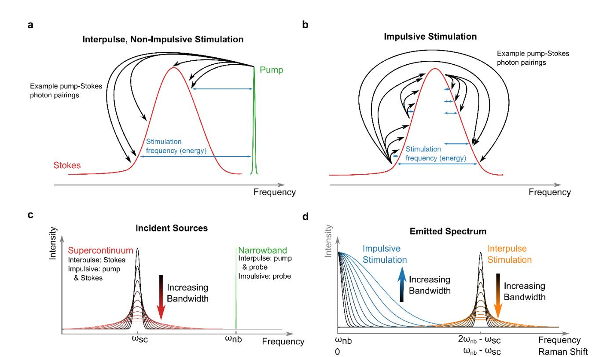
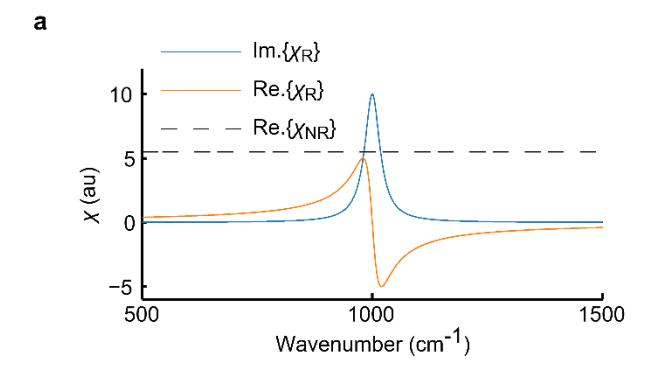
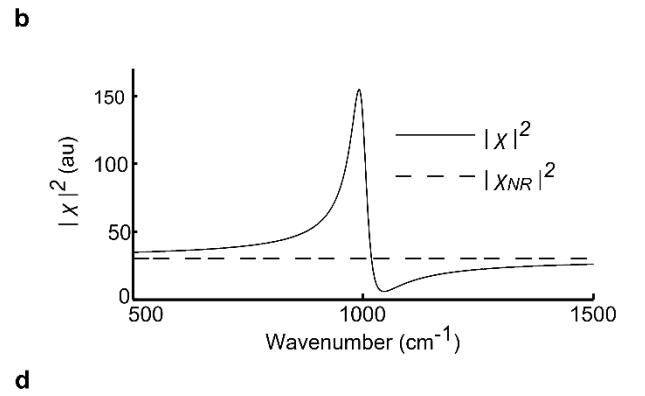
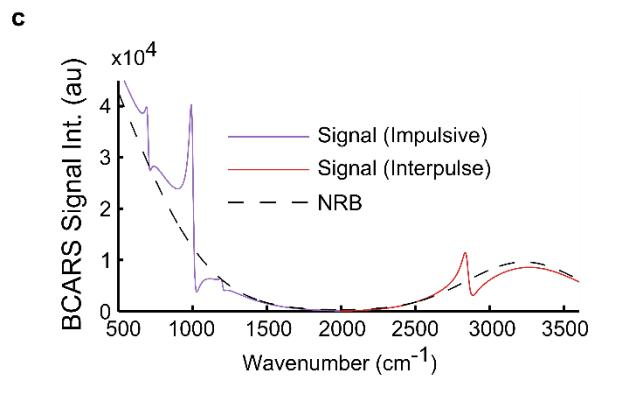
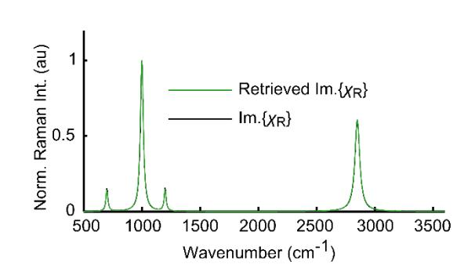
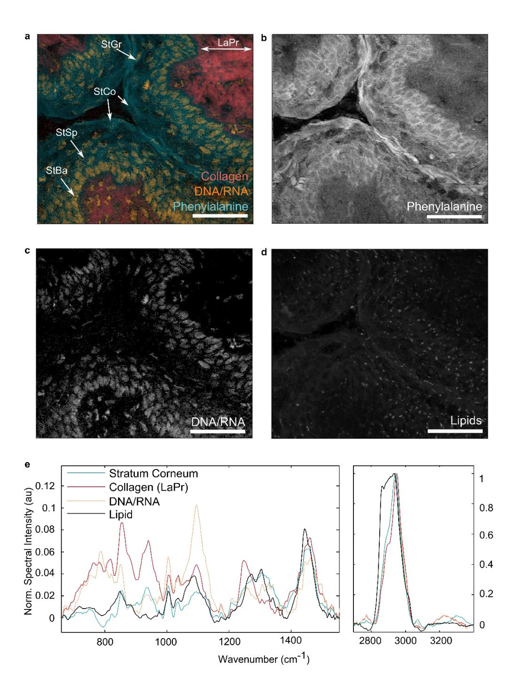
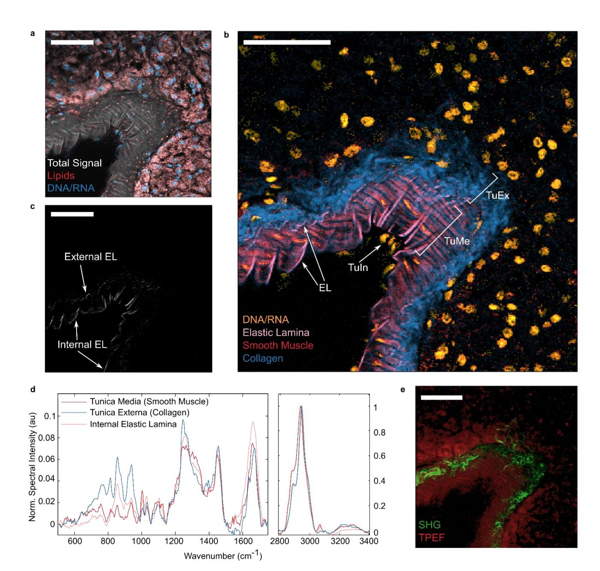

# Broadband Coherent Anti-Stokes Raman Scattering

Charles H. Camp Jr. *National Institute of Standards and Technology Biosystems and Biomaterials Division 100 Bureau Drive, Mail Stop 8543 Gaithersburg, MD 20899-8543 charles.camp@nist.gov*

#### **Abstract**

Broadband coherent anti-Stokes Raman scattering (BCARS) microspectroscopy is a unique label-free imaging modality that provides detailed chemical information at each pixel. In minutes, this technique captures a "hyperspectral" cube that co-registers microscopic spatial features with chemical signatures, sensitive to molecular content and structure. This technique can delve into the molecular inner workings of cells and tissues, illuminating, for example, health and disease, cell function and state. This chapter will provide an overview of BCARS technology, from the basic theory to future directions and demonstrate imaging of histological sections of mouse tissue.

#### **Keywords**

Broadband coherent anti-Stokes Raman scattering, Nonlinear microscopy, Raman spectroscopy, Coherent Raman Imaging, coherent anti-Stokes Raman scattering, label-free microscopy, microspectroscopy

#### **Outline**

- I. Introduction
- II. Contextual Background
  - **a.** From IR absorption and Raman to Coherent Raman Scattering (CRS)
  - **b.** What need in Raman spectroscopy did CARS fulfill
  - **c.** The limitations of CARS led to BCARS
- III. BCARS
  - **a.** Qualitative description
  - **b.** History of development
- IV. Brief introduction to the theory
  - **a.** The physics of CARS/BCARS without sample considerations
    - **i.** The CARS mechanism
    - **ii.** How the physics determines the performance characteristics
    - **iii.** BCARS with interpulse stimulation (the method of doing BCARS until 2014)
    - **iv.** BCARS with intrapulse/impulsive stimulation (the newest method)
  - b. Physical description of the material (i.e., the sample)
    - i. The Raman component
    - ii. The nonresonant background (NRB)
    - iii. The NRB and its ramifications
    - iv. Removing the NRB via "phase retrieval techniques"
- V. Experimental Demonstrations
  - a. Brief system overview
  - b. Murine vaginal tissue
  - c. Murine pancreatic tissue (artery)

#### VI. Conclusion

- a. BCARS only recently can carry through with its perceived promise
  - i. Raman and IR have long history of success in dermatological research
  - ii. CARS has some history as well
- b. Future prospects: *in vivo* imaging

#### **Introduction**

Molecules vibrate. Within each molecule, individual atoms are constantly in motion. In fact, the motion between bonded atoms and small groups of linked atoms is oscillatory. The exact frequency (energy) of the vibrations is determined by such factors as the atoms involved, molecular orientation, and temperature. Additionally, these vibrations occur in "modes" with descriptive names such as "stretching", "twisting", "breathing", and "rocking". Of significant consequence is that the particular vibrational modes between particular sets of atoms occur at predictable frequencies (or over small frequency ranges); thus, molecules/chemicals can be characterized by their vibrational fingerprint. Furthermore, with an imaging technique that could interrogate these vibrational modes, one could visualize the molecular content within materials, cells, and tissues, extracting cell state and functional information that could, for example, be utilized to diagnose pathologies before morphological features are even present. Broadband coherent anti-Stokes Raman scattering (BCARS) microspectroscopy is one such method of interrogating these vibrational fingerprints with success in imaging cells, tissues, pharmaceutical tablets, and polymers. For all of the proposed promise and more than a decade in development, however, only recently has BCARS truly demonstrated high-quality imaging and spectroscopy with an unparalleled combination of speed, spectral clarity, and range of addressable vibrational frequencies. In this chapter, an overview of BCARS technology and its theoretical underpinnings will be provided. Additionally, demonstrative examples of tissue imaging will be presented.

#### **Background**

Analytical methods of measuring molecular vibrations are not new, with commercial systems available for over 50 years. The two classic methods of vibrational spectroscopy are infrared (IR) absorption spectroscopy and Raman scattering spectroscopy. At room temperature, most molecular

vibrational modes occur at frequencies within the infrared region of the electromagnetic spectrum. If a sample is illuminated with IR light, photons at the particular frequencies (wavelengths) corresponding to an existing vibrational mode may be absorbed. By comparing the incident spectrum with the spectrum transmitted through a sample, one may determine the vibrational spectrum; thus, the basis of IR absorption spectroscopy. The absorption of infrared radiation was first explored in the late 1800's and early 1900's (1,2), IR microscopy was commercialized in the 1950's, and today modern methods such as Fourier transform IR (FTIR) spectroscopy are still in common use.

An alternative method of exploring the vibrational structure of molecules is through Raman scattering spectroscopy, which was first explored in the 1920's (3–6). The Raman effect (or scattering), named for the pioneering Indian physicist and Nobel laureate Sir Chandrasekhara Venkata (C.V.) Raman, is an inelastic scattering event in which incident photons interact with molecular vibrations, gaining or losing the amount of energy of the vibrational mode (see Figure 14.1a). Thus, in Raman scattering spectroscopy, one observes light at new wavelengths from those incident on the sample.

#### **\*\*\* Insert Figure 14.1 \*\*\***

These classic techniques, although in-use today and commercially available, have significant technical challenges that limit their ubiquity. IR absorption spectroscopy, for example, provides coarse spatial resolution in the range of multiple micrometers due to the diffraction limit of IR light. Additionally, as an absorptive technique, this method requires a transmissive geometry unless the sample is highly scattering (i.e., there is significant back-reflection), and it does not provide a direct route to three-dimensional imaging. Moreover, the IR absorption of water often necessitates sample dehydration for the highest sensitivity of cellular constituents. Raman spectroscopy, on the other hand, as an emissive technique, can provide three-dimensional images in a transmissive or reflective geometry and may be performed at visible wavelengths; thus, spatial resolution can be comparable to that of other standard light microscopies. One major challenge, however, is autofluorescence, which

may obscure the Raman spectrum. Additionally, Raman scattering is a rare phenomenon, affecting approximately 1 in every 10's of millions of incident photons; thus, a single spectrum may require 10's of milliseconds to seconds to acquire. Even a small 100 x 100 pixel image at 100 ms dwell times would require over 15 minutes.

Although Raman microspectroscopy systems are continually improving, the inherent improbability of the scattering events and the limitations on the amount of incident illumination that is tolerable to cells and tissues, significantly restricts the ultimate possibility of a high-throughput imaging platform. An alternative mechanism of inelastic scatter from vibration modes is through coherent Raman scattering (CRS). The aforementioned Raman effect/scattering is a spontaneous process in which minute quantum thermodynamic fluctuations dictate which vibrational modes are accessible in a stochastic fashion; thus, the rarity of a scattering event occurring(7–9). In CRS, pulsed lasers are utilized to actively excite molecular vibrations; thus, enhancing the probability of another incident photon inelastically scattering(10). Additionally, the efficiency of collecting the scattered photons is dramatically enhanced as emitted photons are in a directed beam(10,11), whereas in traditional Raman scattering the emission is typically isotropic; thus, even with high numerical aperture (NA) lenses, the collection efficiency may be significantly less than 20%. Finally, CRS is a nonlinear process in which the intensity of the scattered light is quadratically related to the analyte concentration and cubically related to the incident light intensity (spontaneous Raman scattering is linear in both concentration and incident intensity).

The most prevalent CRS mechanism utilized is coherent anti-Stokes Raman scattering (CARS). The CARS mechanism, as described in Figure 14.1b, occurs when a "pump" photon and a "Stokes" photon beat at a frequency that corresponds to that of a molecular vibration, which stimulates the vibrational mode(11–15). A "probe" photon inelastically scatters off of the excited mode, gaining the energy of that mode. In both CRS and spontaneous Raman scattering, the probe photon is capable of

losing or gaining the energy of the vibrational mode: "Stokes" and "anti-Stokes" scattering, respectively. In the spontaneous Raman scattering process at physiological temperatures, the probability of Stokes Raman scattering is orders-of-magnitude more likely than anti-Stokes scattering; thus, the term Raman spectroscopy almost always implies Stokes scattering rather than anti-Stokes. In CRS, however, Stokes and anti-Stokes scattering can both be readily achieved. The advantage to anti-Stokes scattering is that the gain of energy in the scattered photon equates to a blue-shift in wavelength; thus, there is no overlap with autofluorescence, which is red-shifted.

The CARS mechanism was first described by Maker and Terhune(16) of the Ford Motor Company in 1965-- ironically, the abbreviation "CARS" did not originate until nearly a decade later(17). Although there was significant interest in CARS spectroscopy at the time, the first CARS microscope was not described until 1982(18). The CARS microscope, which is often shortened to just "CARS" (there is some ambiguity in terminology between the CARS mechanism and the technique), does not acquire spectra, but rather, the pump and Stokes sources are tuned to excite a single vibration (see Figure 14.1b). This facilitates rapid image acquisition but recording a full hyperspectral image requires sweeping the pump and Stokes frequencies across the energy spectrum.

Although Duncan *et al*.(18) demonstrated high-speed, label-free imaging, this technique languished due to limited availability of pulsed lasers and the overwhelming existence of a background signal. This background, later termed the "nonresonant background" (NRB), is the collective of other nonlinear optical processes that are co-generated with the CARS signal. As these processes are predominantly electronic in nature, the use of visible lasers greatly enhances their generation with respect to the CARS mechanism. Additionally, the NRB is coherent with the CARS signal; thus, constructively and destructively interfering, distorting the effective CARS spectrum. It was not until 1999, when Zumbusch and Xie(13) re-examined CARS using newly available Ti:Sapphire laser technology with infrared radiation and a greatly simplified geometry that the CARS technique took-off as a microscopy technique for biological imaging.

Although progressing as a technology, CARS still faced two fundamental challenges: 1) the NRB, although reduced by IR lasers, still distorted the Raman spectral landscape and 2) the limited tunability of lasers limited the range of Raman vibrational bands that were practically accessible. To address the second challenge and to transform CARS into a spectroscopic techniques, several groups developed multiplex CARS (MCARS) microspectroscopy(19,20). With MCARS techniques, the pump and/or Stokes source are broadband; thus, multiple vibrational bands are excited simultaneously (see Figure 14.1c). Unlike CARS in which the anti-Stokes photons are captured with a single-element detector, in MCARS the signal is captured with a spectrometer. These earliest MCARS systems were limited to interrogating small spectral windows within the Raman energy spectrum. In 2004, Kee and Cicerone(21) introduced broadband CARS (BCARS) microspectroscopy, which extended the spectral breadth of MCARS by over an order-of-magnitude. The key to this technological development was the use of a nonlinear fiber to generate a "supercontinuum" (SC) Stokes source that spanned over 600 nm. This enabled vibrational stimulation over the entire range of Raman energies typically analyzed with traditional Raman spectroscopy. This development and further improvements in nonlinear fibers for SC generation facilitated hyperspectral imaging of materials(22,23), cells(24–28), and more recently, tissues(29–31).

## **Broadband Coherent Anti-Stokes Raman Scattering (BCARS)**

The initial developments in BCARS technology enabled broad spectral interrogation, but the NRB continued to prevent direct comparison of Raman spectra with BCARS spectra. Additionally, as the NRB is molecularly-sensitive (to a degree), spectral distortions are dependent on local sample conditions-- further compounding challenges in analysis. One solution pursued across the CARS and MCARS/BCARS communities was reducing the generation of the NRB(32–37). This approach,

however, had an acknowledged but unappreciated ramification. The NRB, although disruptive, actually amplifies the CARS signal (heterodyne amplification)(38). By attacking the NRB generation, the CARS spectral intensity was also dramatically reduced; thus, nullifying any advantage. An alternative approach was the removal of the distorting influence of the NRB *in silico,* which maintains the advantages of heterodyne amplification. On information theory grounds and using the physical relationship between the CARS and NRB contributions to the total spectrum, Vartiainen(39) demonstrated the utility of the maximum entropy method to extract the Raman vibrational signal. This "phase retrieval" technique has been widely applied to biomolecules(40,41) and biological imaging(26,29,31), demonstrating CARS spectra that are comparable in shape to those measured with spontaneous Raman spectroscopy. Later an alternative phase retrieval method was proposed on physical grounds using the Kramers-Kronig relation that obtains equivalent results to those with MEM but with significantly less computation time(42,43).

The development of the optical hardware and processing methods expanded the scope of possible applications of BCARS and enabled hyperspectral imaging in less than an hour, but one significant challenge remained: the "fingerprint" Raman region. In CRS imaging of biological samples, the CH-/OH-stretch region (~2700 cm-1 to 3400 cm-1 ) presents the strongest response, frequently by more than ten times, owing to the high density of these vibrational modes and the quadratic dependence of signal strength on mode density. There are, however, few Raman peaks. The aptly monikered fingerprint region, which resides at lower frequencies (<1800 cm-1 ), typically contains the highest number of Raman peaks but the weakest response, with the NRB intensity often comparable to or larger than the Raman peaks. Practically, the fingerprint region was just simply too weak and too distorted for much practical use in imaging. Recently, however, Camp Jr, *et al*.(30) developed a new system architecture that significantly enhanced the sensitivity of BCARS to the fingerprint region by a factor of ~100. This new BCARS approach uses a unique combination of lasers that disproportionately

stimulates vibrational modes within the fingerprint region using "impulsive" stimulation (also known as "three-color" excitation). Additionally, this system design does not require using higher power lasers-- it is just more efficient.

#### **Theory**

*Vibrational Stimulation and Scattering*

Although a complete description of the theory is outside of the scope of this work, a brief summary will facilitate understanding the differences in performance between the various BCARS methods. Classically, the CARS mechanism is described by the beating of pump (*E*p) and Stokes (*E*S) electric fields with a material described by a third-order nonlinear susceptibility tensor, (3). A probe field, *E*pr, inelastically scatters off of the excited molecular vibration at a new frequency. If the center frequency of the pump, Stokes, and probe fields are p0, S0, and pr0, respectively, and a vibrational mode () exists at p0-S0, the scattered radiation is at a frequencyp0 S0 pr0. The total generated signal, *I*, in the frequency-domain (), may be described mathematically as(12):

$$I(\omega) \propto \left| \iiint \chi^{(3)} \left( \omega; \omega_p, -\omega_S, \omega_{pr} \right) E_p \left( \omega_p \right) E_S^* (\omega_S) E_{pr} \left( \omega_{pr} \right) \delta \left( \omega - \omega_p + \omega_S \right) \right.$$

$$\left. - \omega_{pr} \right) d\omega_p d\omega_S d\omega_{pr} \bigg|^{2}, \tag{1}$$

where p, S, and pr are frequency spaces and is a Dirac delta-function that maintains conservation of energy. This equation may be written in a mathematically identical but more tractable form(30):

$$I(\omega) \propto \left| \left\{ \left[ E_S(\omega) \star E_p(\omega) \right] \chi^{(3)}(\omega) \right\} * E_{pr}(\omega) \right|^{2}, \tag{2}$$

where "★" and "✱" are the cross-correlation and convolution operations, respectively. Equation (2)

highlights some important properties of CARS systems:

- 1. The spectral resolution is determined by the bandwidth of the probe source
- 2. The stimulation bandwidth is determined by the bandwidth of the cross-correlation of the Stokes and pump sources.
- 3. The absolute frequency of the CARS spectrum is relative to the probe frequency.

With regards to property (1), in CARS microscopies, the pump, Stokes, and probe sources emanate from picosecond lasers with bandwidths frequently in the range of 1 cm-1 to 2 cm-1 , which is less than or comparable to most Raman lineshapes. In BCARS microspectroscopies, the pump and/or Stokes sources are SC sources with bandwidths frequently in excess of 3000 cm-1 , but the probe source is narrowband (≤10 cm-1 ); thus, CARS microscopies and BCARS microspectroscopies have similar spectral resolution, but the region of interrogation is dramatically different (property 2). Property 3 states that all recorded Raman spectra will be relative to the probe frequency (often described as the "Raman shift"). As an inelastic scattering process, the probe photons will change energy relative to their initial energy (frequency). For example, a Raman peak at 3000 cm-1 will be measured 3000 cm-1 away from the probe center frequency, regardless of the actual wavelength of the probe. The energy (frequency) indifference to wavelength motivates the use of a frequency unit (cm-1 , "wavenumber") rather than wavelength in Raman spectroscopy.

Beyond spectral resolution and stimulative bandwidth, it is also pertinent to analyze signal spectral intensity. For simplicity, we will ignore the nonlinear susceptibility and assume all laser sources have real Gaussian fields in the form of *E*() = *E0*exp(i(-0) 2 /2 2 , where *E*0 is the field amplitude, 0 is the center frequency, and is a bandwidth parameter that is related to the full-width half-maximum (FWHM) as: FWHM = 2(2ln2)1/2. For this field, the average power, *P*, is proportional to ⟨|| 2 ⟩ = |0 | 2√. Under these conditions Eq. (2) may be re-written as:

$$I(\omega) \propto \left| 2\pi \frac{E_{S0}E_{p0}E_{pr0}\sigma_{S}\sigma_{p}\sigma_{pr}}{\sqrt{\sigma_{S}^{2} + \sigma_{p}^{2} + \sigma_{pr}^{2}}} exp \left\{ \frac{-\left(\omega - \omega_{p0} + \omega_{S0} - \omega_{pr0}\right)^{2}}{2\left(\sigma_{S}^{2} + \sigma_{p}^{2} + \sigma_{pr}^{2}\right)} \right\} \right|^{2}$$
(3)

$$\propto 4\sqrt{\pi} \frac{P_S P_p P_{pr} \sigma_S \sigma_p \sigma_{pr}}{\sigma_S^2 + \sigma_p^2 + \sigma_{pr}^2} exp \left\{ \frac{-\left(\omega - \omega_{p0} + \omega_{S0} - \omega_{pr0}\right)^2}{\left(\sigma_S^2 + \sigma_p^2 + \sigma_{pr}^2\right)} \right\}, \tag{4}$$

where  $E_{p0}$ ,  $E_{S0}$ , and  $E_{pr0}$  are the spectral field intensities of the pump, Stokes, and probe sources, respectively,  $\sigma_p$ ,  $\sigma_S$ , and  $\sigma_{pr}$  are the bandwidth parameters, and  $\omega_{p0}$ ,  $\omega_{S0}$ , and  $\omega_{pr0}$  are the center frequencies. From Eq. (4), one can also analyze the total (integrated) signal intensity:

$$\int I(\omega)d\omega \propto 4\pi \frac{P_S P_p P_{pr} \sigma_S \sigma_p \sigma_{pr}}{\sqrt{\sigma_S^2 + \sigma_p^2 + \sigma_{pr}^2}}.$$
 (5)

Using Eqs. (4) and (5) we can elucidate important characteristics of CARS microscopy and different BCARS implementations. In the most common BCARS microspectroscopies (and CARS microscopies), the pump and probe sources are degenerate ( $P_p = P_{pr} = P_{p,pr}$ ;  $\sigma_p = \sigma_{pr} = \sigma_{p,pr}$ ). This has, in the past, been referred to as "two-color" stimulation, but for clarity we will refer to it as "interpulse" stimulation (see Figure 14.2a). Under this condition the spectral intensity and total intensity are described as:

$$I(\omega) \propto 4\sqrt{\pi} \frac{P_S P_{p,pr}^2 \sigma_S \sigma_{p,pr}^2}{\sigma_S^2 + 2\sigma_{p,pr}^2} exp \left\{ \frac{-\left(\omega - 2\omega_{p0,pr0} + \omega_{S0}\right)^2}{\left(\sigma_S^2 + 2\sigma_{p,pr}^2\right)} \right\},\tag{6}$$

$$\int I(\omega)d\omega \propto 4\pi \frac{P_S P_{p,pr}^2 \sigma_S \sigma_{p,pr}^2}{\sqrt{\sigma_S^2 + 2\sigma_{p,pr}^2}}.$$
(7)

From Eq. (6), one can see that the generated signal is Gaussian centered at  $\omega = 2_{\omega p0,pr0} - \omega_{S0}$  (or a Raman shift of  $\omega_{p0}$ - $\omega_{s0}$ ) with a FWHM =  $2[(\sigma^2_S + 2\sigma^2_{p,pr})\ln 2]^{1/2}$ . From Eq. (7) we can compare the total generated signal from CARS ( $\sigma_S = \sigma_{p,pr}$ ) microscopies and BCARS microspectroscopies with interpulse stimulation ( $\sigma_S >> \sigma_{p,pr}$ ):

CARS microscopy: 
$$\int I(\omega)d\omega \propto 4\pi \frac{P_S P_{p,pr}^2 \sigma_{p,pr,S}^2}{\sqrt{3}}.$$
 (8)

Interpulse stimulation BCARS: 
$$\int I(\omega)d\omega \propto 4\pi P_S P_{p,pr}^2 \sigma_{p,pr}^2. \tag{9}$$

Comparing Eqs. (8) and (9), we see that the total signal generated is similar in magnitude. In BCARS, however, the total signal is divided over a large bandwidth; thus, the intensity at any given frequency is much smaller than if probed by CARS microscopy. This fundamentally explains how CARS microscopy can probe a single vibrational band in 100's of nanoseconds to microseconds but BCARS microspectroscopy has traditionally required 10's of milliseconds to acquire a full spectrum. Additionally, this inherent weakness in BCARS has precluded significant acquisition of fingerprint region spectra.

#### \*\*\* Insert Figure 14.2 \*\*\*

An alternative stimulation mechanism is "impulsive" or "intrapulse" stimulation (historically, termed "three-color"). This stimulation paradigm has one small difference with large ramifications: the pump and Stokes sources are degenerate (see Figure 14.2b). Under this condition, the total generated signal is [from Eq. (7) and assuming  $\sigma_{p,S} >> \sigma_{pr}$ ]:

Impulsive stimulation BCARS: 
$$\int I(\omega)d\omega \propto 4\pi \frac{P_{p,S}^2 P_{pr} \sigma_{p,S}^2 \sigma_{pr}}{\sqrt{2}\sigma_{p,S}^2 + \sigma_{pr}^2} \approx 4\pi \frac{P_{p,S}^2 P_{pr} \sigma_{p,S} \sigma_{pr}}{\sqrt{2}}.$$
 (10)

Comparing Eqs. (9) and (10), we see that for the same incident power, impulsive stimulation generates approximately  $0.71\sigma_{p,S}/\sigma_{pr}$  times more signal, which can be a factor of 100 or more.

Although impulsive stimulation in BCARS can generate much more signal, there is another benefit that is just as important: it disproportionately probes the lowest energy levels. Using the same derivation as used for Eq. (6) and noting that the cross-correlation in Eq. (2) is now an auto-correlation(30):

Impulsive stimulation BCARS: 
$$I(\omega) \propto 4\sqrt{\pi} \frac{P_{p,S}^2 P_{pr} \sigma_{p,S}^2 \sigma_{pr}}{2\sigma_{p,S}^2 + \sigma_{pr}^2} exp \left\{ \frac{-(\omega - \omega_{pro})^2}{(2\sigma_{p,S}^2 + \sigma_{pr}^2)} \right\}. \tag{11}$$

With impulsive stimulation, the center frequency is at  $\omega - \omega_{pr0}$ , which corresponds to a Raman shift of  $0~\text{cm}^{-1}$ . With impulsive stimulation the strongest signal is generated at the smallest energies, which corresponds to the dense-and-weak fingerprint Raman region.

Finally, there is one more important difference between interpulse and impulsive stimulation: the signal intensity with increasing Stokes bandwidth. With interpulse stimulation, the total CARS signal generated remains constant with increasing Stoke source bandwidth and fixed average power (as shown in Figures 14.2c and 14.2d, and described in Eq. (9)). Thus, the spectral intensity at any particular frequency will diminish. In contrast, the total signal will rise with increasing Stokes bandwidth using impulsive stimulation (see Figures 14.2c,d and Eq. (10) and (11)). Interestingly, the maximum intensity at 0 cm-1 will remain approximately constant. Impulsive stimulation, therefore, can be viewed as more efficient than interpulse stimulation.

The Nonlinear Susceptibility, Nonresonant Background, and Raman Spectrum Extraction

As previously described, the CARS signal is generated along with an NRB. The NRB is so ubiquitous that in theoretical presentations, the CARS and NRB mechanisms are not separate, but rather both presented collectively as the CARS mechanism.

The material response is described by a third-order nonlinear susceptibility tensor, (3) (in this work, we will disregard the tensor nature). Classically, the nonlinear susceptibility is split into two components: a Raman component that describes the chemically-resonant response, R, and a chemically-nonresonant component, NR, that will generate the NRB. Furthermore, the Raman component is approximated by a summation of complex Lorentzian lineshapes that are akin to damped harmonic oscillators:

$$\chi^{(3)}(\omega) = \chi_R(\omega) + \chi_{NR}(\omega) = \chi_{NR}(\omega) + \sum_m \frac{A_m}{\Omega_m - \omega - i\Gamma_m},$$
(12)

where *A*m, m, and m are the amplitude factor, center frequency, and half-linewidth of the mth Raman vibrational component. Figure 14.3a shows a simulated nonlinear susceptibility with a real nonresonant component, which is relatively accurate away from electronic resonances. To a first-order approximation, spontaneous Raman spectroscopy measures the imaginary portion of R. CARS methods, on the other hand [see Eq. (2)], measure a signal proportional to || 2 . This represents a coherent mixing of R and NR, which mathematically is described as:

$$I(\omega) \propto |\chi|^2 = |\chi_R|^2 + |\chi_{NR}|^2 + 2\text{Re}\{\chi_R \chi_{NR}^*\},$$
 (13)

where Re denotes the real part. The net effect is a distorted spectrum as demonstrated in Figure 14.3b. Although the NRB is vibrationally non-resonant, it is still chemically-sensitive to a certain degree; thus, it cannot be simply removed, and raw BCARS spectra cannot be directly compared to spontaneous Raman spectra.

# **\*\*\* Insert Figure 14.3 \*\*\***

The phase retrieval techniques, as previously mentioned, calculate the real and imaginary parts

of the nonlinear susceptibility. The two most prominent methods are the maximum entropy method (39,40) and by using the Kramers-Kronig relation (KK)(42). Both of these methods provide equivalent results; although, the KK is computationally more expedient(44). Figure 14.3c shows a simulated BCARS spectrum with an excitation profile similar to that of the system in Ref (30). Due to coherent mixing with the NRB, the Raman signature is distorted to the point of unusable. Figure 14.3d shows the retrieved Raman spectrum in comparison to Im{R}, the ideal result.

A final significant aspect to all CARS-based methods is the nonlinear spectral intensity with respect to analyte concentration. R is linearly proportional to concentration; thus, spontaneous Raman spectra are linear with concentration and CARS spectra are quadratically proportional. The net effect is that for high concentration species, CARS spectra are intense but rapidly diminish with decreasing concentration. With impulsive stimulation, BCARS demonstrated sensitivities in the 10's of millimoles per liter range (within an approximately femtoliter volume)(30). Although this does not necessarily represent the ultimate detection limit, it does indicate the current status of the technology, and indicates that CARS-based imaging methods are most applicable to dense biomolecules, such as structural proteins and lipids bodies.

#### **Experimental Results: Tissue Imaging**

BCARS has only recently matured to the point of practical application to tissue imaging. Based on the success of Raman spectroscopy for dermatological applications(45–51), BCARS appears poised to make significant contributions in upcoming years. In this section, BCARS images of histological sections of murine tissue will be presented, specifically that of the vaginal lining and a pancreatic artery.

*System Architecture*

The BCARS system is built upon two co-seeded fiber lasers: one providing a ~3.4 ps

narrowband source at 771 nm and the other a 16 fs SC that spans from ~900 nm to 1350 nm (both sources 40 MHz repetition rate). This laser design, in particular, acquires spectra with impulsive excitation from ~ 470 cm-1 to 2000 cm-1 and interpulse stimulation from ~2000 cm-1 to 3600 cm-1 . The lasers are temporally overlapped using a delay line and collinearly combined using a dichroic beamsplitter. The sources are routed into an inverted microscope and focused onto the sample using a water-immersion objective lens (numerical aperture [NA] = 1.2). The scattered light (elastic and inelastic) is collected in the transmissive direction with a long working distance objective (NA = 0.7) and spectrally filtered with shortpass dichroics. The anti-Stokes signal is focused onto the front slit of a spectrograph and the spectra recorded on a cooled charged-coupled device (CCD) camera with 3.5 ms integration time. The sample is mounted on a piezoelectric driven stage that allows for raster scanning of the sample over a 200 m x 200 m area.

The acquired hyperspectral images are processed using in-house developed software. The basic work-flow is as follows: dark signal removal, de-noising via singular value decomposition (SVD), extraction of Raman-like spectra via the KK relation, and finally baseline detrending. The finer details of the system architecture and processing methodology are described in Ref. (30).

#### *Histological Imaging*

Figure 14.4 shows BCARS images and spectra acquired from a histological slice of murine vaginal tissue. Similar to the human epidermis, the murine vagina is composed of a keritinized stratified squamous epithelium(52). The longitudinal sectioning of the folded tissue surface allows multiple epithelial surfaces to come into contact around the lumen. Figure 14.4a shows a pseudocolor BCARS image highlighting collagen in red, DNA/RNA in orange, and phenylalanine in blue. In particular, collagen is identified by the 1250 cm-1 Amide III peak (53,54). The nuclei are highlighted using the 785 cm-1 peak that emanates from both the phosphodiester-stretch backbone vibration and the pyrimidine ring breathing mode found in cytosine, thymine, and uracil (55–57). Phenylalanine (Phe)

content is highlighted using the ring breathing 1004 cm-1 peak (56). The enhanced Phe content, as shown in Figure 14.4b, clearly delineates the epithelial layer from the fibrous *lamina propria*. The shape and position of the nuclei (also shown independently in Figure 14.4c), relative to the cornified surface and the *lamina propria,* identify the epithelial layers. Single pixel spectra from different histological features are shown in Figure 14.4e. Additionally, an image highlighting the CH2 symmetric stretch, which is particular prominent in lipids, is shown in Figure 14.4d.

#### **\*\*\* Insert Figure 14.4 \*\*\***

From the spectra in Figure 14.4e, one can appreciate the depth and complexity of the Raman signatures. The presented images used single peaks to assign molecular content; although, this is not always possible and limits chemical specificity. In the next example, several peaks and spectral shoulders are utilized to distinguish structural proteins with highly similar spectra.

Figure 14.5 shows colorized BCARS imagery of a pancreatic artery. Figure 14.5a presents in grayscale the total BCARS signal and highlights the nuclei in blue (785 cm-1 ), and lipids in red (2857 cm-1 ). From this image, the wrinkled inner surface of the artery is exposed as is the surrounding smooth muscle (58). Additionally, one can identify several endothelial cells defining the *tunica intima*. Figure 14.5b shows a BCARS image highlighting nuclei in orange, collagen in blue, smooth muscle in red, and the elastic lamina in pink. Smooth muscle was identified by using the spectral shoulder at 1342 cm-1 , which is likely due to actin and/or myosin(59,60), and removing the contributions from nearby peaks by subtracting the linear interpolation from 1312 cm-1 to 1353 cm-1 . The collagen was highlighted again using 855 cm-1 . Both collagen and the elastic lamina contain the 855 cm-1 peak, which may be due solely to elastin(53) or there may be a collagen component as well(60). The elastic lamina, however, contains a peak at 907 cm-1 [C-C-N stretch of elastin (53)] and additionally a prominent peak at 1106 cm-1 , which is attributed to the desmosine and isodesmosine in elastin(53,61). The 1106 cm-1 peak overlaps significantly with several other peaks, such as the 1093 cm-1 [phosphate symmetric stretch of

nucleic acids(55)]; thus, subtraction of these contributions is necessary. Figure 14.4c shows the elastic lamina in isolation, defining the *tunica media* in between. For comparison, Figure 14.4e shows the second harmonic generation (SHG) of collagen fibrils (62,63) and two-photon excited (auto-) fluorescence (TPEF) for species sensitive to light > 900nm (63). Collagen fibrils, owing to their quasicrystalline non-centrosymmetric structure, strongly generate SHG. Comparing the SHG image with the BCARS image shows significant similarity. The differences may be attributable to SHG only produced by fibers with a particular orientation relative to the incident laser polarization or fiber degradation(62,64). Raman scattering, however, does not cease from these effects, but rather the shape of particular peaks is modulated (54,65). Figure 14.4d shows single-pixel BCARS spectra of the three connective tissues in this image. These spectra clearly demonstrate the challenge of distinguishing between individual proteins as the spectra are dense and have significant similarity.

## **\*\*\* Insert Figure 14.5 \*\*\***

#### **Conclusion**

For nearly a century, vibrational spectroscopy has provided a unique glimpse into the chemical world, detailing molecular composition and state in their native environment. Capturing this rich information within cells and tissues could fundamentally alter our understanding of biology and disease. Despite the significant promise, the classic techniques, Raman scattering and IR absorption spectroscopies, do not offer the speed and spatial resolution together necessary for high-throughput microscopy, significantly hampering their widespread adoption. Coherent Raman methods offer vibrationally-sensitive imaging with greatly enhanced speed. Recent developments in BCARS microspectroscopy facilitates new applications and frontiers for vibrational analysis.

BCARS microspectroscopy provides a unique platform for dermatological analysis that currently is being applied to tissue resections. With further development in laser sources, detectors, and fiber probes, *in* vivo imaging could provide a powerful tool for evaluation of suspicious lesions and

surgical margin determination. Both IR and Raman techniques have been used for *in vivo* spectroscopy of dermatological tissues and pathologies(45,50,66–68)(as well as in other tissue types(69–73)). The vast majority of these studies, however, provided only single spectra from points-of-interest and those with imaging capability provided limited spatial quality. Coherent Raman methods have demonstrated high resolution imagery but with limited chemical specificity(74–78). These earlier developments lay the foundation for porting BCARS to *in vivo* imaging. And although BCARS is typically performed in a transmissive geometry, recent imaging experiments of pharmaceutical tablets(79) provide evidence that a reflection geometry is possible.

In this work, the contextual background, basic theory, and experimental demonstration of BCARS microspectroscopy have been presented. Images of murine vagina and pancreas serve to highlight the complexity of the spectral content and the depth of information available. This reinvigorated technology could provide the chemical and spatial clarity to enhance our understanding of the chemical markers of disease and facilitate clinical diagnoses.

#### **References**

- 1. Abney W de W, Festing ER. On the influence of the atomic grouping in the molecules of organic bodies on their absorption in the infra-red region of the spectrum. Philos Trans R Soc London. 1881. 172: p. 887–918.
- 2. Coblentz WW. Investigations of Infrared Spectra Part I. Washington, D.C.: Carnegie Institution of Washington. 1905.
- 3. Raman C V. A new radiation. Indian J Phys. 1928. 398: p. 368–76.
- 4. Raman C V., Krishnan KS. A new type of secondary radiation. Nature. 1928. 121: p. 501–2.
- 5. Smekal A. Zur Quantentheorie der Dispersion. Naturwissenschaften. 1923.11(43): p. 873–5.
- 6. Landsberg G, Mandelstam L. Eine neue Erscheinung bei der Lichtzerstreuung in Krystallen. Naturwissenschaften. 1928. 16(28): p. 557–8.
- 7. Long DA. Raman Spectroscopy. New York: McGraw-Hill. 1977.
- 8. Konigstein JA. Introduction to the Theory of the Raman Effect. Dordrecht, Holland: D Reidel. 1972.
- 9. Stevenson TL, Vo-Dinh T. Signal Expressions in Raman Spectroscopy. In: Laserna JJ, editor. Modern Techniques in Raman Spectroscopy. New York: John Wiley & Sons. 1996. p. 1–40.
- 10. Petrov GI, Arora R, Yakovlev V V, Wang X, Sokolov A V, Scully MO. Comparison of coherent and spontaneous Raman microspectroscopies for noninvasive detection of single bacterial endospores. Proc Natl Acad Sci U S A. 2007. 104: p. 7776–9.
- 11. Cheng J-X, Volkmer A, Xie XS. Theoretical and experimental characterization of coherent anti-Stokes Raman scattering microscopy. J Opt Soc Am B. 2002. 19(6): p. 1363 1375.
- 12. Gomez JS. Coherent Raman Spectroscopy. In: Laserna JJ, editor. Modern Techniques in Raman Spectroscopy. Chichester: John Wiley & Sons. 1996. p. 305–42.
- 13. Zumbusch A, Holtom G, Xie XS. Three-dimensional vibrational imaging by coherent anti-Stokes Raman scattering. Phys Rev Lett. 1999. 82(20): p. 4142–5.
- 14. Potma EO, Mukamel S. Theory of Coherent Raman Scattering. In: Cheng J-X, Xie XS, editors. Coherent Raman Scattering Microscopy. Boca Raton: CRC. 2013. p. 3–42.
- 15. Mukamel S. Principles of nonlinear optical spectroscopy. New York: Oxford University. 1995.
- 16. Maker P, Terhune R. Study of optical effects due to an induced polarization third order in the electric field strength. Phys Rev. 1965. 137(3): p. A801–18.
- 17. Begley RF, Harvey AB, Byer RL. Coherent anti-Stokes Raman spectroscopy. Appl Phys Lett. 1974. 25(7): p. 387–90.
- 18. Duncan MD, Reintjes J, Manuccia TJ. Scanning coherent anti-Stokes Raman microscope. Opt Lett. 1982. 7(8): p. 350–2.

- 19. Cheng J-X, Volkmer A, Book LD, Xie XS. Multiplex coherent anti-Stokes Raman scattering microspectroscopy and study of lipid vesicles. J Phys Chem B. 2002. 106(34): p. 8493–8.
- 20. Müller M, Schins JM. Imaging the thermodynamic state of lipid membranes with multiplex CARS microscopy. J Phys Chem B. 2002. 106(14): p. 3715–23.
- 21. Kee TW, Cicerone MT. Simple approach to one-laser, broadband coherent anti-Stokes Raman scattering microscopy. Opt Lett. 2004. 29(23): p. 2701–3.
- 22. Vacano B von, Meyer L, Motzkus M. Rapid polymer blend imaging with quantitative broadband multiplex CARS microscopy. J Raman Spectrosc. 2007. 38: p. 916–26.
- 23. Lee YJ, Moon D, Migler KB, Cicerone MT. Quantitative image analysis of broadband CARS hyperspectral images of polymer blends. Anal Chem. 2011. 83(7): p. 2733–9.
- 24. Lee YJ, Vega SL, Patel PJ, Aamer KA, Moghe P V, Cicerone MT. Quantitative, label-free characterization of stem cell differentiation at the single-cell level by broadband coherent anti-Stokes Raman scattering microscopy. Tissue Eng Part C Methods. 2014. 20(7): p. 562–9.
- 25. Kano H, Hamaguchi H-O. Vibrationally resonant imaging of a single living cell by supercontinuum-based multiplex coherent anti-Stokes Raman scattering microspectroscopy. Opt Express. 2005. 13(4): p. 1322–7.
- 26. Rinia HA, Burger KNJ, Bonn M, Müller M. Quantitative label-free imaging of lipid composition and packing of individual cellular lipid droplets using multiplex CARS microscopy. Biophys J. 2008. 95(10): p. 4908–14.
- 27. Parekh SH, Lee YJ, Aamer KA, Cicerone MT. Label-free cellular imaging by broadband coherent anti-Stokes Raman scattering microscopy. Biophys J. Biophysical Society. 2010. 99(8): p. 2695–704.
- 28. Afonso P V, Janka-Junttila M, Lee YJ, McCann CP, Oliver CM, Aamer K a, et al. LTB4 is a signal-relay molecule during neutrophil chemotaxis. Dev Cell. 2012. 22(5): p. 1079–91.
- 29. Pohling C, Buckup T, Pagenstecher A, Motzkus M. Chemoselective imaging of mouse brain tissue via multiplex CARS microscopy. Biomed Opt Express. 2011. 2(8): p. 2110–6.
- 30. Camp Jr CH, Lee YJ, Heddleston JM, Hartshorn CM, Walker ARH, Rich JN, et al. High-speed coherent Raman fingerprint imaging of biological tissues. Nat Photonics. Nature Publishing Group. 2014. 8(8): p. 627–34.
- 31. Billecke N, Rago G, Bosma M, Eijkel G, Gemmink A, Leproux P, et al. Chemical imaging of lipid droplets in muscle tissues using hyperspectral coherent Raman microscopy. Histochem Cell Biol. 2014. 141(3): p. 263–73.
- 32. Volkmer A, Book LD, Xie XS. Time-resolved coherent anti-Stokes Raman scattering microscopy: Imaging based on Raman free induction decay. Appl Phys Lett. 2002. 80(9): p. 1505–7.
- 33. Cui M, Joffre M, Skodack J, Ogilvie JP. Interferometric Fourier transform Coherent anti-Stokes

- Raman Scattering. Opt Express. 2006. 14(18): p. 8448–58.
- 34. Dudovich N, Oron D, Silberberg Y. Single-pulse coherently controlled nonlinear Raman spectroscopy and microscopy. Nature. 2002. 418(6897): p. 512–4.
- 35. Cheng J-X, Book LD, Xie XS. Polarization coherent anti-Stokes Raman scattering microscopy. Opt Lett. 2001. 26(17): p. 1341–3.
- 36. Garbacik ET, Korterik JP, Otto C, Mukamel S, Herek JL, Offerhaus HL. Background-free nonlinear microspectroscopy with vibrational molecular interferometry. Phys Rev Lett. 2011. 107(25): p. 253902.
- 37. Evans CL, Xie XS. Coherent anti-stokes Raman scattering microscopy: chemical imaging for biology and medicine. Annu Rev Anal Chem. 2008. 1: p. 883–909.
- 38. Müller M, Zumbusch A. Coherent anti-Stokes Raman Scattering Microscopy. ChemPhysChem. 2007. 8(15): p. 2156–70.
- 39. Vartiainen EM. Phase retrieval approach for coherent anti-Stokes Raman scattering spectrum analysis. J Opt Soc Am B. 1992. 9(8): p. 1209–14.
- 40. Vartiainen EM, Rinia HA, Müller M, Bonn M. Direct extraction of Raman line-shapes from congested CARS spectra. Opt Express. 2006. 14(8): p. 3622–30.
- 41. Rinia HA, Bonn M, Vartiainen EM, Schaffer CB, Müller M. Spectroscopic analysis of the oxygenation state of hemoglobin using coherent anti-Stokes Raman scattering. J Biomed Opt. 2006. 11(5): p. 050502.
- 42. Liu Y, Lee YJ, Cicerone MT. Broadband CARS spectral phase retrieval using a time-domain Kramers-Kronig transform. Opt Lett. 2009. 34(9): p. 1363–5.
- 43. Cicerone MT, Aamer K a., Lee YJ, Vartiainen E. Maximum entropy and time-domain Kramers-Kronig phase retrieval approaches are functionally equivalent for CARS microspectroscopy. J Raman Spectrosc. 2012. 43(5): p. 637–43.
- 44. Cicerone MT, Aamer KA, Lee YJ, Vartiainen EM. Maximum entropy and time-domain Kramers-Kronig phase retrieval approaches are functionally equivalent for CARS microspectroscopy. J Raman Spectrosc. 2012. 43(5): p. 637–43.
- 45. Lieber C a, Majumder SK, Ellis DL, Billheimer DD, Mahadevan-Jansen A. In vivo nonmelanoma skin cancer diagnosis using Raman microspectroscopy. Lasers Surg Med. 2008. 40(7): p. 461–7.
- 46. Gniadecka M, Philipsen PA, Sigurdsson S, Wessel S, Nielsen OF, Christensen DH, et al. Melanoma diagnosis by Raman spectroscopy and neural networks: structure alterations in proteins and lipids in intact cancer tissue. J Invest Dermatol. 2004. 122(2): p. 443–9.
- 47. Gniadecka M, Wulf HC, Mortensen NN, Nielsen OF, Christensen DH. Diagnosis of Basal Cell Carcinoma by Raman Spectroscopy. J Raman Spectrosc. 1997. 28: p. 125–9.

- 48. Nijssen A, Bakker Schut TC, Heule F, Caspers PJ, Hayes DP, Neumann MH, et al. Discriminating basal cell carcinoma from its surrounding tissue by Raman spectroscopy. J Invest Dermatol. 2002. 119(1): p. 64–9.
- 49. Hata TR, Scholz T a., Ermakov I V., McClane RW, Khachik F, Gellermann W, et al. Non-invasive Raman spectroscopic detection of carotenoids in human skin. J Invest Dermatol. 2000. 115(3): p. 441–8.
- 50. Lui H, Zhao J, McLean D, Zeng H. Real-time raman spectroscopy for in vivo skin cancer diagnosis. Cancer Res. 2012. 72(10): p. 2491–500.
- 51. Sigurdsson S, Philipsen PA, Hansen LK, Larsen J, Gniadecka M, Wulf HC. Detection of skin cancer by classification of Raman spectra. IEEE Trans Biomed Eng. 2004. 51(10): p. 1784–93.
- 52. Rendi MH, Muehlenbachs A, Garcia RL, Boyd KL. Female reproductive system. In: Treutling PM, Dintzis SM, editors. Comparative Anatomy and Histology: A Mouse and Human Atlas. St. Louis: Academic Press. 2011. p. 253–84.
- 53. Frushour BG, Koenig JL. Raman scattering of collagen, gelatin, and elastin. Biopolymers. 1975. 14(2): p. 379–91.
- 54. Bonifacio A, Sergo V. Effects of sample orientation in Raman microspectroscopy of collagen fibers and their impact on the interpretation of the amide III band. Vib Spectrosc. Elsevier B.V.. 2010. 53(2): p. 314–7.
- 55. Deng H, Bloomfield V a, Benevides JM, Thomas GJ. Dependence of the Raman signature of genomic B-DNA on nucleotide base sequence. Biopolymers. 1999. 50(6): p. 656–66.
- 56. Gelder J De, Gussem K De, Vandenabeele P, Moens L. Reference database of Raman spectra of biological molecules. J of Raman Spectrosc. 2007. p. 1133–47.
- 57. Erfurth SC, Kiser EJ, Peticolas WL. Determination of the backbone structure of nucleic acids and nucleic acid oligomers by laser Raman scattering. P Natl Acad Sci USA. 1972. 69(4): p. 938–41.
- 58. Kempf SC, Hortsch M, MacCallum D. Don MacCallum's Michigan histology. Ann Arbor: University of Michigan Technology Transfer. 2013.
- 59. Romer TJ, Brennan JF, Fitzmaurice M, Feldstein ML, Deinum G, Myles JL, et al. Histopathology of human coronary atherosclerosis by quantifying its chemical composition with Raman spectroscopy. Circulation. 1998. 97(9): p. 878–85.
- 60. Buschman HP, Deinum G, Motz JT, Fitzmaurice M, Kramer JR, Van Der Laarse A, et al. Raman microspectroscopy of human coronary atherosclerosis: Biochemical assessment of cellular and extracellular morphologic structures in situ. Cardiovasc Pathol. 2001. 10(2): p. 69–82.
- 61. Manoharan R, Wang Y, Feld MS. Histochemical analysis of biological tissues using Raman spectroscopy. Spectrochim Acta Part A Mol Biomol Spectrosc. 1996. 52(2): p. 215–49.
- 62. Williams RM, Zipfel WR, Webb WW. Interpreting second-harmonic generation images of collagen

- I fibrils. Biophys J. Elsevier. 2005. 88(2): p. 1377–86.
- 63. Zipfel WR, Williams RM, Christie R, Nikitin AY, Hyman BT, Webb WW. Live tissue intrinsic emission microscopy using multiphoton-excited native fluorescence and second harmonic generation. Proc Natl Acad Sci U S A. 2003. 100(12): p. 7075–80.
- 64. Sun Y, Chen W-L, Lin S-J, Jee S-H, Chen Y-F, Lin L-C, et al. Investigating mechanisms of collagen thermal denaturation by high resolution second-harmonic generation imaging. Biophys J. Elsevier. 2006. 91(7): p. 2620–5.
- 65. Dong R, Yan X, Pang X, Liu S. Temperature-dependent Raman spectra of collagen and DNA. Spectrochim Acta A. 2004. 60(3): p. 557–61.
- 66. McIntosh LM, Jackson M, Mantsch HH, Mansfield JR, Crowson a. N, Toole JWP. Near-infrared spectroscopy for dermatological applications. Vib Spectrosc. 2002. 28: p. 53–8.
- 67. Caspers PJ, Lucassen GW, Carter E a, Bruining H a, Puppels GJ. In vivo confocal Raman microspectroscopy of the skin: noninvasive determination of molecular concentration profiles. J Invest Dermatol. 2001. 116: p. 434–42.
- 68. Greve TM, Kamp S, Jemec GBE. Disease quantification in dermatology: in vivo near-infrared spectroscopy measures correlate strongly with the clinical assessment of psoriasis severity. J Biomed Opt. 2013. 18: p. 037006.
- 69. Bergholt MS, Zheng W, Lin K, Ho KY, Teh M, Yeoh KG, et al. Raman endoscopy for in vivo differentiation between benign and malignant ulcers in the stomach. Analyst. 2010. 135(12): p. 3162–8.
- 70. Shim MG, Wong Kee Song L-M, Marcon NE, Wilson BC. In vivo Near-infrared Raman Spectroscopy: Demonstration of Feasibility During Clinical Gastrointestinal Endoscopy. Photochem Photobiol. 2000. 72(1): p. 146–50.
- 71. Krafft C, Kirsch M, Beleites C, Schackert G, Salzer R. Methodology for fiber-optic Raman mapping and FTIR imaging of metastases in mouse brains. Anal Bioanal Chem. 2007. 389(4): p. 1133–42.
- 72. Motz JT, Gandhi SJ, Scepanovic OR, Haka AS, Kramer JR, Dasari RR, et al. Real-time Raman system for in vivo disease diagnosis. J Biomed Opt. 2005. 10(3): p. 031113.
- 73. Matthäus C, Dochow S, Bergner G, Lattermann A, Romeike BFM, Marple ET, et al. In vivo characterization of atherosclerotic plaque depositions by Raman-probe spectroscopy and in vitro coherent anti-stokes Raman scattering microscopic imaging on a rabbit model. Anal Chem. 2012. 84(18): p. 7845–51.
- 74. Evans CL, Potma EO, Puoris'haag M, Côté D, Lin CP, Xie XS. Chemical imaging of tissue in vivo with video-rate coherent anti-Stokes Raman scattering microscopy. P Natl Acad Sci USA. 2005. 102(46): p. 16807–12.

- 75. Ji M, Orringer D a, Freudiger CW, Ramkissoon S, Liu X, Lau D, et al. Rapid, label-free detection of brain tumors with stimulated Raman scattering microscopy. Sci Transl Med. 2013. 5(201): p. 1–10.
- 76. Fu Y, Wang H, Huff TB, Shi R, Cheng J-X. Coherent anti-Stokes Raman scattering imaging of myelin degradation reveals a calcium-dependent pathway in lyso-PtdCho-induced demyelination. J Neurosci Res. 2007. 85(13): p. 2870–81.
- 77. Bélanger E, Henry FP, Vallée R, Randolph M a, Kochevar IE, Winograd JM, et al. In vivo evaluation of demyelination and remyelination in a nerve crush injury model. Biomed Opt Express. 2011. 2(9): p. 2698–708.
- 78. Jung Y, Tam J, Jalian HR, Anderson RR, Evans CL. Longitudinal, 3D in vivo imaging of sebaceous glands by coherent anti-Stokes Raman scattering microscopy: Normal function and response to cryotherapy. J Invest Dermatol. Nature Publishing Group. 2014. 135(1): p. 1–6.
- 79. Hartshorn CM, Lee YJ, Camp CH, Liu Z, Heddleston J, Canfield N, et al. Multicomponent chemical imaging of pharmaceutical solid dosage forms with broadband CARS microscopy. Anal Chem. 2013. 85(17): p. 8102–11.

#### **Glossary**

Coherent Raman scattering: class of mechanisms in which molecular vibrational modes are actively driven by incident laser sources.

Coherent anti-Stokes Raman scattering (mechanism): a particular CRS mechanism in which a "pump" and "Stokes" photon coherently excite a vibrational mode. A probe photon inelastically scatters from the excited mode, gaining energy

equal to that of the vibrational energy.

Coherent anti-Stokes Raman scattering (method): Microscopy technique in which narrowband laser

sources are tuned to excite a single vibrational mode (frequency) via the CARS mechanism. Images are captured to record the intensity at the tuned-to frequency. To capture multiple frequencies or to effectively record a spectrum, the laser frequencies are tuned between acquisitions.

Broadband coherent anti-Stokes Raman scattering: A CRS method that utilizes broadband sources to

excite multiple Raman vibrations simultaneously. Full spectra collected

at each image pixel.

Raman scattering: Inelastic scattering mechanism in which an incident photon scatters off of

molecular vibration, gaining or losing an energy amount equal to that of

the vibrational mode.

Raman microscopy/microspectroscopy: Microscopy method that collects a Raman spectrum at

each image pixel.

Infrared (IR) absorption spectroscopy/ IR spectroscopy: Measurement of the absorbance of infrared

light on a sample, detailing the molecular vibrational modes.

Molecular vibrational modes/vibrational modes: Bonded atoms or small collections of bonded

atoms vibrate within a molecule at certain frequencies and certain motion

(e.g., rocking, twisting, stretching)

Raman vibrational modes: Molecular vibrational modes that can take part in Raman scattering.

#### **Acronyms and Abbreviations**

BCARS: Broadband coherent anti-Stokes Raman scattering

CARS: Coherent anti-Stokes Raman scattering

CRS: Coherent Raman scattering

FTIR: Fourier-transform infrared [spectroscopy]

FWHM: Full-width at half-maximum

IR: Infrared

KK: Kramers-Kronig relation

MEM: Maximum entropy method

NRB: Nonresonant background

#### **Figure Legends**

- 14.1: **(a)** In Raman scattering, incident photons interact with spontaneously excited molecular vibrations, inelastically scattering with increased or decreased energy (frequency). **(b)** In coherent anti-Stokes Raman scattering, excitation sources (pump and Stokes) are tuned so that their frequencydifference corresponds to the frequency of a particular molecular vibration; thus, stimulating the vibrational mode. Probe photons inelastically scatter off of the excited vibrations with higher energy (frequency). **(c)** In broadband coherent anti-Stokes Raman scattering (BCARS), like CARS, lasers coherently excite vibrational modes. In BCARS, however, broadband sources are used to excite multiple molecular vibrations simultaneously.
- 14.2 **(a)** With interpulse stimulation, pump and Stokes photons emanate from separate sources. Black arrows depict possible frequency differences between the pump and Stokes source. Blue arrow indicate the energy (frequency) of some of these pairings. No two pairing have the same frequency. (**b)** In impulsive stimulation, the pump and Stokes source emanates from the same source. The pump-Stokes photon pairing are from different permutations across the spectrum. There are many photon pairs with the same stimulation frequency—maximum for the smallest frequencies (see blue arrows showing example pairings). **(c)** As the SC source bandwidth is increased, and average power is maintained, the peak spectral intensity of the SC drops. **(d)** As the SC bandwidth increases, the total CARS signal generated by interpulse stimulations remains constant, but the energy is spread over a broader spectrum (peak intensity drops). With intrapulse stimulation, the peak CARS intensity at 0 cm-1 remains fixed and the rest of the spectrum increases with increasing bandwidth. The total CARS signal generated with impulsive stimulation increases with increased SC bandwidth.
- 14.3 **(a)** Real and imaginary part of the chemically resonant and nonresonant components of the nonlinear susceptibility. The nonresonant component is assumed to be real away from electronic resonances, which is typically the case with IR excitation. Re: real. Im: imaginary. **(b)** The measured BCARS spectrum is proportional the modulus of the nonlinear susceptibility-squared. The coherent mixing of the resonant and nonresonant components leads to spectral distortions that prevent direct comparison of spontaneous Raman spectra and BCARS spectra. **(c)** Simulated BCARS spectrum of 4 Raman peaks showing significant peak distortion due to the NRB. **(d)** Retrieved Raman spectrum using the KK relation and the ideal Raman spectrum.
- 14.4 **(a)** Pseudocolor BCARS image of murine vaginal tissue. Arrows point to pertinent epithelial structures. StCo: *stratum corneum*; StGr: *stratum granulosum*; StSp: *stratum spinosum*; StBa: *stratum basale*; LaPr: *lamina propria*. **(b)** Grayscale BCARS image of phenylalanine content. Note the highest content in the cornified layers and the weakest in the collagenous regions. **(c)** Grayscale BCARS image of DNA/RNA. **(d)** Grayscale BCARS image highlighting lipids. **(e)** Single-pixel BCARS spectra. Scale bars are 50 m.
- 14.5 **(a)** Pseudocolor BCARS image of a murine pancreatic artery. **(b)** Pseudocolor BCARS image highlighting DNA/RNA, the elastic lamina, smooth muscle, and collagen. Arrows identify pertinent histological features of the arterial wall. EL: elastic lamina; TuIn: *tunica intima*; TuMe: *tunica media*; TuEx: *tunica externa*. **(c)** Grayscale BCARS image highlighting the elastic lamina (1106 cm-1 ). **(d)**  Single-pixel BCARS spectra of structural proteins. **(e)** Pseudocolor image of second harmonic generation (SHG, collagen) and two-photon excited fluorescence (autofluorescence). Scale bars are 50 m.

С

# **Spontaneous Raman Scattering** Stokes scattering (red-shifted) Anti-Stokes scattering (blue-shifted) Incident source

Incoherent, isotropic radiation

**Broadband Coherent Anti-Stokes Raman Scattering (BCARS)** 

stimulate multiple vibrational modes frequency.

Molecular vibrations spontaneously excited

