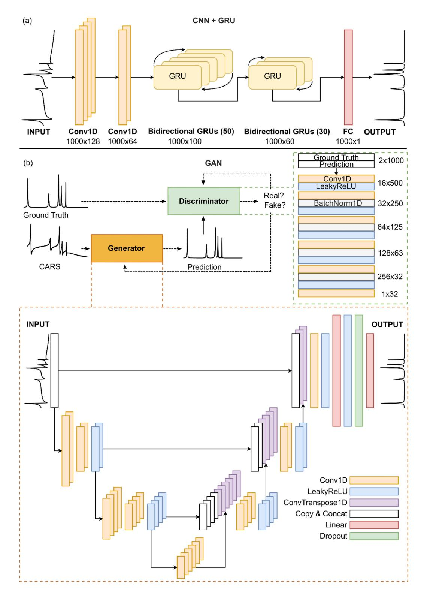
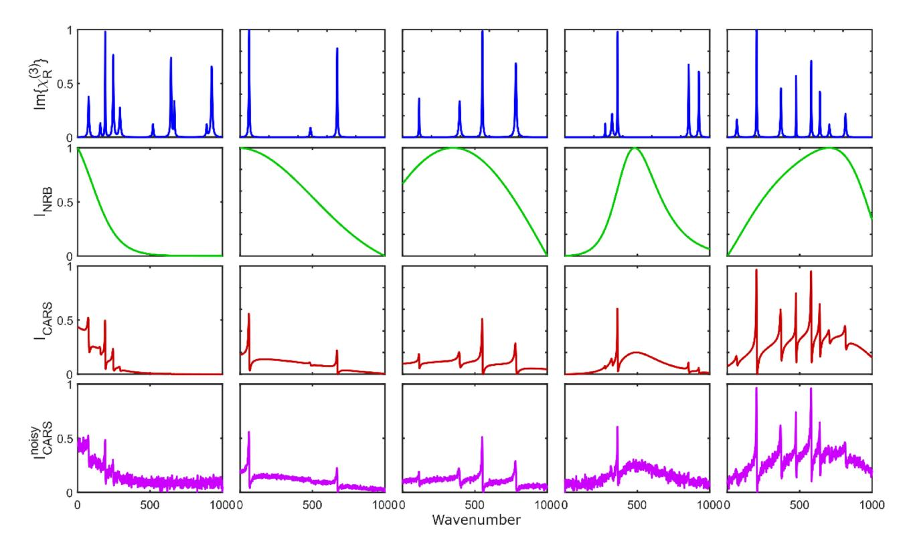
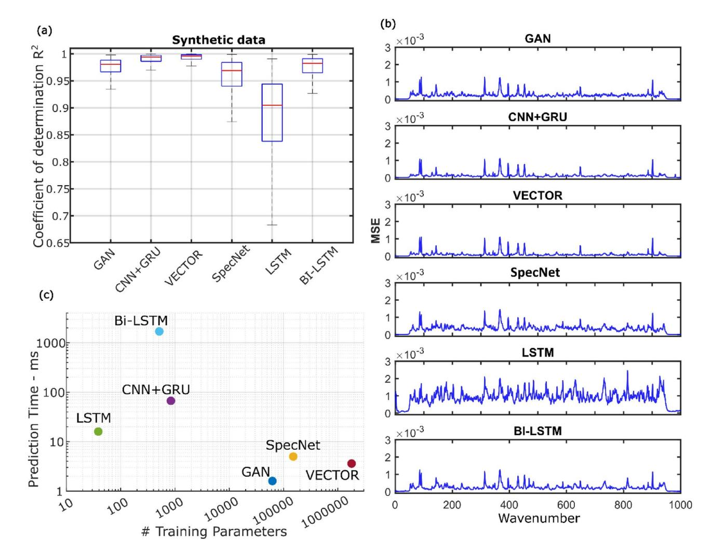
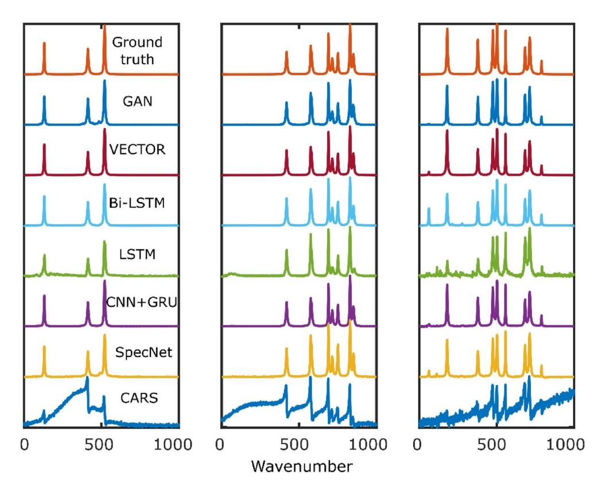
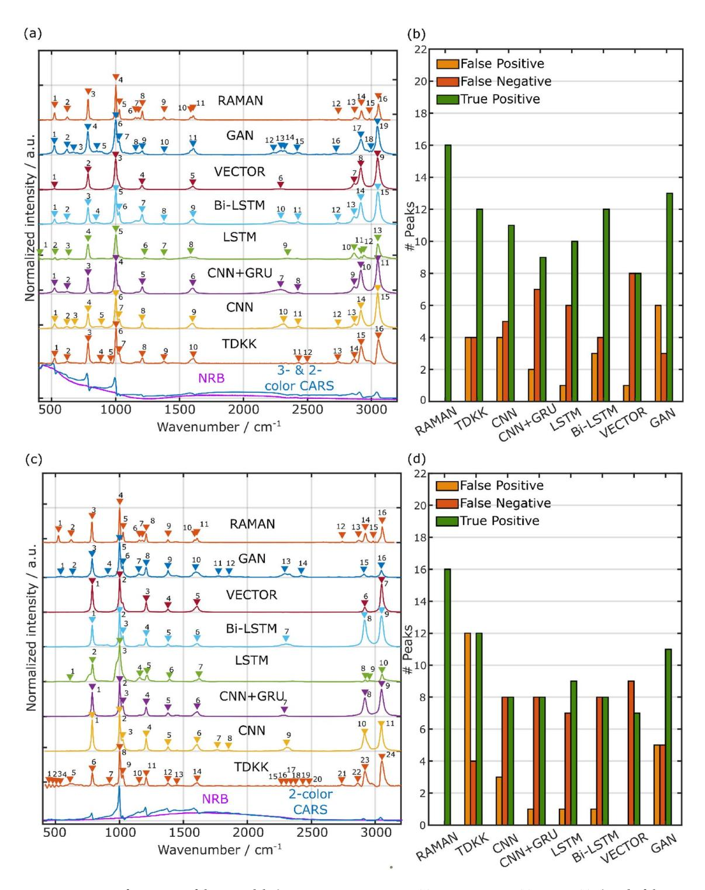
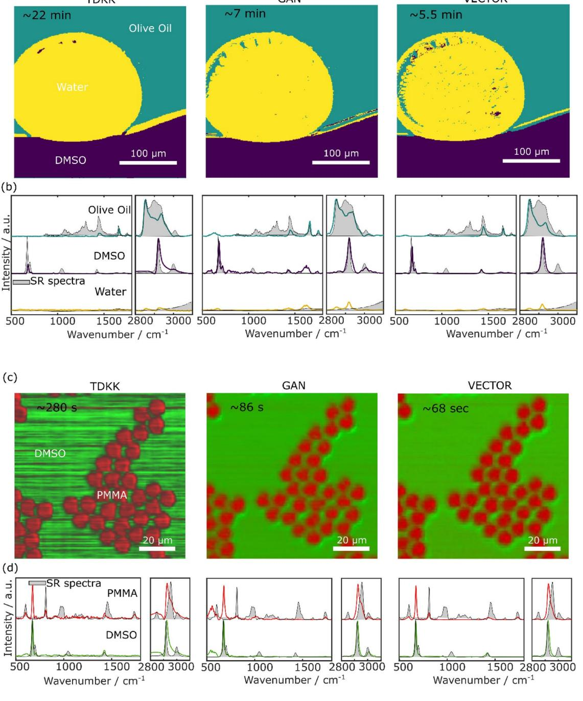

# scientific reports

# **OPEN**

# Non-resonant background removal in broadband CARS microscopy using deep-learning algorithms

Federico Vernuccio1,2,7⊠, Elia Broggio3,7, Salvatore Sorrentino1,7, Arianna Bresci1, Rajendhar Junjuri4,5, Marco Ventura1,6, Renzo Vanna6, Thomas Bocklitz4,5, Matteo Bregonzio3, Giulio Cerullo1,6, Hervé Rigneault2 & Dario Polli1,6⊠

Broadband Coherent anti-Stokes Raman (BCARS) microscopy is an imaging technique that can acquire full Raman spectra (400-3200 cm-1) of biological samples within a few milliseconds. However, the CARS signal suffers from an undesired non-resonant background (NRB), deriving from four-wavemixing processes, which distorts the peak line shapes and reduces the chemical contrast. Traditionally, the NRB is removed using numerical algorithms that require expert users and knowledge of the NRB spectral profile. Recently, deep-learning models proved to be powerful tools for unsupervised automation and acceleration of NRB removal. Here, we thoroughly review the existing NRB removal deep-learning models (SpecNet, VECTOR, LSTM, Bi-LSTM) and present two novel architectures. The first one combines convolutional layers with Gated Recurrent Units (CNN + GRU); the second one is a Generative Adversarial Network (GAN) that trains an encoder-decoder network and an adversarial convolutional neural network. We also introduce an improved training dataset, generalized on different BCARS experimental configurations. We compare the performances of all these networks on test and experimental data, using them in the pipeline for spectral unmixing of BCARS images. Our analyses show that CNN + GRU and VECTOR are the networks giving the highest accuracy, GAN is the one that predicts the highest number of true positive peaks in experimental data, whereas GAN and VECTOR are the most suitable ones for real-time processing of BCARS images.

Raman scattering (RS) is a vibrational spectroscopy technique that provides information on the molecular vibrational energies in materials and biological samples in a label-free and non-destructive way1. In RS, a quasimonochromatic pump laser beam ( $\omega_p$ ) in the visible or near-infrared illuminates the sample. The vibrational information is encoded in the spontaneously and inelastically scattered Stokes and anti-Stokes spectra, at frequencies  $\omega_s = \omega_p - \Omega$  and  $\omega_{aS} = \omega_p + \Omega$ , respectively, where  $\Omega$  are the vibrational modes of the sample. Although RS features high chemical specificity, it suffers from a low scattering cross-section, preventing fast acquisition imaging. Coherent anti-Stokes Raman scattering (CARS) is a coherent Raman technique that overcomes this limitation by creating in the sample a vibrational coherence, which enhances the signal intensity of several orders of magnitude ( $\approx 10^5$ – $10^6$ ), drastically boosting the acquisition speed2–4. In single-frequency or narrowband CARS, the signal originates from the interaction between two narrowband trains of pulses, namely the pump (at frequency  $\omega_p$ ) and the Stokes (at frequency  $\omega_s$ ), and the investigated sample, characterized by a resonant third-order nonlinear vibrational susceptibility  $\chi_R^{(3)}$ . First, the interaction of the pump and Stokes fields coherently excites a vibrational mode at the frequency  $\Omega = \omega_p - \omega_s$ ; then, a second interaction with the pump field, which now acts as a probe, generates the anti-Stokes component, at frequency  $\omega_{aS} = 2\omega_p - \omega_s$ . In this configuration, CARS fails to provide the same chemical specificity as RS, since it only probes a single vibrational mode. Moreover, it suffers from a chemically unspecific signal that arises at the same frequency as the resonant

1Department of Physics, Politecnico di Milano, P.zza Leonardo da Vinci 32, 20133 Milan, Italy. 2Aix Marseille University, CNRS, Centrale Med, Institut Fresnel, Marseille, France. 3Datrix S.p.A., Foro Buonaparte 71, 20121 Milan, Italy. 4Leibniz Institute of Photonic Technology, Member of Leibniz Health Technologies, Member of the Leibniz Centre for Photonics in Infection Research (LPI), Albert-Einstein-Strasse 9, 07745 Jena, Germany. 5Institute of Physical Chemistry (IPC) and Abbe Center of Photonics (ACP), Friedrich Schiller University Jena, Member of the Leibniz Centre for Photonics in Infection Research (LPI), Helmholtzweg 4, 07743 Jena, Germany. 6CNR-Institute for Photonics and Nanotechnologies (CNR-IFN), P.zza Leonardo Da Vinci 32, 20133 Milan, Italy. 7These authors contributed equally: Federico Vernuccio, Elia Broggio and Salvatore Sorrentino. ∞email: federico.vernuccio@fresnel.fr; dario.polli@polimi.it

CARS signal, known as non-resonant background (NRB). The NRB derives from four-wave mixing processes  $(\omega_p + \omega_p = \omega_S + \omega_{aS})$  mediated by the non-resonant part of the third-order nonlinear optical susceptibility of the sample  $\chi_{NR}^{(3)}$ . The NRB distorts the signal and shifts the peaks, but also acts as a self-heterodyne amplifier of the weak resonant Raman signal, which in its absence is immersed in the dark noise of the detector. However, such an amplification is of little help in a narrowband approach, since no post-processing methods are available to separate the resonant from the non-resonant component.

Broadband CARS (BCARS) overcomes this limitation, combining the high chemical specificity provided by RS with the fast acquisition speed provided by coherent Raman processes6. BCARS can be implemented either using hyperspectral or multiplex approaches. In hyperspectral CARS, one sequentially generates different anti-Stokes frequencies by tuning the pump or Stokes wavelength to match different vibrational frequencies  $\Omega$ , detected by a single-pixel detector. In multiplex CARS, one combines a narrowband pump beam with a broadband Stokes beam, thus simultaneously exciting many vibrational modes at once and detecting their CARS signal in parallel with a spectrometer. Two different mechanisms can generate the signal in multiplex CARS: the two-color and the three-color mechanism7,8. In the "two-color" configuration, the vibrational coherence is generated by one interaction with the narrowband pump pulse and one interaction with the broadband Stokes and is then read by a further interaction with the narrowband pump, which generates the anti-Stokes signal. In the "three-color" mechanism, the vibrational coherence is directly generated by the broadband Stokes pulse, according to the impulsive Stimulated Raman Scattering (ISRS) mechanism9,10. In ISRS, different colors of a single broadband pulse simultaneously excite virtual levels and stimulate the emission down to vibrational levels of the ground state. Once the vibrational coherence has been generated, it can be read out by an interaction with the narrowband pump pulse. The ISRS can excite only the vibrational modes whose oscillation period is longer than the pulse duration. Hence, to probe as many modes as possible, ISRS requires broadband and wellcompressed pulses with a duration of the order of tens of fs. Nowadays, state-of-the-art BCARS setups8,11,12 enable the user to acquire spectra of biological samples and crystalline materials in the entire Raman-active region in 1–3 ms per pixel, limited by the readout time of CCD sensors.

Numerous optical approaches such as time-resolved CARS13,14, polarization CARS15, frequency-modulation CARS16, and interferometric CARS17, have been demonstrated to reduce the NRB contribution in CARS measurements. All these approaches decrease the NRB contribution, at the expense of increasing the complexity and costs of experimental setups. Moreover, they reduce the strength of the resonant contribution, thus requiring longer integration time for good-quality signal acquisition, diminishing the benefits of the CARS technique. Conversely, in the implementation of BCARS, the NRB is particularly suitable for the amplification of the resonant signals, enabling one to reduce the spectrum acquisition time by 2 to 3 orders of magnitude, while still preserving the same chemical information. The spectral distortion introduced by the NRB can be removed in post-processing to obtain spectra comparable to RS ones.

In the last decades, NRB removal post-processing tasks have become an attractive field of research within the Raman and data scientists' communities. CARS spectral measurements through a spectrometer or a single-pixel detector are intensity measurements, so that one has access only to the modulus and not to the phase of the anti-Stokes field. To retrieve the imaginary part of the resonant susceptibility  $\chi_R^{(3)}$ , featuring absorptive-like spectral signatures and thus bringing the same information as RS, it is necessary to extract the spectral phase from the CARS intensity. To this aim, the two most employed techniques are the so-called time-domain Kramers Kronig (TDKK)18,19 and the Maximum Entropy Method (MEM)20. TDKK exploits the KK transform in the time domain to extract the spectral phase from the CARS modulus. The main assumption at the heart of its application is that the CARS signal obeys the causality principle, i.e., there is no signal at negative times. Essentially, this means that the KK transform can be applied given the holomorphic nature of the CARS signal. On the other hand, the MEM relies on the maximum-entropy hypothesis to estimate the spectral phase from the known data. It states that any inferences made from incomplete data should be consistent with the maximized entropy of the associated probability distribution, given the constraints of the known information. These two methods are functionally equivalent for holomorphic spectral responses21, i.e., for complex-valued spectral responses differentiable in a neighborhood of each point. This is the case in most CARS applications since multiphoton electronic resonances are rare.

The TDKK and MEM algorithms require the user's intervention and sensitively depend on the spectral shape of the NRB, which needs to be measured independently on a reference sample without resonances, such as on the glass substrate or in pure water (displaying its main Raman bands at rather high vibrational frequencies, above 3100 cm-1). However, the use of a reference introduces errors in phase and amplitude, since the pure non-resonant response of the sample differs from the one measured in these materials. To account for these errors, supervised Raman signal extraction is needed through phase-detrending and amplitude correction methods19. The application of all these processing steps requires a single spectrum processing time longer than 15–20 ms, preventing real-time processing of BCARS spectra in imaging applications.

Recently, deep-learning (DL) methods have emerged as promising tools for spectral and image processing22. DL approaches have been used to extract the pure Raman response from the CARS intensity spectra, getting rid of the undesired NRB. The first demonstration of a deep neural network for tackling the NRB removal task was done by Valensise et al. in 202023. In this work, a convolutional neural network (CNN), named SpecNet24, is trained on simulated CARS data and tested both on synthetic and experimental data. SpecNet shows good performance on real data of solvents; however, its sensitivity to noise prevents the retrieval of weak Raman peaks. In the same year, Houhou et al.25 used a long short-term memory (LSTM) network to accomplish the same task. In this case, the spectrum is seen as a temporal sequence of values and the line distortion as patterns recurring in the data. In 2022, Wang et al.26 proposed a new architecture called Very dEep Convolutional auTOencodeRs (VECTOR), using the same training dataset generated in SpecNet. VECTOR is constituted by

an encoder and a decoder. On the one hand, the encoder aims to compress the input to a lower dimensional latent representation without losing critical information. The decoder learns to reconstruct the input from the compressed representation. Skip connections are introduced to bypass the encoder to the decoder, thus boosting the performance of the network, ultimately reaching a lower Mean Square Error (MSE) than SpecNet.

In 2022, Junjuri et al.[27](#page-13-16) retrained SpecNet with a new training set made of synthetic and semi-synthetic data. While the synthetic data were generated using the same code of the training set in SpecNet, the semi-synthetic data were built starting from experimental spontaneous-Raman data and applying data-augmentation method[s28](#page-13-17). The real and imaginary parts of the Raman spectra are extrapolated through the KK relations and then simulated NRB with a sigmoidal shape is added to the data. The retrained model has shown an improvement compared to SpecNet in terms of efficient extraction of imaginary parts across the total spectral range. Similarly, Saghi et al.[29](#page-13-18) improved the phase retrieval task by fine-tuning SpecNet with semi-synthetic training data. Recently, Junjuri et al[.30](#page-13-19) explored a model based on a bidirectional long short-term memory (Bi-LSTM) architecture for extracting the imaginary part of the CARS spectra. Bi-LSTM is a variant of the LSTM architecture that enables the input data sequence to be modeled in both directions, forward and backward. The outputs of both forward and backward layers are combined in several ways, including average, sum, multiplication, and concatenation. This network led to an improved final accuracy compared to LSTM and the SpecNet. Eventually, Muddiman et al.[31](#page-13-20) trained VECTOR using a physically informed training dataset that considers the effect of laser pulse characteristics on the spectral shape. They experimentally measured the laser stimulation profile that modulates the nonlinear susceptibility and then convolved the probe laser spectrum with the result. This approach results in a network that learns how to map Raman spectra into the experimental BCARS spectra in a more accurate way than just using simulated data. However, its use is specific to the experimental setup, and new training of the parameters based on the setup characteristics has to be done when switching different experimental configurations. Despite the many works that have been performed in the field, the proposed networks still lack generalizability to spectra measured with different BCARS technical implementations and have not been used for microscopy applications.

The present work introduces two new models to remove NRB from CARS spectra and an improved method to generate the synthetic training dataset, making models generalizable to different experimental setups. Our first model is a hybrid neural network, combining convolutional layers and Gated Recurrent Unit (GRU) layers. The second network is based on a Generative Adversarial Network (GAN). We compare the prediction performances of our models with those of all the networks proposed so far in literature to tackle the same task (i.e., the SpecNet, LSTM, VECTOR, and Bi-LSTM) after training them on the same simulated dataset. Our analysis enables us to identify the advantages and disadvantages of the networks, defining which are the most suitable for BCARS spectroscopy or microscopy. Eventually, we use the different models on experimental BCARS spectra and images obtained with a homemade BCARS microscope operating in different configurations. We prove that all the trained models can be generalized to different setups. We conclude that GAN is the one enabling the prediction of the highest number of relevant Raman peaks, whereas VECTOR and GAN are the most suitable for real-time processing of BCARS images.

# **Results**

# **Neural network architectures**

The existing supervised learning methods for NRB removal are either based on CNNs, such as SpecNet and VECTOR, or recurrent neural networks, such as LSTM and Bi-LSTM. Taking inspiration from the architecture of these models, we explore the possibility of combining convolutional layers and recurrent units, specifically bidirectional GRUs[32](#page-13-21)[,33](#page-13-22) in a single DL model. The model (see Fig. [1](#page-3-0)a), referred to as "CNN+GRU", consists of two convolutional layers: the first with 128 filters and a kernel size of 5, and the second with 64 filters and a kernel size of 3, designed to extract the main features from the measured intensity CARS spectra. Subsequently, we employ a cascade of two bidirectional GRUs. The GRU consists of a network of recurrent units, each of which maintains an internal state representing the memory of the network. The key aspect of the GRU is its gating mechanism, which regulates the flow of information within each recurrent unit. Specifically, it has two gates: the update gate and the reset gate. The update gate determines how much of the previous internal state of the network should be preserved and how much of the new incoming input should be incorporated into the current state. It helps the model to selectively update its weights based on the relevance of new information. On the other hand, the reset gate controls how much of the previous state should be forgotten when computing the new state. It allows the model to forget irrelevant information from the past, thus avoiding the vanishing gradient proble[m34](#page-13-23),[35](#page-13-24) and improving the ability of the model to capture long-term dependencies in the data.

Based on this GRU architecture, the bidirectional GRU exploits two GRU networks, one processing the input sequence in the forward direction and the other in the backward direction, and concatenates their outputs at each time step. This bidirectional processing allows the model to leverage information from both past and future Raman data points simultaneously, improving its understanding of the input sequence.

The initial GRU layer comprises 50 units, while the following one has 30 units. Finally, the GRU cascade output is fed into a fully connected layer with the same dimensionality as the input vector. The model training employed an Adam optimize[r36](#page-13-25) with a learning rate of 0.0005 for parameter updates, and the Huber loss function.

The second neural network for NRB removal employs a GAN, see Fig. [1b](#page-3-0). This network is inspired by the architecture designed by Goodfellow et al.[37](#page-13-26) for image generation and by the work of Isola et al.[38](#page-13-27) for the image-to-image change domain. Our GAN model uses two neural networks trained in an adversarial fashion: a generator and a discriminator. The generator receives the BCARS spectra as inputs and predicts the NRB-free spectra. On the opposite end, the discriminator evaluates the authenticity of the data, distinguishing between the ground truth spectra without NRB and those produced by the generator. This binary classification task trains the discriminator to become more adept at identifying subtle cues that differentiate real spectra from generated instances.

**Fig. 1**. Schematics of the new DL model architectures for the NRB removal. (**a**) CNN combined to GRU network. (**b**) The GAN is constituted by a Generator and a Discriminator. The Generator architecture is an encoder-decoder architecture with skip connections, the discriminator is a CNN.

During training, these two networks engage in a continuous game. The generator aims to produce increasingly realistic NRB-removed spectra, while the discriminator strives to distinguish between spectra produced by the generator and the ground truth. This competition drives both networks to improve: the generator learns to produce more accurate imitations of the real NRB-removed spectra, while the discriminator becomes more skilled at detecting differences between real and generated spectra.

For the generator network (see Fig. 1b), we used a U-Net architecture39, a type of CNN known for its effectiveness in image segmentation tasks. The U-Net is characterized by its symmetric, 'U'-shaped layout, which allows for precise localization of features in the input data. The generator network takes as input the CARS spectra and goes through an encoding process via five one-dimensional (1-D) convolutional layers that are constituted of 32, 32, 64, 64, and 128 filters, with a kernel size of 9, 9, 7, 7, and 3, respectively. After both the first two convolutional layers and after the third and fourth convolutional layers, we use a Leaky ReLu activation function layer. Hence, the encoded information is fed into a decoder, made of five blocks of a convolutional transpose layer, which reconstructs the predicted spectrum. After the last decoding block, two fully connected layers, a leaky ReLu layer, a dropout layer, and a sigmoid activation function produce the predicted output vector. Moreover, skip connections are added from each convolutional layer to its corresponding paired transposed convolutional layer to bypass the information from the encoder to the decoder thus avoiding information loss.

The discriminator is a classifier network with three 1-D convolutional layers. Among these convolutional layers, we use a Leaky ReLu activation function and a Batch Normalization layer between the second and third convolutional layers. The convolutional layers feature respectively 64, 128, and 1 filters. The discriminator gets input from both the ground truth for a CARS spectrum and the corresponding NRB-removed spectrum produced by the generator. The last layer outputs a classification vector of size 32, following the approach introduced in the Pix2Pix GAN38. Each of the 32 values classifies a smaller patch, namely a smaller portion of the input spectra. Therefore, the discriminator is trained to reduce the distance between ground truth and generated spectra in every patch. This technique improves the quality of generated spectra, enhancing their robustness to distortion by conferring more importance on prominent features inside patches, like peaks. It should be noted that only the generator network is involved in the inference phase, *i.e.*, in the phase where we generate NRB-free spectra starting from CARS signals, while the discriminator is discarded at the end of the training process.

For the training of the GAN, we adopted a customized loss function. This loss function weights in a different way a Huber loss function based on the case that a peak is defined as true-positive, false-positive, true-negative, or false-negative for a chosen threshold. A true-positive peak is a peak that is above a given threshold both in the ground truth and in the predicted spectrum; a false-positive peak is a peak that is above the threshold in the predicted spectrum but below the threshold in the ground-truth spectrum; a true-negative peak is a peak which is below threshold both in the predicted spectrum and in the ground-truth spectrum; a false-negative peak is a peak which is above threshold in the ground-truth spectrum, but below threshold in the predicted spectrum. These four cases are associated with four different weights in the loss function. Using this customized loss function and adjusting its weights, it is possible to better adapt the network to learn also smaller signals in the dataset and increase the reliability of the learned representation.

#### Training dataset

The CNN+GRU and the GAN architecture, together with the other DL models adapted from the literature, have been trained employing a training dataset of 200,000 simulated instances and a validation dataset of 30,000 instances, used to evaluate the performances of the training in an Early Stopping framework. For the generation of the synthetic data, we started from the expression of the measured CARS signal as a function of the Pump intensity  $I_P(\omega)$ , Stokes intensity  $I_S(\omega)$ , and the third-order non-linear optical susceptibility  $\chi^{(3)}(\omega) = \chi_R^{(3)}(\omega) + \chi_{NR}^{(3)}(\omega)$ , where  $\chi_R^{(3)}(\omega)$  is the complex resonant term that contains the chemical information and  $\chi_{NR}^{(3)}(\omega)$  is the purely real non-resonant term that mediates the interaction between the excitation beams and the surrounding medium:

$$I_{CARS} \propto I_{p}^{2}(\omega) I_{S}(\omega) \left| \chi^{(3)}(\omega) \right|^{2} = I_{p}^{2}(\omega) I_{S}(\omega) \left| \chi_{R}^{(3)}(\omega) + \chi_{NR}^{(3)}(\omega) \right|^{2}$$

$$= I_{p}^{2}(\omega) I_{S}(\omega) \left( \left| \chi_{R}^{(3)}(\omega) \right|^{2} + \chi_{NR}^{(3)}(\omega)^{2} + 2R \left\{ \chi_{R}^{(3)}(\omega) \right\} \chi_{NR}^{(3)}(\omega) \right)$$
(1)

We simulated the resonant term as the sum of N complex Lorentzian peaks (with N from 1 to 11), with amplitude A randomly chosen based on a uniform distribution U (0.1, 1), width  $\Gamma$  uniformly distributed as U (0.001, 0.025) and centered with a random frequency  $\Omega$  following a uniform distribution U (0, 1):

$$\chi_R^{(3)}(\omega) = \sum_{i=1}^N \frac{A_i}{\Omega_i - \omega - j\Gamma_i}.$$
 (2)

A few examples are plotted in the first row of Fig. 2, where we considered only the imaginary part  $Im\left\{\chi_R^{(3)}\right\}$ , corresponding to the ground truth spectra in the training dataset.

The non-resonant contribution  $\chi_{NR}^{(3)}(\omega)$  is simulated as a purely Real component slowly varying with respect to the frequency axis:

$$\chi_{NR}^{(3)}(\omega) = s * (\omega - min_{\omega}) + max_{NR}$$
(3)

where s is the slope, defined as  $s=max_{NR}-min_{NR}$ , with  $max_{NR}$  and  $min_{NR}$  uniformly distributed as  $U\left(0.3,0.5\right)$  and  $U\left(0.5,0.7\right)$ .

**Fig. 2.** Examples of synthetic instances generated with different simulation parameters. For each instance, we report the ground truth  $(Im\{\chi_R^{(3)}\})$ , the intensity of the NRB contribution, the intensity of the total CARS signal, and the noisy CARS intensity.

In the simulation, we did not include the spectral dependence of the pump beam, as we are assuming that in a broadband CARS setup, it corresponds to the narrowband beam that does not play a significant role in the shape of the excitation profile of the CARS signal.

Finally, we simulated the Stokes spectrum  $I_s(\omega)$ , corresponding to the broadband beam in multiplex CARS, using a sigmoidal, a Gaussian, or a polynomial function, randomly choosing among one of these three possibilities with equal probability. (a) The sigmoidal Stokes derives from the product of two sigmoidal functions defined as:

$$\sigma_{1,2}(\omega, c_{1,2}, b_s) = \frac{1}{1 + e^{-(\omega - c_{1,2})b_s}}$$
(4)

where the parameter  $b_s$  follows a normal distribution N (10,5) and the parameters  $c_{1,2}$  are generated with two normal distributions  $N_1$  (0.2,0.3) and  $N_2$  (0.7,0.3). (b) The Gaussian Stokes is simulated considering a Gaussian function with unitary amplitude and a mean  $\mu$  uniformly distributed as U  $(0, max_\omega)$  and a standard deviation  $\sigma$  distributed as randint (0.25,0.75). (c) The polynomial Stokes is generated considering a normalized 4-th order polynomial function  $^{40}$  with coefficients a,b,c,d, and e with a,b,d=U (-10,10) and c,e=U (-1,1):

$$I_s = a\omega^4 + b\omega^3 + c\omega^2 + d\omega + e \tag{5}$$

In the second row of Fig. 2 we reported a few examples of the intensity of the NRB ( $I_{NRB}$ ) that is obtained by considering the product between one of these three Stokes spectral profiles and the squared modulus of the non-resonant third order nonlinear susceptibility  $\chi_{NR}^{(3)}(\omega)$ .

The third row in Fig. 2 reports some examples of synthetic CARS signal intensity spectral profiles  $(I_{CARS})$ , obtained by the multiplication of the Stokes intensity with the squared modulus of the total third order nonlinear susceptibility, as in Eq. (1).

Eventually, on top of the CARS signal we added a noise with a uniformly distributed  $U(0.0002, max_{noise})$  amplitude, with  $max_{noise} = U(0.005, 0.05)$ . The results are plotted in the fourth row of Fig. 2.

Before generating the final CARS intensity for the training dataset as  $I_{CARS}\left(\omega\right)=I_{S}\left|\chi_{R}^{(3)}\left(\omega\right)+\chi_{NR}^{(3)}\left(\omega\right)\right|^{2}+noise$ , we generated a code that establishes if the peak must be considered

or not in the final simulated spectrum according to the strength of the CARS intensity in correspondence with the center position of the peak. In particular, after several tests, we decided that a peak is kept if its normalized CARS intensity is higher than 0.1 in correspondence of the peak center and if the peak-to-peak variation of the dispersive line-shape of the peak is 3 times larger than  $max_{noise}$ . This is because we cannot pretend that the

algorithm is trained with the too-stringent constraint of identifying as true positive a peak whose intensity is comparable to the noise floor.

### Performances of the DL models on simulated test data

After training the different models, we tested the performances of all the networks on a test set of 1000 simulated data, not previously seen by the networks. We evaluated the performances using different figures of merits: the coefficient of determination  $R^2$ , the MSE at different Raman shift values, the number of training parameters, and the prediction time for every single instance.

We calculated the coefficient of determination  $R^2$  for each single instance as:

$$R^{2} = 1 - \frac{\sum_{i} (y_{i} - \widehat{y}_{i})^{2}}{\sum_{i} (y_{i} - \overline{y})^{2}}$$
 (6)

where y is the ground truth spectrum,  $\hat{y}$  corresponds to the predicted spectrum, and  $\overline{y}$  is the mean value of each spectrum. A value of  $R^2=1$  means that the prediction perfectly matches the ground truth; a value of  $R^2=0$  means that the model always predicts the mean value. Models with worse prediction can generate negative  $R^2$  values. The distribution through box plots of the  $R^2$  values on the 1000 instances (Fig. 3a) demonstrates that all the models have a coefficient of determination on synthetic data above 0.65. In particular, except for the LSTM, whose  $R^2$  median value is 0.9046, the median of all the other networks is above 0.96, with the best two networks being the new CNN+GRU network (0.9938) and the VECTOR network (0.9958), while the GAN network we propose has a median value of 0.9805. From this figure of merit, we also notice that among all the networks the one that has the smallest interquartile range, *i.e.*, the lower dispersion of the  $R^2$  values around the median value, is VECTOR, followed by the CNN+GRU architecture.

**Fig. 3.** Performances of the 6 models (GAN, CNN+GRU, VECTOR, SpecNet, LSTM, BI-LSTM) on a test set made of 1000 instances after training with the synthetic dataset. (a) Coefficient of determination R2. (b) Average mean square error (MSE) on the test instances. (c) The scatter plot reports the number of parameters and the mean prediction time for each model on a single instance of the test dataset.

Then, we compared the performances of the network by looking at the MSE of the 1000 instances for each model (Fig. 3b). Also in this case, the DL networks that show the best performances are the VECTOR (mean value  $9.97*10^{-5}$ ), the CNN+GRU (mean value  $1.18*10^{-4}$ ), and the GAN ( $2.21*10^{-4}$ ), while LSTM shows the highest MSE (mean value  $8.99*10^{-4}$ ).

The main goal of using neural networks for NRB removal tasks is related to how fast a single spectrum can be processed in an unbiased way and without using any further measurements of reference samples. The typical computational time to perform the time-domain Kramers Kronig algorithm on a single CARS spectrum, including supervised correction steps for phase and amplitude19, ranges from 15 to 20 ms. However, recent advancements in the field41 have demonstrated that the discrete Hilbert transform, used for retrieving the phase from the CARS data in the first step of the algorithm, can be replaced with a learned matrix approach to the discrete Hilbert transform. This choice leads to a 30 times faster data processing on the first step of the algorithm and improves the accuracy of the phase retrieval task.

To choose the best DL models that can guarantee real-time or quasi-real-time processing of CARS data during acquisition (often requiring less than 10-ms spectral acquisition times), we evaluated the different model performances in terms of the number of training parameters and single-instance prediction time (Fig. 3c). The measured prediction times, when running the algorithm on a machine with NVIDIA GeForce RTX 3090, show that among the six models, the three that are most suitable for real-time CARS processing are the new GAN model (1.6 ms), the SpecNet model (5 ms), and VECTOR (3.6 ms). However, we need to specify that, while VECTOR, being based on convolutional layers only, can accept inputs with variable size, the GAN model and the SpecNet model, because of their architecture, can only accept input with exactly 1000 spectral pixels. For processing spectra with a different size, an additional time of generally 3 ms (on CPU) must be added to these numbers, to account for spectra interpolation before and after the neural network. From this singleinstance processing time estimation, we also notice that all the networks that use recurrent units, i.e., LSTM, CNN+GRU, and Bi-LSTM, need longer time for single spectra prediction, respectively of 16 ms, 67 ms, and 1.7 s. This analysis shows that, despite their good performances in terms of coefficient of determination and MSE, they remain more suitable for single-spectra prediction and not for imaging/microscopy applications. We expect that running the hardware and DL processing in parallel would enable background-free B-CARS image acquisition with a < 10 ms pixel dwell time, this time is one to two orders of magnitude faster than spontaneous Raman and the collected signal provides the same chemical information.

Figure 4 showcases three examples of the prediction from test CARS spectra with different excitation profiles, number, position, width, and amplitude of the Raman peaks, and different noise levels.

#### Performances of the DL models in experimental CARS spectra

After assessing the model performances on synthetic data, we want to evaluate how they perform on experimental data. To account for the variability of the excitation profile, we acquired two CARS spectra of toluene enclosed in between a 1 mm-thick well-glass slide and a 170  $\mu$ m glass coverslip, adopting two different setup configurations. In the first case, the CARS spectrum was acquired by using both two-color and three-color CARS processes for the excitation of the vibrational modes as shown in Fig. 5a. The setup we used for this experiment is described in the Methods section. After the acquisition of the three-color and two-color CARS spectrum using 1-ms exposure time of a CCD sensor with 1340 spectral pixels, we measured the reference spectrum on the glass coverslip maintaining the same setup settings. This second spectrum is used exclusively for the phase retrieval of the resonant term using the TDKK algorithm.

After applying the TDKK, we fed the pre-trained networks with the toluene CARS spectrum and obtained the predicted spectra. We remark that in this case, having measured a number of spectral points larger than the 1000 points used for training the instances, for the case of all the networks, except for VECTOR, we interpolated the spectrum over 1000 points before the network and restored the initial dimension of the spectrum on the prediction. Moreover, we applied a min-max normalization to the CARS spectrum. Contrary to what we did for the synthetic test dataset, here we do not have the information about the ground truth of the CARS spectrum available. Therefore, to assess the system performance, we compared the predicted spectra with the RS spectrum of toluene that we obtained averaging 5 times a spectrum acquired over 1 s using a home-made RS setup with a continuous diode laser (Cobolt AB, Flamenco) centered at 660 nm. Complete details on the RS setup description can be found in our previous works11,42. For each prediction from the BCARS spectrum with the various deeplearning (DL) networks, we determined the number of false-positive, false-negative, and true-positive peaks, by considering the sixteen toluene peaks measured with the RS spectrum. For the peak identification, we used a peak-finder function (MATLAB R2021b), setting the same minimum peak prominence and minimum distance between the peaks for all the different predictions. We set the two parameters on the RS spectrum to identify all the main and distinguishable peaks, setting values of 4 cm-1 for the minimum distance and 0.015 for the minimum peak prominence. Afterward, we defined that a peak is considered "true positive" if the center frequency of the predicted peak is within 4 cm-1 of the real peak as measured by RS.

We summarized all the number of peaks for the different predictions in Fig. 5b, also including the RS spectrum for comparison. This graph tells us that the best three algorithms for single-spectrum NRB removal in terms of true-positive peaks are the GAN (13 true-positive peaks), followed by Bi-LSTM and TDKK (both with 12 true-positive peaks). Among these three networks, the GAN is the one that gives the highest number of false positive peaks, however, four of these peaks are located in the silent region of the spectrum while Bi-LSTM and TDKK predict only two peaks in this region. In this specific case, we know that our CARS spectra (bottom blue curve in Fig. 5a) present spurious artifacts, and no peaks are expected in this region.

**Fig. 4.** Prediction of the different models for three CARS spectra (bottom blue curves) belonging to the test set and comparison with the corresponding Ground truth (top orange curves).

To account for the generalizability of the network, we changed the configuration of our CARS setup (see Methods for details) to acquire CARS spectra over the entire Raman active region but exploiting only two-color processes. The two-color CARS spectrum of toluene (Fig. 5c) was acquired using the same sample configuration and CDD exposure time of the two-color and three-color experiments. In this second configuration, we recorded another reference spectrum to perform the TDKK algorithm and removed the NRB using all the pre-trained neural networks, after normalization and spectral interpolation of the input BCARS data. Also in this case, the comparison with the RS spectrum (Fig. 5d) shows that TDKK and GAN are the two methods that enable predicting the highest number of true-positive peaks, predicting 12 and 11 peaks, respectively. Moreover, the TDKK predicted many more false-positive peaks (12) than the GAN (5). However, as in the previous case, the majority of these false-positive peaks correspond to the region of the spectrum where either we should not expect peaks because they cannot be excited through the two-color CARS mechanism11 (in the region below 500 cm-1) or there should not be peak as we are in the silent region (6 false peaks for the TDKK versus 2 peaks for the GAN).

For both the CARS spectra, we also noticed that VECTOR, which has shown very good performances on the synthetic data, does not identify many true-positive peaks. Despite that, the number of false-positive peaks is very low, meaning that the network can identify a lower number of true-positive peaks, but also reduce the possibility of considering peak distortion of the spectrum due to noise or measurement artifacts.

The presented experimental CARS spectra of toluene represent two possible shapes of the NRB in the experimental data. Although the neural networks have never seen the same excitation profile, they have been trained on a generalized dataset that includes many different excitation profiles, obtained by considering different shapes of the Stokes spectrum, simulating it either as a sigmoidal, Gaussian, or polynomial function. Experimentally, several shapes of the NRB can be obtained either by changing the spectrum of the Stokes beam or by varying its temporal compression by changing the insertion of one of the two prisms in the prism compressor. However, we do not expect that other NRB shapes may vary the performances of the network as compared to the two experimental results presented in this section.

# NRB removal in broadband CARS microscopy

After assessing the capability of the different networks in removing the NRB in experimental spectra, we used the network in the pipeline for the analysis of experimental broadband CARS hyperspectral images. The main goal of broadband CARS imaging is to deliver false-color maps, distinguishing the different chemical species and associating them to a Raman spectrum that can be further analyzed to fully comprehend the chemical composition of specific regions in the sample. To do so, the raw hyperspectral CARS images must go through several steps of processing. The first step is typically the denoising step, where the spectral noise is reduced.

**Fig. 5**. Performances of the 6 models (GAN, CNN+GRU, VECTOR, SpecNet, LSTM, BI-LSTM) and of the traditional time domain Kramers–Kronig (TDKK) algorithm on two experimental CARS spectra of toluene. (**a**) Spectra predicted by the different models from the CARS spectrum of toluene (bottom light blue curve) were acquired using both two and three-color processes for signal excitation and comparison with the Raman spectrum (top orange curve). (**b**) Histogram summarizing the number of true positive, false positive, and false negative peaks predicted by each algorithm for the spectra in (**a**) in comparison with the ones of the Raman spectrum. (**c**) Spectra predicted by the different models from the CARS spectrum of toluene (bottom light blue curve) acquired using only two color processes for signal excitation and comparison with the Raman spectrum (top orange curve) (**d**) Histogram summarizing the number of true positive, false positive and false negative peaks predicted by each algorithm for the spectra in (**c**) in comparison with the ones of the Raman spectrum.

This is typically done using methods either based on numerical algorithms43,44 or DL models42,45,46. The second step consists of removing the NRB from all the CARS spectra. This step must be performed for every single spectrum and it is typically the step that slows down the analysis of BCARS images. The last one is the spectral unmixing step, in which the hyperspectral image is decomposed in concentration matrices or clusters and the corresponding Raman spectra, which can be either associated with a given chemical species, in case of factorization algorithms (such as MCR-ALS algorithm47, PCA, N-FINDR11, etc.), or to a given cluster of pixels, in case of clustering algorithms (such as K-means cluster analysis48 or hierarchical cluster analysis).

As previously stated, an ideal computational time for NRB-removal algorithms should be lower than 10 ms to perform real-time CARS processing, as state-of-the-art BCARS systems are now able to acquire vibrational spectra spanning the entire Raman-active region within 1 to 10 ms8,11. Based on the performance analysis we carried out both considering simulated and experimental data, the best models we can use for this purpose are GAN and VECTOR. We first considered a sample of oil, water, and DMSO, obtained by sandwiching three droplets of each species between two 170 µm coverslips. We acquired a BCARS image with 1-µm pixel size and 1 ms-pixel dwell time over an area of 300 × 300 µm2. We first used the traditional method for NRB removal by using the TDKK after spectral denoising with the SVD algorithm44. Then, since the sample consists of three immiscible liquids, we used K-means cluster analysis to identify the three main clusters and three average spectra associated with them (Fig. 6a,b). Afterward, we used both GAN and VECTOR replacing the first two steps, being the network trained also on noisy data. The results (Fig. 6a,b) show that the three methods can distinguish the three clusters and identify the characteristic spectra, that are compared for reference to the spontaneous Raman (SR) one (grey areas in Fig. 6b). Eventually, similar experiments were conducted on a sample of 8 µm plastic polymethyl methacrylate (PMMA) beads in DMSO sandwiched between two 170 µm-thick glass coverslips (Fig. 6c,d). The CARS measurements were performed with a pixel size of 500 nm and 1 ms pixel dwell time. We followed the same processing done for the image of oil, DMSO, and water, but this time we used the MCR-ALS algorithm to deliver the concentration matrices and the relative spectra associated with each species. Note that, in all three approaches, the spectra of the 8-µm PMMA beads present a residual peak of DMSO. This is caused by the fact that the DMSO solvent covers the smaller PMMA beads. These results also demonstrate that GAN and VECTOR can be used for denoising and NRB removal when inserted in the pipeline for broadband CARS imaging processing, speeding up the analysis process and delivering false-color chemical maps with similar information to the one obtained through conventional data processing (SVD and TDKK).

#### Discussion and conclusion

In this work, we reported different deep-learning methods for the removal of the undesired NRB from BCARS spectra. Traditionally, the NRB removal task is tackled using numerical algorithms, such as the MEM and TDKK. There are five main advantages to using deep neural networks over numerical algorithms. (i) The prediction provided by DL models is not biased by the decision of the user, as it happens in numerical methods when fine-tuning the parameters according to the spectra size and the spectral excitation profile. (ii) The networks work for different setup configurations being trained on a dataset that accounts for system variability, while numerical algorithms need tuning of the parameters when the system configuration changes. (iii) There is no need to measure a reference spectrum to characterize the excitation profile of the BCARS experimental setup. (iv) We demonstrated that neural networks with some specific architectures can perform real-time processing of BCARS images, which is not currently possible with numerical algorithms. (v) Pre-trained DL models are user-friendly tools that do not require an expert user for their implementation on hyperspectral CARS data.

The network models existing in the literature are either based on convolutional layers or use recurrent neural networks to tackle the nonlinear problem in a supervised fashion. Here, we propose two new architectures to explore other possible models and eventually test the performances of the new models and of the existing one on the same training dataset. The first architecture combines both convolutional layers and recurrent units in the form of Gated Recurrent Units. The second one is a Generative Adversarial Network made of an autoencoder-decoder architecture for the generator and a convolutional network for the discriminator. The hyperparameters of these two models were optimized on a synthetic training dataset that we built to make the networks generalizable on different BCARS experimental systems. The new training dataset allows us to obtain spectra more similar to real-case scenarios. Indeed, with respect to our previous training dataset that considered a spectral dependent  $\chi_{NR}^{(3)}$  discarding the Stokes spectral profile23, here, we included different Stokes spectral shapes, while  $\chi_{NR}^{(3)}$  is considered as a slowly varying function in the wavenumber domain. After training all the neural models, the performances of the network have been evaluated considering different figures of merits. Although the CNN+GRU network shows one of the highest coefficients of determination and lowest MSE on the test set, the single-spectrum prediction time for this network is quite long and does not make this model the best choice for real-time BCARS image processing. On the other hand, VECTOR and the new GAN model feature both a high coefficient of determination and a low R2 in addition to a short computational time, thus being the most suitable for processing CARS hypercubes.

Moreover, our analysis shows that VECTOR outperforms all the other networks on the synthetic test set, despite featuring a slightly longer computational time than the GAN one. When referring to experimental data acquired with different setup configurations, we found that GAN is better than all the other models in predicting the highest number of true-positive peaks, while VECTOR predicts the lowest number of false-positive peaks.

One of the main applications for CARS microscopy is the investigation of biological samples, whose vibrational spectra feature tiny resonant peaks with a small modulation on top of the NRB. To analyze these samples, our training dataset that generalizes on different experimental data can be improved to be more suitable for the NRB removal task in spectra featuring such small signals. One solution is to increase the number of peaks with a higher non-resonant to resonant ratio. This can easily be implemented by changing the way the amplitude

**Fig. 6**. Evaluation of three different models (TDKK, GAN, and VECTOR) for NRB removal on experimental CARS images. (**a**) Prediction on a CARS image of oil, DMSO, and water clustered using K-means cluster analysis. (**b**) Spectra related to the three images in (**a**) corresponding to the average spectrum of each cluster and comparison with the SR spectra of Oil and DMSO (grey area). (**c**) Prediction on a CARS image of DMSO and 8-µm polymethyl methacrylate (PMMA) beads classified using the MCR-ALS algorithm. (**d**) Spectra related to the three images in (**c**) were derived through the MCR-ALS algorithm and comparison with the SR spectra of DMSO and OIL (grey area). In each image, we report the time needed to perform the denoising (SVD only for the TDKK case) and NRB removal (TDKK, GAN, VECTOR) steps for all the pixels.

of the resonant peak is chosen, substituting the uniform distribution with one that has a higher probability in correspondence with lower amplitude values, and reducing the minimum amplitude value in the distribution of maxnoise. This entails that new retraining of the chosen network has to be done before using it to remove the NRB on the experimental CARS data from biological samples.

Eventually, the test of GAN and VECTOR on hyperspectral CARS data demonstrates how the development of the neural network models is now at a stage in which they can be inserted in the pipeline for CARS image processing. The pre-trained model for GAN and VECTOR can be found as an easy-to-use and freely available tool on RamApp49, a user-friendly interface that we developed for the analysis of hyperspectral data. We are convinced that the study and comparison of the different networks and the tool we are providing with this work are useful to the researchers working in the field of hyperspectral imaging and will simplify and boost the processing of BCARS data.

#### Methods

#### Neural network architectures

To have a fair comparison between all the neural networks, we retrained the previously developed ones using our new dataset. For each of the four, we used the code available in the literature (SpecNet24, VECTOR50, LSTM51, bi-LSTM52) and replaced the training dataset. In this way, we were able to maintain the original architectures and ensure that the only difference between the retrained models and the original ones was the training dataset.

As previously mentioned, all models except VECTOR accept input spectra of the same length as the spectra they were trained on (1000 spectral pixels in this case). This means that, when dealing with experimental CARS spectra, we used an interpolation function both before and after the neural network to accommodate their input size. We performed linear interpolation using NumPy's interp function to generate a new set of spectral points at evenly spaced positions. This ensures that the resampled spectrum matches the desired output length while preserving the original information. It is worth noting that this same function was used to both increase and decrease the number of spectral points.

#### Experimental BCARS setup

The BCARS microscope used in this experiment is described in detail in our previous works11,12,42. Briefly, the system starts with an amplified ytterbium-fiber laser (Coherent Monaco) generating 270 fs pulses at a 1035 nm wavelength and a 2 MHz repetition rate. The train of pump pulses is generated through an etalon, leading to 3.7 ps pulses and a system spectral resolution of  $\approx 9~\text{cm}^{-1}~\text{FWHM}$ . The broadband Stokes beam is obtained via supercontinuum generation in a 10 mm-thick YAG crystal. The Stokes pulses are compressed to ≈20 fs duration by an SF11 prism-pair compressor compensating for the positive group-delay dispersion introduced by the optical elements on the Stokes beam path. The two beams are then spatially and temporally combined and sent to a homebuilt vertical microscope, designed in an upright configuration. Sample illumination and light collection are performed by a pair of 0.85-NA air objectives (LCPLN100XIR, Olympus). After the microscope, a short-pass filter (FESH1000, Thorlabs) selects the blue-shifted region of the spectrum that is focused into a monochromator (Acton SP2150, Princeton Instruments) equipped with a 600 g/mm grating and a back-illuminated chargecoupled device camera with a 100×1340-pixel sensor (BLAZE 100HR, Princeton Instruments).

To tune the system between the two-color/three-color CARS configuration and the only two-color CARS configuration, we placed a mask after the second prism of the compressor that adjusts the extension of the Stokes spectrum. When the Stokes spectrum is in the range of 1200–1600 nm and the pulses are compressed to ≈20 fs duration, the two-color CARS mechanism is limited to the high-frequency region of the vibrational spectrum, while the low wavenumber region is excited through three-color mechanisms. In the two-color/three-color configuration, the fine-tuning of the mask position avoids the undesired presence of fringes in the spectrum due to the interference of the two processes. On the other hand, when the Stokes spectrum spans between 1070 and 1600 nm and the pulses are not compressed, the CARS signal is excited only through two-color mechanisms. Moderate average powers of the Stokes (<10 mW) and pump (<25 mW) beam have been used for all the experiments.

#### Data availability

The data underlining the results presented in this paper are available in Zenodo53. The deep learning models and the code for the generation of the training dataset are available in GitHub54.

Received: 15 July 2024; Accepted: 30 September 2024

Published online: 13 October 2024

#### References

- 1. Vanna, R. et al. Vibrational imaging for label-free cancer diagnosis and classification. Riv. Nuovo Cimento 45, 107-187 (2022).
- 2. Müller, M. & Zumbusch, A. Coherent anti-stokes Raman scattering microscopy. ChemPhysChem 8, 2156-2170 (2007).
- 3. Zumbusch, A., Holtom, G. R. & Xie, X. S. Three-dimensional vibrational imaging by coherent anti-stokes Raman scattering. Phys. Rev. Lett. 82, 4142-4145 (1999).
- 4. Cheng, J.-X. & Xie, X. S. Coherent anti-stokes Raman scattering microscopy: Instrumentation, theory, and applications. J. Phys. Chem. B 108, 827-840 (2004).
- 
-  Coherent Raman Scattering Microscopy. (CRC Press, 2016). https://doi.org/10.1201/b12907.
   Polli, D., Kumar, V., Valensise, C. M., Marangoni, M. & Cerullo, G. Broadband coherent Raman scattering microscopy. Laser Photonics Rev. 12, 1800020 (2018).
- 7. Lee, J. Y., Kim, S.-H., Moon, D. W. & Lee, E. S. Three-color multiplex CARS for fast imaging and microspectroscopy in the entire CHn stretching vibrational region. Opt. Express 17, 22281 (2009).
- 8. Camp, C. H. Jr. et al. High-speed coherent Raman fingerprint imaging of biological tissues. *Nat. Photonics* **8**, 627–634 (2014).
  9. Batignani, G., Ferrante, C., Fumero, G. & Scopigno, T. Broadband impulsive stimulated Raman scattering based on a chirped
- detection. J. Phys. Chem. Lett. 10, 7789-7796 (2019).
- 10. Dhamija, S., Bhutani, G., Jayachandran, A. & De, A. K. A revisit on impulsive stimulated Raman spectroscopy: Importance of spectral dispersion of chirped broadband probe. J. Phys. Chem. A 126, 1019-1032 (2022).

- 11. Vernuccio, F. et al. Full-spectrum CARS microscopy of cells and tissues with ultrashort white-light continuum pulses. *J. Phys. Chem. B* **127**, 4733–4745 (2023).
- 12. Hempel, F. et al. Comparing transmission- and epi-BCARS: A round robin on solid-state materials. *Appl. Opt.* **63**, 112–121 (2024).
- 13. Volkmer, A., Book, L. D. & Xie, X. S. Time-resolved coherent anti-stokes Raman scattering microscopy: Imaging based on Raman free induction decay. *Appl. Phys. Lett.* **80**, 1505–1507 (2002).
- 14. Selm, R. et al. Ultrabroadband background-free coherent anti-stokes Raman scattering microscopy based on a compact Er:fiber laser system. *Opt. Lett.* **35**, 3282 (2010).
- 15. Cheng, J.-X., Book, L. D. & Xie, X. S. Polarization coherent anti-stokes Raman scattering microscopy. *Opt. Lett.* **26**, 1341–1343 (2001).
- 16. Ganikhanov, F., Evans, C. L., Saar, B. G. & Xie, X. S. High-sensitivity vibrational imaging with frequency modulation coherent anti-stokes Raman scattering (FM CARS) microscopy. *Opt. Lett.* **31**, 1872–1874 (2006).
- 17. Potma, E. O., Evans, C. L. & Xie, X. S. Heterodyne coherent anti-stokes Raman scattering (CARS) imaging. *Opt. Lett.* **31**, 241–243 (2006).
- 18. Liu, Y., Lee, Y. J. & Cicerone, M. T. Broadband CARS spectral phase retrieval using a time-domain Kramers–Kronig transform. *Opt. Lett.* **34**, 1363–1365 (2009).
- 19. Camp, C. H., Lee, Y. J. & Cicerone, M. T. Quantitative, comparable coherent anti-stokes Raman scattering (CARS) spectroscopy: Correcting errors in phase retrieval. *J. Raman Spectrosc. JRS* **47**, 408–415 (2016).
- 20. Vartiainen, E. M., Peiponen, K.-E., Kishida, H. & Koda, T. Phase retrieval in nonlinear optical spectroscopy by the maximumentropy method: an application to the |χ(3)| spectra of polysilane. *JOSA B* **13**, 2106–2114 (1996).
- 21. Cicerone, M. T., Aamer, K. A., Lee, Y. J. & Vartiainen, E. Maximum entropy and time-domain Kramers–Kronig phase retrieval approaches are functionally equivalent for CARS microspectroscopy. *J. Raman Spectrosc.* **43**, 637–643 (2012).
- 22. Vernuccio, F. et al. Artificial intelligence in classical and quantum photonics. *Laser Photonics Rev.* **16**, 2100399 (2022).
- 23. Valensise, C. M. et al. Removing non-resonant background from CARS spectra via deep learning. *APL Photonics* **5**, 061305 (2020).
- 24. Valensise Carlo. [https://github.com/Valensicv/Specnet.](https://github.com/Valensicv/Specnet)
- 25. Houhou, R. et al. Deep learning as phase retrieval tool for CARS spectra. *Opt. Express* **28**, 21002–21024 (2020).
- 26. Wang, Z. et al. VECTOR: Very deep convolutional autoencoders for non-resonant background removal in broadband coherent anti-stokes Raman scattering. *J. Raman Spectrosc.* **53**, 1081–1093 (2022).
- 27. Junjuri, R., Saghi, A., Lensu, L. & Vartiainen, E. M. Convolutional neural network-based retrieval of Raman signals from CARS spectra. *Opt. Contin.* **1**, 1324–1339 (2022).
- 28. Bresci, A. et al. Removal of cross-phase modulation artifacts in ultrafast pump–probe dynamics by deep learning. *APL Photonics* **6**, 076104 (2021).
- 29. Saghi, A., Junjuri, R., Lensu, L. & Vartiainen, E. M. Semi-synthetic data generation to fine-tune a convolutional neural network for retrieving Raman signals from CARS spectra. *Opt. Contin.* **1**, 2360–2373 (2022).
- 30. Junjuri, R., Saghi, A., Lensu, L. & Vartiainen, E. M. Evaluating different deep learning models for efficient extraction of Raman signals from CARS spectra. *Phys. Chem. Chem. Phys.* **25**, 16340–16353 (2023).
- 31. Muddiman, R., Dwyer, K. O., Camp, C. H. & Hennelly, B. Removing non-resonant background from broadband CARS using a physics-informed neural network. *Anal. Methods* **15**, 4032–4043 (2023).
- 32. Cho, K. et al. Learning phrase representations using RNN encoder-decoder for statistical machine translation. Preprint at [https://](https://doi.org/10.48550/arXiv.1406.1078) [doi.org/10.48550/arXiv.1406.1078](https://doi.org/10.48550/arXiv.1406.1078) (2014).
- 33. Gruber, N. & Jockisch, A. Are GRU cells more specific and LSTM cells more sensitive in motive classification of text?. *Front. Artif. Intell.* **3**, 40 (2020).
- 34. Pascanu, R., Mikolov, T. & Bengio, Y. On the difficulty of training recurrent neural networks. Preprint at [https://doi.org/10.48550/](https://doi.org/10.48550/ARXIV.1211.5063) [ARXIV.1211.5063](https://doi.org/10.48550/ARXIV.1211.5063) (2012).
- 35. Tan, H. H. & Lim, K. H. Vanishing gradient mitigation with deep learning neural network optimization. in *2019 7th International Conference on Smart Computing & Communications (ICSCC)* 1–4 (IEEE, Sarawak, Malaysia, Malaysia, 2019). [https://doi.](https://doi.org/10.1109/ICSCC.2019.8843652) [org/10.1109/ICSCC.2019.8843652.](https://doi.org/10.1109/ICSCC.2019.8843652)
- 36. Kingma, D. P. & Ba, J. Adam: A method for stochastic optimization. Preprint at <https://doi.org/10.48550/ARXIV.1412.6980> (2014).
- 37. Goodfellow, I. et al. Generative adversarial networks. *Commun. ACM* **63**, 139–144 (2020).
- 38. Isola, P., Zhu, J.-Y., Zhou, T. & Efros, A. A. Image-To-image translation with conditional adversarial networks. in *Proceedings of the IEEE Conference on Computer Vision and Pattern Recognition*.
- 39. Ronneberger, O., Fischer, P. & Brox, T. U-Net: Convolutional networks for biomedical image segmentation. In *Medical Image Computing and Computer-Assisted Intervention–MICCAI 2015* Vol. 9351 (eds Navab, N. et al.) 234–241 (Springer International Publishing, Cham, 2015).
- 40. Junjuri, R., Saghi, A., Lensu, L. & Vartiainen, E. M. Effect of non-resonant background on the extraction of Raman signals from CARS spectra using deep neural networks. *RSC Adv.* **12**, 28755–28766 (2022).
- 41. Camp, C. H. Raman signal extraction from CARS spectra using a learned-matrix representation of the discrete Hilbert transform. *Opt. Express* **30**, 26057 (2022).
- 42. Vernuccio, F. et al. Fingerprint multiplex CARS at high speed based on supercontinuum generation in bulk media and deep learning spectral denoising. *Opt. Express* **30**, 30135–30148 (2022).
- 43. Liao, C.-S., Choi, J. H., Zhang, D., Chan, S. H. & Cheng, J.-X. Denoising stimulated Raman spectroscopic images by total variation minimization. *J. Phys. Chem. C* **119**, 19397–19403 (2015).
- 44. Masia, F., Glen, A., Stephens, P., Borri, P. & Langbein, W. Quantitative chemical imaging and unsupervised analysis using hyperspectral coherent anti-stokes Raman scattering microscopy. *Anal. Chem.* **85**, 10820–10828 (2013).
- 45. Manifold, B., Thomas, E., Francis, A. T., Hill, A. H. & Fu, D. Denoising of stimulated Raman scattering microscopy images via deep learning. *Biomed. Opt. Express* **10**, 3860 (2019).
- 46. Lin, H. et al. Microsecond fingerprint stimulated Raman spectroscopic imaging by ultrafast tuning and spatial-spectral learning. *Nat. Commun.* **12**, 3052 (2021).
- 47. Chitra Ragupathy, I., Schweikhard, V. & Zumbusch, A. Multivariate analysis of hyperspectral stimulated Raman scattering microscopy images. *J. Raman Spectrosc.* **52**, 1630–1642 (2021).
- 48. Li, Y. & Wu, H. A clustering method based on K-means algorithm. *Phys. Procedia* **25**, 1104–1109 (2012).
- 49. Vanna, R. et al. [https://ramapp.io/.](https://ramapp.io/) *Ramapp website*.
- 50. Wang, Z. et al.<https://github.com/villawang/VECTOR-CARS>.
- 51. Junjuri, R. et al. [https://github.com/Junjuri/Four-DL-models-comparison-for-evaluating-CARS/blob/main/LSTM\\_train.py](https://github.com/Junjuri/Four-DL-models-comparison-for-evaluating-CARS/blob/main/LSTM_train.py).
- 52. Junjuri, R. et al. [https://github.com/Junjuri/Four-DL-models-comparison-for-evaluating-CARS.](https://github.com/Junjuri/Four-DL-models-comparison-for-evaluating-CARS)
- 53. Vernuccio, F. et al. Supplementary material-non-resonant background removal in broadband CARS microscopy using deeplearning algorithms. Zenodo<https://doi.org/10.5281/ZENODO.13694431>(2024).
- 54. Vernuccio, F. et al. [https://github.com/crimson-project-eu/NRB\\_removal](https://github.com/crimson-project-eu/NRB_removal).

# **Acknowledgements**

This study was funded by the European Union project CRIMSON under Grant Agreement No. 101016923, the European Union's NextGenerationEU Programme with the I-PHOQS Infrastructure [IR0000016, ID D2B8D520, CUP B53C22001750006] "Integrated infrastructure initiative in Photonic and Quantum Sciences", and the Horizon Europe Marie Skłodowska-Curie Postdoctoral Fellowship CHIMERA under Grant Agreement No. 101148683.

# **Author contributions**

D.P. and F.V. conceived the project; E.B., S.S, and F.V developed the CNN+GRU and GAN models with the help of A.B., D.P., R.J., T.B, and M.B.; F.V. conducted the BCARS experiments and the analysis of the data with the help of A.B., S.S, R.V., G.C., H.R., and D.P.; M.V. and R.V. provided the spontaneous Raman data. F.V., E.B., S.S., and D.P. wrote the manuscript, with the inputs of all authors. D.P. supervised the work and provided funds. All authors have approved the final version of the manuscript.

# **Declarations**

# **Competing interests**

The authors declare no competing interests.

# **Additional information**

**Correspondence** and requests for materials should be addressed to F.V. or D.P.

**Reprints and permissions information** is available at www.nature.com/reprints.

**Publisher's note** Springer Nature remains neutral with regard to jurisdictional claims in published maps and institutional affiliations.

**Open Access** This article is licensed under a Creative Commons Attribution-NonCommercial-NoDerivatives 4.0 International License, which permits any non-commercial use, sharing, distribution and reproduction in any medium or format, as long as you give appropriate credit to the original author(s) and the source, provide a link to the Creative Commons licence, and indicate if you modified the licensed material. You do not have permission under this licence to share adapted material derived from this article or parts of it. The images or other third party material in this article are included in the article's Creative Commons licence, unless indicated otherwise in a credit line to the material. If material is not included in the article's Creative Commons licence and your intended use is not permitted by statutory regulation or exceeds the permitted use, you will need to obtain permission directly from the copyright holder. To view a copy of this licence, visit [http://creativecommons.org/](http://creativecommons.org/licenses/by-nc-nd/4.0/) [licenses/by-nc-nd/4.0/.](http://creativecommons.org/licenses/by-nc-nd/4.0/)

© The Author(s) 2024