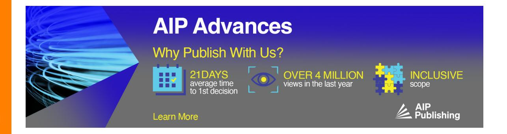
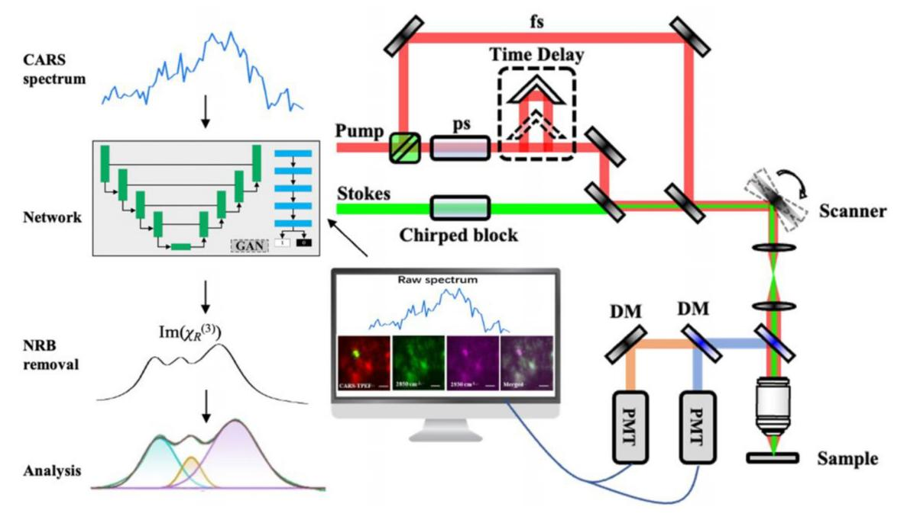
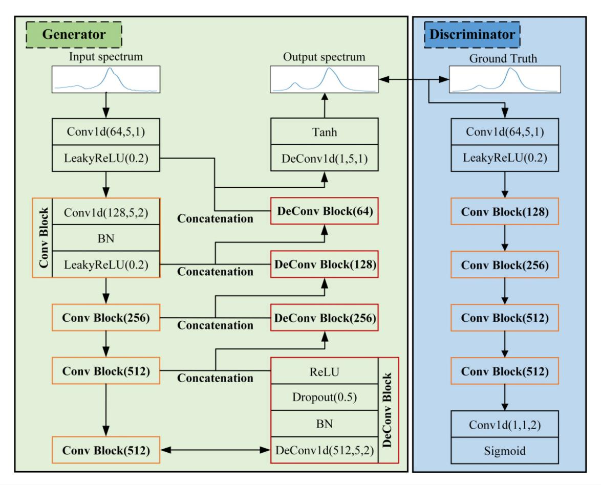
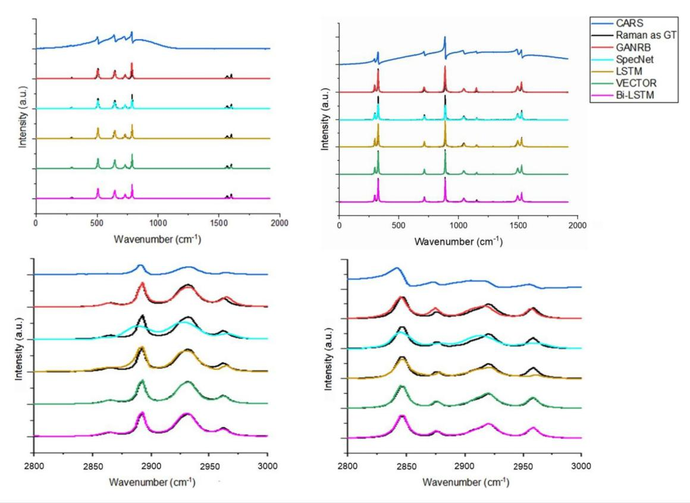
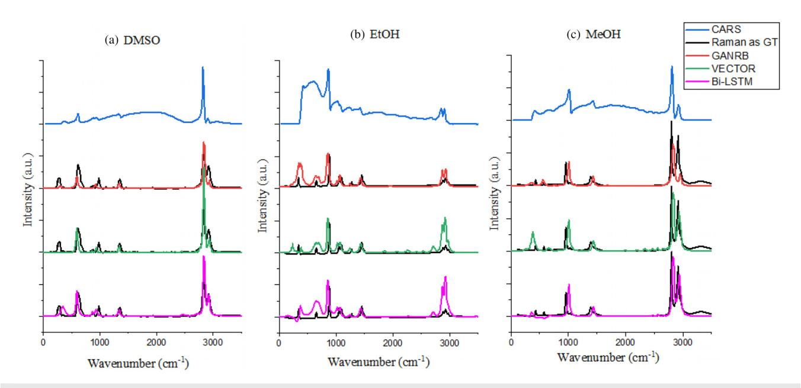
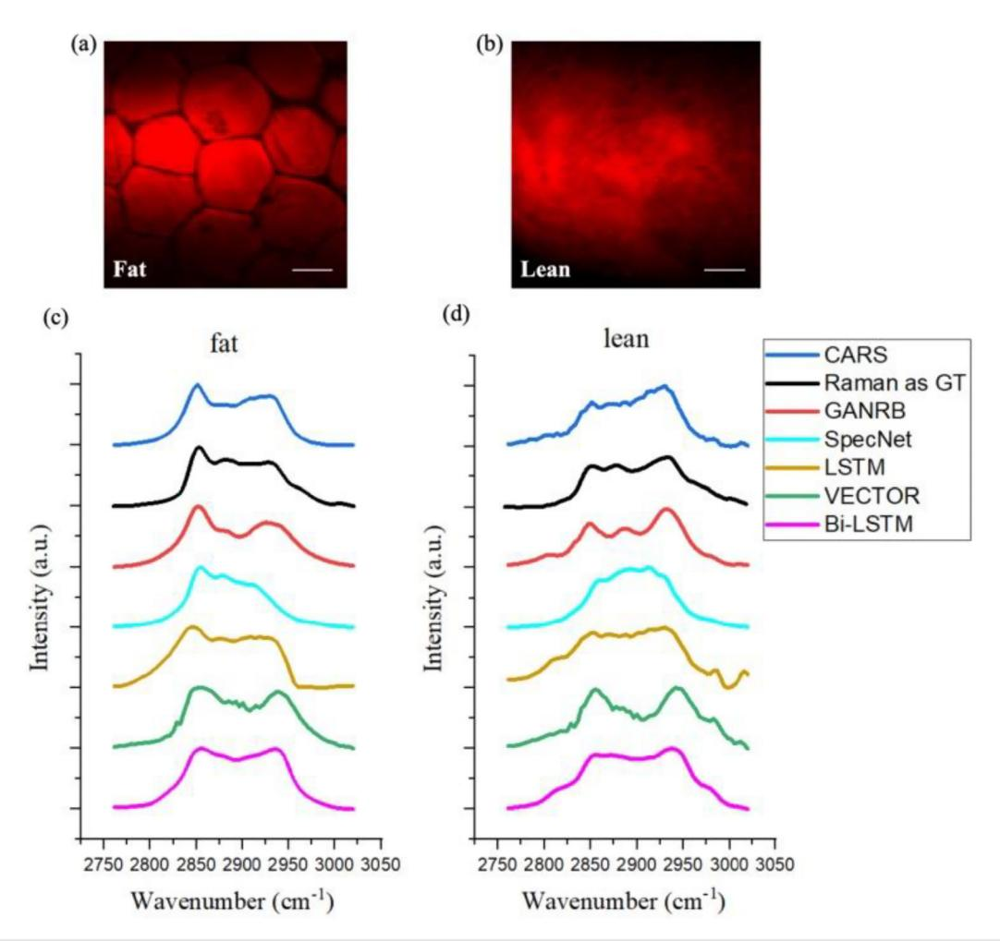
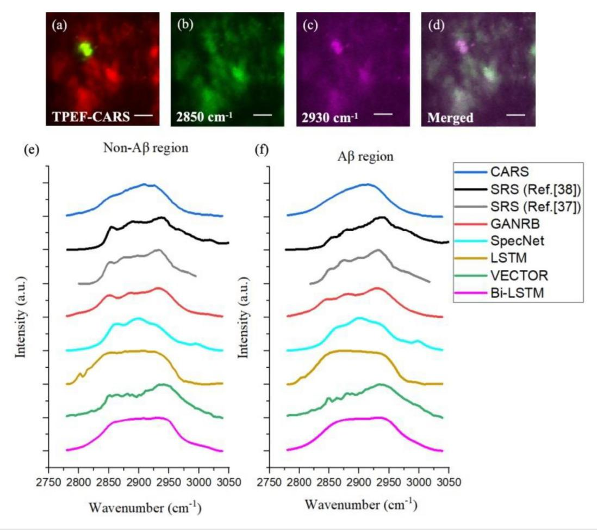

RESEARCH ARTICLE | JUNE 24 2024

# Removing non-resonant background of CARS signal with generative adversarial network

Ziyi Luo (1); Xiangcong Xu (1); Danying Lin (1); Junle Qu (1); Fangrui Lin ∞; Jia Li ∞

Appl. Phys. Lett. 124, 264101 (2024) https://doi.org/10.1063/5.0201616

## Articles You May Be Interested In

Infrared and visible image: Enhancement and fusion using adversarial network *AIP Conf. Proc.* (April 2024)

Brain tumour segmentation with a U-Net based GaN model using multi-modal MRI images

AIP Conf. Proc. (July 2024)

Improving short-term power load forecasting with a domain adversarial transfer network

AIP Advances (December 2025)

# Removing non-resonant background of CARS signal with generative adversarial network

Cite as: Appl. Phys. Lett. **124**, 264101 (2024); doi: 10.1063/5.0201616 Submitted: 25 February 2024 · Accepted: 10 June 2024 · Published Online: 24 June 2024 · Corrected: 14 October 2024

Ziyi Luo,1 (b) Xiangcong Xu,1 (b) Danying Lin,1 (b) Junle Qu,1,2 (b) Fangrui Lin,1,a) and Jia Li1,a) (b)

#### **AFFILIATIONS**

1State Key Laboratory of Radio Frequency Heterogeneous Integration, Key Laboratory of Optoelectronic Devices and Systems of Ministry of Education and Guangdong Province, College of Physics and Optoelectronic Engineering, Shenzhen University, Shenzhen 518060, China

#### **ABSTRACT**

Coherent anti-Stokes Raman scattering (CARS) microscopy requires the removal of non-resonant background (NRB) to ensure spectral accuracy and quality. This study introduces a deep-learning-based algorithm that leverages its enhanced capability for NRB removal and spectra retrieval. A generative adversarial network is trained using simulated noisy CARS data, enabling straightforward analysis of real CARS spectra obtained from pork belly and living mice brains. The results highlight the algorithm's ability to accurately extract vibrational information in the CH region. Importantly, this method eliminates the need for additional experimental measurements or extensive data preprocessing or postprocessing.

© 2024 Author(s). All article content, except where otherwise noted, is licensed under a Creative Commons Attribution (CC BY) license (https://creativecommons.org/licenses/by/4.0/). https://doi.org/10.1063/5.0201616

Coherent anti-Stokes Raman scattering (CARS) microscopy is considered a powerful nonlinear imaging modality in biomedical optics. It enables the simultaneous acquisition of CARS spectra and 2D label-free images in a noninvasive manner, leveraging the intrinsic vibrational frequencies of molecules in the samples. CARS spectra serve as unique "fingerprints" of substances, providing valuable chemical information. This capability allows for the measurement and analysis of changes in the metabolic activities of lipids, proteins, and other important biomolecules associated with specific diseases. Consequently, CARS microscopy has implications for pathological diagnosis, treatment, and prognosis. The simplications is pathological diagnosis, treatment, and prognosis.

However, CARS microscopy suffers from the presence of a non-resonant background (NRB) that can dominate the CARS spectrum in cases where the strong non-resonant signals generated by the sample and liquid environment overwhelms the weak resonant CARS signals generated by the sample, such as low sample concentration or dilute solution. This phenomenon leads to shifts in spectral peaks, distortions in spectral line shapes, and imprecise molecular information. Therefore, the development of effective algorithms for NRB removal is crucial to enhance spectral quality and improve the accuracy of obtained information.

A variety of methods have been developed over the past decades to eliminate NRB. Experimentally, resonant and non-resonant signals can be separated using techniques such as interferometric CARS, 9,10 frequency modulation, 11 and polarization control 12,13 for narrowband mode, as well as spectral phase control, 14 time-resolved CARS, 15 and Fourier transform CARS 16,17 for broadband mode. These approaches often come at the cost of increased experimental complexity and reduced CARS spectral intensities. Another category of methods involves numerical techniques such as the maximum entropy method (MEM) and the time-domain Kramers–Kronig transform (TDKK). MEM requires compromises between information contrast and noise when approximating the normalized spectrum. TDKK also necessitates prior knowledge about the sample, and computational speed compromises are inevitable.

Deep learning, on the other hand, exploits more complex ways of connecting layers and larger computing power to automatically extract features. With recent advances, deep learning has been applied to remove NRB without the need for external measurements or processing. Peche SpecNet is a pioneering deep learning model for extracting vibrational information from broadband CARS spectra. Two other works explore the effect of training data on the output spectra based on SpecNet's network architecture. Long short-term memory (LSTM) network serves as phase retrieval tool to extract Raman line shapes from CARS spectra. A variant of the LSTM architecture,

&lt;sup>2School of Medical Engineering and Technology, Xinjiang Medical University, Urumqi 830054, China

a) Authors to whom correspondence should be addressed: lfr1993@163.com and jli@szu.edu.cn

bidirectional long short-term memory (Bi-LSTM),24 is utilized to enhance learning of long-term dependencies and model accuracy. The very deep convolutional autoencoder (VECTOR)25 is the first investigation of deep generative models for NRB removal in CARS. Nevertheless, these deep learning-based methods have primarily been applied to solvents and have not been extensively tested on biological tissues or living samples under imaging conditions with more complex non-resonant background signals.

This work aims to develop an NRB removal algorithm suitable for CARS imaging, making two important contributions. The first contribution lies in improving the quality of the spectra by reducing the undesired non-resonant background. We demonstrate the algorithmic performance in terms of spectral shapes, peak numbers, peak positions, and intensities, using both simulated data and real CARS data from chemical solvents, pork belly, and living Alzheimer's disease (AD) mice brains. The second contribution is providing algorithmic insights into the application of generative adversarial networks (GANs) for accurately mapping measured CARS spectra with NRB to those without NRB. As a result, we term the proposed network GANRB. We have meticulously designed the network architecture and employed a smooth  $l_1$  loss function to enhance its robustness. This approach allows to produce reliable results on different types of test data using the same trained model.

Figure 1 illustrates the schematic diagram of our custom-built CARS imaging system.27 To enable simultaneous two-photon-excited fluorescence (TPEF) and CARS imaging, we utilize a femtosecond (fs) laser (Chameleon Discovery, Coherent Inc. Santa Clara, USA) with two outputs as the light source. The Stokes beam has a wavelength of 1040 nm and a pulse width of 140 fs, while the pump beam has a wavelength of 800 nm and a pulse width of 100 fs. This configuration not only matches the vibration of CH2 in lipids but also excites the two-

photon-excited fluorescence of the fluorescent dye methoxy-X04. To achieve high spectral resolution of CARS spectra, we chirp the 100 fs pump beam to 2 ps and the 140 fs Stokes beam to 1.8 ps by introducing a high dispersion glass rod. By changing the optical path difference of the two laser beams through a time delay device, we can obtain CARS spectra of different wavenumbers. The combined laser beam passes through the galvanometer scanning system and is focused onto the sample by an objective lens. The TPEF and CARS signals generated by the sample are collected by the same objective and separated by dichroic mirrors (DM) and bandpass filters. Finally, these signals are detected by two photomultiplier tubes (PMT). Both the pump light and the Stokes light are set to a power of 30 mW, with a beam splitting ratio of 5:5 between the picosecond light and the femtosecond light.

We acquire hyperspectral CARS images of  $512 \times 512$  pixels with a pixel residence time of 2  $\mu$ s. The measured spectra range from 2750 to  $3050~{\rm cm}^{-1}$  with a step size of  $3~{\rm cm}^{-1}$ , and the acquisition time at each step is close to 10 s for *in vivo* imaging. The imaging depth is approximately  $200~\mu$ m, and the field of view is  $410 \times 410~\mu$ m², achieved using a  $20 \times$  water immersion objective (Numerical aperture 1.00, Olympus). The spatial resolution of the system is approximately 470 nm, and the spectral resolution is  $18~{\rm cm}^{-1}$ . Our proposed GANRB method has no special requirement on the imaging system.

We design the network architecture based on the conditional generative adversarial network (cGAN) framework,28 as depicted in Fig. 2. The architecture consists of two parts: a generative model and a discriminative model. In the generative model, the CARS spectrum with NRB is input to retrieve the corresponding spectrum without NRB. This retrieved CARS spectrum, along with the ground truth (simulated spontaneous Raman spectrum without NRB), serves as the input to the discriminative model. The discriminative model compares these two spectra and estimates the probability of the generated CARS

FIG. 1. The schematic diagram of NRB removal and the optical setup of the CARS microscope.

FIG. 2. The network architecture of GANRB.

spectrum being the ground truth (GT). This training process continues until the discriminative model can no longer distinguish the generated CARS spectrum from the ground truth.

The generator in our work is inspired by U-Net29 where the encoder network extracts features from the input signal and consists of four convolutional blocks. The input signal is first passed through a convolutional layer with a kernel size of  $1\times 5$  and a stride of 1 to generate feature maps. Then, a leaky rectified linear unit activation function (LeakyReLU) with a slope of  $\alpha=0.2$  is applied for nonlinearity,30 given by

LeakyReLU
$$(x; \alpha) = \max(0, x) - \alpha \times \max(0, -x)$$
. (1)

Let  $d_{i,in}$  and  $d_{i,out}$  be the input and output of the *i*th Conv block, respectively. Their relationship can be expressed as

$$d_{i,out} = \text{LeakyReLU}(\text{BN}[\text{Conv1d}(d_{i,in})]),$$
  

$$i = 1, 2, 3, 4,$$
(2)

where Conv1d() represents the convolution operation with a filter size of  $5 \times 5$  and a stride of 2, followed by batch normalization (BN[]) to alleviate internal covariate shift and speed up training.31 The

LeakyReLU is then applied. The first parameter of each Conv1d() denotes the number of filters in the corresponding convolutional layer, which also represents the number of features in the representation block. The levels of the encoder and decoder are connected by a regular concatenation operation.

The decoder network upsamples the feature maps to predict the CARS signals without the non-resonant background. It consists of four deconvolutional blocks, within which the following operation is performed:

$$u_{i,out} = \text{ReLU}[\text{Dropout}(\text{BN}[\text{DeConv1d}(u_{i,in})])],$$
  

$$i = 1, 2, 3, 4,$$
(3)

in which  $u_{i,out}$  and  $u_{i,im}$  are the output and input of the *i*th DeConv block, respectively, and DeConv1d() represents the transposed convolution operation with a filter size of  $1 \times 5$  and a stride of 2. We also insert a dropout layer between batch normalization and the rectified linear unit  $(ReLU)^{32}$  to alleviate overfitting, with the dropout probability set as p=0.5. Mathematically,  $ReLU(\cdot)=max(\cdot,0)$ . The last convolutional layer maps the 64 channels into 1 channel that corresponds to the predicted CARS spectrum without NRB. Then tanh

activation function is adopted here, because our tests validate that tanh achieves better outcomes than the ReLU.

The discriminative model takes the generated CARS spectrum and the ground truth as input and aims to distinguish between them. It is a simple convolutional neural network (CNN) architecture that begins with a convolutional layer and a LeakyReLU. Four convolutional blocks follow, similar to the encoder network in the generator. After that, a convolutional layer with a filter size of  $1\times 1$  and a stride of 2 is performed to reshape the feature map, and a sigmoid activation is used to output the probability of the generated CARS spectrum being the ground truth.  $^{53}$ 

We design the loss function of the generator as a combination of smooth  $l_1$  loss and the binary cross-entropy (BCE). The former ensures prediction accuracy by penalizing the difference between the network's prediction G(X) and the ground-truth spectrum Y, and it is less sensitive to outliers than the  $l_2$  loss, 34 while the latter measures the probability of the classification. This leads to the following loss function:

$$\mathcal{L}_{G|D}(X, Y) = \eta \times \operatorname{Smooth} l_1(G(X), Y)$$

$$+ \operatorname{BCE}(D(G(X)) - D(Y), Y_{\text{label}}), \tag{4}$$

where  $\eta$  is the parameter for the trade-off between corresponding terms, and  $\eta = 100$  is selected empirically to achieve the best performance in our work. G() and D() are the generative model prediction

and the discriminative model output, respectively. X is the input CARS spectrum with non-resonant background.  $Y_{label}$  is often set as 1 in the process of training the generator. Specifically, we aim to minimize

$$\mathcal{L}_{G|D}(X,Y) = \eta \times \begin{cases} \frac{1}{n} \sum_{i=1}^{n} 0.5 \times (G(X_{i}) - Y_{i})^{2} & \text{if } |G(X_{i}) - Y_{i}| < 1, \\ \frac{1}{n} \sum_{i=1}^{n} |G(X_{i}) - Y_{i}| - 0.5 & \text{otherwise} \end{cases}$$

$$-\log(D(G(X)) - D(Y)), \tag{5}$$

where n is the length of the input spectral signal.

The loss function of the discriminative model calculates binary cross-entropy, i.e.,

$$\mathcal{L}_{D|G}(X,Y) = \frac{1}{2} \left\{ BCE(D(G(X)) - D(Y), Y_{label}) + BCE(D(Y) - D(G(X)), 1 - Y_{label}) \right\}, \tag{6}$$

where  $Y_{\text{label}}$  is set as 0 in the process of training the discriminator.

The network is trained solely on simulated data, and the training data pairs are divided into CARS spectra with NRB and corresponding spectra without NRB as ground truth. The code employed to generate the simulated CARS spectra with NRB is adapted from Refs. 20 and

**FIG. 3.** Comparison of input simulated spectra (blue curves) with the corresponding true  $Im(\chi_R^{(3)})$  (black curves) and predicted output by GANRB (red curves), SpecNet (cyan curves), LSTM (ochre curves), VECTOR (green curves), and Bi-LSTM (magenta curves).

TABLE I. Comparison of MAE with different models.

| Models | CARS              | GANRB             | SpecNet           | LSTM              | VECTOR            | Bi-LSTM           |
|--------|-------------------|-------------------|-------------------|-------------------|-------------------|-------------------|
| MAE    | $0.118 \pm 0.033$ | $0.020 \pm 0.010$ | $0.040 \pm 0.017$ | $0.024 \pm 0.010$ | $0.001 \pm 0.003$ | $0.010 \pm 0.001$ |

FIG. 4. Comparison of the retrieved spectra of (a) DMSO, (b) EtOH, and (c) MeOH from three different methods, with the measured CARS spectrum as input and spontaneous Raman spectrum as GT.

25, and we change some parameters such as the vibrational frequency  $\Omega_i$  and the linewidth  $\Gamma_i$  for the *i*th resonance component after a reasonable estimation of our experimental data to make the simulation more realistic. The minimum and the maximum of the total number of Lorentzian peaks presented in the spectrum are set according to the estimated number of peaks within the high-frequency CH stretch region.

We eventually prepare 60 000 spectra as the training set, and other 12 000 spectra are randomly selected as the validation data. Each spectrum is generated with 70 datapoints. The model is optimized using the adaptive moment estimation (Adam) optimizer35 with a starting learning rate of 0.0002, a decay rate for the first moment estimate  $\beta 1 = 0.5$ , a decay rate for the second moment estimate  $\beta 2 = 0.999$ . This framework is implemented with Pytorch36 framework version 1.9.0 and Python version 3.8.3 in the Microsoft Windows 10 operating system. The training and the inference are performed on a computer equipped with a NVIDIA GeForce RTX3080 graphics card and an AMD Ryzen 5 5600X CPU @3.7 GHz. It takes ∼8 h to train the network for 5000 epochs on batch size of 256, reaching the minimum validation loss value, which is sufficient for different spectra in our experiments. The training enables GANRB model to learn the ability of mapping such that it can directly infer spectra without NRB when applied to CARS spectra with NRB.

We validate the performance of the proposed algorithm using both simulated and real measured spectral data, including standard solvents, static pork belly, and living mice brains. In particular, we applied GANRB to reduce NRB in the CARS spectra of amyloid- $\beta$  (A $\beta$ ) plaques, thereby providing more accurate spectral information for AD research.

Figure 3 exhibits two simulated CARS spectra in the wavenumber range of 0–2000 cm $^{-1}$  and two simulated spectra in 2800–3000 cm $^{-1}$ , along with the corresponding imaginary components without NRB distortions and model predictions. The NRB contribution differs among the four examples in terms of spectral shape and peak position. We compared our results to SpecNet,  $^{20}$  LSTM,  $^{23}$  VECTOR,  $^{25}$  and Bi-LSTM,  $^{24}$  and the results demonstrate that our GANRB not only correctly recovers spectra with shape and peak positions being basically consistent with the ground truth, but also generalizes well to different background conditions and suppresses NRB.

To quantify the quality of the network output, we also calculate the mean absolute error (MAE) between the predicted spectra (12 000 spectra for our test datasets) and the corresponding ground truth, as summarized in Table I. Larger MAE values imply high spectral errors despite the fact that these five methods can correctly extract all vibrational spectral features. GANRB achieves moderate performance on simulated spectra with a smaller MAE compared to SpecNet and LSTM but larger than that of VECTOR and Bi-LSTM.

We begin with evaluating the performance of our proposed GANRB model using real data of chemical solvents. The CARS spectra of dimethyl sulfoxide (DMSO), ethyl alcohol (EtOH), and methanol

**FIG. 5.** CARS images acquired on pork belly and comparison of the retrieved spectra. (a) and (b) are, respectively, the CARS images of fat meat and lean meat at 2885 cm-1. (c) and (d) are, respectively, the retrieved spectra of fat meat and lean meat from five different methods, with the measured CARS spectrum as input and spontaneous Raman spectrum as GT. Scale bar, 50 μm.

(MeOH) are from Ref. 20. It can be observed from Fig. 4 that GANRB can remove NRB and identify all the vibration features throughout the spectra, although it is underperforming compared to VECTOR and Bi-LSTM. For deep-learning-based methods, they strike a balance between retrieving resonant signals and NRB removal. For example, these methods recover the spectral peaks in CH region at the expense of preserving more NRB in fingerprint regions for MeOH. By contrast, they suppress NRB for DMSO, resulting in weakened spectra intensity.

Next, we verify the practicability of the algorithm in NRB removal by using pork belly, which contains an appreciable amount of lipids and proteins. Figures 5(a) and 5(b), respectively, show the CARS images of fat meat and lean meat at the peak of 2885 cm-1. Figures 5(c) and 5(d) present the CARS spectra and the results of five different methods for fat meat and lean meat, respectively. We also measure the spontaneous Raman spectra as the ground truth for comparison.

Our proposed GANRB method resolves three peaks located at  $2850\,\mathrm{cm}^{-1}$  (CH2 symmetric stretching mode related to lipid),  $2885\,\mathrm{cm}^{-1}$  (CH2 asymmetric stretching mode), and  $2930\,\mathrm{cm}^{-1}$  (CH3 stretching of

total lipid and protein). In contrast, the spectra from other four methods cannot distinguish individual peaks for lean meat and show significantly lower spectral resolutions of CH peaks. This is in accordance with our expectations for GANRB to remove non-resonant signals and acquire more accurate spectral information. The inferior spectral shape recovered by VECTOR indicates that it is more appropriate to use the U-Net architecture as the generator to infer the spectra within our framework. Furthermore, we notice that the intensity of the CH peak at  $2850\,\mathrm{cm}^{-1}$ is larger than the one at 2930 cm-1 for the fat meat, while it is reversed for the lean meat in CARS spectra and the retrieved result with our method. This is in agreement with different compositions in the adipose region and the protein-rich region of the sample. However, other four methods are not able to accurately predict the spectral characteristics due to the disturbance of the unsuppressed NRB. The results in Fig. 5 confirm that GANRB outperforms the other models in removing NRB and retrieving spectra with high quality in pork belly.

To demonstrate the generalization of GANRB, We apply it to retrieve the spectra of  $A\beta$  plaques in the cerebral cortex of living AD

**FIG. 6.** TPEF image and CARS images acquired on living AD mice brains and comparison of the retrieved spectra. (a) is the CARS-TPEF image. (b) and (c) are, respectively, the CARS images taken at 2850 and 2930 cm $^{-1}$ . (d) is the merged image of (b) and (c). (e) and (f) are, respectively, the retrieved spectra of non-A $\beta$  region and A $\beta$  plaque from five different methods, with the measured CARS spectrum as input and SRS spectrum as ground truth. Scale bar, 50  $\mu$ m.

mice brains. *In vivo* imaging is performed on the transgenic APPSWE/PS1dE9 (APP/PS1) mice, which overexpresses human mutant amyloid precursor protein (APPV717F), one of the most common animal models of AD. The mice are intraperitoneally injected with methoxy-X04 (5 mg/kg), dissolved in a solution of 10% dimethyl sulfoxide (DMSO) and 90% phosphate-buffered saline (PBS), to facilitate the imaging of A $\beta$  plaques. A craniotomy procedure, as described in previous work,27 is performed on the living mice to enable imaging and spectra acquisition. Our custom-built TPEF/CARS system is used to image the cerebral cortex of the mice. TPEF microscopy is initially employed to locate the A $\beta$  plaques before acquiring CARS spectra [Fig. 6(a)]. Figures 6(b) and 6(c) present CARS images of the same region taken at 2850 and 2930 cm-1, respectively, clearly visualizing lipids, normal proteins, and A $\beta$  plaques. The A $\beta$  plaques are colocalized in the merged CARS image [Fig. 6(d)] and the TPEF image.

We collect data from 20 AD mice and generate average spectra for non-A $\beta$  and A $\beta$  regions in Figs. 6(e) and 6(f), respectively. In the original CARS spectra, the difference between non-A $\beta$  and A $\beta$  regions is not clearly discernible. SpecNet, LSTM, VECTOR, and Bi-LSTM

produce incorrect spectra due to their inability to reduce NRB and retrieve accurate spectral information. In contrast, our proposed method generates spectra that closely aligned with the results obtained from stimulated Raman scattering (SRS) microscopy in previous studies,37,38 thereby demonstrating its effectiveness in NRB removal. Importantly, the NRB-free spectral information enables more accurate quantitative analysis of normal tissues and A $\beta$  plaques, facilitating the assessment of molecular metabolic characteristics. This is beneficial for studying the pathological mechanisms of AD, as it has been suggested that oxidative stress in the brain during the development of AD induces changes in the chemical structure of lipids, such as cholesterol, which can regulate the generation of A $\beta$  plaques.39,40 These changes can be revealed by precise CARS spectral information. Additionally, this approach may aid in disease treatment by quantitatively monitoring lipids with CARS, since abnormal lipid accumulation affects metabolism and the deposition of A $\beta$  protein.41

It also should be noted that the retrieved spectra without NRB can be used to recover CARS image that is supposed to have higher contrast and better quality, since NRB is suppressed and resonant

signals are enhanced. However, it costs a lot of time for acquiring each pixel's spectrum and putting them back in place after removing NRB, especially for a large-size image. Accordingly, we aim to explore the application of this method to high-quality CARS image recovery in future research.

In this paper, we have demonstrated the application of GAN architecture for non-resonant background removal and spectra retrieval in CARS microscopy. The exceptional generalization capability of our proposed method is validated through its application to simulated data and various real CARS datasets, including chemical solvents, pork belly samples, and *in vivo* imaging of the cerebral cortex with A $\beta$  plaques in AD mice brains. We compared the results with those obtained using several other deep-learning-based methods, considering spectral shapes and vibrational peaks. The performance of our proposed method positions it as a prime candidate for CARS applications, particularly in accurate label-free *in vivo* imaging of subcellular structures. The related code is entirely available online.

This work was sponsored by the National Key Research and Development Program of China (No. 2022YFF0706001), the National Natural Science Foundation of China (Nos. 61835009, 62127819, and 62275165), the Natural Science Foundation of Guangdong Province (Nos. 2024A1515012082 and 2024A1515012567), the Shenzhen Key Laboratory of Photonics and Biophotonics (No. ZDSYS2021062 3092006020), and the Shenzhen Science and Technology Innovation Program (No. JCYJ20220818100202005).

#### **AUTHOR DECLARATIONS**

#### **Conflict of Interest**

The authors have no conflicts to disclose.

#### **Ethics Approval**

All experimental mice were obtained from the Guangdong Provincial Animal Experiment Center of China, and the experiments were conducted following universally accepted standard guidelines, which were further reviewed and approved by the Experimental Animal Ethics Committee of Shenzhen University.

### **Author Contributions**

Z. L. and X. X. contributed equally to this work.

Ziyi Luo: Investigation (lead); Writing – original draft (equal). Xiangcong Xu: Methodology (lead); Writing – original draft (supporting). Danying Lin: Conceptualization (equal); Writing – review & editing (supporting). Junle Qu: Supervision (lead). Fangrui Lin: Conceptualization (lead); Supervision (equal). Jia Li: Conceptualization (equal); Supervision (equal); Writing – review & editing (lead).

#### DATA AVAILABILITY

The data that support the findings of this study are available from the corresponding authors upon reasonable request.

#### **REFERENCES**

1C. L. Evans and X. S. Xie, "Coherent anti-Stoke Raman scattering microscopy: Chemical imaging for biology and medicine," Annu. Rev. Anal. Chem. 1, 883–909 (2008).

- 2F. Vernuccio, A. Bresci, B. Talone, A. De La Cadena, C. Ceconello, S. Mantero, C. Sobacchi, R. Vanna, G. Cerullo, and D. Polli, "Fingerprint multiplex CARS at high speed based on supercontinuum generation in bulk media and deep learning spectral denoising," Opt. Express 30(17), 30135–30148 (2022).
- 3K. C. Corn, M. A. Windham, and M. Rafat, "Lipids in the tumor microenvironment: From cancer progression to treatment," Prog. Lipid Res. **80**, 101055 (2020).
- 4E. C. B. Johnson, E. B. Dammer, D. M. Duong, L. Ping, M. Zhou, L. Yin, L. A. Higginbotham, A. Guajardo, B. White, J. C. Troncoso, M. Thambisetty, T. J. Montine, E. B. Lee, J. Q. Trojanowski, T. G. Beach, E. M. Reiman, V. Haroutunian, M. Wang, E. Schadt, B. Zhang, D. W. Dickson, N. Ertekin—Taner, T. E. Golde, V. A. Petyuk, P. L. De Jager, D. A. Bennett, T. S. Wingo, S. Rangaraju, I. Hajjar, J. M. Shulman, J. J. Lah, A. I. Levey, and N. T. Seyfried, "Large-scale proteomic analysis of Alzheimer's disease brain and cerebrospinal fluid reveals early changes in energy metabolism associated with microglia and astrocyte activation," Nat. Med. 26, 769–780 (2020).
- 5R. Mallick, S. Basak, and A. K. Duttaroy, "Fatty acids and evolving roles of their proteins in neurological, cardiovascular disorders and cancers," Prog. Lipid Res. 83, 101116 (2021).
- 6Y. Tan, J. Li, G. Zhao, K.-C. Huang, H. Cardenas, Y. Wang, D. Matei, and J.-X. Cheng, "Metabolic reprogramming from glycolysis to fatty acid uptake and beta-oxidation in platinum-resistant cancer cells," Nat. Commun. 13, 4554 (2022).
- 7C. Zhang, D. Zhang, and J.-X. Cheng, "Coherent Raman scattering microscopy in biology and medicine," Annu. Rev. Biomed. Eng. 17, 415–445 (2015).
- 8B. Li, K. Charan, K. Wang, T. Rojo, D. Sinefeld, and C. Xu, "Nonresonant background suppression for coherent anti-Stokes Raman scattering microscopy using a multi-wavelength time-lens source," Opt. Express 24(23), 26687–26695 (2016).
- 9E. O. Potma, C. L. Evans, and X. S. Xie, "Heterodyne coherent anti-Stokes Raman scattering (CARS) imaging," Opt. Lett. 31, 241 (2006).
- 10 Y. J. Lee and M. T. Cicerone, "Single-shot interferometric approach to background free broadband coherent anti-Stokes Raman scattering spectroscopy," Opt. Express 17(1), 123–135 (2009).
- 11F. Ganikhanov, C. L. Evans, B. G. Saar, and X. S. Xie, "High-sensitivity vibrational imaging with frequency modulation coherent anti-Stokes Raman scattering (FM CARS) microscopy," Opt. Lett. 31, 1872 (2006).
- ing (FM CARS) microscopy," Opt. Lett. 31, 1872 (2006).

  12 J.-X. Cheng, L. D. Book, and X. S. Xie, "Polarization coherent anti-Stokes Raman scattering microscopy," Opt. Lett. 26, 1341 (2001).
- 13F. Munhoz, S. Brustlein, D. Gachet, F. Billard, S. Brasselet, and H. Rigneault, "Raman depolarization ratio of liquids probed by linear polarization coherent anti-Stokes Raman spectroscopy," J. Raman Spectrosc. 40, 775–780 (2009).
- 14N. Dudovich, D. Oron, and Y. Silberberg, "Single-pulse coherently controlled nonlinear Raman spectroscopy and microscopy," Nature **418**, 512–514 (2002).
- 15 A. Volkmer, L. D. Book, and X. S. Xie, "Time-resolved coherent anti-Stokes Raman scattering microscopy: Imaging based on Raman free induction decay," Appl. Phys. Lett. 80, 1505 (2002).
- 16 J. P. Ogilvie, E. Beaurepaire, A. Alexandrou, and M. Joffre, "Fourier transform coherent anti-Stokes Raman scattering microscopy," Opt. Lett. 31, 480 (2006).
- 17S. Takizawa, K. Hiramatsu, and K. Goda, "Compressed time-domain coherent Raman spectroscopy with real-time random sampling," Vib. Spectrosc. 107, 103042 (2020).
- 18E. M. Vartiainen, H. A. Rinia, M. Muller, and M. Bonn, "Direct extraction of Raman line-shapes from congested CARS spectra," Opt. Express 14, 3622 (2006).
- 19 Y. Liu, Y. J. Lee, and M. T. Cicerone, "Broadband CARS spectral phase retrieval using a time-domain Kramers-Kronig transform," Opt. Lett. 34, 1363 (2009).
- 20C. M. Valensise, A. Giuseppi, F. Vernuccio, A. De la Cadena, G. Cerullo, and D. Polli, "Removing non-resonant background from CARS spectra via deep learning," APL Photonics 5, 061305 (2020).
- 21R. Junjuri, A. Saghi, L. Lensu, and E. M. Vartiainen, "Convolutional neural network-based retrieval of Raman signals from CARS spectra," Opt. Continuum 1(6), 1324–1339 (2022).
- 22R. Junjuri, A. Saghi, L. Lensu, and E. M. Vartiainen, "Effect of non-resonant background on the extraction of Raman signals from CARS spectra using deep neural networks," RSC Adv. 12, 28755 (2022).

- 23R. Houhou, P. Barman, M. Schmitt, T. Meyer, J. Popp, and T. Bocklitz, "Deep learning as phase retrieval tool for CARS spectra," [Opt. Express](https://doi.org/10.1364/OE.390413) 28(14), 21002–
- 21024 (2020). 24R. Junjuri, A. Saghi, L. Lensu, and E. M. Vartiainen, "Evaluating different deep learning models for efficient extraction of Raman signals from CARS spectra,"
- [Phys. Chem. Chem. Phys.](https://doi.org/10.1039/D3CP01618H) 25, 16340 (2023). 25Z. Wang, K. O'Dwyer, R. Muddiman, T. Ward, C. H. Camp, Jr., and B. M. Hennelly, "VECTOR: Very deep convolutional autoencoders for non-resonant background removal in broadband coherent anti-Stokes Raman scattering,"
- [J. Raman Spectrosc.](https://doi.org/10.1002/jrs.6335) 53, 1081–1093 (2022). 26R. Muddiman, K. O'Dwyer, C. H. Camp, Jr., and B. Hennely, "Removing nonresonant background from broadband CARS using a physics-informed neural
- network," [Anal. Methods](https://doi.org/10.1039/D3AY01131C) 15, 4032 (2023). 27Z. Luo, H. Xu, S. Samanta, R. Zhang, G. Luo, Y. Wang, L. Liu, X. Weng, J. He, C. Liao, Y. Wang, B. Guo, and J. Qu, "Long-term repeatable in vivo monitoring of Amyloid-b plaques and vessels in Alzheimer's disease mouse model with
- combined TPEF/CARS microscopy," [Biomedicines](https://doi.org/10.3390/biomedicines10112949) 10, 2949 (2022). 28I. J. Goodfellow, J. Pouget-Abadie, M. Mirza, B. Xu, D. Warde-Farley, S. Ozair, A. Courville, and Y. Bengio, "Generative adversarial networks," in Advances in Neural Information Processing Systems (NIPS) (MIT Press, 2014), pp. 2672–
- 2680. 29O. Ronneberger, P. Fischer, and T. Brox, "U-net: Convolutional networks for
- biomedical image segmentation," [arXiv:1505.04597](http://arxiv.org/abs/1505.04597) (2015). 30A. L. Maas, A. Y. Hannun, and A. Y. Ng, "Rectifier nonlinearities improve neural network acoustic model," in 30th International Conference on Machine
- Learning (ICML) (JMLR.org, 2013). 31S. Ioffe and C. Szegedy, "Batch normalization: Accelerating deep network training by reducing internal covariate shift," in Proceedings of the 32nd International Conference on Machine Learning (ICML), edited by F. Bach and
- D. Blei (JMLR.org, 2015), pp. 448–456. 32X. Glorot, A. Bordes, and Y. Bengio, "Deep sparse rectifier neural networks," in 14th International Conference on Artificial Intelligence and Statistics (AISTATS) (Society for Artificial Intelligence and Statistics, 2011), pp. 315–323.

- 33J. Patterson and A. Gibson, Deep Learning: A Practitioner's Approach (O'Reilly
- Media, 2017), Chap. I. 34R. Girshick, "Fast R-CNN," in 2015 IEEE International Conference on
- Computer Vision (ICCV) (IEEE, 2015), pp. 1440–1448. 35D. P. Kingma and J. Ba, "Adam: A method for stochastic optimization,"
- [arXiv:1412.6980](http://arxiv.org/abs/1412.6980) (2014). 36A. Paszke, S. Gross, S. Chintala, G. Chanan, E. Yang, Z. Devito, Z. Lin, A. Desmaison, L. Antiga, and A. Lerer, "Automatic differentiation in PyTorch," in 31st Conference on Neural Information Processing Systems (Curran Associates
- Inc., 2017). 37M. Ji, M. Arbel, L. Zhang, C. W. Freudiger, S. S. Hou, D. Lin, X. Yang, B. J. Bacskai, and X. S. Xie, "Label-free imaging of amyloid plaques in Alzheimer's disease with stimulated Raman scattering microscopy," [Sci. Adv.](https://doi.org/10.1126/sciadv.aat7715) 4, eaat7715
- (2018). 38R. Cunha, L. Lafeta, E. A. Fonseca, A. Barbosa, M. A. Romano-Silva, R. Vieira, A. Jorio, and L. M. Malard, "Nonlinear and vibrational microscopy for labelfree characterization of amyloid-b plaques in Alzheimer's disease model,"
- [Analyst](https://doi.org/10.1039/D1AN00074H) 146, 2945 (2021). 39M. W. Park, H. W. Cha, J. Kim, J. H. Kim, H. Yang, S. Yoon, N. Boonpraman, S. S. Yi, I. D. Yoo, and J.-S. Moon, "NOX4 promotes ferroptosis of astrocytes by oxidative stress-induced lipid peroxidatin via the impairment of mitochon-
- drial metabolism in Alzheimer's disease," [Redox Biol.](https://doi.org/10.1016/j.redox.2021.101947) 41, 101947 (2021). 40H. Wang, J. A. Kulas, C. Wang, D. M. Holtzman, H. A. Ferris, and S. B. Hansen, "Regulation of beta-amyloid production in neurons by astrocytederived cholesterol," [Proc. Natl. Acad. Sci. U. S. A.](https://doi.org/10.1073/pnas.2102191118) 118(33), e2102191118
- (2021). 41M. B. Victor, N. Leary, X. Luna, H. S. Meharena, A. N. Scannail, P. L. Bozzelli, G. Samaan, M. H. Murdock, D. von Maydell, A. H. Effenberger, O. Cerit, H.-L. Wen, L. Liu, G. Welch, M. Bonner, and L.-H. Tsai, "Lipid accumulation induced by APOE4 impairs microglial surveillance of neuronal-network activity," [Cell](https://doi.org/10.1016/j.stem.2022.07.005)
- [Stem Cell](https://doi.org/10.1016/j.stem.2022.07.005) 29(8), 1197–1212 (2022). 42See <https://github.com/Xu-onion/GANRB> for "The full code of the neural network model."