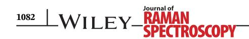
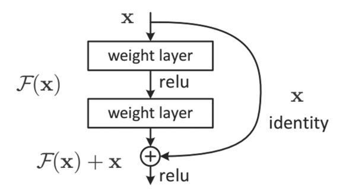
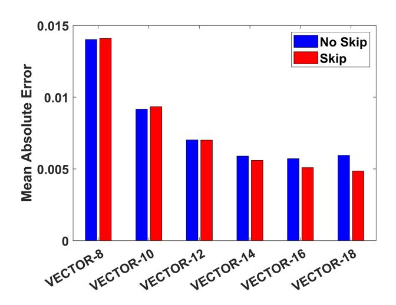
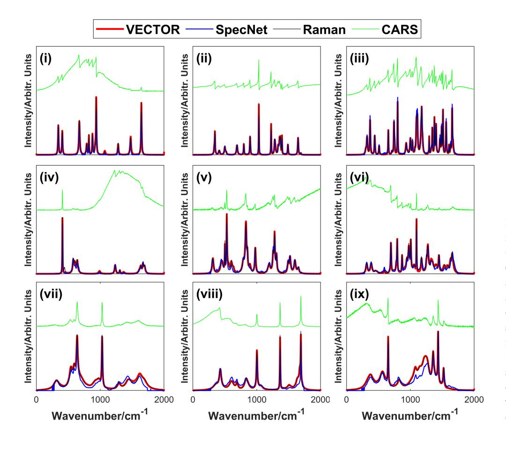
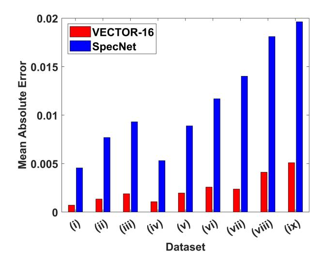
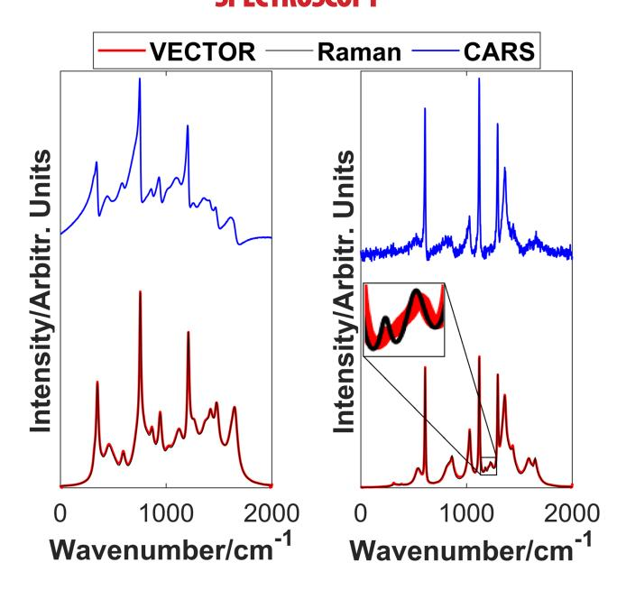
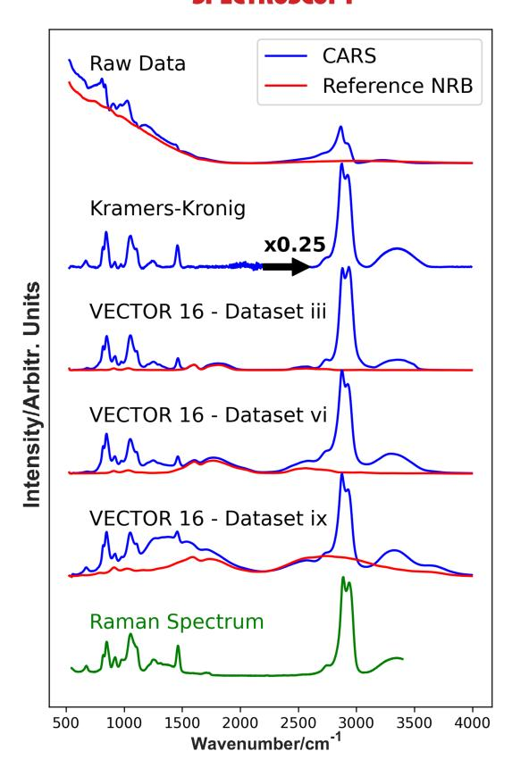

[DOI: 10.1002/jrs.6335](https://doi.org/10.1002/jrs.6335)

#### RESEARCH ARTICLE

# VECTOR: Very deep convolutional autoencoders for non-resonant background removal in broadband coherent anti-Stokes Raman scattering

Zhengwei Wang1 | Kevin O' Dwyer2 | Ryan Muddiman2 | Tomas Ward3 | Charles H. Camp Jr.4 | Bryan M. Hennelly2

#### Correspondence

Bryan Hennelly, Department of Electronic Engineering, Maynooth University, Kildare, Ireland.

Email: [bryan.hennelly@mu.ie](mailto:bryan.hennelly@mu.ie)

#### Abstract

Rapid label-free spectroscopy of biological and chemical specimen via molecular vibration through means of broadband coherent anti-Stokes Raman scattering (B-CARS) could serve as a basis for a robust diagnostic platform for a wide range of applications. A limiting factor of CARS is the presence of a nonresonant background (NRB) signal, endemic to the technique. This background is multiplicative with the chemically resonant signal, meaning the perturbation it generates cannot be accounted for simply. Although several numerical approaches exist to account for and remove the NRB, they generally require some estimate of the NRB in the form of a separate measurement. In this paper, we propose a deep neural network architecture called Very dEep Convolutional auTOencodeRs (VECTOR), which retrieves the analytical Raman-like spectrum from CARS spectra through training of simulated noisy CARS spectra, without the need for an NRB reference measurement. VECTOR is composed of an encoder and a decoder. The encoder aims to compress the input to a lower dimensional latent representation without losing critical information. The decoder learns to reconstruct the input from the compressed representation. We also introduce skip connection that bypass from the encoder to the decoder, which benefits the reconstruction performance for deeper networks. We conduct abundant experiments to compare our proposed VECTOR to previous approaches in the literature, including the widely applied Kramers–Kronig method, as well as two another recently proposed methods that also use neural networks.

Abbreviations: AE, autoencoder; CARS, coherent anti-Stokes Raman scattering; CNN, convolutional neural network; NRB, non-resonant background.

This is an open access article under the terms of the [Creative Commons Attribution-NonCommercial-NoDerivs](http://creativecommons.org/licenses/by-nc-nd/4.0/) License, which permits use and distribution in any medium, provided the original work is properly cited, the use is non-commercial and no modifications or adaptations are made. © 2022 The Authors. Journal of Raman Spectroscopy published by John Wiley & Sons Ltd.

1 School of Computer Science and Statistics, Trinity College Dublin, Dublin, Ireland

2 Department of Electronic Engineering, Maynooth University, Kildare, Ireland

3 Insight Centre for Data Analytics, School of Computing, Dublin City University, Dublin, Ireland

4 Biosystems and Biomaterials Division, National Institute of Standards and Technology, Gaithersburg, Maryland, USA

#### KEYWORDS

coherent anti-Stokes Raman scattering (CARS), coherent Raman spectroscopy, convolutional autoencoders, deep neural networks

#### 1 | INTRODUCTION

Coherent Raman scattering (CRS) microscopies and spectroscopies have long sought to acquire the same chemical-rich information as traditional spontaneous Raman methods but orders of magnitude faster. Such a transformative technology would enable a significant expansion of application, such as live-cell and large-area imaging. Broadly speaking, the two dominant CRS modalities based on either stimulated Raman scattering (SRS) or coherent anti-Stokes Raman scattering (CARS) have either surpassed traditional Raman spectroscopy/ imaging in speed or matched its spectroscopic bandwidth and sensitivity, but not both simultaneously. In this work, we focus on broadband CARS (B-CARS), a method capable of probing over 4000 cm-1 bandwidth. Like all CARS-based methods, though, the signal is affected by a co-generated coherent background signal, the so-called non-resonant background (NRB). A limiting factor of CARS is that the third-order susceptibility term, from which it derives the frequency domain response, has a resonant and non-resonant component, with respect to the Raman-active transition frequencies  $\chi^{(3)} = \chi_R + \chi_{NR}$ . The intensity of the CARS spectrum is quadratically proportional to the susceptibility term:

$$I_{CARS} \propto |\chi_R^2| + |\chi_{NR}^2| + 2\chi_{NR}Re[\chi_R]. \tag{1}$$

Though much maligned, the NRB is a stable homodyne amplifier thus partially responsible for the signal strength of CARS methods, [1] which can also be used as an internal reference.[2] The side effect, though, is a significant perturbation of the recorded spectral shapes. If the NRB could be independently measured, it could be removed with analytical methods, [3] though this is not currently possible; thus, surrogate materials have traditionally been utilized that contain weak or no vibrational peaks within swaths of the spectroscopic window. Though recent work has mitigated some of the ramifications, [2] removing the necessity of any NRB estimate while still extracting undistorted Raman features would be superior. In this work, we present a new deep learning method, Very dEep Convolutional auTOencodeR (VECTOR), based upon an autoencoder (AE) topology with the addition of skip connections that provides similar results to analytical methods with NRB

estimates and superior results over an alternative neural network approach.

Many NRB removal techniques exist, both as experimental techniques[4–7] and as post-processing approaches. [2,3,8,9] The majority of approaches seek to suppress or eliminate the non-resonant contribution, so that the observed spectrum obtains the form of a Ramanlike spectrum. Experimental approaches have the benefit of directly collecting a purely resonant signal at the sample level, but suffer from weak signal, added experimental complexity and analysis or reduced throughput owing to requiring multiple measurements per area of interest. Post-processing approaches use physics or information theoretic approaches to mathematically extract the imaginary component of the CARS susceptibility  $\chi_R$ , as it takes the form of a Raman-like spectrum. These approaches, however, necessitate an independent measurement of the NRB, which is not currently possible; thus, reference materials such as water, glass slide, or salt[10] is used, which contain weak or isolated vibrational signatures over certain regions of the Raman spectrum. Deep neural networks (DNNs) have achieved striking results in different areas such as natural language processing[11] and computer vision.[12] Recently, deep learning approaches have been employed to tackle the issue of NRB removal.[13,14] Houhou et al[13] used a long short-term memory (LSTM) topology while Valensise et al[14] implemented a convolutional neural network (CNN), termed "SpecNet," for NRB removal in CARS. These developments represent a significant step forward in rapid extraction of Raman-like spectra from B-CARS measurements. A CNN is comprised of convolutional layers (for which the neurons are connected to some subset to its neighbors), which are followed by fully connected layers and have been shown to be particularly useful in identifying patterns within images with spatial invariance. It has been pointed out that this property of spatial invariance is of interest in the context of processing spectra for which peak location can vary. CNNs can generate feature maps, which can be described as different representations of the signal, the complexity of which can increase with the number of layers used in the CNN. An LSTM is a subclass of recurrent neural network (RNN), where the network is trained by looping through sequences of data as functions of time. CNNs employ filters within convolutional layers to transform data, although LSTMs/ RNNs are predictive in nature, reusing activation

functions from other data points in the sequence in order to generate the next output in a series. Convolutional AEs (CAEs) use CNNs to form each of an encoder and decoder pair, which encodes the input signal into a lower dimensional latent space and then decodes it to back to its original value. For the first time, we investigate the use of CAEs, which belong to the deep generative models (DGMs) family, for removing the NRB from CARS. A DGM is a powerful model of learning any kind of data distribution, and it has achieved tremendous success in the past few years in the form of AEs,[[15](#page-11-0)] variational AEs (VAEs),[\[16\]](#page-11-0) and generative adversarial networks (GANs).[[17,18](#page-11-0)] Regarding our case, we seek to solve the problem by finding a "mapping" between a noisy CARS spectrum and the underlying Raman spectrum. On the basis of the previous successful deployment of using AE for denoising images[\[19\]](#page-11-0) and speech signals,[\[20\]](#page-11-0) we explore the use of AE for extraction of the Raman-like signal from CARS in this work.

The contributions in this paper are summarized as follows: First, we propose a VECTOR architecture specifically designed for removing the NRB in CARS. Extensive experiments were performed to identify the optimal hyperparameters of VECTOR. We also demonstrate that skip connections are not only able to boost performance for deeper networks but also to speed up the training process. Second, training was performed for nine different datasets with increasing complexity in terms of the number of peaks and the range of peak width. These datasets have different spectral shapes that emulate different applications of Raman spectroscopy, with the most complex dataset representative of biochemical spectra, and the simplest representative of pure chemical spectra. We demonstrate for the first time that the performance of deep learning based NRB removal correlates with spectral complexity. Third, we demonstrate significantly superior performance of VECTOR when compared with a simpler architecture that was recently proposed for NRB removal for all of the datasets tested. Lastly, VECTOR is applied to an experimental B-CARS spectrum of glycerol, and the results are compared with the Kramers–Kronig (KK) method. These results highlight a shortcoming of the trained VECTOR networks in dealing with a realworld NRB profile, which is not ideally smooth, as for the cases of the NRB profiles used in training. This in turn points to new research directions for training future networks, which are discussed in Section [6.](#page-9-0)

The breakdown of the paper is as follows: Section 2 briefly reviews B-CARS in terms of the experimental optical recording system, as well as the current state-of-the art in numerical NRB removal. In Section [3,](#page-3-0) the VECTOR architecture is considered in detail, including the skip connections. Section [4](#page-5-0) details how simulated data were generated to train the networks and present an ablation study and cross-validation to find the optimal hyperparameters. In Section [5](#page-7-0), the results are provided. This includes a quantitative comparison with another CNN over the aforementioned datasets and experimental results on a glycerol B-CARS spectrum. Finally, in Section [6](#page-9-0), we offer a conclusion with an emphasis on the direction of future work.

# 2 | BROADBAND COHERENT ANTI-STOKES RAMAN SPECTROSCOPY

# 2.1 | Theory and system design

CARS is a third-order nonlinear optical process in which a "pump" and a "Stokes" photon coherently excite a molecular vibration at their beat frequency from which a "probe" photon is able to inelastically scatter, gaining energy (blue shifting) equal to the vibrational frequency—the anti-Stokes photon—as depicted in Figure 1a. Many of the earliest CARS microscopy systems were narrowband[\[21](#page-11-0)] ( 1 ps to 10 ps pulse duration), able to probe single vibrational modes at high-speed, but 10974555, 2022, 6, Downloaded from https://analyticalsciencejournals.onlinelibrary.wiley.com/doi/10.1002/jrs.6335, Wiley Online Library on [12/02/2026]. See the Terms and Conditions (https://onlinelibrary.wiley.com/terms-and-conditions) on Wiley Online Library for rules of use; OA articles are governed by the applicable Creative Commons License

FIGURE 1 (a) CARS energy-level diagram (ωp, pump frequency; ωs, Stokes frequency; ωpr, probe frequency; ωas, anti-Stokes frequency), (b) Diagram of the setup of the broadband coherent anti-Stokes Raman scattering (B-CARS) microspectrometer [Colour figure can be viewed at [wileyonlinelibrary.](http://wileyonlinelibrary.com) [com](http://wileyonlinelibrary.com)]

1202026. See the Terms and Conditions, villey, converses and Conditions (https://onlinelibary.wiley.con/terms-and-conditions) on Wiley Online Library for rules of use; OA articles are governed by the applicable Creative Commons License

capturing hyperspectral imagery required slow, often unstable laser tuning. To capture single-shot spectra, one approach termed broadband or multiplex CARS uses a broadband Stokes source to stimulate multiple vibrations simultaneously with the now broadband anti-Stokes signal captured on a spectrometer.[22,23] Due to practical limitations in the intensity of laser light that can be applied to [biological] samples and detector technology, B-CARS methods collect images relatively slowly but spectra extremely quickly. It should be noted that in most implementations of CARS methods, the probe source and the pump source are the same (and narrowband) sometimes specified as "interpulse" excitation or "twocolor" CARS. It is also possible to have a degenerate pump and Stokes source, "intrapulse," "impulsive," or "three-color" CARS.[24]

Figure 1b presents a simplified schematic of a basic B-CARS system. Here, the Stokes source (supercontinuum) is necessarily broadband, the probe source is necessarily narrowband (i.e., it is a determining factor in the spectroscopic resolution), and the pump source is purposely left ambiguous. The broadband pulsed source and the narrowband probe are combined using a dichroic and focused on the sample. Though there is a spatial phasematching condition for CARS excitation, the use of high numerical aperture (NA) objective lenses effectively presents a plethora of permutations of photon vectors, thus enabling collinear excitation. The generated anti-Stokes light is collected with another objective lens and separated from the remaining excitation beam by low-pass dichroic filters and recorded with a spectrometer. It should be highlighted that "epi-detected" systems with a reflective geometry have also been developed as have systems with beam-scanning capabilities, though sample raster scanning is the most prevalent setup.

#### 2.2 | State of the-art for NRB removal

There are two established methods for removing the NRB from a CARS spectrum: the KK method and the maximum entropy method (MEM). The KK method utilizes a Hilbert transform to recover the susceptibility phase from the CARS spectrum and a reference NRB. [3] The MEM is an information theoretic approach that attempts to maximize the spectral entropy of the susceptibility, given the measured constraints of the CARS spectrum. [25] These post-processing methods used to remove the NRB contribution from CARS signals take a reference NRB signal and the resonant CARS signal as inputs. As  $\chi_{NR}$  cannot be readily extracted from a CARS spectrum, a CARS signal from a sample with no active Raman transitions in the region of interest is obtained. Glass or water are

commonly used for this purpose, as they can be easily measured alongside the sample of interest. However, these NRB spectra are not perfect analogies for the non-resonant component of the sample CARS signal as they do contain some Raman vibrational features. This discrepancy is the major cause of error in the KK and MEM methods. The KK method is briefly reviewed in the following subsection. The KK method was chosen as the current best practice for analytical NRB removal because it requires less parameter optimization in the computation compared with the MEM. The KK method is also known to be more computationally efficient than the MEM approach, which will be pertinent for high-speed applications of B-CARS.

The KK relations generally relate the real and imaginary parts of any complex quantity that describes a causal (analytic) system. Under certain conditions, the KK relations may be extended to relate the intensity modulus and phase. [27,28] It has been shown that the KK relation could be applied to CARS, [3] enabling the retrieval of the spectral phase of the susceptibility ( $\phi$ ) from the CARS intensity:

$$\varphi(\omega) = -\frac{P}{\pi} \int_{-\infty}^{+\infty} \frac{\ln|\chi^{(3)}(\omega')|}{\omega' - \omega} d\omega', \tag{2}$$

where *P* is the Cauchy principale value.

In this work, we have implement the method from Camp et al[2] and apply wavelet denoising and a baseline correction using asymmetrically reweighted penalized least squares (arPLS) smoothing[29] on the phase prior to obtaining the complex quantity through Equation (3).

$$\chi^{(3)} = \sqrt{I_{\text{CARS}}} \exp[i\varphi(\omega)]. \tag{3}$$

#### 3 | VERY DEEP CAES

The AE learns how to efficiently encode the input and learns how to reconstruct the input back from the reduced representation. Its ability to reduce data dimensions by learning how to ignore the noise in the data by design has precipitated extensive study in the area of speech signals[20] and computer vision.[15,19] A typical AE normally comprises three main components (see Figure 2): (1) The encoder, in which the model learns how to reduce the input dimensions and compress input data into an encoded representation; (2) a latent space or bottleneck, which is the layer that contains the compressed representation of the input data. This is the

FIGURE 2 The example of Very dEep Convolutional auTOencodeR (VECTOR)-8 architecture used in this study. Convolutional layers in the encoder and transposed convolutional layers in the decoder are symmetric; that is, the input dimension to the convolutional layer and the output dimension to the paired transposed convolutional layer are the same [Colour figure can be viewed at [wileyonlinelibrary.com\]](http://wileyonlinelibrary.com)

lowest possible dimension among the AE; (3) the decoder, in which the model learns how to reconstruct the input data from the encoded representation. The ordinary AE incorporates all fully connected layers for both encoder and decoder.[\[30\]](#page-11-0) However, training a fully connected DNNs suffers from long computation times, overfitting, and being difficult to optimize[\[31\]](#page-11-0) especially for high-dimensional input data. CNNs[\[32\]](#page-11-0) were proposed to mitigate the problems above by introducing sparse connections among neurons.

### 3.1 | Architecture

The proposed VECTOR consists of an encoder and a decoder as seen in Figure 2. The structure of the encoder and the decoder is symmetric. This design will enable conducting a symmetric skip connection[\[12,19,20](#page-11-0)] between each paired convolutional layer and transposed convolutional layer in the encoder and the decoder, respectively. We will introduce the benefits of employing skip connections in Section 3.2. Here, we present notations used in this section: N is the batch size, K is the size of the 1D convolutional kernel, C is number of channels, S is the stride number, T is the input or feature length, and XℝNT is the input.

The encoder and the decoder are fully convolutional (1D) and fully transposed convolutional (1D), respectively. Batch normalization[\[33,34\]](#page-11-0) and ReLU[\[35](#page-11-0)] are added to each convolutional layer and transposed convolutional layer except for the last layer in the decoder. The encoder acts as a feature extractor that preserves primary information and properties of the input CARS spectra. To this end, the input is compressed to the latent representation (as seen in the middle of the architecture in Figure 2). This compression process could have two benefits: (1) The latent representation holds as much critical information as input contains but in a much lower dimension; (2) the compressed representation removes noise and nonessential information contained in the input. The decoder is then combined to recover details of input contents subject to the corresponding set of "clean" Raman spectra. We use the mean absolute error (MAE), also known as the L1 norm, between CARS spectra and clean spectra as the loss (see Equation 4) to train the VECTOR network in an end-to-end manner.

$$L_1 = \frac{1}{N} \sum_{i=1}^{N} |f(\mathbf{X}_i; \theta) - \mathbf{Y}_i|, \tag{4}$$

where X is CARS input spectra, Y is Raman output spectra, f is the network, and θ represents all of the network parameters, which have been optimized by the training process with no a priori knowledge.

Moreover, skip connections are also added from each convolutional layer to its corresponding paired transposed convolutional layer. The convolutional feature maps are passed to, and summed to, the transposed convolutional feature maps in an element-wise manner because those two feature maps have the exact same dimension. Details of VECTOR-8 are provided in Table [1](#page-5-0), and the details of the other VECTOR architectures are provided in the Supplementary Information S1.

# 3.2 | Skip connections

Skip connections have been widely applied in the area of computer vision. The most well-known CNN architecture with skip connection is ResNet.[\[12\]](#page-11-0) Figure [3](#page-5-0) shows an example of skip connection.

The output of a residual block can be easily formulated as y :¼ FðxÞ þx. He et al[[12\]](#page-11-0) showed that skip

| Stage        |         | Operation $(K, C_{in}, C_{out}, S)$ | Output size $(T \times C)$ |
|--------------|---------|-------------------------------------|----------------------------|
| Input        |         | _                                   | $1000\times 1$             |
| Encoder      | Layer 1 | 8, 1, 64, 1                         | 993 × 64                   |
|              | Layer 2 | 8, 64, 128, 2                       | $493\times128$             |
|              | Layer 3 | 8, 128, 256, 2                      | $243 \times 256$           |
|              | Layer 4 | 8, 256, 512, 2                      | $118 \times 512$           |
| Latent space |         | _                                   | $118\times512$             |
| Decoder      | Layer 1 | 8, 512, 256, 2                      | $243 \times 256$           |
|              | Layer 2 | 8, 256, 128, 2                      | $493\times128$             |
|              | Layer 3 | 8, 128, 64, 2                       | 993 × 64                   |
|              | Layer 4 | 8, 64, 1, 1                         | $1000 \times 1$            |
| Output layer |         | Sigmoid                             | $1000\times 1$             |

TABLE 1 The architecture of VECTOR-8

Note: The operation refers to 1D convolution and 1D transposed convolution for encoder and decoder respectively, where K is the kernel size,  $C_{in}$  represents number of input channels,  $C_{out}$  represents number of output channels, and S refers to the stride. The output size refers to the dimension of feature maps produced by each stage, where T is the length and C is the number of channels. Rest of VECTOR models can be referred to Appendix S1.

Abbreviation: VECTOR, Very dEep Convolutional auTOencodeR.

FIGURE 3 Skip connection in residual block12

connections are easier to optimize compared to those "plain" networks without skip connections, in which skip connections mitigate the vanishing gradient descent to bottom layers[36] and skip connections are able to boost performances for the networks with greatly increased depth. The vanishing gradient is a well-known problem in training neural networks. Gradients are used to update the network weights and are in the range (0, 1]. Backpropagation computes gradients by the chain rule, which has the effect of multiplying *n* of these small numbers to compute gradients of the early layers in an *n*-layer network, meaning that the gradient (error signal) decreases exponentially with n while the early layers train slowly. Skip connections offer a solution to this problem by connecting the early layers to the later layers, which enables gradients to pass to early layers directly, instead of passing n layers.

Apart from the vanishing gradient problem, the growing depth of the AE architecture could also lead to the critical input information being lost such that they

cannot be recovered via the encoding/decoding process. Skip connections also enable the recovery of such information. We design the VECTOR network in a symmetric manner; that is, the convolutional layer in the encoder and the transposed convolutional layer in the decoder are paired with each other. This design allows connections bypassing from one convolutional layer to the paired transposed convolutional layer. An additional benefit of the symmetrical skip connection is that padding can be avoided. Figure 2 shows an example of skip connection for VECTOR-8. In this work, the number of skip connections is equal the the number of layers in the encoder/ decoder. To address benefits of using skip connection, we will show that skip connections are able to (1) speed-up the training and (2) boost the performance for the deeper networks compared with the "plain" networks in Section 4.3.

#### 4 | TRAINING

#### 4.1 | Datasets for training

VECTOR was trained by a dataset of simulated CARS spectra. The efficacy of the algorithm was tested by training it with a number of different datasets of varying complexity. The datasets were varied based on the number of Raman peaks per spectrum, and the variation in full-width half-maximum (FWHM) of the peaks themselves. This is principally of interest owing to the different kinds of Raman spectra found in different applications. Chemical and pharmaceutical specimens have sharper peaks

qualitatively observed as distinct peaks,[[37,38](#page-11-0)] in comparison with biological samples, for example, cellular spectra, which have broader peaks and appear as more complex amalgam of broad to narrow peaks.[[39,40](#page-11-0)]

The code used to generate the simulated datasets was adapted from Valensise et al,[\[14\]](#page-11-0) which we detail below. Further details are also given in Supplementary Information S2. The CARS spectra were generated as per Equation [\(1](#page-1-0)). The resonant susceptibility is expressed as a sum of Lorentzian functions, as per its physical basis; see Equation (5). For each Lorentz function, the peak amplitude A is uniform random value between 0 and 1, with its resonant peak at Ω between 300 and 1700 cm1 with FWHM 2Γ. Nine datasets were generated of varying ranges of peaks widths and number of peaks per spectrum, designated (i–ix). The spectra are generated as 1000 datapoints across 2000 cm1 . FWHM varies from low (2–10 cm1 ) in (i–iii), to moderate (2–25 cm1 ) in (iv–vi), to high (2–75 cm1 ) in (vii–ix). The datasets are further split into three sections by number of spectra. Each spectrum generated in datasets (i, iv and vii) have between 1 and 15 peaks. Similarly, (ii, v and viii) contain between 15 and 30 peaks per spectrum, and (iii, vi and ix) have between 30 and 50 peaks.The non-resonant susceptibility is typically expressed as an arbitrary, slowly varying function. In this case, it is expressed as the product of two randomized, countervailing sigmoid functions, per Equation (6). In Equation (6), c1 and c3 control the steepness of the rising falling rates of the sigmoid functions; c2 and c2 determine the position of the inflection points of the sigmoids.

$$\chi_{R}(\omega) = \sum_{N_{peaks}} \frac{A}{\Omega - \omega - i\Gamma},\tag{5}$$

$$\chi_{NR}(\omega) = \frac{e^{-c_3(\omega - c_4)}}{(1 + e^{-c_1(\omega - c_2)})(1 + e^{-c_3(\omega - c_4)})}.$$
 (6)

A training set of 200 000 spectra and an evaluation set of 30 000 spectra was generated for each dataset. Alongside the CARS spectrum, a corresponding Raman spectrum is created to function as an ideal reference to train the network.

### 4.2 | Implementation details

Experiments were conducted on nine synthetic datasets using the formulation presented in Section [4.1](#page-5-0). When comparing to previous studies,[[14](#page-11-0)] we select VECTOR-16 by default as an acceptable trade-off between computation time and performance; more details on this selection are given in Section 4.3. The models were trained on one TITAN Xp GPU. We adopted stochastic gradient descent (SGD) as an optimizer with a momentum of 0.9 and a weight decay of 5104. The batch size was set to 256 for the training. The initial learning rate was 0.1 and was reduced by a factor of 10 at 25, 50 and 75 epochs. Training was stopped at 100 epochs. The code is based on the Pytorch library and is freely available.[[41](#page-11-0)]

# 4.3 | Model dimensionality

Figure 4 compares the performance of six architectures of VECTOR with different numbers of layers including (red) and excluding (blue) skip connections. The MAE between the synthetic Raman spectrum and the recovered Raman spectrum from the corresponding CARS spectrum in the validation datasets was used as the performance metric for this study. It should be noted that architectures without skip connections achieve comparable performance for lower sets of layers, that is, VECTOR-8, VECTOR-10 and VECTOR-12. Starting from VECTOR-14, performance of architectures without skip connection saturates, which indicates that the critical information contained in the bottom layers gets lost and does not pass to the transposed convolutional layers successfully. For VECTOR-18, the performance is even worse than VECTOR-14 and VECTOR-16, which indicates the vanishing gradient problem may arise for the bottom layers leading to the bottom layer weights receiving very small gradient and has not been fully optimized.

Increasing number of layers of the VECTOR will increase computation times leading to slower training 10974555, 2022, 6, Downloaded from https://analyticalsciencejournals.onlinelibrary.wiley.com/doi/10.1002/jrs.6335, Wiley Online Library on [12/02/2026]. See the Terms and Conditions (https://onlinelibrary.wiley.com/terms-and-conditions) on Wiley Online Library for rules of use; OA articles are governed by the applicable Creative Commons License

FIGURE 4 Mean absolute error (MAE) performance of Very dEep Convolutional auTOencodeR (VECTOR) for different encoder-decoder depths,applied to the most complex dataset (dataset ix) [Colour figure can be viewed at [wileyonlinelibrary.com\]](http://wileyonlinelibrary.com)

10974555, 2022, 6, Downloaded from https://analyticalsciencejournals.onlinelibrary.wiley.com/doi/10.1002/jrs.6335, Wiley Online Library on [12/02/2026]. See the Terms and Conditions (https://onlinelibrary.wiley.com/terms-and-conditions) on Wiley Online Library for rules of use; OA articles are governed by the applicable Creative Commons License

but only provide very limited performance enhancement. As such, VECTOR-16 was determined to be optimal for our purposes. Shown in Figure 5 is the training loss for VECTOR-16 and VECTOR-18 with and without skip connections. It can seen that skip connections are able to accelerate the training process especially for the first 25 epochs. This is most pronounced in VECTOR-18 where the skip connection architecture produces consistently better performance throughout all training epochs.

FIGURE 5 Training loss for Very dEep Convolutional auTOencodeR (VECTOR)-16 and VECTOR-18 with and without skip connections [Colour figure can be viewed at [wileyonlinelibrary.com](http://wileyonlinelibrary.com)]

# 5 | RESULTS

# 5.1 | Performance on simulated datasets

We trained and performed validation on nine different networks, where each network was trained/validated using the nine different training/validation datasets described in Section [4.1](#page-5-0). These nine networks were then tested using nine test datasets of size 4096 spectra. The test dataset used for each network matched the parameters of the training/validation datasets for that given network in terms of peak number and width. The SpecNet network[[14\]](#page-11-0) was trained/validated using the same nine datasets as described in Section S3 and were then subject to the identical test datasets. Visualizations of spectra recovered by VECTOR-16 and the SpecNet network are shown in Figure 6. Figure [7](#page-8-0) illustrates the average MAE (as defined in Equation [4\)](#page-4-0) for both networks on each dataset. It can be noticed that the VECTOR network significantly outperforms SpecNet for all nine datasets.

FIGURE 6 Example of recovered spectra for Very dEep Convolutional auTOencodeR (VECTOR)-16 (red) and SpecNet architecture (blue) for each algorithm trained and evaluated on datasets (i–ix). True Raman spectrum is overlaid (black) and input coherent anti-Stokes Raman scattering (CARS) spectrum (green) is plotted with offset [Colour figure can be viewed at [wileyonlinelibrary.](http://wileyonlinelibrary.com) [com](http://wileyonlinelibrary.com)]

FIGURE 7 Average mean absolute error (MAE) from each of the datasets [Colour figure can be viewed at [wileyonlinelibrary.](http://wileyonlinelibrary.com) [com\]](http://wileyonlinelibrary.com)

For both networks, MAE increases proportionally with number of peaks. Datasets (i, iv and vii) have between 1 and 15 peaks, datasets (ii, v and viii) have between 15 and 30, and datasets (iii, vi and ix) have between 30 and 50 peaks per spectrum (these correspond to left, center and right columns in Figure [6](#page-7-0)). Similarly, an increase in the ranges of peak widths produces an increase in MAE. Datasets (i–iii) contain narrow peak widths between 2 and 10 cm1 , widening to between 2 and 25 cm1 for datasets (iv–vi), with the widest range of 2–75 cm1 in the case of datasets (vii–ix) (corresponding to top, middle and bottom rows in Figure [6\)](#page-7-0). MAE increases most sharply for the most complex datasets containing the broadest range of peaks. The relative change in MAE is broadly consistent across datasets for both networks. VECTOR is seen to outperform SpecNet for all datasets.

Both Figures [6](#page-7-0) and 7 clearly demonstrate that the VECTOR-16 network is able to recover spectra with high quality for the case of all nine datasets. For datasets (i–iii), both SpecNet and our three individual networks perform well in recovering peak position and shape. However, close inspection of the peak values reveals that VECTOR is more successful at recovering peak height and also at removing noise in the baseline. For the case of datasets (vii–ix) SpecNet returns erroneous values at the ends of the spectrum.

We also highlight the capability of the VECTOR network to reduce the effect of noise in the CARS intensity. Figure 8 shows the result of applying VECTOR-16 (trained on dataset ix) for two test cases also corresponding to dataset ix. In the first case, on the left side of the figure, we see the result of processing a high

FIGURE 8 An example of high and low signal noise ratio (SNR) broadband coherent anti-Stokes Raman scattering (B-CARS) spectra processed by Very dEep Convolutional auTOencodeR (VECTOR)-16 trained on dataset ix. Although the network effectively removes the noise in the retrieved Raman spectrum, the insert on the right figure highlights that spectral features under the noise floor may be lost [Colour figure can be viewed at [wileyonlinelibrary.com\]](http://wileyonlinelibrary.com)

10974555, 2022, 6, Downloaded from https://analyticalsciencejournals.onlinelibrary.wiley.com/doi/10.1002/jrs.6335, Wiley Online Library on [12/02/2026]. See the Terms and Conditions (https://onlinelibrary.wiley.com/terms-and-conditions) on Wiley Online Library for rules of use; OA articles are governed by the applicable Creative Commons License

SNR CARS spectrum, with high-quality output as expected. In the second case on the right a lower SNR signal is processed. In this case, the random noise fluctuations are clearly seen in the input CARS spectrum. The recovered Raman spectrum is high quality and contains no such noisy signal. However, the insert in the figure highlights that small spectral features, with similar amplitude to the noise signal have been lost. These results show that the VECTOR network is robust to handle low SNR inputs, with the caveat that spectral features matching the noise floor may be lost. However, dealing with very low SNR signals would require further training with datasets of similar quality. A more detailed discussion of prediction accuracy in the presence of noise is provided in Section S4.

### 5.2 | Performance on experimental data

A B-CARS spectrum of glycerol was recorded using an Er-Fibre system as described in Section [2.1](#page-2-0). Neat glycerol was applied into a 120-μ m-thick imaging spacer sandwiched between a microscope slide and coverslip glass. A spectrum of a glass coverslip was also recorded, as an NRB reference spectrum. The spectrum was processed independently by VECTOR-16, trained on datasets (iii),

FIGURE 9 Recovery of experimental coherent anti-Stokes Raman scattering (CARS) spectrum. The top spectrum shows the CARS spectrum recorded from glycerol, and a corresponding nonresonant background (NRB) reference spectrum of glass. The successive spectra shown are the recovered Raman-like spectra from the KK method, followed by Very dEep Convolutional auTOencodeR (VECTOR)-16 trained on different dataset configurations, all shown in blue. The NRB spectra were also processed for the case of VECTOR-16 and is shown in red [Colour figure can be viewed at [wileyonlinelibrary.com](http://wileyonlinelibrary.com)]

(vi) and (ix). The recovered spectrum is shown in Figure 9. Although VECTOR-16 shows robust performance for simulated datasets, performance with real spectra is found to be sensitive to the training data used for the network.

The form of the NRB seen in an Er-Fibre CARS system is not simply modeled as a slowly varying polynomial such as the countervailing sigmoids used here, as is more appropriate for a conventional two-color B-CARS platform. The combination of two-color and three-color excitation domains produces a complex NRB signal that is highly subject to the laser properties, such as spectral envelope and phase delay. This is particularly difficult for an NRB agnostic system such as VECTOR, in comparison with KK or MEM, which incorporate an NRB reference in their process. As a result, the high degree of variation in the NRB intensity means the peak heights of the C–H band in glycerol are not as intense as would be expected, as achieved by KK. As a result, components of the NRB profile are interpreted by the network as resonant features, and attempts to construct peaks, as can be seen most acutely in datasets (vi) and (ix), which are trained on broader sets of peak widths.

However, VECTOR does not produce many of the artifacts of the KK method common to low intensity regions, typically the Raman silent region, where quotients of small values produce noisy results. VECTOR also seeks to smooth the extracted Raman-like output. For comparison, a Raman spectrum of glycerol was also recorded and is shown in green in Figure 9. This spectrum was recorded using a coomercial Raman microspectrometer (Horiba Jobin Yvon LabRAM HR, grating 300 lines/mm, excitation 532 nm). The spectrum was wavenumber calibrated using 4-Acetamidophenol (Sigma) and intensity calibrated using a NIST calibrated White-Light source (Ocean-Optics) as described in Hutsebaut et al.[\[42\]](#page-11-0) Interestingly, the spectrum recovered from the various VECTOR architectures appears to be more consistent regarding the relative intensity of the peaks in the higher wavenumbers.

## 6 | CONCLUSION

In this paper, we have proposed a general architecture called VECTOR specifically designed for removing the NRB from CARS spectra. The VECTOR network is symmetric and consists of an encoder and decoder. Each convolutional layer and transposed convolutional layer are paired to each other. More importantly, the VECTOR network contains the skip connection from one convolutional layer and the paired transposed convolutional layer. We design abundant experiments to demonstrate the skip connection is able to help on recovering clean spectra and tackles the optimization difficulty caused by vanishing gradient for deeper networks. The proposed VECTOR network outperforms the previous works on recovering the clean spectra and is also robust to low SNR input spectra.

Compared with the traditional AE, we adopt two critical designs in the VECTOR: (1) Replace fully connected layers by convolutional layers; (2) skip connections are bypassed from a convolutional layer to a paired transposed convolutional layer. We design ablation studies to demonstrate that skip connections are able to improve the reconstruct performance and speed up the training. The key difference between VECTOR and CNNs is that VECTOR is symmetric. It contains a symmetric encoder– decoder architecture to reconstruct spectra in a "squeezeand-unsqueeze" manner. This symmetric design enables the skip connection between paired convolutional layer and transposed convolutional layer. In Figure [4,](#page-6-0) we have shown that deeper VECTOR has better reconstruction performance. However, we only investigate the impact of the network depth scaling in this study. Other expansion for networks such as width scaling, resolution scaling, and compound scaling[\[43](#page-12-0)] can be further investigated beyond the VECTOR network for CARS-related research.

We have shown the superior performance of our VECTOR compared to the previous CNNs approach[\[14\]](#page-11-0) for all nine datasets. We trained our network on different configurations of simulated spectra, which demonstrated the importance of training the network for the specific types of spectra that it is intended to be used on. Although the network created by Valensise et al[\[14\]](#page-11-0) performed well on the simulated datasets that were similar or simpler to their training set (i–iv), its qualitative and quantitative performance suffered from more complex datasets, as seen in Figures [6](#page-7-0) and [7.](#page-8-0)

Although VECTOR performs well when processing synthetic spectra that is used to train it, further work is required for use with real-world experimental data. The use of experimental spectra would be cumbersome for training due to the large volume of data required to train the network, and therefore, improvements must be made to the training set to better emulate the spectra recorded from the CARS platform. Furthermore, it is not strictly possible to obtain a ground truth Raman spectrum for a given recorded CARS spectrum. Any algorithm used to retrieve a CARS spectrum would be an approximation, which would compound errors to the retrieval network. Constraining and tailoring the peak shapes, heights, and frequencies to emulate those observed in the fingerprint and C–H stretching regions of the spectrum are a natural next step. This would be achieved by a wider range of peak amplitudes, SNR ranges, and generating taller, sharper peaks in the C–H range with smaller, denser, wider peaks in the fingerprint region. At present, the double sigmoid function used to model the slowly varying frequency response of the NRB is not sufficient to model a three-color CARS system. In order to train VECTOR on data that better emulate the types of experimental data seen in Figure [9](#page-9-0), rather than use an arbitrary function, it may be advantageous to model the excitation profile of the specific laser system to create the two- and three-color NRB domains. This can be achieved by accurately modeling the laser sources in the frequency domain and applying the appropriate convolutional and cross-correlation operators to model the three-color and two-color interactions. In this configuration, the excitation profile would describe the NRB shape, assuming the non-resonant susceptibility contribution is non-zero across the frequency domain, as is physically appropriate.

An important point of discussion is the relationship between the proposed architecture (VECTOR) and U-Net,[[44](#page-12-0)] which is a CNN developed for 2D image segmentation, and which has become the gold-standard in this area. VECTOR and U-Net are both specific types of the more general AE architecture[\[45,46\]](#page-12-0) for which the encoder learns an efficient representation of unlabelled data in the form of key features, which can then be used by the decoder to reconstruct the data in the absence of unwanted data such as noise. Both VECTOR and U-Net use an "hourglass architecture," and both use skip connections. The skip in VECTOR is different from that used in U-Net. Our skip is similar to the ResNet skip connection[\[12\]](#page-11-0) in which the original input data is also added to the output of the convolution block, although U-Net concatenates feature maps through the channel dimension. The skip connection in VECTOR can be described as (a + b), compared with U-Net's [a, b]. Another distinguishing feature is that U-Net uses max pooling, while

VECTOR uses striding convolution. In this paper, we have successfully demonstrated the application of the AE architecture as an effective method to remove the NRB contribution to a CARS spectrum. Further, we have demonstrated the use of skip connections to boost the performance of deeper networks. This work sets the baseline for AE research in this application area and any future research can incrementally build on this work. Examples of future work could include an investigation of U-Net (it should be noted that our VECTOR architecture is easily adapted to U-Net), attention mechanism,[[47](#page-12-0)] transformer,[[47\]](#page-12-0) etc., all of which belong to the AE family.

#### ACKNOWLEDGEMENTS

It should be noted that the first two authors listed on this article contributed equally to the work presented. We acknowledge the support of Science Foundation Ireland under Grant Numbers 15/CDA/3667, 19/FFP/7025, and 16/RI/3399. We wish to thank Swarnavo Sarkar, Michael Majurski, Nancy Lin, Sheng Lin-Gibson, and Donald Atha of the National Institute of Standards and Technology for their helpful discussions and insights towards the preparation of this manuscript. Open access funding provided by IReL. Correction added on May 19, 2022, after first online publication: IReL funding statement has been added.

### DISCLAIMER

Certain commercial equipment, instruments, or materials are identified in this paper in order to specify the experimental procedure adequately. Such identification is not intended to imply recommendation or endorsement by the National Institute of Standards and Technology, nor is it intended to imply that the materials or equipment identified are necessarily the best available for the purpose.

#### DATA AVAILABILITY STATEMENT

The data that support the findings of this study are openly available in GitHub at [https://github.com/](https://github.com/villawang/VECTOR-CARS) [villawang/VECTOR-CARS](https://github.com/villawang/VECTOR-CARS).

### ORCID

Kevin O' Dwyer <https://orcid.org/0000-0001-7405-9679> Ryan Muddiman [https://orcid.org/0000-0001-9369-](https://orcid.org/0000-0001-9369-749X) [749X](https://orcid.org/0000-0001-9369-749X)

Bryan M. Hennelly [https://orcid.org/0000-0003-1326-](https://orcid.org/0000-0003-1326-9642) [9642](https://orcid.org/0000-0003-1326-9642)

#### REFERENCES

- [1] M. Müller, A. Zumbusch, ChemPhysChem 2007, 8(15), 2156. <https://doi.org/10.1002/cphc.200700202>
- [2] C. H. Camp, Y. J. Lee, M. T. Cicerone, J. Raman Spectrosc: JRS 2016, 47(4), 408. <https://doi.org/10.1002/jrs.4824>
- [3] Y. Liu, Y. J. Lee, M. T. Cicerone, Opt. Lett. 2009, 34(9), 1363. <https://doi.org/10.1364/OL.34.001363>
- [4] J.-X. Cheng, L. D. Book, X. S. Xie, Opt. Lett. 2001, 26(17), 1341. <https://doi.org/10.1364/OL.26.001341>
- [5] B. Littleton, T. Kavanagh, F. Festy, D. Richards, Phys. Rev. Lett. 2013, 111(10), 103902. [https://doi.org/10.1103/PhysRevLett.](https://doi.org/10.1103/PhysRevLett.111.103902) [111.103902](https://doi.org/10.1103/PhysRevLett.111.103902)
- [6] E. O. Potma, C. L. Evans, X. S. Xie, Opt. Lett. 2006, 31(2), 241. <https://doi.org/10.1364/OL.31.000241>
- [7] A. Volkmer, L. D. Book, X. S. Xie, Appl. Phys. Lett. 2002, 80(9), 1505. <https://doi.org/10.1063/1.1456262>
- [8] M. Okuno, H. Kano, P. Leproux, V. Couderc, J. P. R. Day, M. Bonn, H. Hamaguchi, Angew. Chem. Int. Ed. 2010, 49(38), 6773. <https://doi.org/10.1002/anie.201001560>
- [9] E. M. Vartiainen, H. A. Rinia, M. Müller, M. Bonn, Opt. Express 2006, 14(8), 3622. [https://doi.org/10.1364/OE.14.](https://doi.org/10.1364/OE.14.003622) [003622](https://doi.org/10.1364/OE.14.003622)
- [10] A. Karuna, F. Masia, P. Borri, W. Langbein, J. Raman Spectrosc. 2016, 47(9), 1167. <https://doi.org/10.1002/jrs.4876>
- [11] J. Devlin, M.-W. Chang, K. Lee, K. Toutanova, Bert: Pretraining of deep bidirectional transformers for language understanding, arXiv preprint arXiv:1810.04805, 2018.
- [12] K. He, X. Zhang, S. Ren, J. Sun, in 2016 IEEE Conference on Computer Vision and Pattern Recognition (CVPR), IEEE Computer Society, Los Alamitos, CA, USA 2016, 770–778.
- [13] R. Houhou, P. Barman, M. Schmitt, T. Meyer, J. Popp, T. Bocklitz, Optics Express 2020, 28(14), 21002. [https://doi.org/10.](https://doi.org/10.1364/OE.390413) [1364/OE.390413](https://doi.org/10.1364/OE.390413)
- [14] C. M. Valensise, A. Giuseppi, F. Vernuccio, A. De la Cadena, G. Cerullo, D. Polli, APL Photon. 2020, 5(6), 61305. [https://doi.](https://doi.org/10.1063/5.0007821) [org/10.1063/5.0007821](https://doi.org/10.1063/5.0007821)
- [15] P. Vincent, H. Larochelle, I. Lajoie, Y. Bengio, P.-A. Manzagol, L. Bottou, J. Mach. Learn. Res. 2010, 11(12), 3371.
- [16] D. P. Kingma, M. Welling, Auto-encoding variational bayes, arXiv preprint arXiv:1312.6114, 2013.
- [17] I. J. Goodfellow, J. Pouget-Abadie, M. Mirza, B. Xu, D. Warde-Farley, S. Ozair, A. Courville, Y. Bengio, Generative adversarial networks, arXiv preprint arXiv:1406.2661, 2014.
- [18] Z. Wang, Q. She, T. E. Ward, Generative adversarial networks in computer vision: A survey and taxonomy, arXiv preprint arXiv:1906.01529, 2019.

- [19] X.-J. Mao, C. Shen, Y.-B. Yang, Image restoration using convolutional auto-encoders with symmetric skip connections, arXiv preprint arXiv:1606.08921, 2016.
- [20] S. R. Park, J. Lee, A fully convolutional neural network for speech enhancement, arXiv preprint arXiv:1609.07132, 2016.
- [21] A. Volkmer, J.-X. Cheng, X. X. Sunney, Phys. Rev. Lett. 2001, 87(2), 23901. <https://doi.org/10.1103/PhysRevLett.87.023901>
- [22] W. Min, C. W. Freudiger, S. Lu, X. S. Xie, Annu. Rev. Phys. Chem. 2011, 62, 507. [https://doi.org/10.1146/annurev.](https://doi.org/10.1146/annurev.physchem.012809.103512) [physchem.012809.103512](https://doi.org/10.1146/annurev.physchem.012809.103512)
- [23] D. Polli, V. Kumar, C. M. Valensise, M. Marangoni, G. Cerullo, Laser Photonics Rev. 2018, 12(9), 1800020. [https://doi.](https://doi.org/10.1002/lpor.201800020) [org/10.1002/lpor.201800020](https://doi.org/10.1002/lpor.201800020)
- [24] C. H. Camp Jr, Y. J. Lee, J. M. Heddleston, C. M. Hartshorn, A. R. Walker, J. N. Rich, J. D. Lathia, M. T. Cicerone, Nat. Photonics 2014, 8(8), 627. [https://doi.org/10.1038/nphoton.](https://doi.org/10.1038/nphoton.2014.145) [2014.145](https://doi.org/10.1038/nphoton.2014.145)
- [25] P.-K. Yang, J. Y. Huang, J. Opt. Soc. Am. B 1997, 14(10), 2443. <https://doi.org/10.1364/josab.14.002443>
- [26] M. T. Cicerone, K. A. Aamer, Y. J. Lee, E. Vartiainen, J. Raman Spectrosc. 2012, 43(5), 637. [https://doi.org/10.1002/](https://doi.org/10.1002/jrs.3169) [jrs.3169](https://doi.org/10.1002/jrs.3169)
- [27] D. Y. Smith, J. Opt. Soc. Am. 1977, 67(4), 570. [https://doi.org/](https://doi.org/10.1364/josa.67.000570) [10.1364/josa.67.000570](https://doi.org/10.1364/josa.67.000570)
- [28] J. S. Toll, Phys. Rev. 1956, 104(6), 1760. [https://doi.org/10.](https://doi.org/10.1103/PhysRev.104.1760) [1103/PhysRev.104.1760](https://doi.org/10.1103/PhysRev.104.1760)
- [29] S.-J. Baek, A. Park, Y.-J. Ahn, J. Choo, Analyst 2015, 140(1), 250. <https://doi.org/10.1039/c4an01061b>
- [30] J. Schmidhuber, Neural Netw. 2015, 61, 85.
- [31] I. Goodfellow, Y. Bengio, A. Courville, Y. Bengio, Deep Learning. MIT Press Cambridge 2016, 1.
- [32] Y. LeCun, Y. Bengio, Handb. Brain Theory Neural Netw. 1995, 3361(10), 1995.
- [33] S. Ioffe, C. Szegedy, in Proceedings of the 32nd International Conference on Machine Learning, vol. 37, (Eds: F. Bach, D. Blei), Proceedings of Machine Learning Research, PMLR, Lille, France 2015, 448–456.
- [34] S. Santurkar, D. Tsipras, A. Ilyas, A. Madry, How does batch normalization help optimization? arXiv preprint arXiv: 1805.11604, 2018.
- [35] V. Nair, G. E. Hinton, in Proceedings of the 27th International Conference on International Conference on Machine Learning, ICML'10, Omnipress, Madison, WI, USA 2010, 807–814.
- [36] S. Hochreiter, Int. J. Uncertain Fuzziness Knowl.-Based Syst. 1998, 6(02), 107.
- [37] R. S. Das, Y. K. Agrawal, Vib. Spectrosc. 2011, 57(2), 163. <https://doi.org/10.1016/j.vibspec.2011.08.003>
- [38] T. Vankeirsbilck, A. Vercauteren, W. Baeyens, G. Van der Weken, F. Verpoort, G. Vergote, J. P. Remon, TrAC Trends Anal. Chem. 2002, 21(12), 869. [https://doi.org/10.1016/S0165-](https://doi.org/10.1016/S0165-9936(02)01208-6) [9936\(02\)01208-6](https://doi.org/10.1016/S0165-9936(02)01208-6)
- [39] C. Krafft, I. W. Schie, T. Meyer, M. Schmitt, J. Popp, Chem. Soc. Rev. 2016, 45(7), 1819. [https://doi.org/10.1039/](https://doi.org/10.1039/C5CS00564G) [C5CS00564G](https://doi.org/10.1039/C5CS00564G)
- [40] Z. Movasaghi, S. Rehman, I. U. Rehman, Appl. Spectrosc. Rev. 2007, 42(5), 493. <https://doi.org/10.1080/05704920701551530>
- [41] Z. Wang, VECTOR-CARS, [https://github.com/villawang/](https://github.com/villawang/VECTOR-CARS) [VECTOR-CARS,](https://github.com/villawang/VECTOR-CARS) 2021.
- [42] D. Hutsebaut, P. Vandenabeele, L. Moens, Analyst 2005, 130(8), 1204.

- [43] M. Tan, Q. Le, in Proceedings of the 36th International Conference on Machine Learning, vol. 97, (Eds: K. Chaudhuri, R. Salakhutdinov), Proceedings of Machine Learning Research, PMLR 2019, 6105–6114.
- [44] O. Ronneberger, P. Fischer, T. Brox, in Medical Image Computing and Computer-assisted Intervention – MICCAI 2015, (Eds: N. Navab, J. Hornegger, W. M. Wells, A. F. Frangi), Springer International Publishing, Cham 2015, 234–241.
- [45] L. Deng, A tutorial survey of architectures, algorithms, and applications for deep learning, in APSIPA Transactions on Signal and Information Processing, 2014, 3.
- [46] A. Shrestha, A. Mahmood, IEEE Access 2019, 7, 53040.
- [47] A. Vaswani, N. Shazeer, N. Parmar, J. Uszkoreit, L. Jones, A. N. Gomez, L. Kaiser, I. Polosukhin, in Advances in Neural Information Processing Systems, vol. 30, (Eds: I. Guyon, U. V. Luxburg, S. Bengio, H. Wallach, R. Fergus, S. Vishwanathan, R. Garnett), Curran Associates, Inc. 2017.
- [48] T. J. Harvey, C. Hughes, A. D. Ward, E. C. Faria, A. Henderson, N. W. Clarke, M. D. Brown, R. D. Snook, P. Gardner, J. Biophotonics 2009, 2(1-2), 47.

- [49] S. J. Barton, T. E. Ward, B. M. Hennelly, Anal. Methods. 2018, 10(30), 3759.
- [50] S. J. Barton, B. M. Hennelly, In J Popp, VV Tuchin, FS Pavone (eds.), in Biophotonics: Photonic Solutions for Better Health Care VI. 2018, 698–708.

#### SUPPORTING INFORMATION

Additional supporting information may be found in the online version of the article at the publisher's website.

How to cite this article: Z. Wang, K. O' Dwyer, R. Muddiman, T. Ward, C. H. Camp Jr., B. M. Hennelly, J Raman Spectrosc 2022, 53(6), 1081. <https://doi.org/10.1002/jrs.6335>