# Deep learning as phase retrieval tool for CARS spectra

ROLA HOUHOU,1,2 PARIJAT BARMAN,2 MICHEAL SCHMITT,1 TOBIAS MEYER,1,2 JUERGEN POPP,1,2 AND THOMAS BOCKLITZ1,2,\*

**Abstract:** Finding efficient and reliable methods for the extraction of the phase in optical measurements is challenging and has been widely investigated. Although sophisticated optical settings, e.g. holography, measure directly the phase, the use of algorithmic methods has gained attention due to its efficiency, fast calculation and easy setup requirements. We investigated three phase retrieval methods: the maximum entropy technique (MEM), the Kramers-Kronig relation (KK), and for the first time deep learning using the Long Short-Term Memory network (LSTM). LSTM shows superior results for the phase retrieval problem of coherent anti-Stokes Raman spectra in comparison to MEM and KK.

Published by The Optical Society under the terms of the Creative Commons Attribution 4.0 License. Further distribution of this work must maintain attribution to the author(s) and the published article's title, journal citation, and DOI.

### 1. Introduction

Spontaneous Raman scattering is an inelastic scattering based technique that describes information about the different vibrational, rotational and other transitions in the molecules [1]. Spontaneous Raman spectra are measured under the assumption of a weak electric field, where the molecular polarization P is directly proportional to the electric field E as follows  $P = \epsilon_0 \chi E$ . The symbols  $\epsilon_0$  and  $\chi$  represent the electric permittivity in vacuum and the molecular susceptibility, respectively [2]. Although spontaneous Raman scattering is a label-free, molecular fingerprint technique; the weak Raman spectroscopic signals in combination with fluorescence contributions of biological samples and the resulting long acquisition times are reducing the spread of its applications [3].

To overcome the aforementioned drawbacks, increasing the electric field strength can be considered as a solution. Accordingly, the induced polarization is expressed as Taylor series  $P = \epsilon_0(\chi^{(1)}E^{(1)} + \chi^{(2)}E^{(2)} + \chi^{(3)}E^{(3)} + \cdots)$ , where  $\chi^{(n)}$  is the nth order susceptibility [2]. Our study focuses on the coherent Raman scattering (CRS) which results from third order polarization  $P^{(3)} = \chi^{(3)}E^{(3)}$ , in particular, coherent anti-Stokes Raman scattering (CARS). CARS produces much stronger vibrational sensitive signals than spontaneous Raman scattering for high concentration samples [4]. Therefore, it is useful as a diagnostic tool for determining the presence of chemical species using their Raman vibrational modes. Additionally, it can be applied to probe molecular structures and their environment, because the resonance frequency and relaxation rate often depend upon the molecular environment [2]. Due to these reasons, CARS is considered as an ideal tool for enhancing the Raman signals and reducing the acquisition time. These properties lead to first the focus on the development of CARS microscopy e.g. multiplex [5], broadband [6] and vibrational phase contrast CARS [7]. In addition to its advancement into the imaging of biomedical samples where a large number of publications deal with [8–12].

However, CARS faces a main challenge; the non-resonant background (NRB). This contribution distorts the vibrational signals as it is coherent with the CARS signal and leads to constructive and destructive interference effects [13]. By experimentally reducing the NRB generation, the CARS

#390413 Journal © 2020 Received 1

&lt;sup>1Institute of Physical Chemistry and Abbe Center of Photonics, Friedrich-Schiller-University, Helmholtzweg 4, 07743 Jena, Germany

&lt;sup>2Leibniz Institue of Photonic Technology, Albert-Einstein-straße 9, 07745 Jena, Germany \*thomas.bocklitz@uni-jena.de

spectral intensities will also dramatically reduce thus cancelling any advantage of the CARS measurements [14]. Therefore, the search for methods that extract the phase without physically removing the non-resonant background is essential. In this context, algorithmic phase retrieval methods have been widely explored. Most of these methods are based on iterative algorithms like the Gerchberg-Saxton algorithms derived from an error-reduction algorithm. This methods was first suggested for phase determination in image and diffraction plane images [15]. Another method which was frequently used for the phase retrieval problems is the maximum entropy method (MEM). MEM is based on the maximum entropy of the probability distribution from the available information. Accordingly, Vartiainen et al. investigated MEM in various papers; using the squared modulus spectra of substances like Polysilane [16], reflection data [17] and an improved version of MEM for reflection data [18]. Additionally, the Kramers-Kronig relation (KK) was popular as well and it is based on the causality of the physical process. This condition results in a certain relation between real and imaginary part of many physical quantities as they are represented by analytical functions. Grosse et al. [19] presented an analysis of a reflectance data using KK. While, Kuzmelo et al. [20] focuses on the KK constrained for optical spectra. Comparisons between KK and MEM for resolving the phase were also investigated by Gornov et al. [21] and Cicerone et al. [22]. Additionally, other algorithms such as basic input-output and hybrid input-output convex projection-based methods were tested by Bauschke et al. [23].

MEM and KK require an accurate measurement of the non-resonant background [13] and as far as we know, little research has been conducted on the behavior of these models when the strength of the NRB varies. In this manner, we want to evaluate the deep learning technique for the CARS spectra by varying the NRB conditions with comparison to MEM and KK. However, the extraction of the phase using deep learning was widely investigated in other fields. For digital holography Zhang et al. [24] used a U-type convolutional neural network (U-net) to recover the original phase of the microscopic images. Sinha et al. [25] built and tested a lensless imaging system where a deep neural network was trained and utilized to recover the phase of the objects. Goy et al. [26] demonstrated a superior performance of deep neural networks to recover objects comparing to the Gerchberg-Saxton phase retrieval algorithm.

We explore in this paper MEM and KK as two popular phase retrieval methods. We discuss their mathematical background and applications problems in section 2. Then, we present an alternative solution for the phase retrieval by means of deep learning using the LSTM network and corresponding details are described in section 3. Then, the impact of the strengths of the non-resonant background in the application of the three methods is tested using simulated data, which is shown in subsection 4.1. Then, we explore these three methods on two experimental BCARS spectra and the results are summarized in subsection 4.2. Finally, a conclusion is drawn in section 5.

### 2. MEM and KK: mathematical background

Theoretically, the CARS intensity  $I_{CARS}$  is directly proportional to the squared modulus of the nonlinear susceptibility  $|\chi^{(3)}|^2$  [27] and can be described as follows:

$$I_{CARS} \propto |\chi^{(3)}|^2 I_{pu}^2 I_s , \qquad (1)$$

where  $I_{pu}$  and  $I_s$  are the pump and the Stokes intensity, respectively. The nonlinear susceptibility  $\chi^{(3)}$  is the sum of a non-resonant part (NRB)  $\chi_{nr}^{(3)}$  that appears due to the electronic contributions and a Raman resonant part  $\chi_r^{(3)}$ , which can be written as follows:

$$\chi^{(3)} = \chi_{nr}^{(3)} + \chi_r^{(3)} \,. \tag{2}$$

The non-resonant part is purely real and shows only a weak frequency dependency, while the resonant part is a complex function that can be described as Lorentz function:

$$\chi_r^{(3)} = \sum_r \frac{A_r}{\Omega_r - (\omega_{pu} - \omega_s) - i\gamma_r} , \qquad (3)$$

where  $(\omega_{pu} - \omega_s)$  is the difference of pump and Stokes frequency and  $A_r$ ,  $\Omega_r$  and  $\gamma_r$  are the amplitude, the vibrational frequency and the bandwidth of the  $r^{th}$  Raman mode, respectively. Moreover, the imaginary component of the resonant part is of interest as it holds the same information as the spontaneous Raman signal. However, this term is not directly measured, but determined in combination in the CARS spectrum [28]. More precisely, in CARS measurements, both the real and the imaginary components are unknown and only the squared modulus  $S(\nu) = |\chi^{(3)}(\nu)|^2$  is available. Therefore, the use of mathematical methods that retrieve the phase  $\varphi(\nu)$  from the modulus of the nonlinear susceptibility  $|\chi^{(3)}(\nu)|$ , related via

$$\chi^{(3)}(\nu) = |\chi^{(3)}(\nu)| \exp(i\varphi(\nu)), \qquad (4)$$

is crucial and was tested in this paper. As mentioned previously, a variety of methods are available for phase retrieval, but we focused on the application of the Maximum Entropy Method (MEM) and the Kramers-Kronig relation (KK). The application of these methods is different and a brief explanation of the methods is given in the following.

### 2.1. Maximum Entropy Method (MEM)

MEM is a probability-based technique, where the power spectrum  $S(\nu)$  can be approximated on a defined normalized frequency  $\nu$  range, described as

$$S(\nu) \approx \frac{|a_0|^2}{|1 + \sum_{k=1}^{M} a_k \exp(-2i\pi\nu k)|^2},$$
 (5)

where  $a_0$ ,  $a_k$  for  $1 \le k \le M$  and M represent the coefficients and the number of poles of the approximation, respectively. Then, by using Wiener-Khinchin theorem, which states that the power spectrum is equal to the Fourier transform of the autocorrelation function  $R_j$ , we can write the following approximation:

$$\frac{|a_0|^2}{|1 + \sum_{k=1}^{M} a_k \exp(-2i\pi \nu k)|^2} \approx \sum_{j=-M}^{M} R_j \exp(-2i\pi \nu j) , \qquad (6)$$

where the autocorrelation functions  $R_j$  for  $1 \le k \le M$  are obtained in Eq. (7) by applying the Fourier transform on the power spectrum:

$$R_j = \int_0^1 S(\nu) \exp(2i\pi\nu j) d\nu; |j| \le M.$$
 (7)

The coefficients  $a_0$  and  $a_k$  are estimated by solving the following Toeplitz matrix:

$$\begin{pmatrix} R_{0} & R_{-1} & \dots & R_{-M} \\ R_{1} & R_{0} & \dots & R_{1-M} \\ \vdots & \vdots & \ddots & \vdots \\ R_{M} & R_{M-1} & \dots & R_{0} \end{pmatrix} \begin{pmatrix} 1 \\ a_{1} \\ \vdots \\ a_{M} \end{pmatrix} = \begin{pmatrix} |a_{0}|^{2} \\ 0 \\ \vdots \\ 0 \end{pmatrix}.$$
 (8)

Afterwards, the estimated coefficients  $|a_0|^2$  and  $a_k$  for  $1 \le k \le M$  are used to calculate  $\chi^{(3)}$  as follows:

$$\chi^{(3)} = \frac{a_0}{1 + \sum_{k=1}^{M} a_k \exp(-2i\pi\nu k)}.$$
 (9)

Since we calculated the squared modulus of  $|a_0|^2$ , the problem of finding the real and the imaginary parts of  $\chi^{(3)}$  is reduced to finding the real and the imaginary part of  $a_0$ . As  $a_0$  is constant and independent of  $\nu$ , the problem can be solved at a specific frequency position  $\nu_0$ . Two physically valid restrictions are available. If  $\nu_0$  is far from any resonances;

$$Im[\chi^{(3)}(\nu_0)] = 0, (10)$$

then the constant phase  $\varphi_0$  is defined as follows:

$$\tan \varphi_0 = \text{Im}(a_0)/\text{Re}(a_0)$$

$$=\operatorname{Im}(1 + \sum_{k=1}^{M} a_k \exp(-2i\pi\nu_0 k))/\operatorname{Re}(1 + \sum_{k=1}^{M} a_k \exp(-2i\pi\nu_0 k)). \tag{11}$$

Another restriction can be defined as the imaginary part  $\text{Im}(\chi^{(3)})$  has a local maximum at a resonance:

$$\frac{\partial}{\partial \nu} \operatorname{Im}[\chi^{(3)}(\nu)]_{\nu = \nu_r} = 0. \tag{12}$$

Then  $\varphi_r$  is defined as follows:

$$\tan \varphi_r = \frac{\partial_{\nu} [\text{Im}(1 + \sum_{k=1}^{M} a_k \exp(-2i\pi\nu k)) | 1 + \sum_{k=1}^{M} a_k \exp(-2i\pi\nu k)|^{-2}]_{\nu = \nu_r}}{\partial_{\nu} [\text{Re}(1 + \sum_{k=1}^{M} a_k \exp(-2i\pi\nu k)) | 1 + \sum_{k=1}^{M} a_k \exp(-2i\pi\nu k)|^{-2}]_{\nu = \nu_r}}.$$
 (13)

Subsequently, we can approximate the real and the imaginary part of  $\chi^{(3)}$  using one of the restrictions mentioned either in Eq. (10) or in Eq. (12) [29]. The major drawback of the MEM method is that it requires an estimation of an error phase spectrum, which should be further removed from the retrieved MEM phase. However, this estimation involves a priori knowledge and in case of its absence, the method does not work properly. Additionally, a prerequisite for the method is the choice of the number of poles M which is fundamental and selected using a trial and error process. This choice effects dramatically the approximation quality. Therefore, M should be large enough to accurately reproduce the real and the imaginary components and adequately small to abandon any noises. In this context, the application of some preprocessing methods e.g. de-noising and baseline correction are crucial.

### 2.2. Kramers-Kronig relation (KK)

KK is a mathematical relationship between the real and the imaginary part of a complex function based on the Cauchy residue theorem. Therefore, we can calculate the imaginary part, if we know the real part, and vice versa as shown in Eq. (14) [13]:

$$\operatorname{Re}(\chi(i\nu)) = \frac{-1}{\pi} \wp \int_{-\infty}^{\infty} \frac{\operatorname{Im}(\chi(ix))}{x-\nu} dx$$

$$\operatorname{Im}(\chi(i\nu)) = \frac{1}{\pi} \wp \int_{-\infty}^{\infty} \frac{\operatorname{Re}(\chi(ix))}{x-\nu} dx ,$$
(14)

where  $\wp$  is the Cauchy principle value. By taking the logarithm on both sides of Eq. (4) and then using the KK relation displayed in Eq. (13) we can deduce the phase from the squared modulus as follows:

$$\varphi(\nu) = -\frac{1}{\pi} \wp \int \frac{\ln(\sqrt{S(\nu')})}{\nu' - \nu} d\nu' . \tag{15}$$

Hence, the phase was extracted by applying a discrete Hilbert transform on  $\ln(\sqrt{S(\nu)})$ . One of the drawbacks of KK method is the infinite behavior of  $\ln(\sqrt{S(\nu)})$  which rises the problem of

extrapolation beyond the range of measurement. Similar to the MEM method, the KK method also requires an estimation of an error phase spectrum which involves a priori knowledge and resulted in phase distortion in case of its absence. Accordingly, various modifications to the KK methods were investigated. Furthermore, some preprocessing steps, e.g. de-noising, phase de-trending and baseline correction, are essential in order to reach an accurate reconstructed spectrum.

# **3. Deep learning: an alternative solution**

Deep learning is a particular field of machine learning that is often implemented using neural network geometries. It works by easy processing units called layers, which are stacked. Deep learning extract useful information through these layers by optimizing their internal parameters via the backpropagation algorithm [\[30\]](#page-21-18). As in machine learning methods, an input is fed and an output is produced and both are controlled by using an optimizer and a loss function, respectively. These optimizer and loss function represent the core of the deep learning technique and work successively in such a way that the scores derived from the loss function are feed back to the network in order to adjust the weights by means of the optimizer [\[31\]](#page-21-19).

Deep learning was able to overcome other machine learning methods in terms of performance in spite of being a black box tool which lacks knowledge of internal network working. However, it has a major drawback; its computation time which is significantly large. Despite this, the scope of its application expanded into diverse fields. In particular, it was widely applied in spectroscopy especially for classification and pattern recognition problems [\[32](#page-21-20)[–34\]](#page-21-21).

Due to the excellent performances achieved by deep learning in other fields [\[35](#page-21-22)[–38\]](#page-21-23), we want to test how the deep learning performs in the phase retrieval task. So, we used it as an indirect process to extract the imaginary component from the CARS squared modulus. The procedure is different than MEM and KK; we build first a model using the Long Short-Term Memory network. This network maps between the squared modulus and its imaginary component based on artificial data. Then, we use this model to predict the imaginary part or Raman like spectrum from the squared modulus of the testing set.

A large number of deep learning networks are available, but we implemented a network that deals with sequential data, and which has the same architecture as recurrent neural networks (RNNs). RNNs are gradient-based learning algorithm, which are used to predict sequential data. However, RNNs face a major challenge; it is not able to connect information when the input sequence range increases [\[39](#page-21-24)[,40\]](#page-21-25). Thus, for long term dependencies, the gradient in RNNs will either vanish or explode. To solve this problem, the Long Short-Term Memory network (LSTM) was introduced [\[40](#page-21-25)[,41\]](#page-21-26). In LSTM, four neural network layer; the input gate, the forget gate, the output gate and the cell state interacts in a particular way, which is described below. However, the core of this network is the cell state *Ct* . The cell state is linearly connected to the other layers and runs through the whole sequence. The process of the deep learning network using LSTM is shown in Fig. [1.](#page-5-0)

First, in LSTM, the output from a previous state *ht*−1 and the current input vector *xt* are fed into the forget gate *Ft* . Its output i.e. the forget value *ft* is calculated as follows; 0 if no information is taken into consideration and 1 if all information is considered. And this is translated using the following equation:

$$f_t = \sigma(W_f[h_{t-1}, x_t] + b_f),$$
 (16)

where σ is a sigmoid function. *Wl* and *bl* are the weight matrices and the bias vector parameters for each of the four layers, respectively. The subscript *l* ∈ {*f* , *i*, *o*,*C*} characterized the layer. Then, we need to decide what information we want to store in the cell state. In this manner, two steps should be implemented. First, via the input gate layer *It* , a sigmoid function is used to decide on the values that we need to update. This layer *It* is fed by two values; the current input

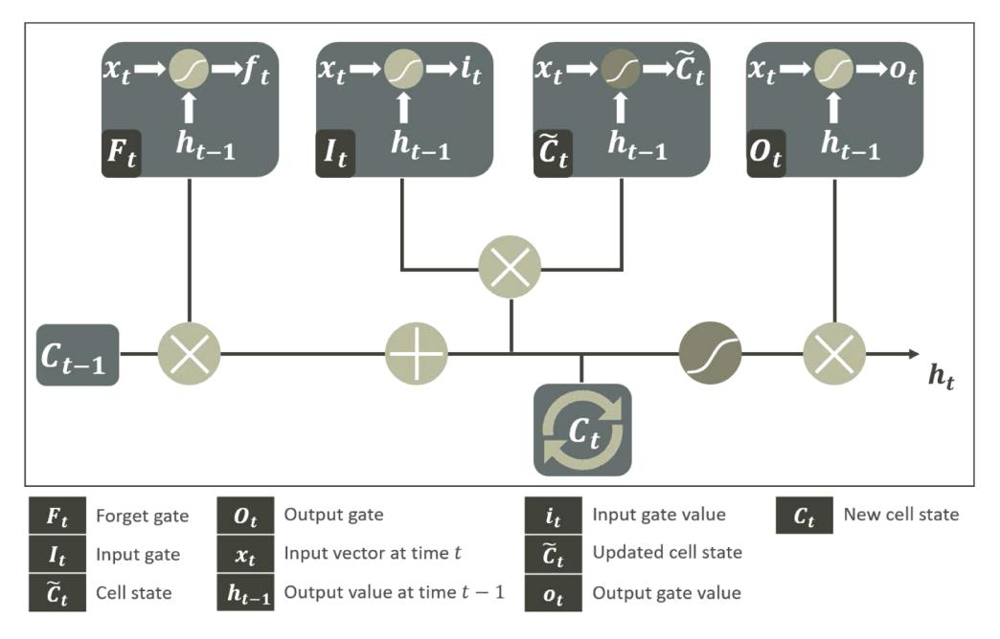

**Fig. 1.** The diagram of the Long Short-Term Memory network. LSTM is formed using four main gates; the input gate, the forget gate, the output gate and the cell state. These gates are connected in a particular way to learn the long term dependencies. See text for details.

vector  $x_t$  and the output from previous state  $h_{t-1}$  and it results with an input gate values  $i_t$  as shown in Eq. (17):

$$i_t = \sigma(W_i[h_{t-1}, x_t] + b_i).$$
 (17)

Further, a tanh layer creates a vector of new candidate values  $\widetilde{C}_t$  that could be added to the cell state using Eq. (18):

$$\widetilde{C}_t = \tanh\left(W_C[h_{t-1}, x_t] + b_C\right). \tag{18}$$

Additionally, we need to use the old cell state  $C_{t-1}$  and the updated cell state  $\widetilde{C}_t$  to calculate the new cell state  $C_t$ . This is accomplished by linearly connecting both with the forget gate value  $f_t$  and the input gate value  $i_t$  using Eq. (19):

$$C_t = C_{t-1}f_t + i_t\widetilde{C}_t . (19)$$

Finally, we need to decide what we want to output. Therefore, first we run a sigmoid function that decides which parts of the cell state we need to output and this is the output value  $o_t$  from the output gate  $O_t$ . Then, a hyperbolic tangent tanh was implemented on the cell state and multiply it with the output from  $O_t$  in order to only output the parts that we decided to as follows:

$$o_t = \sigma(W_o[h_{t-1}, x_t] + b_o)$$
 (20)

and

$$h_t = o_t \tanh C_t. \tag{21}$$

The aforementioned network is the simple LSTM nevertheless different versions are available [42]. The differences between these networks are minor but some of them are popular e.g. including "peephole connections" that let the gate layers look at the cell state which was introduced by Gers and Schmidhuber [43]. A comparison has been made between popular variants of LSTM by Greff et al. where the author finds that the compared LSTMs are similar [44]. However, in this paper we used the simple version of LSTM.

### 4. Results

### 4.1. Artificial data

In this paper, we focused on comparing the deep learning network LSTM as phase retrieval tool to MEM and KK models (displayed in Fig. 2) with respect to the strength of the non-resonant background. Therefore, we considered two scenarios. In scenario 1, the Raman resonances were constructed only in the region where the NRB is strong. In scenario 2, the Raman resonances were built in both the strong and the weak NRB regions. These both scenarios were chosen to determine the dependency of the three phase retrieval techniques to the NRB strength.

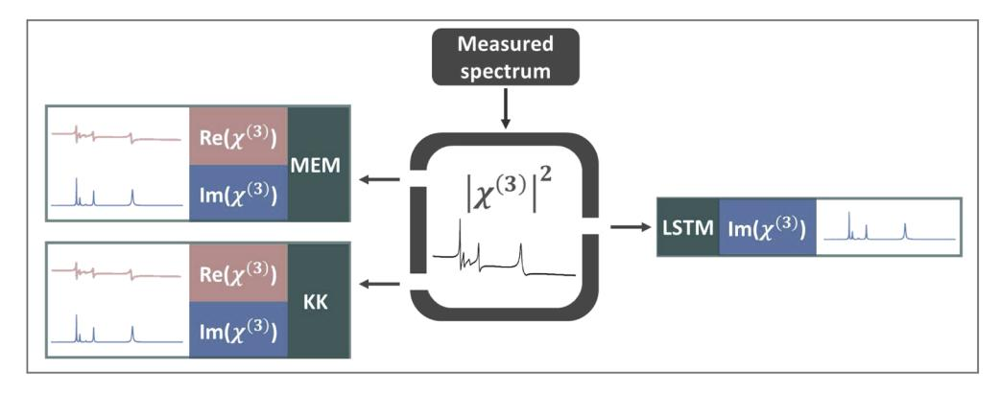

**Fig. 2.** The workflow of the three phase retrieval methods. Both MEM and KK extract both the real  $\text{Re}(\chi^{(3)})$  and the imaginary  $\text{Im}(\chi^{(3)})$  component from the squared modulus of the susceptibility  $|\chi^{(3)}|^2$ . In contrast, LSTM network predicts only the imaginary component  $\text{Im}(\chi^{(3)})$  using the squared modulus of the susceptibility  $|\chi^{(3)}|^2$ .

Initially, we construct simulated CARS spectra using Eq. (3) and this simulated data is used to assess the performance of the three phase retrieval techniques. The parameters used for the construction of the simulated spectra were chosen randomly (see Table 3). As shown in Eq. (3), the number of resonances needed to be defined a priori and the number was selected between 4 and 7. A range of amplitudes and bandwidths for the different resonances was defined between 0.001 and 0.5 and between 0.0001 and 0.01, respectively. The non-resonant background is defined as a constant value  $\chi_{nr} = 0.5$  multiplied by a Gaussian function. In addition, we added noise in order to reflect the experimental conditions. As a result, the total sample size of the simulated CARS spectra was 4000.

Then, we used these simulated CARS spectra and applied all three phase retrieval methods. For MEM, we used an in-house written R algorithm. A trial and error process was implemented to determine the optimal number of poles which was equal to M=150. Finally, Eq. (9) was used to extract the phase, where  $\nu_0=0.6$  (refer to Table 3). A preprocessing step was necessary to remove the oscillations at the edges and this was done by replicating two small sub-regions on both edges and then removing them after the reconstruction of the spectra.

Afterwards, we applied the KK algorithm on the simulated CARS spectra, which was implemented in Python by Camp et al. [13].

Finally, we tested the deep learning technique using the LSTM network. In contrast to MEM and KK, the procedure of extracting the phase using the LSTM network is indirect. We used the network to map between the squared modulus and the imaginary components of the 4000 simulated CARS spectra. We split the squared modulus spectra into  $\frac{2}{3}$  training set and  $\frac{1}{3}$  testing set, where 20% of the training set were used as a validation set. First, we trained our network by tuning its hyperparameters (refer to Table 3). The Adam optimizer was used to update the parameters of the network and the maximum number of training epochs were set to 50. The

found optimal learning rate, optimal training batch size, and the optimal number of hidden units in the layer were found to be 0.005, 10 and 30, respectively. Then, we used the trained network in the prediction step on the testing set.

In scenario 1, four resonances were built in the strong NRB region. Using the MEM method, the constructed squared modulus fits well the theoretical one as shown in the first row of Fig. [3.](#page-7-0) On the other hand, the MEM algorithm was able to predict the peak like shape in the constructed imaginary component displayed in the second row of Fig. [3.](#page-7-0) The MEM based phase retrieval algorithm estimates correctly the position and the width of the peaks. However, it shows distortion in the amplitude and the shape in particular in the third peak which might be resulted from the presence of the background. In addition, the MEM algorithm constructs the real component shown in the third row of Fig. [3.](#page-7-0) The constructed real component has a dispersive line shape in the four positions and resembles to the theoretical real component. However, similarly to the constructed imaginary component, they were distorted by the presence of the background.

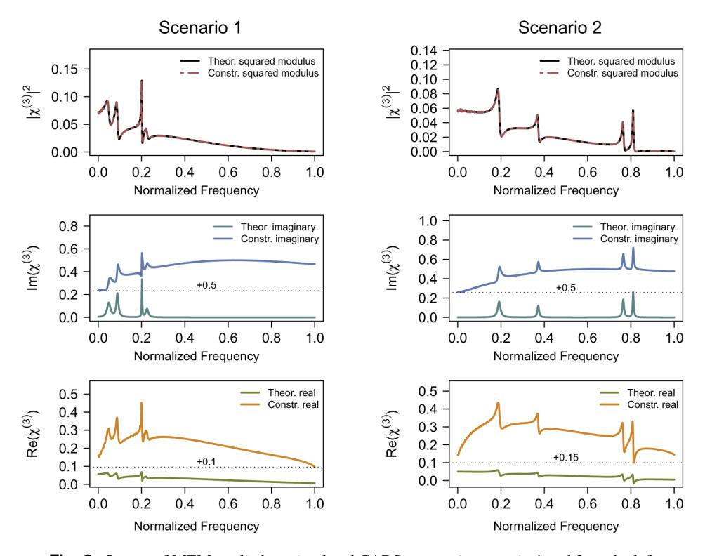

**Fig. 3.** Output of MEM applied on simulated CARS spectra in scenario 1 and 2 on the left and the right, respectively. In the second row, the constructed and the theoretical imaginary components for both scenarios are displayed in the upper and bottom part, respectively. In the third row the constructed and the theoretical real components for both scenarios are shown in the upper and bottom section, respectively. The dotted line in black represents the offset value.

For the same scenario (scenario 1), the results of the KK algorithm are shown in Fig. [4.](#page-8-0) In the first row, the constructed squared modulus is shown, which fits perfectly the theoretical one. If the constructed imaginary component and the theoretical one are compared, the KK algorithm was able to estimate the peak like shape for the four resonances. In addition, the position, width and amplitude of the peaks represent well the theoretical one. Additionally, the constructed real component of the KK algorithm showed a dispersive line shape in the four

positions. However, the background presence persist in both the imaginary and real components, which can be extracted afterwards using a baseline correction technique. [\[45\]](#page-22-2)

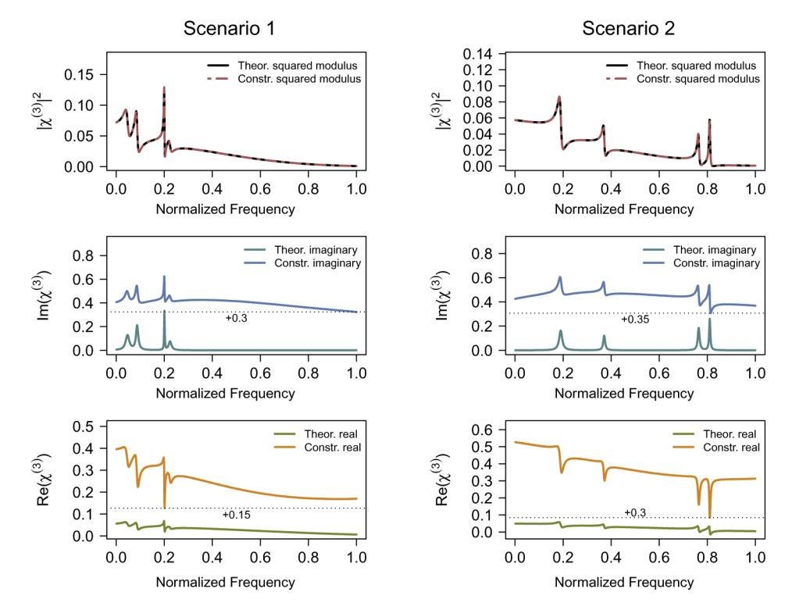

**Fig. 4.** Output of KK applied on simulated CARS spectra in scenario 1 and 2 on the left and the right, respectively. In the second row, the constructed and the theoretical imaginary components for both scenarios are displayed in the upper and bottom lines, respectively. In the third row, the constructed and the theoretical real components for both scenarios are shown in the upper and bottom lines, respectively. The dotted line in black represents the offset value.

Using our trained LSTM network, we predicted the imaginary component of the same spectra from scenario 1 as shown in the left part of Fig. [5.](#page-9-0) The LSTM network was able to correctly construct the peak like shape for the four resonances. The peak positions and widths were perfectly reflecting the theoretical ones. But, the amplitude for the first and fourth peak were smaller than those in the theoretical imaginary component. This might be a result of the parameter used to train the network. However, the LSTM method was able to remove completely the background.

In scenario 2, two resonances were built in the strong NRB region and two resonances in the weak NRB region. Using the MEM method, the constructed squared modulus fits well the theoretical one as shown in the first row of Fig. [3.](#page-7-0) Moreover, the MEM algorithm predicted the peak like shape in the constructed imaginary component in all four positions as shown in the second row of Fig. [3.](#page-7-0) It estimates correctly the peak positions, widths and amplitudes. Regarding the constructed real component, the MEM technique accurately estimated the dispersive line shape in the four positions displayed in the third row of Fig. [3.](#page-7-0) However, the constructed imaginary and real components were both distorted by the presence of the background.

The output of the KK algorithm on the spectrum from scenario 2 is shown in Fig. [4.](#page-8-0) The constructed squared modulus fits perfectly the theoretical one as shown in the first row of Fig. [4.](#page-8-0) In spite of this, the constructed imaginary component shows a peak like shape in the first two

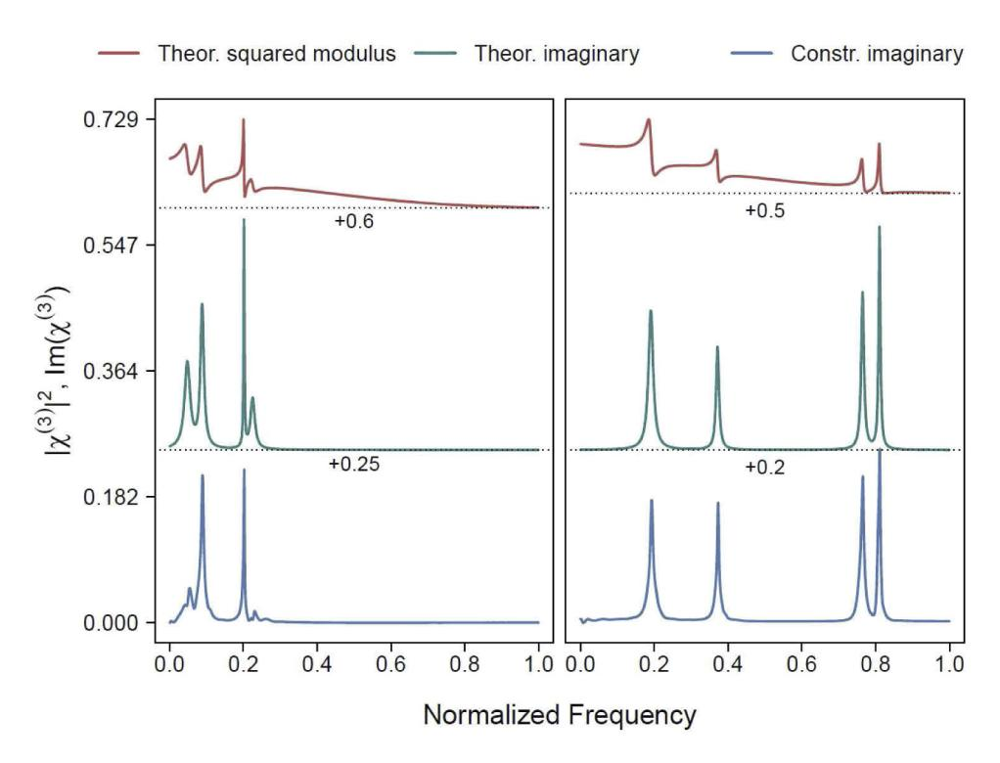

**Fig. 5.** Prediction of the imaginary components of the simulated spectra using the trained LSTM model in both scenarios. The theoretical squared modulus are shown in the upper line. The constructed and the theoretical imaginary components for both scenarios are displayed in the bottom and middle part, respectively. The dotted line in black represents the offset value.

resonances but a dispersive line shape in the weak NRB region as shown in the second row of Fig. [4.](#page-8-0) Similarly, the constructed real component shows a dispersive line shape in the first two resonances but a negative peak like shape in the weak NRB region which is displayed in the third row of Fig. [4.](#page-8-0) Additionally, the background remains in both the imaginary and the real components, which can be extracted afterwards using a baseline correction technique. [\[45\]](#page-22-2)

Using the trained LSTM network, we predicted the imaginary component of the same spectra from scenario 2 as shown in the right part of Fig. [5.](#page-9-0) In this case, the LSTM was able to perfectly construct the peak like shape for the four resonances. The peak positions and widths were perfectly reflecting the theoretical ones in both NRB regions. Moreover, comparing with MEM and KK, LSTM was able to remove completely the background.

To evaluate the quality of the constructed components, we used the Root Mean Squared Error (RMSE) of all spectra in both scenarios. First, we calculated the RMSE per spectrum then the mean error and standard deviation of all spectra in each scenario were determined separately. As shown in Table [1,](#page-10-1) the constructed squared modulus of the MEM method fits the theoretical one with a mean error of ≈ 0.0264 ± 0.005 and ≈ 0.026 ± 0.006 in scenario 1 and 2, respectively. This represents a relative error of 3.97%±0.7% and 3.7%±0.8% in scenario 1 and 2, respectively. The mean errors of the constructed imaginary component were ≈ 0.1095±0.009 and ≈ 0.1053±0.007 in scenario 1 and 2, respectively. These values represent a relative error of 16.11% ± 1.3% and 14.91% ± 0.9%. The constructed real component fits the theoretical one with a mean error of ≈ 0.0987 ± 0.007 and ≈ 0.0996 ± 0.007, which represents a relative error of 14.73% ± 1% and 14.12% ± 0.9%, in scenario 1 and 2, respectively.

Table 1. The mean and standard deviation of the Root Mean Squared Error (RMSE), which was calculated on single spectrum, for MEM, KK and LSTM methods. Comparing the constructed imaginary component of all three methods, the LSTM network overcame MEM and KK since the method shows a significantly lower mean error in both regions.

| Scenario | MEM              |                  |                  | KK                |                                 |                  | LSTM                            |
|----------|------------------|------------------|------------------|-------------------|---------------------------------|------------------|---------------------------------|
|          | $ \chi^{(3)} ^2$ | $Im(\chi^{(3)})$ | $Re(\chi^{(3)})$ | $ \chi^{(3)} ^2$  | $\operatorname{Im}(\chi^{(3)})$ | $Re(\chi^{(3)})$ | $\operatorname{Im}(\chi^{(3)})$ |
| 1        | 0.0264           | 0.1095           | 0.0987           | $4.69e^{-18}$     | 0.1018                          | 0.0669           | 0.0115                          |
|          | ±0.005           | $\pm 0.009$      | ±0.007           | $\pm 4.73e^{-19}$ | $\pm 0.011$                     | ±0.008           | $\pm 0.003$                     |
| 2        | 0.026            | 0.1053           | 0.0996           | $4.63e^{-18}$     | 0.1039                          | 0.068            | 0.0116                          |
|          | ±0.006           | $\pm 0.009$      | ±0.007           | $\pm 4.93e^{-19}$ | $\pm 0.01$                      | ±0.01            | $\pm 0.003$                     |

For the KK method the constructed squared modulus fits the theoretical one better then for the MEM technique showing a mean error of  $\approx 0$  with a very small variation in both scenarios. However, the constructed imaginary component represents the theoretical one with a mean error of  $\approx 0.1018 \pm 0.01$  and  $\approx 0.1039 \pm 0.01$ , which represents a relative error of  $15.33\% \pm 1.5\%$  and  $14.8\% \pm 1.4\%$  in scenario 1 and 2 respectively. The constructed real component represents the theoretical one with a mean error of  $\approx 0.0669 \pm 0.008$  and  $\approx 0.068 \pm 0.01$ , which represents a relative error of  $10.07\% \pm 1.2\%$  and  $9.68\% \pm 1.4\%$  in scenario 1 and 2 respectively. Furthermore, the LSTM network overcome both MEM and KK as shown in Table 1. The imaginary components of the testing set were constructed with an error of  $\approx 0.01 \pm 0.003$ , which represents a relative error of  $1.67\% \pm 0.4\%$  in both scenarios, respectively.

In general, the time for the execution of the MEM algorithm using the whole 4000 spectra is relatively short  $\approx 10.584$  minutes. Furthermore, the time for training the LSTM network is also relatively small  $\approx 1.9$  hours as a limited CPU was used for the execution. Additionally, the time for predicting a unique spectrum using MEM, KK and LSTM network is  $\approx 0.18$ ,  $\approx 0.67$  and  $\approx 0.16$  seconds, respectively, as shown in Table 2.

Table 2. Comparison of the model training and the prediction times for the three methods. The time for training the LSTM network is  $\approx$  1.9 hours. And, the time for building the MEM model using the 4000 spectra is relatively small  $\approx$  10.58 min. However, the time to predict the imaginary component of one single spectrum using LSTM is smaller than the time for the MEM and KK based prediction.

| Method | Training time | Prediction time |  |
|--------|---------------|-----------------|--|
| MEM    | 10.58m        | 0.18s           |  |
| KK     | 0             | 0.67s           |  |
| LSTM   | 1.91h         | 0.16s           |  |

After the evaluation of the two scenarios, the MEM technique and the KK algorithm were not able to accurately construct the real and the imaginary components without an accurate measurement of the NRB. It was shown that the output of both methods was strongly dependent on the NRB strength. In contrast the output of the deep learning network LSTM was almost independent of the NRB strength. Additionally, the LSTM could prove to be a powerful method for extracting the Raman like spectrum without the need for an accurate estimation of the non-resonant background.

### 4.2. Experimental data

The validation of the above-mentioned methods is achieved by testing the three methods on experimental measured broadband CARS (BCARS) spectra. These spectra was generated using an optical source (FemtoFiber pro UCP, Toptica Photonics, Germany) with the ps pump pulse centered at 777 nm and a sub 25 fs broadband Stokes pulse covering  $\approx 840-1100$  nm. See Appendix A for further details on the setup. The comparison of the three phase retrieval methods

was performed using two experimental BCARS spectra, which reflect the two aforementioned scenarios. In scenario 1, the Toluene broadband CARS spectrum was tested, where the Raman resonances are in the strong non-resonant background region. In scenario 2, the Acetonitrile broadband CARS spectrum was used, where its Raman resonances exist in both the strong and the weak non-resonant background regions. Moreover, after a trial and error process, for the MEM method applied on both spectra, the optimal number of poles is *M* = 150 and Eq. (9) is used to extract the phase for ν0 = 0.6.

In scenario 1, the output of the MEM, KK and LSTM methods applied on the Toluene BCARS spectrum can be found in Appendix B (Fig. [8,](#page-14-0) Fig. [9](#page-15-0) and Fig. [10,](#page-16-0) respectively). For the MEM and the KK methods, the reconstructed spectrum fits perfectly the BCARS Toluene spectrum and the imaginary and the real components were successfully retrieved. A comparison between the constructed imaginary components of the three methods for the Toluene BCARS spectrum is displayed in the second row of Fig. [6](#page-11-0) in upper, middle and bottom lines, respectively. The three methods were able to successfully extract a Raman like spectrum. The outputs of MEM and KK, illustrated in the upper and middle lines of the second row in Fig. [6,](#page-11-0) show a good estimation of the peaks positions, widths and amplitudes. A clear distortion of the peaks shape is shown particularly in the region on the left. This was resolved by using the LSTM network as shown in the bottom line of Fig. [6.](#page-11-0) Therefore, the LSTM network shows a very good performance with regards to the peak amplitudes and widths. Nevertheless, the LSTM was not able to accurately predict the small peak at the band 1200 cm−1 and this might result from the properties of the simulation data. In addition, the LSTM reconstruction does not need an additional preprocessing compared with the imaginary components of the MEM and the KK method.

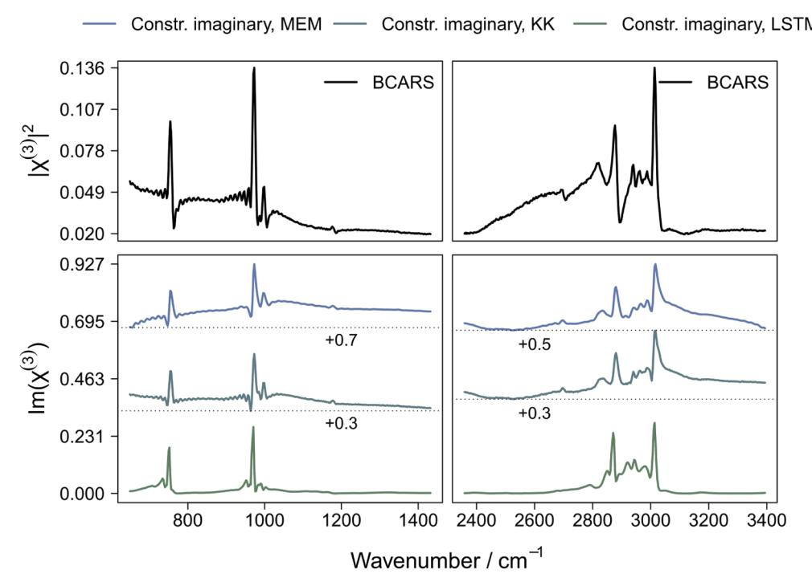

**Fig. 6.** The constructed imaginary component of BCARS Toluene spectrum using MEM, KK and LSTM. The BCARS Toluene spectrum is shown in the first row. In the second row, the constructed imaginary components by MEM, KK and LSTM are shown in upper, middle and bottom lines, respectively. The dotted line in black represents the offset value.

In scenario 2, the output of the MEM, KK and LSTM method applied on an Acetonitrile BCARS spectrum can be found in Appendix B (Fig. [11,](#page-17-0) Fig. [12](#page-18-0) and Fig. [13,](#page-19-0) respectively ). For MEM and KK, the reconstructed spectrum fits perfectly the Acetonitrile BCARS spectrum but the imaginary and the real components were distorted, in particular in the region where the NRB is weak. A comparison between the constructed imaginary components using MEM, KK and LSTM for the Acetonitrile BCARS spectrum is displayed in the second row of Fig. [7](#page-12-0) in upper, middle and bottom lines, respectively. For the MEM and the KK method, the imaginary components are dramatically distorted in the region where the NRB is weak. This is visible by the presence of a dispersive line shape as displayed in the upper and the middle lines of the second row in Fig. [7.](#page-12-0) In the region on the left, MEM and KK constructed imaginary components show a background contribution and small peak distortions. On the other hand, the LSTM network predicted correctly the peak positions and widths, but a small distortion is seen in the amplitudes in the strong NRB region. However, in the weak NRB region, the LSTM network could successfully extract the imaginary component which is seen by the accurate estimation of the positions, widths and amplitudes of the peaks. Nevertheless, LSTM was not able to accurately predict the small peak at the band 1337 cm−1 and this might result from the properties of the simulation data. In addition, in LSTM, there is no need for additional preprocessing steps in contrast to the imaginary components from the MEM and the KK method.

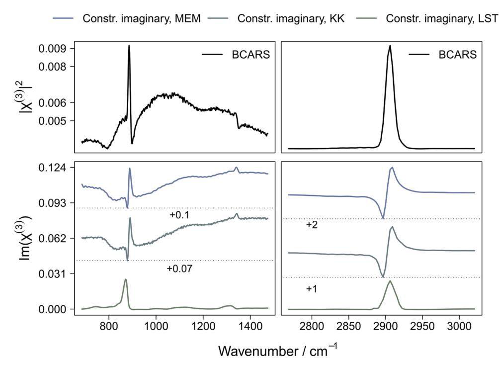

**Fig. 7.** The constructed imaginary components of a Acetonitrile BCARS spectrum using MEM, KK and LSTM. The Acetonitrile BCARS spectrum is shown in the first row. In the second row, the constructed imaginary components by MEM, KK and LSTM are shown in upper, middle and bottom lines, respectively. The dotted line in black represents the offset value.

In summary, the MEM and the KK method show an increased sensitivity regarding the strength of the NRB. This was presented either with the flip of the peaks shape in the imaginary and the real components or by the fact that a background is present after the retrieval. On the other hand,

the LSTM network showed its potential since its results are not dependent on the strength of the non-resonant background.

# **5. Conclusion**

Coherent anti-Stokes Raman scattering offers many advantages over spontaneous Raman scattering among which the increase of the Raman signal, the elimination of fluorescence and the rapid time acquisition. Even though this optical technique improves the Raman vibrational modes, the CARS signal is distorted due to the contribution of the non-resonant background that has destructive and constructive role at the same time. Therefore, to extract the phase without experimentally removing the non-resonant background, algorithmic methods can be implemented. In this paper, we examined two popular methods for the phase retrieval; the maximum entropy method (MEM) and the Kramers-Kronig relation (KK). Furthermore, we applied deep learning using the long short term memory network as a phase retrieval tool. The imaginary components extracted from these three methods were compared by varying the non-resonant background into strong and weak regions.

Initially, the three methods were tested on a CARS simulated spectra for two different scenarios where the non-resonant background is strong and weak. In the scenario where the Raman resonances are built only in the strong NRB region, the imaginary components relative to MEM, KK and LSTM methods were correctly constructed. Their corresponding peaks shape reflect the theoretical ones. While in the scenario where some Raman resonances are built in the weak NRB region, the constructed imaginary components of the three methods differ. In MEM and LSTM, the peaks shape reflect the theoretical ones. While in KK, in particular in the region where the non-resonant background is weak, the constructed components were dramatically affected as the imaginary component shows a dispersive shape and the real component shows a peak like shape. However, for both MEM and KK methods, an additional preprocessing phase to remove the background is essential which is not needed when using the LSTM network. Additionally, the time for training the model in LSTM is high relatively to the other methods but the prediction time of one spectrum is significantly short in both scenarios ≈ 0.16 second. Also, in both scenario the RMSE for the construction of the Raman like spectrum shows a mean error of ≈ 0.01 for the LSTM network, while it shows a mean error of ≈ 0.11 and ≈ 0.10 for the MEM and KK methods, respectively.

Afterwards, we tested these three methods on two BCARS Acetonitrile and Toluene spectra. For BCARS Toluene spectrum, the constructed imaginary components via MEM and KK methods have a peak like shape with a minor distortion. Similarly, LSTM predicts well the peaks shape for the imaginary component plus the distortion mentioned previously was removed. On the other hand, for the BCARS Acetonitrile spectrum, the LSTM network predicts the imaginary component with a peak like shape contrarily to MEM and KK which show a dispersive shape in their constructed imaginary components. Additionally, in LSTM there is no need for further preprocessing step to remove the background in contrast to MEM and KK.

Therefore, the results of MEM, KK and LSTM for the simulated data and the experimental data can be interpreted similarly. MEM and KK are dependent on the strength of the NRB for both data types. In contrast the LSTM network is not dependent an the NRB strength and shows good phase retrieval performances for BCARS spectra.

As a conclusion, we used for the very first time the deep learning technique as a tool for the phase retrieval. To assess its potential, we varied the strength of the non-resonant background and we compared the deep learning output to those of MEM and KK methods. The deep learning technique overcame MEM and KK regarding the peak shape and the removal of additional background contribution. However, for future work, the development of the LSTM network by increasing the sample size, as it was relatively small, can be considered as a step forward towards a perfect phase extraction method.

# **Appendix A. BCARS setup**

In this section a description of the experimental BCARS setup is provided. As excitation source two co-seeded fiber lasers (Toptica FemtoFiber pro UCP) were used generating a narrow band (pump/probe) beam centered at 777 nm with a pulse duration of ∼ 2.6 ps, 40 MHz repetition rate at an average power of ∼ 10 mW (on the sample) and a super continuum (Stokes beam) generating pulses with a pulse duration of 18 fs within a range of 840-1100 nm with a repetition rate of 40 MHz, and an average power of 8 mW. The narrow band source was guided by means of mechanical delay stage to achieve control over temporal overlap of the two laser beams. The Stokes beam was passed through a beam expander (refractive telescope) to enlarge the beam diameter to match the back aperture of the objective. The two beams were then spatially combined by a dichroic beam combiner and focused on the sample by a 20x objective, 0.5 NA (Olympus, UPLFLN20X/0.5). The sample was placed on a three-axis translation stage and the beams were then collected and collimated in a confocal configuration by another 20X, 0.5 NA objective. The excitation beams and generated anti-Stokes beam were then passed through two shortpass filters (Semrock, Brightline multiphoton 770SP) to spectrally filter out the excitation beams and the generated anti-Stokes beam was then guided and focused by an achromatic lens to the entrance slit aperture of the spectrometer (Andor, Kymera 193i) attached with a CCD camera (Newton 920, DU920P-BEX2-DD). For the measurement of the solvents: Toluene (\*) and Acetonitrile (\*); were contained in a quartz cuvette with 1 mm of layer thickness (Hellma Macro-cuvette 110-QS).

### **Appendix B. Results of the three methods applied on experimental BCARS data**

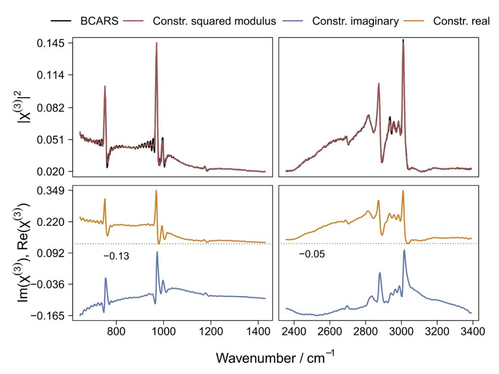

**Fig. 8.** Output of MEM for a Toluene BCARS spectrum. In the first row, the reconstructed spectrum and the BCARS spectrum are displayed. In the second row, the real and the imaginary components are shown in the upper and bottom lines, respectively. The dotted line in black represents the offset value.

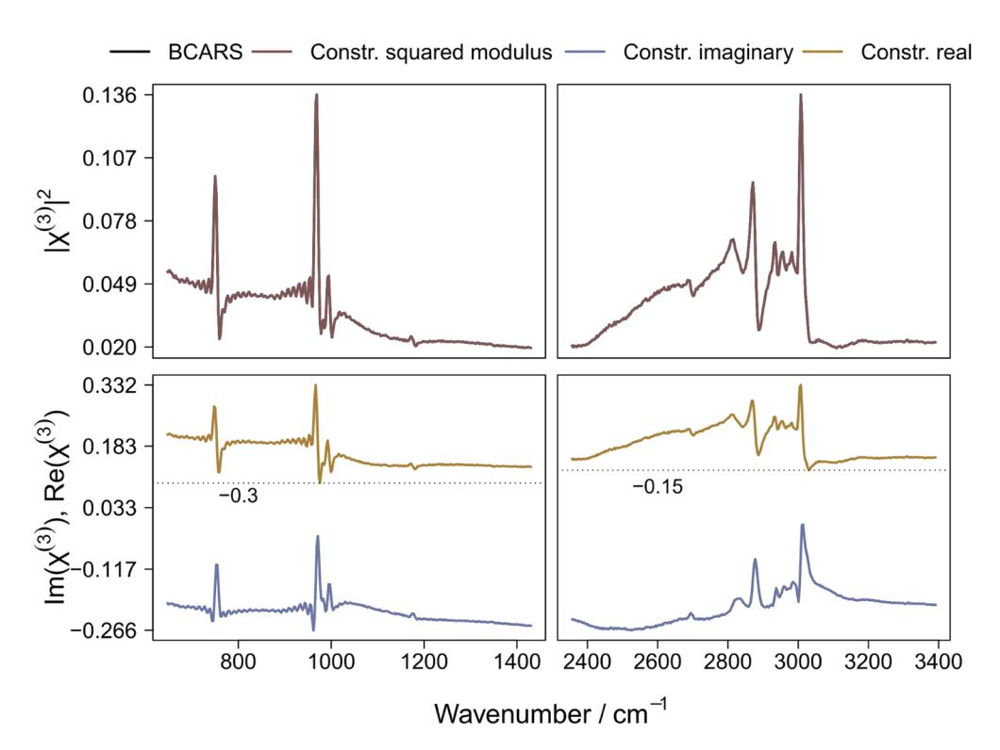

**Fig. 9.** Output of KK for a Toluene BCARS spectrum. In the first row, the reconstructed spectrum and the BCARS spectrum are displayed. In the second row, the real and the imaginary components are shown in the upper and bottom lines, respectively. The dotted line in black represents the offset value.

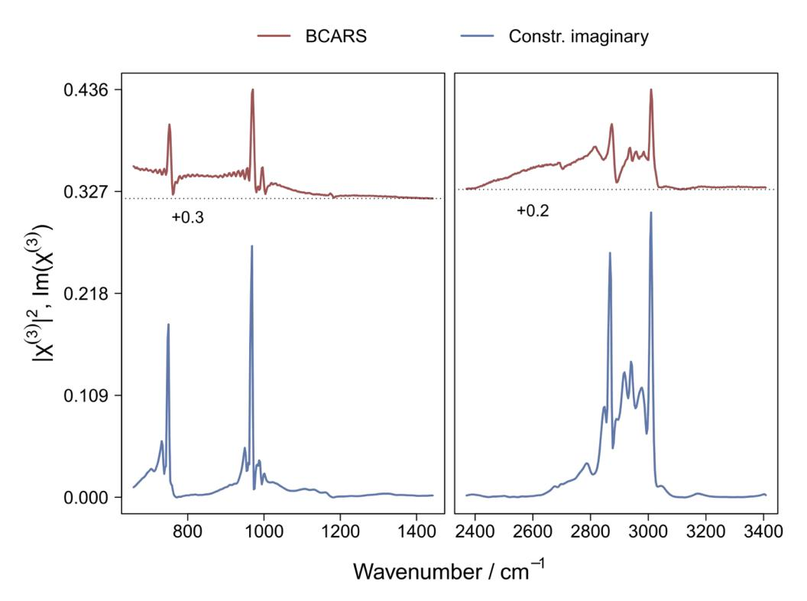

**Fig. 10.** Prediction of the imaginary component of the BCARS Toluene spectrum using the trained LSTM model. The BCARS Toluene spectrum and its predicted imaginary component are shown in the upper and bottom lines, respectively. The dotted line in black represents the offset value.

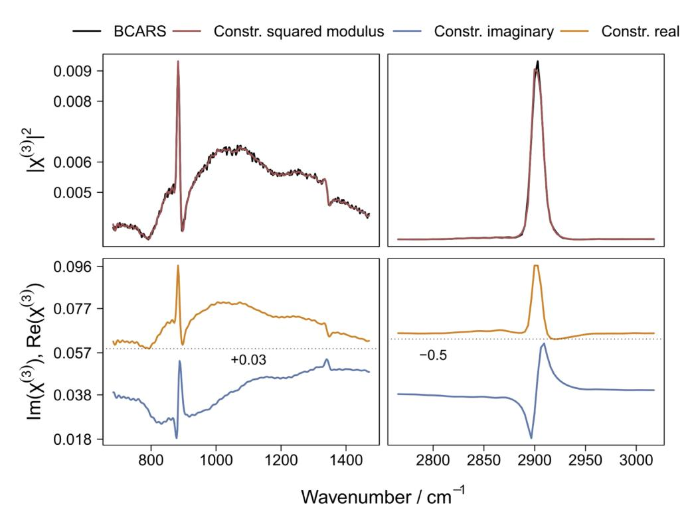

**Fig. 11.** Output of MEM for an Acetonitrile BCARS spectrum. In the first row, the reconstructed spectrum and the BCARS spectrum are displayed. In the second row, the real and the imaginary components are shown in the upper and bottom lines, respectively. The dotted line in black represents the offset value.

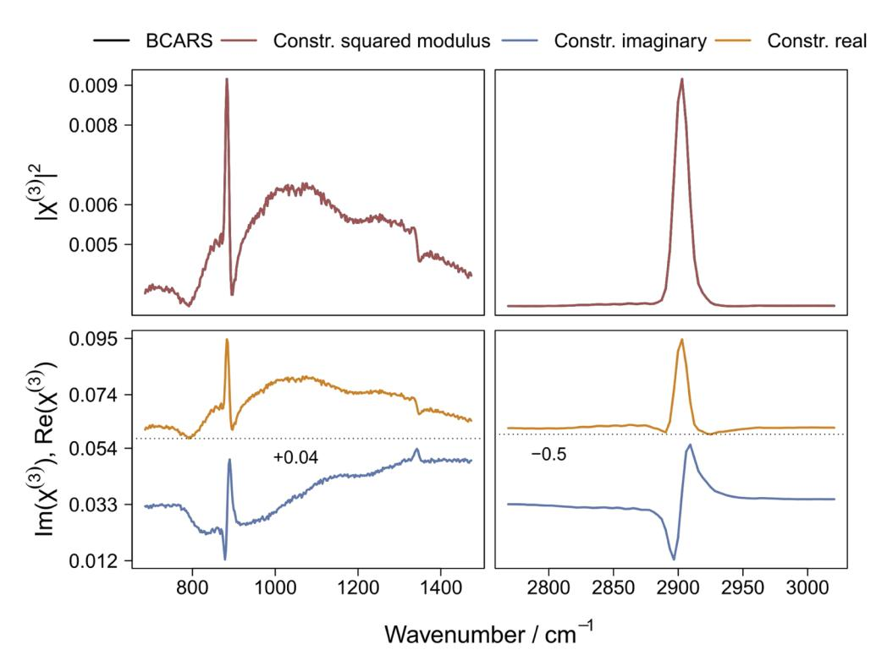

**Fig. 12.** Output of KK for a Acetonitrile BCARS spectrum. In the first row, the reconstructed spectrum and the BCARS spectrum are displayed. In the second row, the real and the imaginary components are shown in the upper and bottom lines, respectively. The dotted line in black represents the offset value.

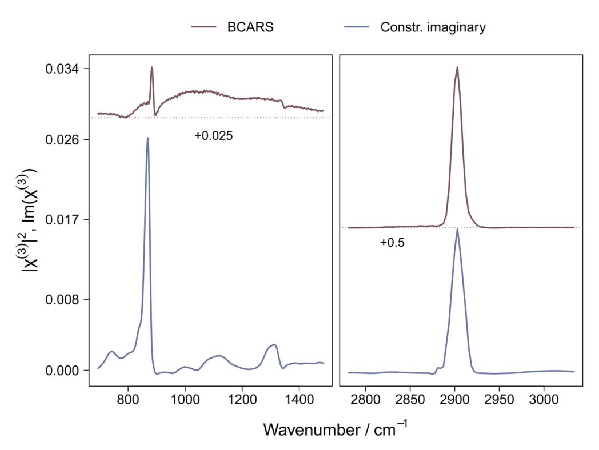

**Fig. 13.** Prediction of the imaginary components of the Acetonitrile BCARS spectrum using the trained LSTM model. The Acetonitrile BCARS spectrum and its predicted imaginary component are shown in the upper and bottom lines, respectively. The dotted line in black represents the offset value.

# **Appendix C. Parameters for MEM and LSTM applied on simulation data**

**Table 3. Parameters for the MEM method and the LSTM network applied to the simulated CARS spectra in both scenarios.**

| Parameters        |                |    |      |                       |       |  |  |  |  |  |  |
|-------------------|----------------|----|------|-----------------------|-------|--|--|--|--|--|--|
| Simulation data   | MEM            |    | LSTM |                       |       |  |  |  |  |  |  |
| No. of resonances | [4, 7]         | M  | 150  | No. of Epochs         | 50    |  |  |  |  |  |  |
| Amplitudes        | [0.001, 0.5]   | ν0 | 0.06 | Optimizer             | Adam  |  |  |  |  |  |  |
| Bandwidths        | [0.0001, 0.01] |    |      | Learning rate         | 0.005 |  |  |  |  |  |  |
| χnr               | 0.5            |    |      | Batch size            | 10    |  |  |  |  |  |  |
| No. of samples    | 4000           |    |      | Validation size       | 20%   |  |  |  |  |  |  |
|                   |                |    |      | No. of units in layer | 30    |  |  |  |  |  |  |

# **Funding**

Deutsche Forschungsgemeinschaft (CRC 1076 AquaDiva, CRC 1375 NOA); Leibniz-Gemeinschaft (SAS-2015-HKI-LWC (FastDrop)).

# **Acknowledgments**

The financial support from the Deutsche Forschungsgemeinschaft (DFG) via the CRC 1076 AquaDiva and the CRC 1375 NOA is highly appreciated. This work was also supported with funds from the funding line strategic networking of the Leibniz competition within the framework of the Leibniz Science Campus InfectoOptics SAS-2015-HKI-LWC (FastDrop).

# **Disclosures**

The authors declare no conflicts of interest.

# **References**

- 1. Y. Shechtman, Y. C. Eldar, O. Cohen, H. N. Chapman, J. Miao, and M. Segev, "Phase Retrieval with Application to Optical Imaging: A contemporary overview," [IEEE Signal Process. Mag.](https://doi.org/10.1109/MSP.2014.2352673) **32**(3), 87–109 (2015).
- 2. J.-X. Cheng and X. S. Xie, Coherent Raman scattering microscopy (Taylor & Francis, 2016).
- 3. C. Krafft, B. Dietzek, J. Popp, and M. Schmitt, "Raman and coherent anti-Stokes Raman scattering microspectroscopy for biomedical applications," [J. Biomed. Opt.](https://doi.org/10.1117/1.JBO.17.4.040801) **17**(4), 040801 (2012).
- 4. M. Cui, B. R. Bachler, and J. P. Ogilvie, "Comparing coherent and spontaneous Raman scattering under biological imaging conditions," [Opt. Lett.](https://doi.org/10.1364/OL.34.000773) **34**(6), 773–775 (2009).
- 5. J.-x. Cheng, A. Volkmer, L. D. Book, and X. S. Xie, "Multiplex coherent anti-Stokes Raman scattering microspectroscopy and study of lipid vesicles," [J. Phys. Chem. B](https://doi.org/10.1021/jp025771z) **106**(34), 8493–8498 (2002).
- 6. T. W. Kee and M. T. Cicerone, "Simple approach to one-laser, broadband coherent anti-Stokes Raman scattering microscopy," [Opt. Lett.](https://doi.org/10.1364/OL.29.002701) **29**(23), 2701–2703 (2004).
- 7. M. Jurna, J. P. Korterik, C. Otto, J. L. Herek, and H. L. Offerhaus, "Vibrational phase contrast microscopy by use of coherent anti-Stokes Raman scattering," [Phys. Rev. Lett.](https://doi.org/10.1103/PhysRevLett.103.043905) **103**(4), 043905 (2009).
- 8. T. W. Bocklitz, F. S. Salah, N. Vogler, S. Heuke, O. Chernavskaia, C. Schmidt, M. J. Waldner, F. R. Greten, R. Bräuer, M. Schmitt, A. Stallmach, I. Petersen, and J. Popp, "Pseudo-HE images derived from CARS/TPEF/SHG multimodal imaging in combination with Raman-spectroscopy as a pathological screening tool," [BMC Cancer](https://doi.org/10.1186/s12885-016-2520-x) **16**(1), 534 (2016).
- 9. O. Chernavskaia, S. Heuke, M. Vieth, O. Friedrich, S. Schürmann, R. Atreya, A. Stallmach, M. F. Neurath, M. Waldner, I. Petersen, M. Schmitt, T. Bocklitz, and J. Popp, "Beyond endoscopic assessment in inflammatory bowel disease: real-time histology of disease activity by non-linear multimodal imaging," [Sci. Rep.](https://doi.org/10.1038/srep29239) **6**(1), 29239 (2016).
- 10. H. Hajjar, H. Boukhaddaoui, A. Rizgui, C. Sar, J. Berthelot, C. Perrin-Tricaud, H. Rigneault, and N. Tricaud, "Label-free non-linear microscopy to measure myelin outcome in a rodent model of Charcot-Marie-Tooth diseases," [J. Biophotonics](https://doi.org/10.1002/jbio.201800186) **11**(12), e201800186 (2018).
- 11. F. Masia, A. Glen, P. Stephens, W. Langbein, and P. Borri, "Label-free quantitative chemical imaging and classification analysis of adipogenesis using mouse embryonic stem cells," [J. Biophotonics](https://doi.org/10.1002/jbio.201700219) **11**(7), e201700219 (2018).

- 12. R. Galli, O. Uckermann, T. Sehm, E. Leipnitz, C. Hartmann, F. Sahm, E. Koch, G. Schackert, G. Steiner, and M. Kirsch, "Identification of distinctive features in human intracranial tumors by label-free nonlinear multimodal microscopy," [J. Biophotonics](https://doi.org/10.1002/jbio.201800465) **11**, e201800465 (2019).
- 13. C. H. Camp Jr, Y. J. Lee, and M. T. Cicerone, "Quantitative, comparable coherent anti-Stokes Raman scattering (CARS) spectroscopy: correcting errors in phase retrieval," [J. Raman Spectrosc.](https://doi.org/10.1002/jrs.4824) **47**(4), 408–415 (2016).
- 14. M. R. Hamblin, P. Avci, and G. K. Gupta, Imaging in dermatology (Elsevier, 2016).
- 15. R. W. Gerchberg, "A practical algorithm for the determination of phase from image and diffraction plane pictures," Optik **35**, 237–246 (1972).
- 16. E. M. Vartiainen, K.-E. Peiponen, H. Kishida, and T. Koda, "Phase retrieval in nonlinear optical spectroscopy by the maximum-entropy method: an application to the |χ(3)| spectra of polysilane," [J. Opt. Soc. Am. B](https://doi.org/10.1364/JOSAB.13.002106) **13**(10), 2106–2114 (1996).
- 17. E. Vartiainen, K.-E. Peiponen, and T. Asakura, "Maximum entropy model in reflection spectra analysis," [Opt.](https://doi.org/10.1016/0030-4018(92)90244-L) [Commun.](https://doi.org/10.1016/0030-4018(92)90244-L) **89**(1), 37–40 (1992).
- 18. E. Vartiainen, T. Asakura, and K.-E. Peiponen, "Generalized noniterative maximum entropy procedure for phase retrieval problems in optical spectroscopy," [Opt. Commun.](https://doi.org/10.1016/0030-4018(93)90123-M) **104**(1-3), 149–156 (1993).
- 19. P. Grosse and V. Offermann, "Analysis of reflectance data using the Kramers-Kronig relations," [Appl. Phys. A](https://doi.org/10.1007/BF00323731) **52**(2), 138–144 (1991).
- 20. A. Kuzmenko, "Kramers–Kronig constrained variational analysis of optical spectra," [Rev. Sci. Instrum.](https://doi.org/10.1063/1.1979470) **76**(8), 083108 (2005).
- 21. E. Gornov, E. M. Vartiainen, and K.-E. Peiponen, "Comparison of subtractive Kramers-Kronig analysis and maximum entropy model in resolving phase from finite spectral range reflectance data," [Appl. Opt.](https://doi.org/10.1364/AO.45.006519) **45**(25), 6519–6524 (2006).
- 22. M. T. Cicerone, K. A. Aamer, Y. J. Lee, and E. Vartiainen, "Maximum entropy and time-domain Kramers–Kronig phase retrieval approaches are functionally equivalent for CARS microspectroscopy," [J. Raman Spectrosc.](https://doi.org/10.1002/jrs.3169) **43**(5), 637–643 (2012).
- 23. H. H. Bauschke, P. L. Combettes, and D. R. Luke, "Hybrid projection–reflection method for phase retrieval," [J. Opt.](https://doi.org/10.1364/JOSAA.20.001025) [Soc. Am. A](https://doi.org/10.1364/JOSAA.20.001025) **20**(6), 1025–1034 (2003).
- 24. G. Zhang, T. Guan, Z. Shen, X. Wang, T. Hu, D. Wang, Y. He, and N. Xie, "Fast phase retrieval in off-axis digital holographic microscopy through deep learning," [Opt. Express](https://doi.org/10.1364/OE.26.019388) **26**(15), 19388–19405 (2018).
- 25. A. Sinha, J. Lee, S. Li, and G. Barbastathis, "Lensless computational imaging through deep learning," [Optica](https://doi.org/10.1364/OPTICA.4.001117) **4**(9), 1117–1125 (2017).
- 26. A. Goy, K. Arthur, S. Li, and G. Barbastathis, "Low photon count phase retrieval using deep learning," [Phys. Rev.](https://doi.org/10.1103/PhysRevLett.121.243902) [Lett.](https://doi.org/10.1103/PhysRevLett.121.243902) **121**(24), 243902 (2018).
- 27. A. Zumbusch, G. R. Holtom, and X. S. Xie, "Three-dimensional vibrational imaging by coherent anti-Stokes Raman scattering," [Phys. Rev. Lett.](https://doi.org/10.1103/PhysRevLett.82.4142) **82**(20), 4142–4145 (1999).
- 28. M. Müller and A. Zumbusch, "Coherent anti-stokes raman scattering microscopy," [ChemPhysChem](https://doi.org/10.1002/cphc.200700202) **8**(15), 2156–2170 (2007).
- 29. E. M. Vartiainen, "Phase retrieval approach for coherent anti-Stokes Raman scattering spectrum analysis," [J. Opt.](https://doi.org/10.1364/JOSAB.9.001209) [Soc. Am. B](https://doi.org/10.1364/JOSAB.9.001209) **9**(8), 1209–1214 (1992).
- 30. Y. LeCun, Y. Bengio, and G. Hinton, "Deep learning," [Nature](https://doi.org/10.1038/nature14539) **521**(7553), 436–444 (2015).
- 31. F. Chollet and J. J. Allaire, "Deep Learning with R, Ch. 5.4," (2018).
- 32. J. Houston, F. Glavin, and M. Madden, "Robust Classification of High-Dimensional Spectroscopy Data Using Deep Learning and Data Synthesis," [J. Chem. Inf. Model.](https://doi.org/10.1021/acs.jcim.9b01037) **60**(4), 1936–1954 (2020).
- 33. M. Chatzidakis and G. Botton, "Towards calibration-invariant spectroscopy using deep learning," [Sci. Rep.](https://doi.org/10.1038/s41598-019-38482-1) **9**(1), 2126 (2019).
- 34. K. Ghosh, A. Stuke, M. Todorović, P. B. Jørgensen, M. N. Schmidt, A. Vehtari, and P. Rinke, "Deep learning spectroscopy: neural networks for molecular excitation spectra," [Adv. Sci.](https://doi.org/10.1002/advs.201801367) **6**(9), 1801367 (2019).
- 35. M. Bojarski, D. Del Testa, D. Dworakowski, B. Firner, B. Flepp, P. Goyal, L. D. Jackel, M. Monfort, U. Muller, J. Zhang, X. Zhang, J. Zhao, and K. Zieba, "End to end learning for self-driving cars," arXiv preprint arXiv:1604.07316 (2016).
- 36. R. T. Schirrmeister, J. T. Springenberg, L. D. J. Fiederer, M. Glasstetter, K. Eggensperger, M. Tangermann, F. Hutter, W. Burgard, and T. Ball, "Deep learning with convolutional neural networks for EEG decoding and visualization," [Hum. brain mapping](https://doi.org/10.1002/hbm.23730) **38**(11), 5391–5420 (2017).
- 37. A. Vieira, "Predicting online user behaviour using deep learning algorithms," arXiv preprint arXiv:1511.06247 (2015).
- 38. F. Jia, Y. Lei, J. Lin, X. Zhou, and N. Lu, "Deep neural networks: A promising tool for fault characteristic mining and intelligent diagnosis of rotating machinery with massive data," [Mech. Syst. Signal Process.](https://doi.org/10.1016/j.ymssp.2015.10.025) **72-73**, 303–315 (2016).
- 39. Z. C. Lipton, J. Berkowitz, and C. Elkan, "A critical review of recurrent neural networks for sequence learning," arXiv preprint arXiv:1506.00019 (2015).
- 40. Y. Bengio, P. Simard, and P. Frasconi, "Learning long-term dependencies with gradient descent is difficult," [IEEE](https://doi.org/10.1109/72.279181) [Trans. Neural Netw.](https://doi.org/10.1109/72.279181) **5**(2), 157–166 (1994).
- 41. S. Hochreiter and J. Schmidhuber, "Long short-term memory," [Neural computation](https://doi.org/10.1162/neco.1997.9.8.1735) **9**(8), 1735–1780 (1997).
- 42. C. Olah, "Understanding LSTM networks, 2015," URL <http://colah.github.io/posts/2015-08-Understanding-LSTMs> (2015).

- 43. F. A. Gers and J. Schmidhuber, "Recurrent nets that time and count," in *Proceedings of the IEEE-INNS-ENNS International Joint Conference on Neural Networks. IJCNN 2000. Neural Computing: New Challenges and Perspectives for the New Millennium*, vol. 3, (2000), pp. 189–194.
- 44. K. Greff, R. K. Srivastava, J. Koutník, B. R. Steunebrink, and J. Schmidhuber, "LSTM: A search space odyssey," [IEEE Trans. Neural Netw. Learning Syst.](https://doi.org/10.1109/TNNLS.2016.2582924) **28**(10), 2222–2232 (2017).
- 45. S. Guo, T. Bocklitz, and J. Popp, "Optimization of Raman-spectrum baseline correction in biological application," [Analyst](https://doi.org/10.1039/C6AN00041J) **141**(8), 2396–2404 (2016).