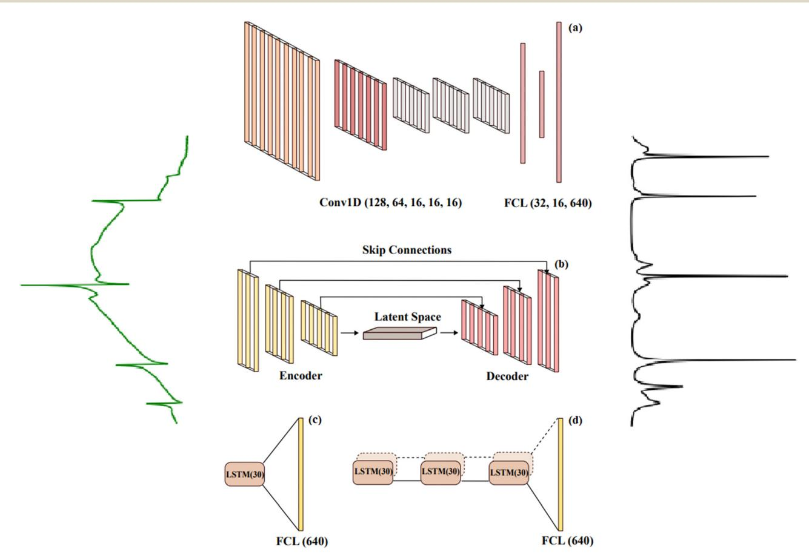
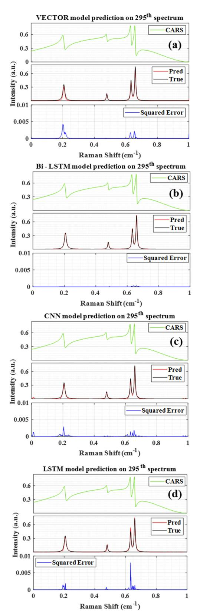
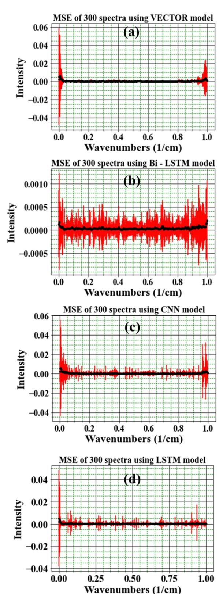
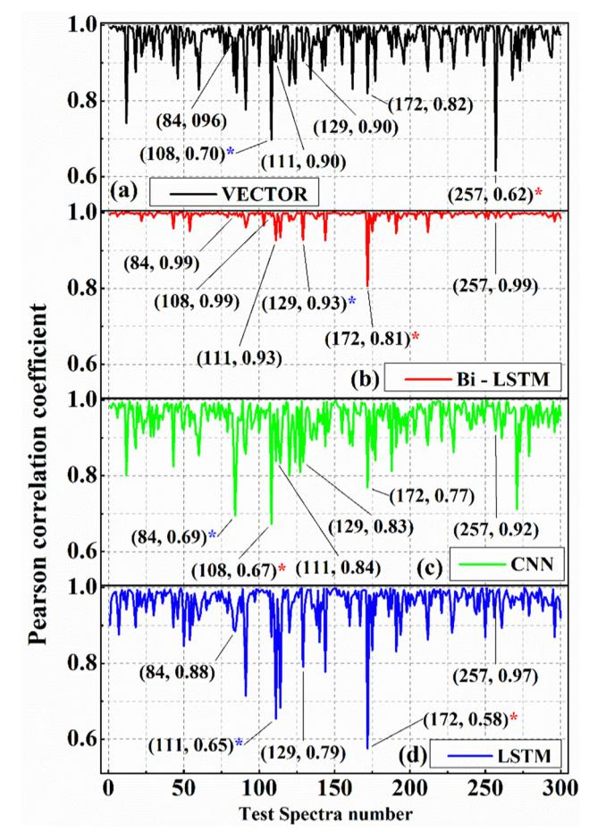
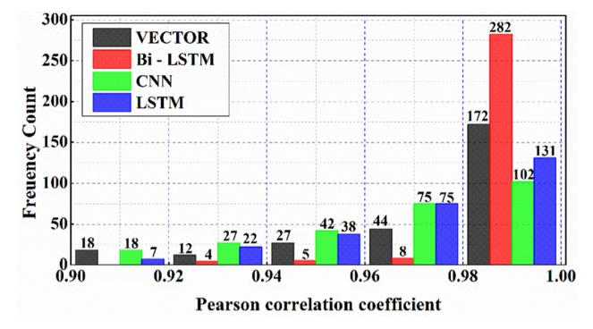
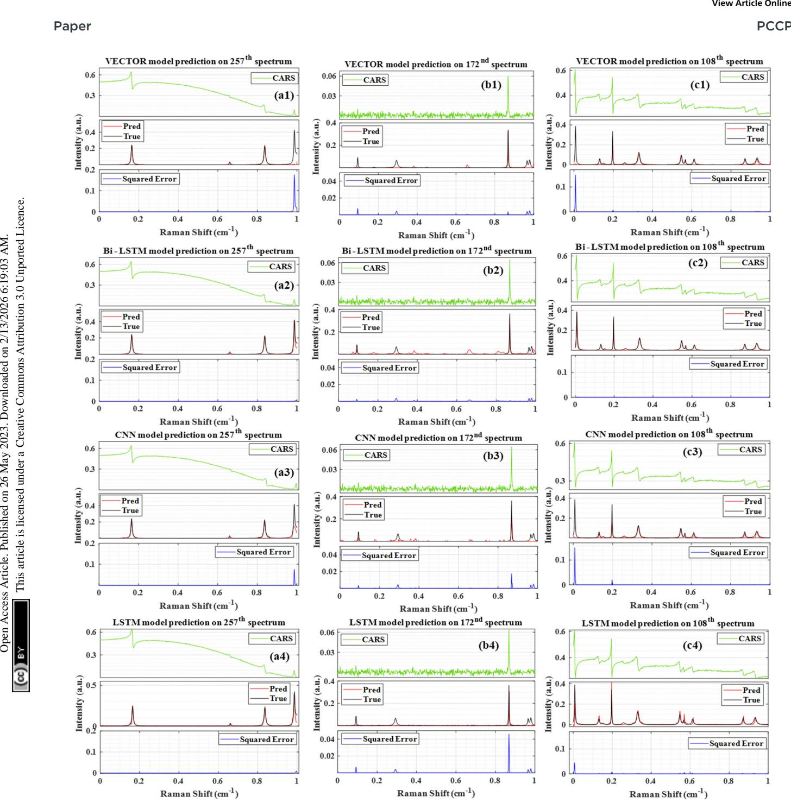
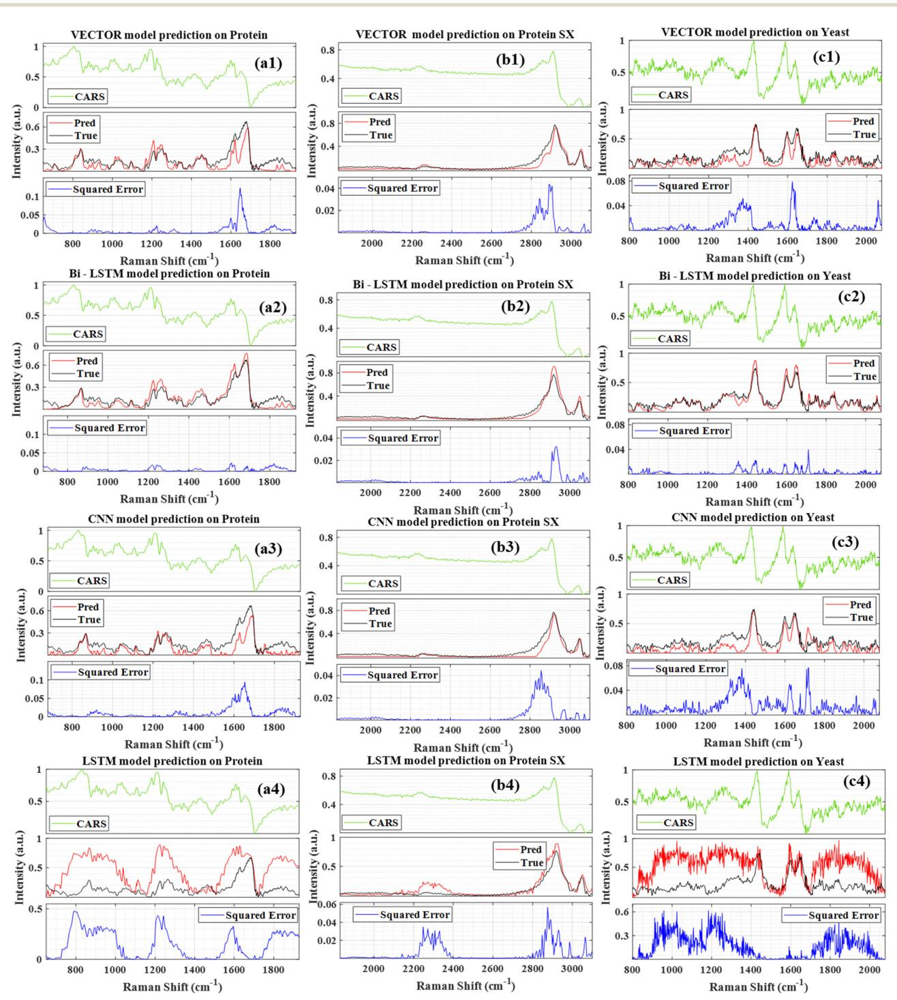
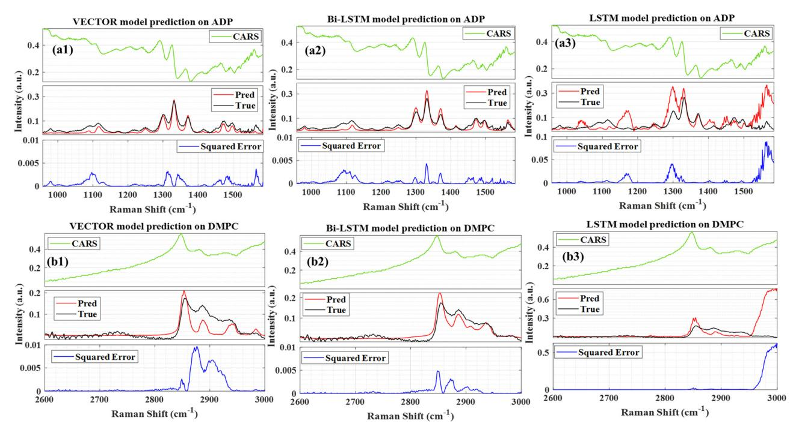
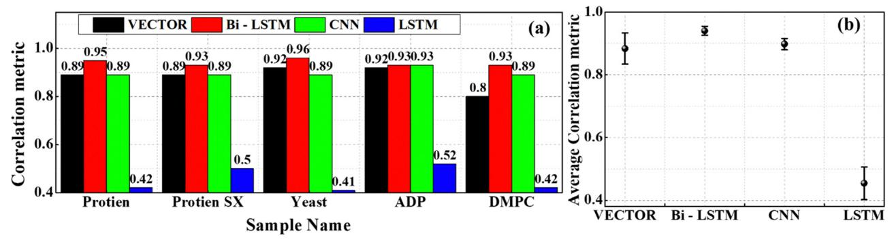

# **PCCP**

PAPER View Article Online

Cite this: *Phys. Chem. Chem. Phys.*, 2023, **25**, 16340

# Evaluating different deep learning models for efficient extraction of Raman signals from CARS spectra†

Rajendhar Junjuri, 🕩 ‡\*ab Ali Saghi, 🕩 ‡a Lasse Lensu 🕩 a and Erik M. Vartiainen 🕩

The nonresonant background (NRB) contribution to the coherent anti-Stokes Raman scattering (CARS) signal distorts the spectral line shapes and thus degrades the chemical information. Hence, finding an effective approach for removing NRB and extracting resonant vibrational signals is a challenging task. In this work, a bidirectional LSTM (Bi-LSTM) neural network is explored for the first time to remove the NRB in the CARS spectra automatically, and the results are compared with those of three DL models reported in the literature, namely, convolutional neural network (CNN), long short-term memory (LSTM) neural network, and very deep convolutional autoencoders (VECTOR). The results of the synthetic test data have shown that the Bi-LSTM model accurately extracts the spectral lines throughout the range. In contrast, the other three models' efficiency deteriorated while predicting the peaks on either end of the spectra, which resulted in a 60 times higher mean square error than that of the Bi-LSTM model. The Pearson correlation analysis demonstrated that Bi-LSTM model performance stands out from the rest, where 94% of the test spectra have correlation coefficients of more than 0.99. Finally, these four models were evaluated on four complex experimental CARS spectra, namely, protein, yeast, DMPC, and ADP, where the Bi-LSTM model has shown superior performance, followed by CNN, VECTOR, and LSTM. This comprehensive study provides a giant leap toward simplifying the analysis of complex CARS spectroscopy and microscopy.

Received 9th April 2023, Accepted 26th May 2023

DOI: 10.1039/d3cp01618h

rsc.li/pccp

# 1. Introduction

The spontaneous Raman spectroscopic technique measures the vibrational response of molecules and provides functional and compositional information on the major chemical constituents. However, the acquired Raman signal strength is weak and, combined with the fluorescence contributions, result in longer acquisition times, limiting its applications. In contrast, coherent anti-Stokes Raman scattering (CARS) is a nonlinear analytical method that offers similar fingerprint information to the spontaneous Raman technique, albeit orders of magnitude faster. This characteristic property enabled it as a prominent spectroscopic tool for the label-free imaging of cells and tissues in biomedical applications. Also, it has been significantly explored in other applications, such as materials science

$$I_{\text{CARS}} \propto |\chi_{\text{NR}}^{(3)} + \chi_{\text{R}}^{(3)}(\omega)|^2$$
 (1)

Here,  $\chi_{NR}^{(3)}$  and  $\chi_{R}^{(3)}$  correspond to the nonresonant and resonant third-order susceptibilities, respectively. As CARS is a coherent phenomenon, the  $\chi_{NR}^{(3)}$  and  $\chi_{R}^{(3)}$  responses of the sample interfere via eqn (1) and thus the nonresonant background (NRB) contribution cannot be removed by simple subtraction. The NRB serves as a stable homodyne amplifier which is responsible for the signal strength of CARS. Nevertheless, this coherent contribution simultaneously perturbs the measured CARS signal that significantly distorts the spectral line shapes. It is an inherent limitation in all CARS-based methods. In this milieu, various optical-based techniques have been explored to tackle the NRB, such as single-frequency CARS,6 frequency modulation CARS, polarization CARS, interferometric CARS, and pulse shaping CARS.10 All these experimental methods have reduced the NRB contribution but at the cost of increasing experimental complexity and price. With the NRB being a coherent signal, all these alternatives also drastically reduced the CARS spectral line intensities, 11 thus cancelling the benefit of the CARS approach.12 Furthermore, surrogate materials,

and nanotechnology. The intensity of the CARS signal is proportional to the susceptibility term and can be expressed as

&lt;sup>a LUT School of Engineering Science, LUT University, 53851 Lappeenranta, Finland. E-mail: rajendhar.j2008@gmail.com

b Leibniz Institute of Photonic Technology, Albert-Einstein-Strasse 9, 07745 Jena, Germany

 $\dagger$  Electronic supplementary information (ESI) available. See DOI: https://doi.org/10.1039/d3cp01618h

‡ These authors contributed equally.

PCCF Paper

such as coverslip-glass, salt, and water, have been traditionally utilized to reduce the NRB effect. These materials contain minimal or no vibrational peaks in a large spectroscopic window and have mitigated some of the ramifications but introduced errors in the measured amplitude.

Consequently, exploring for other methods to extract the phase relationship without physically removing the NRB is of paramount importance. In this context, numerical approaches such as the maximum entropy method (MEM)13 and the Kramers-Kronig (KK) relation14 have been widely utilized for phase retrieval. Furthermore, other algorithmic methods such as "phase-error correction", 15 "factorized Kramers-Kronig and error correction", 16 and "wavelet prism decomposition analysis"17 are also reported in the literature to mitigate the experimental artefacts and spectral line distortions in the CARS spectra. Recently, Charles et al. have proposed discrete Hilbert transform to remove the NRB. 18 However, these numerical techniques require a surrogate reference material, and/or the other simulation parameters need to be tuned to get the best results. All these complications can be overcome by utilizing machine learning algorithms where the model learns from the input CARS data and predicts the Raman signal. 19 Deep neural networks (DNNs) have been explored in several applications, such as weather forecasting, 20 natural language processing, 21 and computer vision.22 Moreover, it is also utilized in different spectroscopies, such as hyperspectral image analysis, 23 vibrational spectroscopy, 24,25 molecular excitation spectroscopy, 26 and laser-induced breakdown spectroscopy.27-29

Various deep learning (DL) approaches have also been recently explored via CARS spectroscopy to tackle the NRB removal problem.30-35 Valensise et al. have utilized a convolutional neural network (CNN) model to retrieve the imaginary part from the CARS spectral data.31 It is the first report on utilizing DL methods for removing the NRB and is referred to as SpecNet. Houhou et al. have used a long short-term memory (LSTM) neural network model to retrieve the Raman signal and their results are compared with the results of the MEM & KK.30 Wang et al. deployed very deep convolutional autoencoders (VECTOR) for removing the NRB, and their model's performance is compared with that of SpecNet.32 They have also shown that the VECTOR model with 16 layers has given optimum results in less computational time.

Our recent works have demonstrated that retraining the SpecNet with a combination of semisynthetic and synthetic data improves its performance.33 We have also applied a transfer learning approach to increase the CNN model efficacy in retrieving the imaginary part of the CARS spectra.34 Furthermore, the noise is also varied at various levels to analyse the sensitivity of the model after transfer learning. Very recently, we have also explored three different NRB types to simulate the CARS data.35 It has been revealed that considering the NRB as a fourth-order polynomial function instead of a product of two sigmoids improves the CNN model's efficiency. These three works have shown superior performance compared to the SpecNet, where spectral lines with minimal intensities are also predicted.33-35 Even though the CNN model trained with

polynomial NRB has predicted all the spectral lines of the experimental data, the intensity of a few lines deviated from the true one. Also, similar results were obtained with the LSTM30 and VECTOR models,32 where the performance was found to be sensitive when evaluating the experimental CARS data.

Furthermore, estimating the mean square error (MSE) throughout the spectral range can be considered as a critical parameter for evaluating the model's efficiency. However, no other reports have presented it, excluding our works33-35 to the best of our knowledge. It should be noted that the SpecNet has given a high MSE while predicting the peaks at the ends of the spectrum. It is observed because the model could not extract peaks when it encountered the spectral line that only had a rising or falling part instead of a full line shape. Even retraining SpecNet with semisynthetic data, 33 applying transfer learning,34 and training with the CARS data simulated via polynomial NRB35 could not avoid it and challenged the predictive ability of the models. These studies hint that exploring other DL approaches in addition to the CNN, LSTM, and VECTOR models can mitigate the aforementioned limitations.

Hence, in this work, we have explored the Bi-LSTM model for the first time for extracting the imaginary part of the CARS spectra. Also, the NRB is assumed to be a fourth-order polynomial function while producing the CARS training data, which has already shown optimum results.35 Furthermore, a comprehensive study is performed by comparing the performance of four DL models, namely, (1) VECTOR, (2) CNN, (3) LSTM, and (4) Bi-LSTM. This comparative study has been done for the first time to the best of our knowledge, and critically evaluates the trained model's efficiency in retrieving the Raman signal from the CARS data.

# Experimental details

#### 2.1 CARS spectra simulations

All the models have been trained on pure synthetic spectral data with parameters of the number of peaks, intensity, frequency, and linewidths to enable them to be generalized to the different spectral shapes of NRBs. The CARS spectrum simulation procedure can be found in our previous work.35 The simulation parameter details are presented in Table 1.

In brief, the vibrational frequencies are sampled over a normalized scale [0, 1]. The NRB is considered as a function of fourth-order polynomial as given in eqn (2)

$$NRB = a\omega^4 + b\omega^4 + c\omega^4 + d + e \tag{2}$$

Table 1 Details of the simulation parameters

| S. no | Simulation parameters   | Range           |
|-------|-------------------------|-----------------|
| 1     | No of peaks             | (1, 15)         |
| 2     | Peak amplitude $(A_k)$  | (0.01, 1)       |
| 3     | Line width $(\Gamma_k)$ | (0.001, 0.008)  |
| 4     | Noise $n(\omega)$       | (0.0005, 0.003) |

The coefficients a, b, and d are randomly selected from the range of values [-10, 10], whereas it is [-1, 1] for c and e coefficients. The uniformly distributed noise  $\eta(\omega)$  is added to the chi3 data for generating CARS data. A total of 50 000 synthetic training spectra are generated in Python, where each spectrum has 640 data points/wavenumbers. All the simulation parameters are randomly selected from the given range for generating each CARS spectrum, as shown in Table 1. The code to simulate the synthetic spectra is available here.36 The synthetic dataset used for training all the models is the same (640 data points), except for the VECTOR, as its architecture inherently requires a longer data length (1000 data points). Hence, 1D cubic spline interpolation was used to generate 1000 points from 640 points of the synthetic dataset. This technique ensures that there will be no modifications in interpolation data concerning the shapes and intensity, as shown in Fig. S1 in the ESI.†

#### 2.2 Details of the experimental CARS data

The CARS data are acquired from four samples, namely, ADP, DMPC lipid, yeast, and a protein droplet of FUS-LC (lowcomplexity domain of fused in sarcoma). The first three samples are recorded in one experimental configuration, and its

optical layout can be found here.37 ADP is an equimolar mixture of AMP, ADP, and ATP in water with a total concentration of 500 mM. DMPC is a small unilamellar vesicle (SUV) suspension with a concentration of 75 mM. The third sample is a living budding yeast cell (a zygote of Saccharomyces cerevisiae) measured from the mitochondria of the yeast cell.38 An ultrabroadband CARS spectrum covering both the fingerprint and CH-vibration regions of the FUS-LC droplet (protein) was measured by Y. Kan et al. with a home-built broadband CARS microscope.39 The protein sample is the low-complexity domain of RNA-binding protein fused in sarcoma (FUS-LC).39 Furthermore, sample preparation details and the CARS measurements are explained elsewhere. 40 The CARS line shape (the uppermost line shape) was denoised by the wavelet prism procedure, 17 and the corresponding Raman line shape was computed by the MEM procedure.41

# 3. Deep learning models

Four DL models, namely, (1) VECTOR, (2) CNN, (3) LSTM, and (4) Bi-LSTM, are briefly discussed in detail in this section. The typical schematic of the four models' architecture is presented in Fig. 1, and the complete details are given in Table S1 in the

Fig. 1 General schematic of the four models that are used, including (a) convolutional neural network model, (b) autoencoder model, (c) LSTM model, and (d) Bi-LSTM model. The input for all four models is a CARS spectrum, while the output is the corresponding Raman signal that is predicted by the models

ESI.† It is also worth considering that the Python code to train the VECTOR model is available in the GitHub repository but not the trained model weights. 42 So, we have directly retrained it by utilizing their code without modifying any of its model parameters. In the case of the CNN, the trained model weights are directly taken from our previous work35 and can be accessed from here. 43 Houhou et al. have reported the LSTM model, but the trained weights and the respective codes are not openly available.30 Therefore, we have retrained it without modifying the original model architecture. Finally, we have explored the Bi-LSTM model for the first time for CARS data analysis. The model architecture is inspired by ref. 44, where it was initially explored for analysing spectroscopic data of Type Ia Supernovae. However, we have modified the model parameters to achieve better results on the CARS data. All the trained model weights can be found in our GitHub repository.36 All the computational details are given in Table S1 in the ESI.† Also, the model learning curves are visualized in Fig. S4 in the ESI.†

#### Convolutional neural networks (CNN)

The CNN architecture consists of convolutional and fully connected layers together with pooling and flattening layers. The first part of the architecture includes a stack of convolution layers extracting relevant features from the data and producing new data representations called "feature maps". The main advantage of convolutional layers is that they function as filter banks where the parameters are learned, and the level of abstraction related to the data representation increases layerby-layer. Another benefit is moderate invariance to spatial or spectral translation enabled by the fact that each neuron in the convolution layer is connected to a limited neighbourhood of neurons of the preceding layer and the weights are shared by the neurons. This is relevant in Raman spectroscopy applications where the spectral lines/peaks can be shifted within the spectrum. In the second part of the architecture, fully connected layers have no limitations concerning the connections from the preceding layer and their respective weights. They are used to learn the mapping from the feature representation to the desired output of a specific type and dimensionality.

The CNN architecture used here is SpecNet.35 The typical schematic of the CNN model's architecture is presented in Fig. 1(a). It is composed of five 1-dimensional CLs (128,64,16,16,16) with filters of dimensions (32,16,8,8,8) and three FCLs of (32,16,640) dimensions, all followed by ReLU activation function, while Adam is applied as the optimization function and the loss function is MSE. It aims to remove the NRB, which produces different levels of spectral distortions, from the input broadband CARS spectra.

#### Very deep convolutional autoencoders (VECTOR)

An autoencoder (AE) is an artificial neural network (ANN) architecture that encodes high-dimensional input data to a low-dimensional latent space and then learns how to reconstruct the input from this low-dimensional vector. This architecture has been applied to different problems including facial recognition,45 feature detection,46 and anomaly detection.47

Typically, an AE is constructed from a symmetrical encoder and decoder with fully connected layers. 48 The encoder receives high-dimensional input data and during the training process learns how to reduce its dimension. It can be considered as a feature extractor that produces a feature representation of the lowest dimensionality from the encoder. In addition to reducing the dimensionality, this representation is unable to model the noise and nonessential information from the input data. The decoder learns how to reconstruct the input data from the encoded representation.

In this work, we have used the VECTOR-16 architecture proposed by Wang et al. 32 We have retrained it without modifying its architecture. It is composed of an eight-layer encoder of fully convolutional (1D) and a symmetrical eight-layer decoder of fully transposed convolutional (1D), and stochastic gradient descent (SGD) was used as an optimizer. MAE is used as the loss function between the input CARS spectra and the clean Raman spectra. In addition, skip connections49 have been used, which connect each layer from the encoder to the corresponding paired layer from the decoder; they avoid the padding phenomenon that usually happens in convolutional layers. These skip connections speed up the training process and improve the model's performance in deeper networks compared to the plain ones. They also help to mitigate the overfitting problem when the model is too complex and therefore improve the model generalization.

#### 3.3 Long short-term memory (LSTM) neural network

A recurrent neural network (RNN) is a type of ANN that allows the modelling of temporal dynamic behaviour in the architecture by containing loops between the layers. This characteristic enables the data samples to be dependent on each other and memorization of previous information - a feature that traditional ANNs suffer from. However, RNNs suffer from a problem related to long-term dependencies, which means that if the delay/distance between the depending input samples or sequences increases, it cannot model such dependencies.50 As a remedy for this problem, a long short-term memory (LSTM) network has been introduced.51 The LSTM architecture is based upon four neural network layers, including the forget gate, input gate, output gate, and cell state.

The proposed LSTM architecture is adapted from this work.30 Their code is not available for direct reuse, and its architecture is simple. It contains one LSTM layer of 30 units with ReLU as an activation function and sigmoid as a recurrent activation function. The loss function is MSE, the optimizer is Adam, and the learning rate is 0.005. They have simulated the CARS spectra with NRB as weak and strong regions.

#### 3.4 Bidirectional long short-term memory (Bi-LSTM) neural network

A bidirectional long short-term memory (Bi-LSTM)52 network is a variant of the LSTM architecture that enables the input data sequence to be modelled in both directions, forward and backward. This is implemented by following the input sequence backward through an additional backward LSTM

layer. Then the outputs of both forward and backward layers are combined through several ways, including average, sum, multiplication, and concatenation. Using two LSTM layers improves the learning of the long-term dependencies, and this leads to an improved final accuracy of the model.

The LSTM architecture is usually applied to ordered data without time labels like text classification or to constant timesampling rates such as stock price predictions. All these are usually observed in irregular time-sampling rates. Hence, a preprocessing method named functional principal component analysis (FPCA) was applied. Therefore, an additional dimension is needed to contain the phase information of the spectrum. Hence, the DL model should have an additional channel to contain it as the input data as well. LSTM does not have this channel, so as the solution, the Bi-LSTM model has been used and the phase information was integrated as the input as well. The proposed Bi-LSTM architecture was obtained from this work. 44 It consists of three bidirectional layers, each of them having 30 units, and a time-distributed fully connected layer as output, therefore achieving an output for each time step. MSE and Nadam were used as the loss function and the optimizer, respectively.44

## 4. Results and discussion

In the following sections, the results of the four models are discussed. First, the models are evaluated on the simulated data and later experimentally measured CARS data.

#### 4.1 Prediction on synthetic data

Initially, the efficiency of the four-trained models is demonstrated by retrieving the imaginary part from the 300 synthetic test spectra. These test spectra were independently generated apart from the training set where the spectral simulation parameter values are randomly selected from the given range of values as enumerated in Table 1. The NRB utilized for generating training data is a 4th-order polynomial function. However, three different NRBs were considered to simulate these 300 test spectra. Here, the idea is to estimate the four models' performance when they encounter the spectra simulated with NRB other than the 4th-order polynomial function. Furthermore, the first hundred spectra (1-100) of the 300 test spectra are simulated by considering the NRB as a 'Product of two Sigmoid', whereas spectra 101-200 are generated by assuming NRB as 'One sigmoid'. The last hundred (201-300) spectra were synthesized by adapting the NRB as a '4th order polynomial function'. These 300 synthetic test spectra are available here.43

4.1.1 Extraction of the imaginary part. Fig. 2(a)-(d) represents the predicted imaginary part of the 295th test spectrum by the VECTOR, Bi-LSTM, CNN, and LSTM models, respectively. This spectrum is arbitrarily considered as an example from the entire test set only to visualize the efficacy of the four trained models. In each plot, in the input, the CARS spectrum is presented at the top in green. The true and predicted imaginary

Fig. 2 Comparison of the results obtained from the four models: (a) VECTOR prediction, (b) Bi-LSTM prediction, (c) CNN prediction, and (d) LSTM prediction. The labels 'True' and 'Pred' represent the true and predicted imaginary parts, respectively

parts are shown in the middle, with black and green colors, respectively. The error between the true and predicted values is estimated; then the square of the error (SE) is presented at the bottom with the blue line. This SE plot can be considered a visualization tool for validating the performance of the models. The four models extracted all the spectral lines, albeit their intensity has deviated from the actual one for some models, as shown in Fig. 2(a)-(d). The estimated SE is found to be higher for LSTM, followed by the VECTOR, CNN, and Bi-LSTM, respectively.

It is noticed that some peaks with lower intensity were observed on either side of the spectra for CNN, which were actually not present in the true Raman signal. These spurious lines can degrade the performance of the CNN compared to other models. In the case of LSTM, the predicted spectral line intensities are a little higher; on the contrary, it is slightly lower for the VECTOR prediction. Fig. 2(c) illustrates the Raman signal retrieved from the Bi-LSTM model, where the extracted imaginary spectrum closely resembles the true spectrum. Also, it has not predicted any other spurious lines throughout the spectral range.

The SE plot visualization (represented at the bottom of the Figure, for example, see Fig. 2(a)) efficaciously demonstrates the differences between the true and retrieved Raman signals throughout the spectral range for a single test spectrum. Nevertheless, visualization for the entire test set would not be feasible. Therefore, the mean square error (MSE) plot is considered for evaluating each trained model, as shown in Fig. 3(a)-(d). The MSE is estimated by averaging the measured SE over 300 test spectra. The black dots in Fig. 3(a)-(d) represent the average SE, and the red line corresponds to their standard deviation. For easy interpretation, the total spectral window can be divided into three parts, the first region  $(0-0.1 \text{ cm}^{-1})$ , midregion  $(0.1-0.9 \text{ cm}^{-1})$ , and last region (0.6–1 cm-1), where the middle region itself accounts for 80% of total data points, and the remaining 20% represents the first and last regions.

It is also observed that the error is less in the midregion compared to the other two regions of the spectra. The measured MSE is the highest in the first region compared to the remaining two regions, as shown in Fig. 3(a)-(d). It is true for all four models, irrespective of their architecture. The standard deviation is found to be a maximum of  $\sim 0.06$  for the VECTOR and CNN, and it is slightly less for the LSTM  $\sim 0.055$ . However, a drastic change is observed in the case of the Bi-LSTM model, which has shown a 60 times lower standard deviation contrary to the other models, that is, only  $\sim 0.0012$ . Also, the deviation is approximately the same throughout the spectral range, except for a few points for the Bi-LSTM. However, the scenario is entirely different for the other three models. The deviation in the first region is more than 15 times compared to the midregion for the VECTOR model, whereas it is 5 and 10 times for the LSTM and CNN models, respectively.

In the last region, the maximum deviation is observed for the CNN model, that is,  $\sim 0.035$ , whereas the minimum is for the Bi-LSTM, that is,  $\sim 0.001$ . In the case of VECTOR, it is

Fig. 3 (a)-(d) The mean square error estimated for VECTOR, Bi-LSTM, CNN, and LSTM models, respectively. The black dots represent the mean value, whereas the red line corresponds to the standard deviation measured from the 300 test spectra.

PCCP

 $\sim 0.025$ , and it is  $\sim 0.005$  for the LSTM model. Also, the deviation is nearly the same in the mid and last regions for the LSTM. Overall, the MSE plot visually demonstrated that the Bi-LSTM model has a superior capability in predicting the imaginary part from the CARS spectra among all four models. The same behaviour is noticed for the mean absolute error (MAE), as shown in Fig. S5 in the ESI.† In the following section, Pearson correlation analysis is performed. It provides a unique numerical parameter for each test spectrum, that is, a correlation coefficient. Hence, it can be utilized as a performance metric for validating the predictions of the four different models.

4.1.2 Pearson correlation analysis. It is a statistical approach that estimates the strength of the linear relationship between two sets of continuous variables and provides a unique numerical value, that is, Pearson correlation coefficient (PCC).53 In this context, it represents a similarity percentage between the true and predicted imaginary parts of the CARS spectra. The measured PCC values can lie in the range of -1and 1, which correspond to negative and positive linear correlations, respectively.54 Overall, PCC value 1 represents the best match, that is, true and predicted spectra are identical, whereas 0 corresponds to no similarity at all. Finally, the correlation analysis is performed on the imaginary parts predicted by the four models, and the results are presented in Fig. 4(a)-(d), respectively. Two data points in the parathesis in Fig. 4 represent the test spectrum number and its measured PCC value, respectively.

The PCC values estimated for the Bi-LSTM model have given higher coefficients compared to the other models for more than 97% of test spectra, as shown in Fig. 4(b).

Only one spectrum has given a PCC value of  $\sim 0.80$  out of 300 spectra; all others have given PCCs of more than 0.92. In the case of CNN and VECTOR, four spectra have a PCC value less than 0.8, and it is five spectra for the LSTM model. Furthermore, a histogram plot is drawn to graphically visualize the distribution of the estimated PCCs for the 300 test spectra, as shown in Fig. 5. This plot presents the number of spectra that have the PCCs in a specific range, that is, frequency count in the selected PCC range. For example, seven spectra have PCC between 0.9 and 0.92 for the LSTM. Cumulatively, 273, 299, 264, and 273 spectra have PCCs > 0.9 for the VECTOR, Bi-LSTM, CNN, and LSTM models, respectively, which account for more than  $\sim 90\%$  of the test spectra. Hence, their distribution (on the x-axis) is presented only in the range of 0.9–1 instead of 0–1, which ascertains the best visualization of the PCC distribution.

Also, it is noticed that 282 spectra have PCC values > 0.98 for the Bi-LSTM model, which corresponds to the  $\sim$ 94% of total test data. It demonstrates that the Raman signal extracted using the Bi-LSTM model is in better agreement with the ground truth. On the other hand, only 102 and 131 spectra have PCC values >0.98 for the CNN and LSTM models, respectively, which account for less than  $\sim 50\%$  of the total data. The CNN and LSTM models' performances were found to be almost the same when comparing their PCC values. Hence, the frequency count in most of the bins is approximately the same for the LSTM and CNN models. Furthermore, their

Fia. 4 Pearson correlation coefficient (PCC) values estimated on predicted imaginary part by the (a) VECTOR, (b) LSTM, and (c) CNN, and (d) LSTM models. The data points in the parentheses represent the test spectrum number and its PCC value, respectively. A red asterisk denotes the lowest PCC value in the entire dataset. The blue asterisk represents the second-lowest PCC value

Fig. 5 Histogram plot of the measured PCC values of the four models.

estimated PCC difference is less than 0.05 for 253 spectra and less than 0.1 for 285 spectra, as shown in Fig. S2 in the ESI.†

Furthermore, it is observed that the maximum PCC value obtained is close to 1 for all the models. Nevertheless, the minimum values have shown a notable variation when Paper PCCP

Fig. 6 Comparison of the results obtained from the four models. (a1)–(a2) Raman signal extracted from the 257th test spectra using VECTOR, Bi-LSTM, CNN, and LSTM models, respectively. (b1)–(b4) Results of the 172nd spectrum. (c1)–(c4) Results of the 108th spectrum. 'Pred' is the predicted Raman signal, and 'True' represents the actual Raman signal. Squared error corresponds to their difference.

compared with the predictions of the Bi-LSTM model. The lowest predicted PCC value is B0.81 for the Bi-LSTM; meanwhile, it is B0.58, B0.62, and B0.67 for the LSTM, VECTOR, and CNN models, respectively. The test spectrum with the lowest PCC value in each model is marked with a red asterisk (\*) for easy representation. For example, it is the 257th spectrum for the VECTOR prediction, the 108th spectrum for CNN, and the 172nd spectrum in the case of Bi-LSTM and LSTM models.

The second lowest PCC value is presented with a blue asterisk. These test spectra, along with their Raman line shapes extracted by the four models, are shown in Fig. 6. These visualizations inherently represent the limitations of each model in retrieving the imaginary part from the CARS spectra. It also investigates the route cause for attaining the lowest PCC value for each trained model.

Fig. 6(a1)–(a4) illustrates the results obtained from the 257th test spectrum using VECTOR, Bi-LSTM, CNN, and LSTM

models, respectively. The input CARS spectrum has four spectral features in the entire spectral range where all the lines have a higher intensity, except for the peak at 0.66 cm-1. Among four lines, one is located near the right extrema, that is, at 0.99 cm-1, and it could not be extracted by the VECTOR, whereas the other three models predicted it, but a huge error is found in the case of CNN. A similar observation was noticed in our previous work, 33 where the CNN prediction capability is poor at the edges. The LSTM and Bi-LSTM models have predicted all the lines, including the line at 0.99 cm-1, and the predictive performance was found to be the same for both models. Furthermore, this inefficient extraction of the Raman line at 0.99 cm-1 has given an SE of  $\sim$  0.19 for the VECTOR and led to the minimum PCC value in the entire test dataset, that is,  $\sim 0.62$ . The SE for the Bi-LSTM, LSTM, and CNN is  $\sim 0.005$ ,  $\sim 0.01$ , and  $\sim 0.08$ , respectively.

Fig. 6(b1)-(b4) shows the results of the 172nd test spectrum obtained from the VECTOR, Bi-LSTM, CNN, and LSTM models, respectively. The input CARS spectrum has one strong line at  $\sim$  0.86 cm-1 and three very faint spectral lines in the remaining spectral range. These faint lines' intensities are close to the noise level. Also, the maximum spectral line intensity is only  $\sim$  0.062, and due to this, the spectrum looks noisy compared to other test spectra where the intensities are higher by more than order. All four models predicted only one line at  $\sim 0.86$  cm-1, and the rest of the lines were not extracted properly. Furthermore, the predicted intensities are matched with the true one for the Bi-LSTM where the lowest SE is noticed, that is,  $\sim 0.001$ , and the SE is 4, 48, and 18 times more for the VECTOR, LSTM, and CNN models, respectively. It is also observed that all the models have predicted some spurious lines with minute intensities throughout the spectral range. These observations affected the PCC measurements, and hence, the lowest coefficients,  $\sim 0.81$  and  $\sim 0.58$ , are achieved for Bi-LSTM and LSTM models, respectively.

Fig. 6(c1)-(c4) illustrates the 108th test spectrum results obtained from the VECTOR, Bi-LSTM, CNN, and LSTM models, respectively. The input CASRS spectrum has several vibrational spectral features with different peak intensities. Nevertheless, the first spectral line at  $\sim 0.006$  cm-1 (on the left extreme) has only half part, that is, the spectral line is started with the trailing part instead of the rising part. It is observed because of considering the spectral line/peak generation anywhere on the entire spectral range (0-1) during the CARS spectra simulation. So, the lines generated close to the extremes sometimes have either a rising or trailing part depending on the peak position and width. Hence, the error may also occur on the right side of the spectrum, as reported in our previous study.33 The CNN and VECTOR models have predicted all the Raman lines except for the first line at  $\sim 0.006$  cm-1, which is because of considering only half part of the spectral line. Similar observations were also noticed in the previous studies where the CNN model performance deteriorated when it encountered the spectral lines, with only having either a rising or trailing part.33 This inherent constraint has given a high SE of  $\sim 0.15$  and affected the PCC measurements, where its value is minimum ( $\sim 0.67$ )

for the CNN model and the second lowest PCC value ( $\sim 0.70$ ) for the VECTOR model. This could be a reason for the high MSE observed on either side of the extrema for the VECTOR and CNN models, as shown in Fig. 3(a) and (c), respectively. Furthermore, the Bi-LSTM and LSTM have predicted all the lines, including the first one on the left end. However, the LSTM model has given a high error compared to the Bi-LSTM model, which is of more than order.

Furthermore, the test spectra corresponding to the second lowest PCC value are presented in the ESI,† Fig. S3. It is the 84th spectrum for the CNN ( $\sim$  0.69), the 111th spectrum for the LSTM ( $\sim 0.65$ ), and the 129th spectrum for the Bi-LSTM ( $\sim$ 0.93) model. The results of the 111th spectrum are presented in the ESI,† Fig. S3(a1)-(a4), where the two spectral features are not predicted by the four models. These two spectral lines are very faint. Also, the predicted intestines have deviated, and the error is the highest for the LSTM, which is reflected in PCC measurements, and the error is minimum for the Bi-LSTM. The results of the 129th test spectrum are shown in the ESI,† Fig. S3(b1)-(b4), where the input CARS spectral line intensity is low. The SE of the spectral line at  $\sim 0.97$  (on the right extreme) is only  $\sim 0.004$  for the Bi-LSTM, whereas it is more than 20 times for the other three models. However, the Bi-LSTM could not predict the two lines, which led to the second lowest PCC value. Furthermore, the other three models also did not retrieve three/ four lines. In the case of the 84th spectrum, four models have predicted all the lines. Nevertheless, the retrieved peak intensities are deviated for all the models, except for Bi-LSTM, as shown in the ESI,† Fig. S3(c1)-(c4). The deviation is found to be maximum for the CNN, followed by the LSTM, VECTOR, and Bi-LSTM, respectively. The SE of the spectral line at  $\sim 0.97$  (on the right extreme) is only  $\sim 0.002$  for the Bi-LSTM, whereas it is 30, 22, and 13 times more for the CNN, LSTM, and VECTOR models, respectively. These visual findings clearly demonstrate that the Bi-LSTM model has superior capability in predicting imaginary parts compared to the other three models.

In conclusion, Fig. 4, 6 and the ESI,† Fig. S3, have visually demonstrated the imaginary part prediction capability of four models where the performance of the Bi-LSTM model was found to be best. Numerically, it performed well on more than 97% of the total test dataset (i.e., it has a higher PCC value than the other three models). It also revealed that the Bi-LSTM model has better capability when extracting spectral lines at the ends, even though they only have either a rising or trailing part which led to the lowest MSE even at the edges, as shown in Fig. 3(b).

Furthermore, the efficiency decreased when only it encountered the noisy CARS spectrum with a very low intensity. The results of the experimental CARS spectra are discussed in detail in the next section.

### 4.2 Prediction on experimental CARS spectra

This section critically examines the four trained models' potential by retrieving the Raman signal from the experimentally recorded CARS spectra. This detailed interrogation provides a comprehensive overview of the model's performance when working with the real CARS data, namely, ADP/AMP/ATP

mixture, DMPC, yeast, and protein samples. These biological samples have different resonance vibrational bands with various backgrounds. The sample preparation details and experimental setup overview are presented in Section 2.2.

Fig. 7 shows the results obtained from the four models on these experimental CARS data. Each plot in Fig. 7 is a three-

stacked plot (see Fig. 7(a) for reference). The first row represents the input CARS spectrum (green line), and the second row shows the true (black line) and predicted (red line) imaginary parts. The labels 'True' and 'Pred' in the Figure correspond to the imaginary part extracted by the maximum entropy method and trained DL models, respectively. Furthermore, the third

Fig. 7 Results of the experimental CARS spectra. (a1)-(a4) The imaginary parts predicted by the VECTOR, Bi-LSTM, CNN, and LSTM models for the protein sample in the spectral range of 800-1800 cm-1, respectively. (b1)-(b4) Prediction of the protein sample in the spectral range of 1830-3100  $cm^{-1}$ . (c1)–(c4) Predictions on yeast sample.

row represents the square of the error (blue line), that is, the square of the difference between the predicted and true imaginary parts. In each sample, the y-axis scale is considered to be the same for all four models for better visualization.

Fig. 7(a1)-(a4) represents the results of the protein sample in the fingerprint region (700-1900 cm-1) obtained from the VECTOR, Bi-LSTM, CNN, and LSTM models, respectively. It has various resonance vibrational bands, including tyrosine peaks at 850, 1210, and 1616 cm-1; amide I bands ( $\sim$ 1220-1250 cm-1); amide III bands (~1600-1700 cm-1); and CH2 band at 1445 cm-1. Here, the prediction of the Bi-LSTM model is in good agreement with the true one, where the SE is only  $\sim 0.02$ . In contrast, the LSTM model prediction is poor, where the extracted line shapes are very broad, and intensities deviate from the true ones. The other two models also predicted the spectral lines, albeit the intensities differed from the actual signal. Hence, the SE is found to be 6 times more for the VECTOR model compared to the Bi-LSTM, and it is 20 times for the LSTM and 5 times for the CNN. These observations are reflected in PCC measurements as shown in Fig. 9(a), where the highest value is obtained for the Bi-LSTM, that is,  $\sim 0.95$ , and the minimum is for the LSTM  $\sim 0.42$ . The other two have given the same value,  $\sim 0.89$ .

Fig. 7(b1)-(b4) represents the results of the protein sample in the range of 1830-3100 cm-1 from the VECTOR, Bi-LSTM, CNN, and LSTM models, respectively. The predicted line shapes match with the true one for the Bi-LSTM, but the peak intensities have slightly deviated. In contrast, the CNN and VECTOR models have correctly extracted the peak intensities; however, the line shapes have deteriorated. Similar behaviour is noticed

for the LSTM, and in addition, a broad spurious peak is also observed in the spectral range of 2200-2400 cm-1. An overall minimum SE of  $\sim 0.032$  is noticed for the Bi-LSTM, and a maximum of  $\sim 0.059$  is noticed for the LSTM.

Fig. 7(c1)-(c4) illustrates the imaginary part retrieved from the yeast sample by these four models, respectively. All the models except for the LSTM have extracted major resonance spectral features (a C-H bend of the aliphatic chain at 1440 cm-1, an amide band at 1654 cm-1, a C=C bending mode of phenylalanine at  $\sim 1590 \text{ cm}^{-1}$ ); nonetheless, the predicted intensities have deviated for the VECTOR and CNN models compared to the Bi-LSTM. In the case of LSTM, an intense ringing structure has appeared throughout the spectral region, excluding resonance peak positions that are not present in the true Raman spectra. The maximum estimated SE for Bi-LSTM is  $\sim 0.04$ , and it is more than two times for the LSTM and CNN. The error is more than an order for the LSTM due to the deteriorated spectral line shapes. The measured PCC values also conveyed the same information, where the predictive performance is superior for the Bi-LSTM ( $\sim 0.96$ ) model, followed by the VECTOR ( $\sim 0.92$ ), CNN ( $\sim 0.89$ ), and LSTM ( $\sim 0.41$ ), as shown in Fig. 9(a).

The results of the ADP/AMP/ATP mixture obtained by the VECTOR, Bi-LSTM, and LSTM are presented in Fig. 8(a1)-(a3). The CNN model prediction can be found here.35 The adenine vibrations are observed in the range of 1270 to 1400 cm-1, and the strongest one is noticed at  $\sim 1330$  cm-1, as shown in Fig. 8(a1)-(a3).55 All four models have retrieved these adenine vibrations, albeit the extracted line intensities do not match with the true intensities. The measured SE in this spectral

Fig. 8 Results of the experimental CARS spectra. (a1) – (a3) The imaginary parts predicted by the VECTOR, Bi-LSTM, and LSTM models for the ADP/AMP/ ATP mixture, respectively. (b1)-(b3) Predictions on DMPC sample

Fig. 9 (a) The PCC values measured on the experimental CARS predictions using four trained models. (b) The average value of the PCCs estimated from the five experimental CARS data

range is noticed maximum for the VECTOR models ( $\sim 0.003$ ), followed by the LSMT ( $\sim 0.04$ ), Bi-LSTM ( $\sim 0.004$ ), and CNN  $(\sim 0.001)$ . Furthermore, the symmetric stretching vibration of the triphosphate group of ATP ( $\sim 1123 \text{ cm}^{-1}$ ) is retrieved by all the models except for the LSTM. Hence, the highest SE is observed for the LSTM ( $\sim 0.36$ ) and the minimum is observed for the CNN ( $\sim 10^{-5}$ ). In the case of Bi-LSTM, the SE is  $\sim 10^{-4}$ , and it is  $\sim 10^{-2}$  for the VECTOR. A similar behaviour is noticed for the diphosphate resonance band ( $\sim 1100 \text{ cm}^{-1}$ ). The monophosphate resonance band of AMP (979 cm-1) is only extracted by Bi-LSTM and CNN. The LSTM and VECTOR models could not predict it and led to high SE. Here also, the PCC values measured for all four models with the Bi-LSTM and CNN are the best among all as they have the highest coefficient of  $\sim$  0.93, followed by VECTOR ( $\sim$  0.85) and LSTM ( $\sim$  0.42).

Fig. 8(b1)-(b3) depicts the results of the DMPC sample retrieved from the VECTOR, Bi-LSTM, and LSTM models, respectively. The results of the CNN can be found here.35 Prominent vibrational bands such as the CH stretch mode, symmetric and antisymmetric stretching modes of methylene groups, and overtone of the methylene scissoring mode appeared in the range of 2600-3000 cm-1.57,58 All four models have extracted these vibrational bands except for the LSTM. It could not predict the vibrational mode at 2946 cm-1 and led to a high error. Also, a strong spurious line appeared on the right extreme for the LSTM prediction. These observations have affected the PCC measurements, where the PCC values are  $\sim 0.8$ ,  $\sim 0.93$ ,  $\sim 0.89$ , and  $\sim 0.42$  for the VECTOR, Bi-LSTM, CNN, and LSTM models, respectively, as shown in Fig. 9(a). The Bi-LSTM model performance was found to be the best among all, where the highest average correlation coefficient is obtained for the Bi-LSTM, followed by CNN, VECTOR, and LSTM models, respectively, as shown in Fig. 9(b). However, a relatively higher computational time is required for Bi-LSTM, as presented in Table S1 in the ESI.†

Overall, the BLSTM model predictions are optimum not only on the synthetic data but also on the experimental data. However, a few limitations were noticed when evaluating it on the spectra with low spectral line intensities and higher noise levels where it could not find some peaks. These observations suggest that modification of the spectral simulation parameters is required. Especially, we are planning to train

the model with data generated by different noise levels in our future work. It would also be interesting to train the model with data generated by different simulation parameters (number of peaks, frequencies, amplitudes, etc.) to fit specific applications in different spectral regions.59 Also, fine-tuning or transferring learning mechanisms can be explored to circumvent these limitations, which positively impacts model performance.

## 5. Conclusions

We have systematically evaluated four DL models, namely, CNN, LSTM, VECTOR, and Bi-LSTM, to retrieve the Raman signals from the CARS spectra. These four algorithms fundamentally differ from each other and provide a comprehensive overview in the context of applying them to CARS data analysis. All the models were trained with CARS simulated with the NRBs as a fourth-order polynomial function. The test dataset (300 spectra) is independently generated, where three different NRBs (a fourth-order polynomial function, a product of two sigmoid, and a single sigmoid) are considered for every 100 spectra. The predictions of the test spectra revealed that Bi-LSTM performance is superior, where the measured mean square error is 60 times less compared to the other three models. Also, it predicted the spectral lines on either end of the spectra, but the other three models could not extract the same. Furthermore, the correlation analysis revealed that 97% of test data have a higher correlation coefficient for the Bi-LSTM model than the other three models. Also,  $\sim 94\%$  of total test spectra have PCC values > 0.98 for the Bi-LSTM model, whereas the value is 57% for the VECTOR, 34% for the LSTM, and 44% for the CNN model. Finally, the predictions on four experimental samples (protein, DMPC, ADP, and yeast) also confirmed the same, where the predictive capability is best for the Bi-LSTM model compared to the other three. This systematic study shows that the Bi-LSTM model has great potential and provides a giant leap toward analysing the CARS data.

## Author contributions

Rajendhar Junjuri (RJ), Lasse Lensu (LL), and Erik M. Vartiainen (EMV) have conceived the idea of the experiment.

Rajendhar Junjuri (RJ) has performed the analysis and prepared the initial draft. Ali Saghi (AS) has trained the VECTOR model and also contributed to the analysis part. Finally, the draft was revised by LL, EMV, and AS.

## Conflicts of interest

There are no conflicts to declare.

# **Acknowledgements**

This work is a part of the "Quantitative Chemically-Specific Imaging Infrastructure for Material and Life Sciences (qCSI)" project funded by the Academy of Finland (grant no. FIRI/ 327734). Also, we thank Michiel Müller and Hilde Rinia for providing the experimental measurements of the DMPC lipid sample and the AMP/ADP/ATP mixture, Masanari Okuno and Hideaki Kano for providing the experimental measurements of the yeast sample, and Yelena Kan and Sapun Parekh for providing the protein droplet measurements.

#### References

- 1 A. Zumbusch, G. R. Holtom and X. S. Xie, Threedimensional vibrational imaging by coherent anti-Stokes Raman scattering, Phys. Rev. Lett., 1999, 82, 4142.
- 2 L. M. Malard, L. Lafeta, R. S. Cunha, R. Nadas, A. Gadelha, L. G. Cançado and A. Jorio, Studying 2D materials with advanced Raman spectroscopy: CARS, SRS and TERS, Phys. Chem. Chem. Phys., 2021, 23, 23428-23444.
- 3 K. I. Popov, A. F. Pegoraro, A. Stolow and L. Ramunno, Image formation in CARS and SRS: effect of an inhomogeneous nonresonant background medium, Opt. Lett., 2012, 37, 473-475.
- 4 G. I. Petrov, R. Arora and V. V. Yakovlev, Coherent anti-Stokes Raman scattering imaging of microcalcifications associated with breast cancer, Analyst, 2021, 146, 1253-1259.
- 5 C. L. Evans and X. S. Xie, Coherent anti-Stokes Raman scattering microscopy: chemical imaging for biology and medicine, Annu. Rev. Anal. Chem., 2008, 1, 883-909.
- 6 O. Burkacky, A. Zumbusch, C. Brackmann and A. Enejder, Dual-pump coherent anti-Stokes-Raman scattering microscopy, Opt. Lett., 2006, 31, 3656-3658.
- 7 F. Ganikhanov, C. L. Evans, B. G. Saar and X. S. Xie, Highsensitivity vibrational imaging with frequency modulation coherent anti-Stokes Raman scattering (FM CARS) microscopy, Opt. Lett., 2006, 31, 1872-1874.
- 8 J.-X. Cheng, L. D. Book and X. S. Xie, Polarization coherent anti-Stokes Raman scattering microscopy, Opt. Lett., 2001, 26, 1341-1343.
- 9 M. Jurna, J. P. Korterik, C. Otto, J. L. Herek and H. L. Offerhaus, Background free CARS imaging by phase sensitive heterodyne CARS, Opt. Express, 2008, 16, 15863-15869.
- 10 S. O. Konorov, M. W. Blades and R. F. B. Turner, Lorentzian amplitude and phase pulse shaping for nonresonant

- background suppression and enhanced spectral resolution in coherent anti-Stokes Raman scattering spectroscopy and microscopy, Appl. Spectrosc., 2010, 64, 767-774.
- 11 M. Müller and A. Zumbusch, Coherent anti-Stokes Raman scattering microscopy, ChemPhysChem, 2007, 8, 2156-2170.
- 12 M. Cui, B. R. Bachler and J. P. Ogilvie, Comparing coherent and spontaneous Raman scattering under biological imaging conditions, Opt. Lett., 2009, 34, 773-775.
- 13 E. M. Vartiainen, Phase retrieval approach for coherent anti-Stokes Raman scattering spectrum analysis, J. Opt. Soc. Am. B, 1992, 9, 1209-1214.
- 14 Y. Liu, Y. J. Lee and M. T. Cicerone, Broadband CARS spectral phase retrieval using a time-domain Kramers-Kronig transform, Opt. Lett., 2009, 34, 1363-1365.
- 15 C. H. Camp Jr, Y. J. Lee and M. T. Cicerone, Quantitative, comparable coherent anti-Stokes Raman scattering (CARS) spectroscopy: correcting errors in phase retrieval, J. Raman Spectrosc., 2016, 47, 408-415.
- 16 C. H. Camp Jr, J. S. Bender and Y. J. Lee, Real-time and highthroughput Raman signal extraction and processing in CARS hyperspectral imaging, Opt. Express, 2020, 28, 20422-20437.
- 17 Y. Kan, L. Lensu, G. Hehl, A. Volkmer and E. M. Vartiainen, Wavelet prism decomposition analysis applied to CARS spectroscopy: a tool for accurate and quantitative extraction of resonant vibrational responses, Opt. Express, 2016, 24, 11905-11916.
- 18 C. H. Camp, Raman signal extraction from CARS spectra using a learned-matrix representation of the discrete Hilbert transform, Opt. Express, 2022, 30, 26057-26071.
- 19 Y. LeCun, Y. Bengio and G. Hinton, Deep learning, Nature, 2015, 521, 436-444.
- 20 J. N. K. Liu, Y. Hu, Y. He, P. W. Chan and L. Lai, Information Granularity, Big Data, and Computational Intelligence, Springer, 2015, pp. 389-408.
- 21 L. Deng and Y. Liu, Deep learning in natural language processing, Springer, 2018.
- 22 Y. Guo, Y. Liu, A. Oerlemans, S. Lao, S. Wu and M. S. Lew, Deep learning for visual understanding: A review, Neurocomputing, 2016, 187, 27-48.
- 23 F. Lussier, V. Thibault, B. Charron, G. Q. Wallace and J.-F. Masson, Deep learning and artificial intelligence methods for Raman and surface-enhanced Raman scattering, TrAC, Trends Anal. Chem., 2020, 124, 115796.
- 24 J. Yang, J. Xu, X. Zhang, C. Wu, T. Lin and Y. Ying, Deep learning for vibrational spectral analysis: Recent progress and a practical guide, Anal. Chim. Acta, 2019, 1081, 6-17.
- 25 R. Luo, J. Popp and T. Bocklitz, Deep Learning for Raman Spectroscopy: A Review, Analytica, 2022, 3, 287-301.
- 26 K. Ghosh, A. Stuke, M. Todorović, P. B. Jørgensen, M. N. Schmidt, A. Vehtari and P. Rinke, Deep learning spectroscopy: Neural networks for molecular excitation spectra, Adv. Sci., 2019, 6, 1801367.
- 27 S. K. Anubham, R. Junjuri, A. K. Myakalwar and M. K. Gundawar, An approach to reduce the sample consumption for LIBS based identification of explosive materials, Def. Sci. J., 2017, 67(3), 254-259.

Paper

28 E. Mal, R. Junjuri, M. K. Gundawar and A. Khare, Temporal characterization of laser-induced plasma of tungsten in air, Laser Part. Beams, 2020, 38, 14-24.

- 29 R. Junjuri, S. A. Nalam, E. Manikanta, S. S. Harsha, P. P. Kiran and M. K. Gundawar, Spatio-temporal characterization of ablative Cu plasma produced by femtosecond filaments, Opt. Express, 2021, 29, 10395.
- 30 R. Houhou, P. Barman, M. Schmitt, T. Meyer, J. Popp and T. Bocklitz, Deep learning as phase retrieval tool for CARS spectra, Opt. Express, 2020, 28, 21002-21024.
- 31 C. M. Valensise, A. Giuseppi, F. Vernuccio, A. De la Cadena, G. Cerullo and D. Polli, Removing non-resonant background from CARS spectra via deep learning, APL Photonics, 2020, 5, 61305.
- 32 Z. Wang, K. O' Dwyer, R. Muddiman, T. Ward, C. H. Camp and B. M. Hennelly, VECTOR: Very deep convolutional autoencoders for non-resonant background removal in broadband coherent anti-Stokes Raman J. Raman Spectrosc., 2022, 53, 1081-1093.
- 33 R. Junjuri, A. Saghi, L. Lensu and E. M. Vartiainen, Convolutional neural network-based retrieval of Raman signals from CARS spectra, Opt. Continuum, 2022, 1, 1324.
- 34 A. Saghi, R. Junjuri, L. Lensu and E. Vartiainen, Semisynthetic data generation to fine-tune a convolutional neural network for retrieving Raman signals from CARS spectra, Opt. Continuum, 2022, 1(11), 2360–2373.
- 35 R. Junjuri, A. Saghi, L. Lensu and E. M. Vartiainen, Effect of non-resonant background on the extraction of Raman signals from CARS spectra using deep neural networks, RSC Adv., 2022, 12, 28755-28766.
- 36 R. Junjuri, Four DL models evaluation on CARS data, https://github.com/Junjuri/Four-DL-models-comparisonfor-evaluating-CARS.
- 37 M. Müller and J. M. Schins, Imaging the thermodynamic state of lipid membranes with multiplex CARS microscopy, J. Phys. Chem. B, 2002, 106, 3715-3723.
- 38 M. Okuno, H. Kano, P. Leproux, V. Couderc, J. P. R. Day, M. Bonn and H. Hamaguchi, Quantitative CARS molecular fingerprinting of single living cells with the use of the maximum entropy method, Angew. Chem., Int. Ed., 2010, **122**, 6925–6929.
- 39 A. C. Murthy, G. L. Dignon, Y. Kan, G. H. Zerze, S. H. Parekh, J. Mittal and N. L. Fawzi, Molecular interactions underlying liquid – liquid phase separation of the FUS low-complexity domain, Nat. Struct. Mol. Biol., 2019, 26, 637-648.
- 40 S. Chatterjee, Y. Kan, M. Brzezinski, K. Koynov, R. M. Regy, A. C. Murthy, K. A. Burke, J. J. Michels, J. Mittal and N. L. Fawzi, Reversible kinetic trapping of fus biomolecular condensates, Adv. Sci., 2022, 9, 2104247.
- 41 E. M. Vartiainen, H. A. Rinia, M. Müller and M. Bonn, Direct extraction of Raman line-shapes from congested CARS spectra, Opt. Express, 2006, 14, 3622-3630.
- 42 VECTOR-CARS, https://github.com/villawang/VECTOR-CARS.

- 43 R. Junjuri, CARS data analysis with different NRB, https:// github.com/Junjuri/LUT.
- 44 L. Hu, X. Chen and L. Wang, Spectroscopic Studies of Type Ia Supernovae Using LSTM Neural Networks, Astrophys. J., 2022, 930, 70.
- 45 G. E. Hinton, A. Krizhevsky and S. D. Wang, International conference on artificial neural networks, Springer, 2011, pp. 44-51.
- 46 A. Géron, Hands-on machine learning with Scikit-Learn, Keras, and TensorFlow, 'O'Reilly Media, Inc.', 2022.
- 47 C.-Y. Liou, J.-C. Huang and W.-C. Yang, Modeling word perception using the Elman network, Neurocomputing, 2008, 71. 3150-3157.
- 48 J. Schmidhuber, Deep learning in neural networks: An overview, Neural networks, 2015, 61, 85-117.
- 49 K. He, X. Zhang, S. Ren and J. Sun, in Proceedings of the IEEE conference on computer vision and pattern recognition, 2016, pp. 770-778.
- 50 Z. C. Lipton, J. Berkowitz and C. Elkan, A critical review of recurrent neural networks for sequence learning, arXiv, arXiv1506.00019, Prepr.
- 51 S. Hochreiter and J. Schmidhuber, Long short-term memory, Neural Comput., 1997, 9, 1735-1780.
- 52 M. Schuster and K. K. Paliwal, Bidirectional recurrent neural networks, IEEE Trans. Signal Process., 1997, 45, 2673-2681.
- 53 X. Tan, X. Chen and S. Song, A computational study of spectral matching algorithms for identifying Raman spectra of polycyclic aromatic hydrocarbons, J. Raman Spectrosc., 2017, 48, 113-118.
- 54 P. Schober, C. Boer and L. A. Schwarte, Correlation coefficients: appropriate use and interpretation, Anesth. Analg., 2018, 126, 1763-1768.
- 55 K. T. Yue, C. L. Martin, D. Chen, P. Nelson, D. L. Sloan and R. Callender, Raman spectroscopy of oxidized and reduced nicotinamide adenine dinucleotides, Biochemistry, 1986, 25, 4941-4947.
- 56 L. Rimai, T. Cole, J. L. Parsons, J. T. Hickmott Jr and E. B. Carew, Studies of Raman spectra of water solutions of adenosine tri-, di-, and monophosphate and some related compounds, Biophys. J., 1969, 9, 320-329.
- 57 R. Mendelsohn and D. J. Moore, Vibrational spectroscopic studies of lipid domains in biomembranes and model systems, Chem. Phys. Lipids, 1998, 96, 141-157.
- 58 A. Fasanella, K. Cosentino, A. Beneduci, G. Chidichimo, E. Cazzanelli, R. C. Barberi and M. Castriota, Thermal structural evolutions of DMPC-water biomimetic systems investigated by Raman Spectroscopy, Biochim. Biophys. Acta, Biomembr., 2018, 1860, 1253-1258.
- 59 A. I. Cowen-Rivers, W. Lyu, R. Tutunov, Z. Wang, A. Grosnit, R. R. Griffiths, A. M. Maraval, H. Jianye, J. Wang and J. Peters, HEBO: Pushing The Limits of Sample-Efficient Hyper-parameter Optimisation, J. Artif. Intell. Res., 2022, 74, 1269-1349.