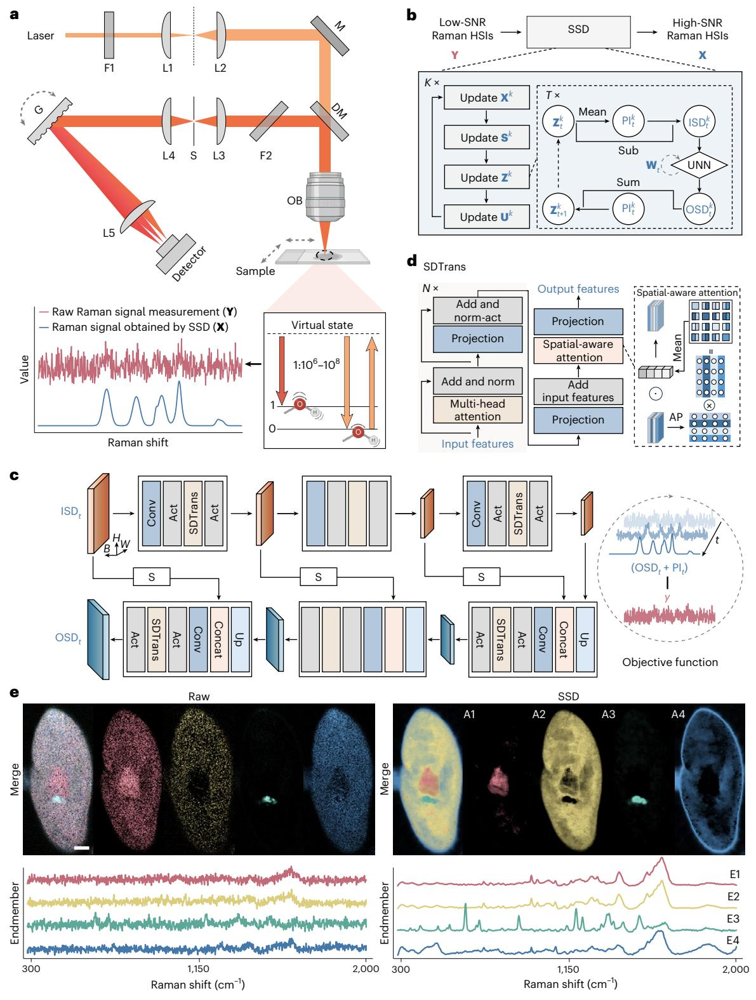
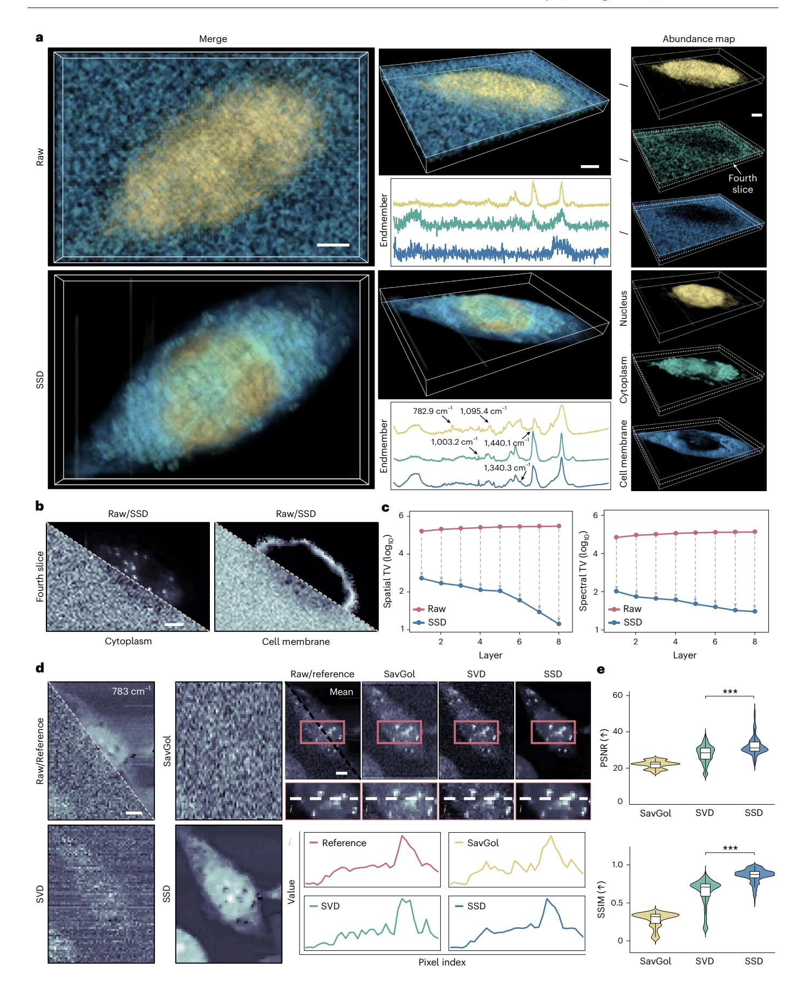
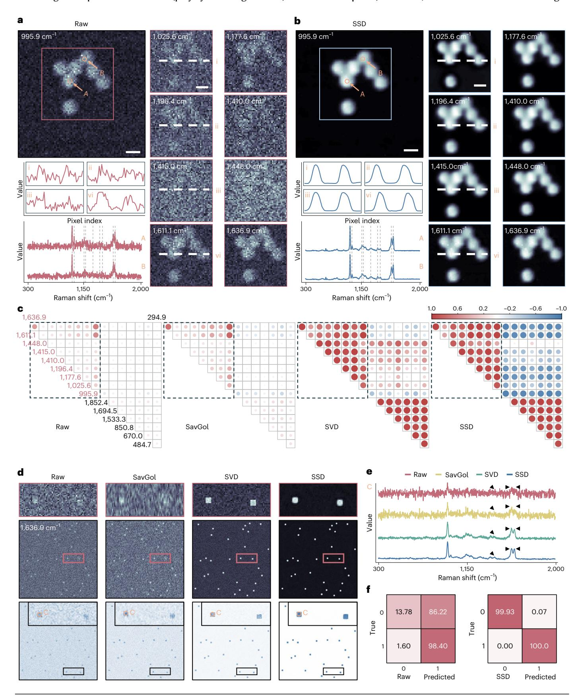
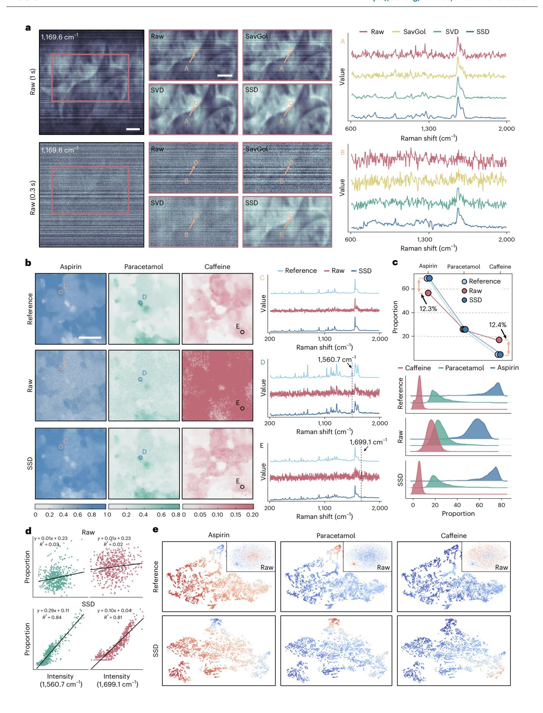

### nature computational science

**Article** 

https://doi.org/10.1038/s43588-026-00957-3

# Self-optimized spectral distance for low-light high-throughput Raman hyperspectral imaging

Received: 11 April 2025

Accepted: 9 January 2026

Published online: 23 February 2026

Yurong Chen1,2,7, Shen Wang3,4,5,6,7, Yaonan Wang 1,2,7, Jianxu Mao1,2, Lizhu Liu1,2, Xiaoxu Cao3,4,5,6, Zhuo Chen 3,4,5,6 & Hui Zhang 1,2

Raman hyperspectral imaging is a powerful technique for probing the intrinsic properties of samples by combining vibrational spectroscopy with spatial imaging. Despite its potential, the inherently weak Raman scattering signal typically necessitates prolonged acquisition times or high-power lasers, thereby limiting its efficiency and broader applicability. Here we present a computational method for facilitating Raman imaging under challenging conditions. We propose that even low-quality measurements-acquired with short integration times or low-power lasers-still contain sufficient information of Raman spectra. To this end, an unsupervised learning-based method, self-optimized spectral distance (SSD), is developed to reconstruct Raman images directly from 'noisy' measurements. By eliminating the dependence on large-scale training datasets, long imaging times and high-energy lasers, SSD helps to advance high-throughput Raman imaging. In diverse applications, including cellular structure analysis, microparticle detection and pharmaceutical ingredient identification, SSD achieves high imaging quality while reducing acquisition time and excitation power at least one order of magnitude.

Raman hyperspectral imaging (HSI) has gained considerable attention for its ability to provide detailed molecular and spatial distribution information via the synergy of Raman spectroscopy¹ and imaging techniques. Compared with other chemical mapping techniques, such as Fourier transform infrared imaging², and fluorescence imaging³,⁴ or calcium imaging⁵,6, Raman HSI offers distinct advantages, including non-destructive analysis, minimal sample preparation, and high spatial and spectral resolution. These attributes have positioned Raman HSI as a powerful analytical tool in diverse disciplines, spanning biology7,8, medicine⁵,¹¹¹0, materials science¹¹¹ and pharmaceuticals¹².

In conventional Raman HSI systems, hyperspectral images are obtained by raster scanning the sample, collecting a Raman spectrum

at each spatial point or line  $^{13,14}$ . However, spontaneous Raman signals are inherently weak (Fig. 1a), with only 1 out of  $10^6$  to  $10^8$  incident photons undergoing Raman scattering  $^{15}$ . Consequently, acquiring high-quality Raman signals usually requires extended acquisition times and/or high-energy excitation lasers. These demands not only prolong the already lengthy scanning process but also raise concerns about sample damage, particularly when working with sensitive materials or biological samples.

To improve signal strength and reduce imaging time, several approaches have been explored. Surface-enhanced Raman spectroscopy16,17, for example, uses metallic nanostructures (silver or gold nanoparticles) to amplify the Raman signal via localized surface

¹School of Artificial Intelligence and Robotics, Hunan University, Changsha, China. ²National Engineering Research Center of Robot Visual Perception and Control Technology, Changsha, China. ³Molecular Science and Biomedicine Laboratory (MBL), Hunan University, Changsha, China. ⁴State Key Laboratory of Chemo and Biosensing, Hunan University, Changsha, China. ⁵College of Environmental Science and Engineering, Hunan University, Changsha, China. ⁵College of Chemistry and Chemical Engineering, Hunan University, Changsha, China. ³These authors contributed equally: Yurong Chen, Shen Wang, Yaonan Wang. ⊠e-mail: yaonan@hnu.edu.cn; zhuochen@hnu.edu.cn; zhanghui1983@hnu.edu.cn

**Fig. 1** | **Schematic overview of SSD and its performance. a**, Diagram of the spontaneous Raman HSI system. Owing to the intrinsically weak Raman scattering compared with Rayleigh scattering, the raw Raman measurements (**Y**) are typically noisy. **G**, diffraction grating; F1, clean-up filter; F2, long-pass filter; M, reflection mirror; L1–L5, lenses L1–L5; DM, dichroic mirror; S, slit; OB, objective lens. **b**, Framework of the proposed SSD algorithm. ISD, initial spectral distance; OSD, optimized spectral distance. *K* × and *T* × denote the number of iterations and training epochs for the untrained neural network, respectively. **c**, Architecture of the UNN used in SSD. It includes convolutional layers (Conv), activation functions (Act), designed spectral distance

transformer module (SDTrans), an upsampling layer (Up), concatenation (Concat) and skip-connection (S). **d**, Structure of SDTrans. AP, average pooling; Norm, normalization layer; ⊙, element-wise; ⊗, matrix product, respectively. *N* × denotes the number of stages. **e**, Example of SSD performance on biological data. Unmixing analysis of raw *Paramecium*Raman hyperspectral images versus SSD-reconstructed images. Abundance maps (A1–A4) and their corresponding endmembers (E1–E4) are shown. Scale bar, 20 µm. Objective lens and microscope slide icons created in BioRender. Chen, Y. (2025) https://BioRender.com/0gvu8qv.

plasmon resonance. Other methods such as coherent anti-Stokes Raman scattering[18,](#page-12-17)[19](#page-12-18) and stimulated Raman scattering[20](#page-13-0),[21](#page-13-1) accelerate the imaging process by leveraging nonlinear Raman effects. While these techniques have proven valuable in applications such as cellular and biomedical imagin[g22](#page-13-2),[23,](#page-13-3) high equipment costs, complex set-ups and limited spectral ranges restrict their applicability to a narrower range of samples.

Alternatively or complementarily, computational methods have gained considerable attention for their capability to reconstruct high signal-to-noise ratio (SNR) Raman hyperspectral images from low-quality or incomplete measurements, which are acquired with short integration times or low-power lasers[24.](#page-13-4) Traditional computational Raman HSI methods, relying on denoising algorithms[25,](#page-13-5) such as singular value decomposition (SVD), have struggled to effectively separate the weak Raman signal from complex background noise while preserving fine spatial information. Recent advances in deep learning have shown promise in improving Raman imaging quality[26](#page-13-6). However, the common supervised learning-based methods require large datasets of paired low- and high-SNR Raman images, which are expensive or even impractical to collect.

To mitigate these problems, recent studies have explored modeling noise characteristics of Raman imaging system[s27](#page-13-7). They leverage neural networks to predict the noise component in raw measurements. Although synthetic data can be used to substitute real low-/high-SNR paired datasets in network training, several challenges remain. (1) High computational cost: existing algorithms operate within a time-consuming 'training–testing' framework, where the training process typically takes hours or even days. (2) Limited performance: predominantly convolutional neural network-based methods focus on local feature extraction. The spatial long-range correlations and spectral correlations inherent in Raman hyperspectral data are unexplored, resulting in suboptimal performance. (3) Poor generalization: training on specific datasets (real or synthetic) hinders their ability to generalize across different experimental conditions and instruments.

In this study, we propose self-optimized spectral distance (SSD) for computational Raman HSI. First, unlike previous approaches, SSD directly reconstructs high-quality Raman images from low-SNR measurements without requiring pretraining. Furthermore, by predicting the spectral distance between each band and a prior image rather than reconstructing the entire spectra or noise components, SSD substantially reduces the burden of networks and computational complexity. Second, SSD explicitly incorporates the long-range spatial and spectral correlations through a dedicated network design. Moreover, the proposed algorithm is optimized according to the currently captured scenes, which demonstrates its superior generalization capability. Extensive experiments—including high-throughput cellular imaging, fast detection of polystyrene microparticles and identification of pharmaceutical ingredients—demonstrate the superior performance of SSD in accelerating Raman HSI workflows by reducing acquisition time and improving imaging quality.

#### **Results**

#### **Principle and set-up of SSD**

The optical configuration of the Raman HSI system used in this study is illustrated in Fig. [1a,](#page-1-0) and details can be found in Supplementary Section 5. To mitigate the inherent weakness of Raman scattering issue, we propose SSD to facilitate high-throughput imaging by reconstructing high-quality Raman hyperspectral images from low-SNR measurements. First, we consider the acquired low-SNR data (**Y**) as a highly noisy version of the high-quality image (**X**). In addition, as noise is unknown and complex[3](#page-12-2),[28](#page-13-8)[–30](#page-13-9), we formulate the observation model of computational Raman HSI as

$$\mathbf{Y} = \mathbf{X} + \mathbf{S},\tag{1}$$

where **S** represents the composite noise. The goal of computational methods is to reconstruct **X** given **Y**. Previous works either rely on large datasets of paired **X** and **Y** (ref. [26](#page-13-6)) or assume specific noise distributio[n27](#page-13-7). In contrast, SSD obtains high-SNR Raman hyperspectral images without these constraints, requiring only the raw measurements **Y**.

In particular, the SSD algorithm works through an iterative optimization process (Fig. [1b\)](#page-1-0). Detailed steps of SSD are provided in 'Framework of SSD' in Methods and Supplementary Algorithm 1. In summary, we leverage the convex programming framework with our proposed prior, which considers that desired Raman hyperspectral images can be decomposed into a prior image (PI) and the spectral distance (SD) between the PI and each spectral band. Both the PI and SD are optimized in a self-supervised (unsupervised) learning manner (Fig. [1b,c](#page-1-0)). The architecture of the designed network to generate the PI and SD is illustrated in 'Network architecture and implementation details' in Methods, Supplementary Tables 1 and 2, and Supplementary Figs. 1 and 2. In the end, SSD can obtain high-SNR data from a low-SNR raw measurement (Fig. [1e\)](#page-1-0).

#### **Foundational advancement in computational Raman HSI with SSD**

To evaluate the potential of the proposed SSD-assisted fast Raman HSI method, we began by testing it on diverse simulated Raman hyperspectral images. Three high-quality datasets, representing ground-truth Raman images (acquired with slow imaging speed), were synthesized by combining six noise-free endmembers with their corresponding abundance maps (Supplementary Fig. 3). To simulate low-SNR images obtained under fast imaging conditions, we added Gaussian–Poisson mixed noise to the high-quality data. This foundational step was crucial in demonstrating how SSD could enhance the quality of Raman hyperspectral images when working with noisy, fast-acquired data.

Results on the first simulated Raman hyperspectral images, with patterns 'H', 'N', 'U', 'R', 'V' and 'C', are presented in Fig. [2a](#page-3-0). Spectral images are shown at three specific bands: the 100th, 300th and 480th, along with the mean of all bands (PI in this paper). The SSD-reconstructed data demonstrate a clear improvement in spatial features compared with the raw data. Raman spectra at points 'A', 'B' and 'C' (marked in the average image) for both the raw data (red lines) and SSD-reconstructed data (blue lines) show enhanced spectral fidelity. Intensity profiles along a white dashed line ('i') further highlight the ability of SSD to recover finer spatial details. Additional unmixing results can be found in Supplementary Fig. 4.

We then compared SSD with existing algorithms on two other datasets: one with a Gaussian distribution-like pattern for simulating smoothly varying images and another with a chessboard-like pattern for high-contrast images. Figure [2b](#page-3-0) shows spectral images at the 290th band of supervised learning-based attention U-shape network[31](#page-13-10) (SLNet), noise modeling-based attention U-net (AUNet)[27](#page-13-7) and our SSD reconstructed data. Magnified views of two regions (marked by red and blue boxes) highlight the differences. Raman spectra of the ground truth and the three methods at point 'D' are presented. When compared with SLNet and AUNet, the spectrum reconstructed by SSD preserves fine Raman spectral features that closely match the ground truth. A violin plot compares the peak signal-to-noise ratio (PSNR) results of SLNet, AUNet and SSD, where SSD achieves the highest median PSNR, demonstrating superior accuracy in reconstructing Raman data from noisy measurements. Additional reconstructed results on the Gaussian distribution-like pattern dataset are presented in Supplementary Fig. 5.

Results for the chessboard-like pattern dataset are presented in Fig. [2c,d](#page-3-0). We applied an unmixing algorithm (described in 'Unmixing for Raman hyperspectral images' in Methods) to these images, using the *N*-finder algorithm (N-FINDR)[32](#page-13-11) for endmember extraction and fully constrained least squares (FCLS)[33](#page-13-12) for abundance map estimation. Figure [2c](#page-3-0) visualizes endmembers and abundance maps for the ground truth, and SLNet-, AUNet- and SSD-reconstructed data. SSD results closely match the ground truth. Furthermore, Fig. [2d](#page-3-0) compares the averaged PSNR, structural similarity index measure (SSIM) and

**Fig. 2** | Comparison of SSD with existing methods on simulated Raman hyperspectral image data. a, Reconstruction results on the 'HNURVC' character pattern dataset. Raw low-quality inputs and SSD-reconstructed images are shown at the 100th, 300th and 480th Raman bands, as well as the mean image averaged over all bands. Raman spectra at points 'A'—'C' and intensity profiles along the white dashed lines (denoted as 'i') illustrate the improved spectral fidelity and spatial clarity of SSD. **b**, Results on the Gaussian distribution-like dataset. Reconstructions at the 290th band from SLNet, AUNet and SSD are shown. Raman spectra at point 'D' highlight that SSD best preserves peak positions and intensities. Black arrowheads indicate key differences. Bottom right: violin plot compares the distribution of PSNR across all bands. Up arrow indicates a higher value is better. The central horizontal line within the embedded box represents the median (50th percentile), with the upper and lower box edges indicating the

75th (third quartile) and 25th (first quartile) percentiles, respectively. Whiskers extend to the minimum and maximum non-outlier values, and the violin shape depicts the kernel density estimation of the data distribution. P values were calculated using a two-sided unpaired t-test (n = 500 spectral bands). P = 1.36  $\times$  10-172 (SSD versus AUNet). GT, ground truth.  $\mathbf{c}$ , Unmixing analysis on the chessboard-like pattern dataset. Ground-truth endmembers and abundance maps are compared with those decomposed from the SLNet-, AUNet- and SSD-reconstructed data. SSD accurately recovers both the spectral signatures (left) and spatial distributions (right).  $\mathbf{d}$ , Quantitative comparison of SLNet, AUNet and SSD. Mean PSNR and SSIM values are reported (top; n = 500 spectral bands), and SAM results are compared (bottom; n = 300 pixels; down arrow indicates a lower value is better). P = 1.62  $\times$  10-259 (SSD versus SLNet), two-sided unpaired t-test. Error bars denote standard deviation. \*\*\*P < 0.001.

**Fig. 3 | SSD-based cellular Raman HSI. a**, Three-dimensional reconstruction and unmixing of human gastric epithelial cells. Raw data fail to clearly differentiate intracellular structures, whereas SSD-reconstructed data distinctly separate the nucleus, cytoplasm and cell membrane. The corresponding endmember spectra confirm that SSD enhances spectral fidelity and resolves key biochemical components. **b**, Representative slice (fourth layer) extracted from the 3D volume shown in **a**. Comparisons between raw and SSD reconstructions highlight that SSD provides sharper boundaries and cleaner visualization of cytoplasmic and membrane features. **c**, Quantitative comparison of spatial total variation (TV; left) and spectral TV (right) across layers. SSD substantially reduces both spatial and spectral fluctuations compared with raw data, indicating improved smoothness and stability. **d**, Reconstruction comparison. Visualization of raw,

reference, and SavGol-, SVD- and SSD-reconstructed 783 cm−1 band images, along with the mean image. The intensity profiles ('i') are compared. **e**, Quantitative evaluation of SavGol, SVD and SSD reconstructions. Violin plots of PSNR (top) and SSIM (bottom) show that SSD consistently outperforms baselines (*n* = 1,015 spectral bands from the cell data in **d**). The central horizontal line within the embedded box represents the median (50th percentile), with the upper and lower box edges indicating the 75th (third quartile) and 25th (first quartile) percentiles, respectively. Whiskers extend to the minimum and maximum non-outlier values, and the violin shape depicts the kernel density estimation of the data distribution. *P* values were calculated using a two-sided unpaired *t*-test. *P* values for PSNR and SSIM (SSD versus SVD) are 6.54 × 10−82 and 1.43 × 10−178, respectively. \*\*\**P* < 0.001. Scale bars, 5 μm.

distribution of spectral angle mapper (SAM) for the three methods. SSD consistently achieves the highest PSNR and SSIM, with improved and more stable SAM results. The entire reconstructed data are in Supplementary Video 1, and a comparison with existing methods is presented in Supplementary Fig. 6. These results demonstrate the effectiveness of SSD in reconstructing high-quality images directly from low-SNR measurements, enhancing the feasibility of fast Raman imaging.

#### **Enhanced cellular analysis through SSD-boosted Raman HSI**

Building on the foundational advances in computational Raman HSI, we next applied the SSD algorithm to enhance cellular HSI. This section begins by addressing the challenge of imaging dynamic biological samples, such as a moving *Paramecium*, using short integration times (Fig. [1e](#page-1-0)). The decomposed abundance maps from raw data show notable overlap and high levels of noise, as evidenced by the poorly resolved endmember spectra. In contrast, SSD-reconstructed data present well-separated components, clearly distinguishing cellular structures and reducing background noise. This highlights the promising potential of SSD for improving the quality and accuracy of biological imaging, particularly in dynamic and noisy environments. Additional reconstruction results on Raman hyperspectral images of *Paramecium* are presented in Supplementary Fig. 7, showcasing the robustness of SSD across different samples.

For three-dimensional (3D) Raman HSI of human gastric epithelial cells, we collected volumetric data with dimensions of 8 × 90 × 60 × 1,015, where 8 represents the number of layers, 90 and 60 denote the spatial dimensions, and 1,015 corresponds to the number of Raman bands. We applied unmixing methods to both raw and SSD-reconstructed data to assess the efficiency of SSD in resolving cellular components. As shown in Fig. [3a,](#page-5-0) unmixing results from raw data fail to differentiate cellular components, yielding noisy and poorly separated abundance maps. In contrast, SSD-reconstructed data reveal clear structural separation of the nucleus (yellow), cytoplasm (green) and cell membrane (blue). The corresponding endmember spectra further confirm that SSD enhances spectral fidelity, providing well-resolved biochemical signatures. Supplementary Video 2 offers a dynamic 3D visualization of these volumetric reconstructions, highlighting the robust delineation of cellular compartments after SSD processing.

A representative slice extracted from the 3D dataset (fourth layer) is shown in Fig. [3b.](#page-5-0) Here the SSD reconstruction yields sharper intracellular boundaries and cleaner visualization of cytoplasmic and cell membrane compared with the raw data, which are dominated by background noise. Quantitative evaluation of spatial and spectral total variation across layers (Fig. [3c](#page-5-0)) demonstrates that SSD substantially reduces fluctuations, indicating improved smoothness and stability of spatial and spectral features. Further comparison with reference data (obtained via a long integration time) is shown in Fig. [3d.](#page-5-0) SSD-reconstructed images of the 783 cm−1 band closely match the reference data, as seen in the left part. Finally, quantitative evaluation in Fig. [3e](#page-5-0) shows that SSD consistently outperforms Savitzky–Golay filtering (SavGol) and SVD, achieving higher PSNR and SSIM values. More reconstruction results can be seen in Supplementary Video 3. Unmixing results on the human gastric epithelial cell data are presented in Supplementary Fig. 7. These results confirm SSD as a powerful tool for high-fidelity cellular Raman HSI.

#### **High-throughput microparticle detection with SSD**

We next extended SSD to high-throughput applications, validating its effectiveness in the fast detection of polystyrene microspheres. With the growing need for rapid, accurate analysis of particulate samples, SSD's optimization was crucial in ensuring high-quality Raman spectral acquisition under fast imaging conditions. Figure [4a,b](#page-5-1) presents a comparison of raw and SSD-reconstructed data at the 995.9 cm−1 Raman band, alongside magnified views at 8 key Raman bands characteristic of polystyrene (1,025.6 cm−1, 1,177.6 cm−1, 1,196.4 cm−1, 1,410.0 cm−1, 1,415.0 cm−1, 1,448.0 cm−1, 1,611.1 cm−1 and 1,636.9 cm−1). The raw data, collected using a low-power laser with short integration times, show substantial noise, making it challenging to distinguish individual components. In contrast, the SSD-reconstructed data substantially reduce noise and enhance spatial resolution, providing clear and accurate spectral signatures for each Raman band. This improvement is further demonstrated in the intensity profiles (labeled 'i' to 'vi') and Raman spectra at points 'A' and 'B', where SSD reconstruction reveals well-resolved spectral features, unlike the raw data. More reconstruction results can be found in Supplementary Video 4, highlighting the superior clarity provided by SSD. Correlation analysis across 9 chemically informative Raman peaks and seven non-informative bands (294.9 cm−1, 484.7 cm−1, 670.0 cm−1, 850.8 cm−1, 1,533.3 cm−1, 1,694.5 cm−1 and 1,852.4 cm−1) is shown in Fig. [4c.](#page-5-1) The correlation matrix was calculated using the Pearson correlation coefficient. SSD yields strong positive correlations among true Raman peaks and low correlations with unrelated bands.

**Fig. 4 | Raman HSI of polystyrene microspheres. a**,**b**, Comparison between raw (**a**) and SSD-reconstructed (**b**) images at 995.9 cm−1. Magnified views of eight representative Raman bands illustrate the severe noise in the raw data and the noise suppression achieved by SSD. Intensity profiles along dashed lines ('i'–'vi') and Raman spectra extracted at points 'A' and 'B' highlight that SSD preserves peak positions and improves spectral fidelity. **c**, Correlation analysis across nine chemically informative Raman bands (red) and seven non-informative bands. SSD reconstruction yields strong positive correlations among true Raman peaks, while raw, SavGol and SVD results show weaker or spurious correlations. The color bar indicates the Pearson correlation coefficient. **d**, Reconstruction

comparison at 1,636.9 cm−1. Raman images reconstructed by SavGol filtering, SVD and SSD are shown alongside the raw input. SSD produces sharper and cleaner bead structures. Bottom: similarity maps between the reconstructed data and the polystyrene reference spectrum, confirming the superior spectral reconstruction ability of SSD. **e**, Raman spectra extracted at point 'C' from raw, SavGol, SVD and SSD data. SSD recovers sharp Raman peaks (arrowheads) that are obscured or distorted in the other methods. **f**, Confusion matrices summarizing classification performance. While raw data result in poor accuracy, SSD reconstruction achieves nearly perfect classification (>99%). Scale bars, 20 μm.

By contrast, raw and SavGol- and SVD-reconstructed data show weaker or spurious correlations, reflecting poorer spectral consistency.

To further assess the performance of SSD when detecting extremely small polystyrene microparticles, we generated a Raman dataset by combining real-captured endmembers (polystyrene and glass slide) with synthetic abundance maps (Supplementary Fig. 8). The endmembers were obtained using a high-power laser, resulting in noise-free spectra. The abundance maps, which represent a spatial region of 256 × 256 pixels, simulate tiny microparticles (each particle spanning a size of 5 × 5 pixels). The raw 1,636.9 cm−1 Raman band and images

reconstructed by different methods are shown at the top of Fig. [4d.](#page-5-1) Additional results are available in Supplementary Figs. 9 and 10. We also computed the normalized Euclidean distance (Methods) between the reference Raman spectrum of polystyrene and spectra obtained from raw data and SavGol-, SVD- and SSD-reconstructed data. The similarity maps, shown in the bottom in Fig. [4d,](#page-5-1) show that SSD offers superior detection performance, with higher similarity to the reference spectrum compared with other methods. The ability of SSD to recover fine spectral details is also demonstrated by the Raman spectra at points 'C' (Fig. [4e\)](#page-5-1). Finally, classification experiments using a random forest model trained on reference spectra demonstrate (Supplementary Fig. 11) that SSD-reconstructed data achieve nearly perfect accuracy (>99%), whereas raw inputs perform poorly (Fig. [4f](#page-5-1)). Moreover, results on the multi-class microsphere mixture dataset, across multiple Raman imaging systems, under different spectral ranges and spatial resolutions are presented in Supplementary Figs. 12–15, respectively.

In conclusion, the application of SSD to Raman HSI of polystyrene microspheres highlights its substantial advantages in enhancing image clarity, spectral accuracy and detection performance. SSD effectively reduces noise artifacts and improves the resolution of key spectral features, facilitating accurate and fast detection of microparticles. These findings demonstrate the utility of SSD in high-resolution, high-throughput Raman HSI, making it an essential tool for analyzing material samples.

#### **Accelerated pharmaceutical ingredient analysis via SSD**

Finally, we assessed the potential of SSD in pharmaceutical applications, focusing on the fast Raman HSI of tablets containing aspirin, paracetamol and caffeine. In pharmaceutical analysis, the speed and accuracy of ingredient identification are critical. Figure [5a](#page-7-0) shows raw Raman data from the 1,169.6 cm−1 band, obtained using a line-scan Raman imaging system with 0.3 s and 1.0 s integration times. The raw data are compared with reconstructed images using SavGol, SVD and SSD methods. The SSD-reconstructed images show considerable improvement in quality, as confirmed by Raman spectra at points 'A' and 'B'. Unlike SavGol and SVD, SSD effectively restores Raman signals from the low-quality measurements, substantially reducing noise and recovering key spectral features with high fidelity.

Figure [5b](#page-7-0) presents abundance maps obtained by unmixing Raman data captured with a ×50 objective lens, along with Raman spectra at three points ('C', 'D' and 'E'). The reference data were collected with a long integration time using a high-power laser, while the raw data were captured with a short integration time using a low-power laser (Methods). The raw data show substantial noise and peak distortion, which makes the identification of specific ingredients challenging. In contrast, SSD reconstruction successfully restores key peaks with minimal deviation from the reference spectra, demonstrating its ability to recover high-fidelity spectral information. These results highlight the capacity of SSD to improve signal clarity, even from challenging low-quality Raman data. Figure [5c](#page-7-0) compares the proportions and distribution of the three ingredients (aspirin, paracetamol and caffeine) based on unmixing results from the reference, raw and SSD-reconstructed data. The SSD-reconstructed data closely match the reference, while the raw data show notable errors in proportion estimations (12.3% for aspirin and 12.4% for caffeine). This underscores the efficacy of SSD in recovering accurate Raman images and performing precise quantitative analysis. The distribution in Fig. [5c](#page-7-0) further illustrates the superior accuracy of SSD, as it clearly matches the distribution of each ingredient within the reference data.

In Fig. [5d,](#page-7-0) we show the correlation between the intensity of key Raman bands (1,560.7 cm−1 for paracetamol and 1,699.1 cm−1 for caffeine) and the proportions of each ingredient. SSD-reconstructed data reveal strong correlations with high *R*2 values for both paracetamol and caffeine, demonstrating its ability to recover critical spectral features from noisy data. Conversely, the raw data show weaker correlations, showing the limitations of conventional methods when working with noisy data. Finally, Fig. [5e](#page-7-0) presents a *t*-distributed Stochastic Neighbor Embedding (*t*-SNE) visualization, where the SSD-reconstructed data show well-separated ingredient clusters that closely resemble the reference data. Raw data, however, show overlapping clusters, leading to poor ingredient separation and less accurate analysis. This confirms the capability of SSD to facilitate more accurate ingredient identification and quantification.

In conclusion, SSD enhances both spatial and spectral accuracy in fast Raman HSI of pharmaceutical ingredients. It effectively improves ingredient separation and quantitative analysis, making it a valuable tool for fast, accurate pharmaceutical analysis. More results are available in Supplementary Figs. 16 and 17.

#### **Discussion**

The proposed SSD algorithm shows effective performance in reconstructing high-quality Raman hyperspectral images from low-SNR measurements, even under challenging conditions such as extremely short integration times and low-power lasers. Extensive experiments show that SSD consistently enhances both spatial and spectral details, making it highly effective for hyperspectral image reconstruction. Furthermore, the algorithm's ability on volumetric Raman HSI, as shown in Fig. [3,](#page-5-0) highlights its potential for more complex imaging tasks.

Despite its competitive performance relative to existing self-supervised learning methods (additional results in Supplementary Figs. 18–20), SSD has several limitations that warrant discussion. One challenge is the need for tuning of hyperparameters, which influence the quality of the reconstructed images, as detailed in Supplementary Table 3. While grid search is a common approach for tuning these parameters, it is computationally expensive, and the optimal settings can vary across different datasets. An adaptive hyperparameter tuning strategy, tailored to the specific characteristics of the captured scenes, could mitigate this issue and improve the generalization ability of SSD across diverse datasets.

In addition, while SSD is generally robust to different neural network initialization schemes, its performance can be affected by pretraining strategies (Supplementary Figs. 21 and 22). Warm-starting with pretrained weights can accelerate convergence and improve reconstruction accuracy when source and target datasets share similar spectral signatures, but may offer limited benefit or even degrade performance in cross-domain scenarios. The use of untrained neural networks (UNNs) also introduces potential overfitting due to the absence of ground-truth supervision. Physics-informed regularization (spatial and spectral total variation) and PI-guided reconstruction help constrain the solution space and reduce artifacts; however, further methodological strategies are needed to mitigate overfitting and suppress stochastic noise.

**Fig. 5 | Fast Raman HSI of pharmaceuticals. a**, Validation on a custom-built line-scan Raman imaging system. Raw Raman images at 1,169.6 cm−1 acquired with 0.3 s and 1.0 s integration times are compared with SavGol-, SVD- and SSD-reconstructed images. Raman spectra at points 'A' and 'B' highlight that SSD preserves peak positions and improves spectral fidelity under short exposure. **b**, Abundance maps obtained by decomposing data captured with a ×50 objective lens. The color bars denote values of abundance maps. In addition, Raman spectra of reference, raw and SSD-reconstructed data are compared at

three points ('C', 'D' and 'E'). **c**, Comparison of the proportions and distribution of the three ingredients. **d**, Correlation analysis between key Raman bands and ingredient proportions. Left: the relationship between the intensity of 1,560.7 cm−1 and the proportion of paracetamol. Right: the relationship between the 1,699.1 cm−1 and the proportion of caffeine. **e**, *t*-SNE visualization of reference, raw and SSD-reconstructed Raman spectra, labeled according to the proportion of aspirin, paracetamol and caffeine (from left to right). Scale bars, 1 mm (**a**), 20 μm (**b**).

Specifically, to further enhance the applicability of SSD, future work could focus on reducing algorithm optimization time and systematically refining key hyperparameters to maximize reconstruction fidelity across diverse datasets. Optimizing the reconstruction process—through monitoring intermediate results and implementing effective stopping criteria—could prevent unnecessary iterations, lower computational cost and further mitigate overfitting. In addition, integrating adaptive or automated hyperparameter selection could improve robustness and streamline the workflow, enabling more efficient and reliable deployment of SSD across a wide range of HSI scenarios.

#### Methods

#### Framework of SSD

In this study, we propose an iterative optimization-based algorithm, SSD, for enhancing the efficiency of Raman HSI. Specifically, we aim to reconstruct a high-fidelity Raman hyperspectral image, denoted as  $\mathbf{X} \in \mathbb{R}^{HW \times B}$ , where H, W and B represent the spatial height, width and the number of Raman bands, respectively, from observed noisy measurements, denoted as  $\mathbf{Y} \in \mathbb{R}^{HW \times B}$ , obtained under challenging conditions, such as short integration times or low-power laser excitation.

In this work, we model the raw observation  $\mathbf{Y}$  as the desired data  $\mathbf{X}$  contaminated by unknown noise  $\mathbf{S} \in \mathbb{R}^{HW \times B}$ , as described in equation (1). Accordingly, SSD formulates the reconstruction problem as an optimization problem, aiming to minimize the error between the noisy measurements and the reconstructed image, while promoting sparsity in the noise and enforcing regularization on the desired image

$$(\hat{\mathbf{X}}, \hat{\mathbf{S}}) = \underset{(\mathbf{X}, \mathbf{S})}{\text{arg min }} \frac{1}{2} ||\mathbf{Y} - \mathbf{X} - \mathbf{S}||_F^2 + \lambda R(\mathbf{X}) + \lambda_S ||\mathbf{S}||_1, \tag{2}$$

where  $||\cdot||_F$  denotes the Frobenius norm,  $||\cdot||_1$  indicates the  $\ell_1$  norm,  $R(\mathbf{X})$  refers to a regularization term that encodes prior knowledge about the data, and  $\lambda$  and  $\lambda_s$  are balancing factors that control the trade-off between data fidelity and the sparsity of the noise. The  $||\mathbf{S}||_1$  term promotes sparsity in the noise, which is especially effective for reducing artifacts such as cosmic-ray interference.

To solve this optimization problem in equation (2), we use the alternating direction method of multipliers (ADMM)34 algorithm, which reformulates it as

$$\begin{split} (\widehat{\boldsymbol{X}},\widehat{\boldsymbol{Z}},\widehat{\boldsymbol{S}}) &= \underset{(\boldsymbol{X},\boldsymbol{Z},\boldsymbol{S})}{\text{arg min}} \ \frac{1}{2} ||\boldsymbol{Y} - \boldsymbol{X} - \boldsymbol{S}||_F^2 + \lambda R(\boldsymbol{Z}) + \lambda_S ||\boldsymbol{S}||_1, \\ &\text{subject to} \ \ \boldsymbol{X} = \boldsymbol{Z}, \end{split} \tag{3}$$

where  $\mathbf{Z} \in \mathbb{R}^{HW \times B}$  is an auxiliary variable. To further optimize this problem, we introduce the scaled augmented Lagrangian, which is given by

$$L_{\rho}(\mathbf{X}, \mathbf{Z}, \mathbf{S}, \mathbf{U}) = \frac{1}{2} ||\mathbf{Y} - \mathbf{X} - \mathbf{S}||_{F}^{2} + \frac{\rho}{2} ||\mathbf{X} - \mathbf{Z} + \mathbf{U}||_{F}^{2} + \lambda R(\mathbf{Z}) + \lambda_{S} ||\mathbf{S}||_{1}, \quad (4)$$

where  $\mathbf{U} \in \mathbb{R}^{HW \times B}$  signifies a scaled Lagrangian multiplier and  $\rho$  is a balancing factor that controls the weights of the penalty term. The optimization is performed iteratively over K total iterations, with each iteration involving the following subproblems

$$\begin{cases} \mathbf{X}^{k} = \arg\min_{\mathbf{X}} \frac{1}{2} ||\mathbf{Y} - \mathbf{X} - \mathbf{S}^{k-1}||_{\mathsf{F}}^{2} + \frac{\rho}{2} ||\mathbf{X} - \mathbf{Z}^{k-1} + \mathbf{U}^{k-1}||_{\mathsf{F}}^{2}, \\ \mathbf{Z}^{k} = \arg\min_{\mathbf{Z}} \frac{\lambda_{\mathsf{F}}(\mathbf{Z}) + \frac{\rho}{2} ||\mathbf{Z} - \mathbf{X}^{k} - \mathbf{U}^{k-1}||_{\mathsf{F}}^{2}, \\ \mathbf{S}^{k} = \arg\min_{\mathbf{S}} \frac{\lambda_{\mathsf{F}}(|\mathbf{S}||_{1} + \frac{1}{2} ||\mathbf{Y} - \mathbf{X}^{k} - \mathbf{S}||_{\mathsf{F}}^{2}, \\ \mathbf{U}^{k} = \mathbf{U}^{k-1} + (\mathbf{X}^{k} - \mathbf{Z}^{k}). \end{cases}$$
(5)

In each iteration, closed-form solutions exist for the updates of  $\boldsymbol{X},\boldsymbol{S}$  and  $\boldsymbol{U}$ 

$$\begin{cases}
\mathbf{X}^{k} = (\mathbf{I} + \rho \mathbf{I})^{-1} \left[ \mathbf{Y} - \mathbf{S}^{k-1} + \rho \left( \mathbf{Z}^{k-1} - \mathbf{U}^{k-1} \right) \right], \\
\mathbf{S}^{k} = S_{\lambda_{s}} (\mathbf{Y} - \mathbf{X}^{k}), \\
\mathbf{U}^{k} = \mathbf{U}^{k-1} + (\mathbf{X}^{k} - \mathbf{Z}^{k}),
\end{cases} (6)$$

where **I** represents the identity matrix and  $S_{\lambda_s}(\cdot)$  is the soft-shrinkage thresholding function (Supplementary Section 1). The primary focus is on solving for the auxiliary variable **Z**, using the proposed SSD prior.

**Definition 1 (SSD prior).** The SSD prior assumes that the Raman hyperspectral image (**Z**) can be decomposed into a prior image (PI) and an optimized spectral distance (OSD). Specifically, we have

$$\mathbf{Z} = P\mathbf{I} + OSD. \tag{7}$$

The PI is broadcasted to match the dimensions of OSD for elementwise operations.

The use of a mean image across noisy measurements has proven effective in tasks such as image denoising35 and multispectral demosaicing36. In this work, we extend this concept by applying it as a PI in the reconstruction of Raman hyperspectral images.

**Remark 1.** Even with notable noise in individual Raman bands, the mean image (PI) retains useful information, as shown in Fig. 2a and Supplementary Fig. 6. We define the PI at the tth training epoch as

$$PI_t = \frac{1}{B} \sum_{b=1}^{B} \mathbf{Z}_t(:, b),$$
 (8)

where  $\mathbf{Z}_0(t=0)$  is initialized as  $\mathbf{Y}$  and updated during the training process  $(t \rightarrow T)$ , b denotes the index of the band and B represents the total number of Raman bands.

The OSD at the tth training epoch is calculated as

$$OSD_t = UNN(ISD_t), (9)$$

where  $UNN(\cdot)$  represents an untrained neural network (Fig. 1c), and  $ISD_t$  denotes the initial spectral distance

$$ISD_t(:,b) = \mathbf{Z}_t(:,b) - PI_t. \tag{10}$$

**Remark 2.** The untrained neural network, denoted as UNN(·), **does not** require pretraining. Instead, its parameters (W) are updated in a self-supervised manner during the tth training epoch within the kth iteration. This update is achieved by minimizing the objective function

$$\begin{aligned} \mathbf{W}_t &= \underset{\mathbf{W}}{\text{arg min}} \frac{\rho}{2\lambda} ||\mathbf{Z}_{t+1} - \mathbf{X}^k - \mathbf{U}^{k-1}||_F^2 + R(\mathbf{Z}_{t+1}) \\ &= \underset{\mathbf{W}}{\text{arg min}} \frac{\rho}{2\lambda} ||(\mathbf{PI}_t + \mathbf{UNN}(\mathbf{ISD}_t)) - \mathbf{X}^k - \mathbf{U}^{k-1}||_F^2 + R((\mathbf{PI}_t + \mathbf{UNN}(\mathbf{ISD}_t))), \end{aligned}$$

$$\tag{11}$$

where the constraint on network output,  $R(\mathbf{Z}_{t+1})$ , consists of two components

$$R(\mathbf{Z}_{t+1}) = ||\mathbf{Y} - \mathbf{Z}_{t+1}||_1 + \lambda_R ||\mathbf{Z}_{t+1}||_{SSTV}.$$
 (12)

The first term measures the distance between the observation  $\mathbf{Y}$  and network output and the second term enforces the spectral-spatial smoothness (namely, spectral-spatial total variation (SSTV)) of the network output. The factor  $\lambda_R$  serves as a balancing weight. Discussion about the constraint  $R(\mathbf{Z}_{t+1})$  can be found in Supplementary Table 4 and Supplementary Fig. 15.

Given the number of training epochs (T), a stochastic gradient descent algorithm (ADAM optimizer37) is leveraged to minimize the objective function in equation (11). At the end of the training process, the desired high-quality images at the kth iteration are obtained as

$$\mathbf{Z}^{k} = \mathbf{Z}_{T} = \text{PI}_{T-1} + \text{OSD}_{T-1} = \frac{1}{B} \sum_{b=1}^{B} \mathbf{Z}_{T-1}(:, b) + \text{UNN} \left( \mathbf{Z}_{T-1} - \frac{1}{B} \sum_{b=1}^{B} \mathbf{Z}_{T-1}(:, b) \right). \tag{13}$$

Through this iterative framework, SSD effectively reconstructs high-quality Raman hyperspectral images from low-SNR measurements, overcoming the limitations of previous deep learning-based computational Raman HSI methods. In addition, the difference between SSD and existing UNNs prior (deep image prio[r38\)](#page-13-17) is illustrated in Supplementary Figs. 19 and 20.

#### **Network architecture and implementation details**

This section outlines the architecture of the untrained neural network used in the SSD framework. The design is guided by two primary objectives: (1) to accurately approximate the true spectral distance, OSD, ensuring that the generated Raman hyperspectral images, **Z**, closely resemble the true data, **X**; and (2) to maintain a lightweight structure for efficient training and practical deployment, as the parameters of the UNN are updated iteratively. Unlike supervised deep networks, the UNN is optimized directly on the observed Raman data, thereby acting as an implicit prior that adapts to each dataset without domain mismatch. Its U-shaped architecture with skip-connections stabilizes optimization, constrains the reconstruction toward physically meaningful spectra and morphology, and avoids overfitting in the absence of ground-truth references.

The network architecture, shown in Fig. [1c](#page-1-0), follows a U-shaped structure, typical of encoder–decoder networks. This design ensures that both the ISD and the output OSD retain the same dimensionality. The encoder consists of three blocks, each comprising a convolutional layer, followed by a spectral distance transformer (SDTrans) module and an activation function to enhance the network's capacity to fit the data. The convolutional layers, with a kernel size of 3 and a stride of 2, extract local features while reducing the resolution of the feature maps. However, in Raman data, chemically relevant peaks may be far apart in the spectral domain, such as CH2 deformation at 1,440 cm−1 and amide I at 1,655 cm−1. The SDTrans module is pivotal for capturing both spectral correlations and non-local spatial dependencies, which are essential for accurately modeling SDs.

Similarly, the decoder also consists of three blocks, each containing a convolutional layer (with a kernel size of 3 and stride 1) and a corresponding SDTrans module, followed by activation functions. Before each convolutional layer, upsampling (Up) and concatenation (Concat) operations are applied. The upsampling step restores the spatial dimensions of the feature maps, while the concatenation merges the upsampled features with corresponding features from the encoder via skip-connections (S). These skip-connection blocks mirror the architecture of the encoder blocks, allowing the network to integrate high-level and low-level features, which enhances both the network's representational capability and optimization efficiency. The number of feature map channels (*N*c) remains consistent throughout the network. The impact of *N*c on model performance is further discussed in Supplementary Table 3.

The proposed SDTrans module, illustrated in Fig. [1d](#page-1-0), incorporates a stack of transformer layers[39](#page-13-18) to capture long-range dependencies that traditional convolutional layers overlook. Each transformer layer comprises two sublayers: a multi-head self-attention mechanism and a projection layer. To ensure stable training, residual connections (add)[40](#page-13-19) and normalization techniques are applied. The input and output feature maps of the SDTrans module share the same dimensions (*c* × *h* × *w*, where *c* denotes the number of channels, and *h* and *w* are the spatial dimensions). By modeling long-range spectral correlations and non-local spatial context simultaneously, SDTrans provides the network with enhanced ability to preserve chemically informative Raman bands while maintaining morphological continuity across regions. Further details of the SDTrans module are provided in Supplementary Table 2 and Supplementary Fig. 1.

Moreover, to improve the ability of SDTrans to capture correlations across different Raman bands, we introduce a spatial-aware attention mechanism. This mechanism begins with an adaptive average pooling operation, which reduces the spatial dimensions from *c* × *h* × *w* to *c* × *p* × *p* (*p* denotes the reduced size). Matrix multiplication (⊗) between the vectorized form of the reduced feature maps (with shape *c* × *p*2 ) and its transpose (shape *p*2 × *c*) generates a *c* × *c* matrix that captures channel similarity by correlating their spatial information. By averaging across the rows, a vector of size 1 × *c* is obtained, representing the significance of each channel. The input feature map is then element-wise multiplied (⊙) by these channel significance weights. Finally, the feature maps are passed through the channel attention mechanis[m41.](#page-13-20) This spatial-aware attention mechanism enables the network to focus on key spectral features by leveraging correlations across all Raman bands. Additional details can be found in Supplementary Fig. 2.

#### **Simulated Raman hyperspectral images**

This part describes the simulated data used for evaluation in this study, which includes the generation of both high-quality and low-quality Raman hyperspectral images. Simulated data allow for quantitative evaluation, as the ground truth is available for comparison. The high-quality Raman hyperspectral images represent ground-truth data collected under conditions with long integration times and high-power lasers, leading to minimal noise. In contrast, low-SNR data are generated by adding noise to high-quality datasets, replicating real-world conditions where spectra are affected by detector noise or variations in photon counts under challenging imaging conditions.

Specifically, the high-quality hyperspectral images were created by combining six endmembers with their corresponding abundance maps. These endmembers and abundance maps were generated using RamanSpy[42](#page-13-21) or custom-implemented code. Details of the endmembers and abundance maps can be found in Supplementary Fig. 3. The combination of endmembers and abundance maps follows a linear mixing model. Low-quality hyperspectral images were simulated by adding Gaussian–Poisson mixed noise to the high-quality images in three stages. First, random noise values, sampled from a normal (Gaussian) distribution, were added to each spectrum to simulate detector instability. Then, Poisson-distributed noise was introduced to model photon-counting noise. Three distinct simulated scenes were generated as described below.

The first dataset, a character pattern Raman hyperspectral image, features the letters 'HNURVC' as shown in Fig. [2a.](#page-3-0) This hyperspectral image has dimensions of 180 × 180 × 500, where 180 represents the spatial height and width, and 500 denotes the number of Raman bands, spanning from 300 cm−1 to 2,000 cm−1. The second dataset contains a Gaussian distribution-like pattern, shown in Fig. [2b.](#page-3-0) This pattern represents smooth, continuous spatial variations, typical of real-world Raman images where chemical compositions change gradually. Like the first dataset, it has dimensions of 180 × 180 × 500. The third dataset features a chessboard-like pattern (Fig. [2c](#page-3-0)), which challenges the model with high-contrast, alternating squares that test its ability to capture sharp boundaries and abrupt transitions. This dataset also has dimensions of 180 × 180 × 500.

#### **Raman HSI of** *Paramecium*

This section includes the preparation of *Paramecium* samples and the Raman HSI procedure. A mixed solution was prepared by dissolving 0.25 g NaHCO3 (Titan Scientific) and 0.5 g casein powder (Hongrun) in 1 l double-distilled water. The solution was sterilized at 121 °C for 30 min. Afterward, 1 ml of a 0.2 g ml−1 C6H12O6 (Sigma-Aldrich) solution was added to create the *Paramecium* culture medium. *Paramecium* specimens were collected from a natural freshwater pond in Changsha, Hunan, China. Surface water (200–500 ml) was sampled using sterile bottles and transported to the laboratory at ambient temperature. After settling, individual *Paramecium* were isolated under a stereomicroscope using a Pasteur pipette and transferred into culture medium. Cultures were maintained at 28–30 °C for 3–7 days. Before imaging, the paramecia were centrifuged at 94*g* for 3 min (Eppendorf 5424R, FA-45-24- 11 rotor), and the supernatant was discarded. This washing step was repeated three times. Finally, the cells were fixed with 5% glutaraldehyde for 30 min before being placed in a confocal dish for imaging. Raman imaging was performed using a Renishaw inVia Raman microscope. The light source was a 532 nm laser, coupled with a ×60 water immersion objective lens (Olympus LUCPlanFL N 60×/1.00 W). The spectrograph was equipped with an 1,800 lines per mm grating, and the sample was illuminated with a 50 mW laser power. Raw Raman images in Fig. [1e](#page-1-0) were acquired by scanning the sample with an integration time of 0.01 s, a step size of 1 μm, and a spectral range from 266 cm−1 to 2,005 cm−1. Finally, the obtained low-SNR *Paramecium* Raman hyperspectral images dataset has dimensions of 220 × 88 × 1,015, where 220 and 88 denote the spatial height and width, and 1,015 is the number of Raman bands.

#### **Raman HSI of GES-1 human gastric epithelial cell**

This section describes the cell sample preparation and Raman HSI procedure for human gastric epithelial cells. The GES-1 cell line was used, obtained from iCell Bioscience (catalog number iCell-h062). GES-1 cells were cultured in 1640 medium supplemented with 10% fetal bovine serum (Zeta Life) under a humidified 5% CO2 atmosphere at 37 °C. The cells were seeded onto a confocal dish and cultured for 24–48 h. They were then washed twice with DPBS (Thermo Fisher Scientific) to remove any residual medium before imaging. Three-dimensional Raman imaging was performed using a Renishaw inVia Raman microscope. The light source was a 532 nm laser, coupled with a ×60 water immersion objective lens (Olympus LUCPlanFL N 60×/1.00 W). The spectrograph used 1,800 lines per mm grating, and the sample was illuminated with a 50 mW laser power. Raman images shown in Fig. [3a,b](#page-5-0) were acquired by scanning the cell volume in the *z*direction with 1 μm increments across 8 layers. In the *x* and *y* directions, the step size was set to 500 nm, with an integration time of 0.1 s and a spectral range from 266 cm−1 to 2,005 cm−1. Thus, the captured data have a size of 8 × 90 × 60 × 1,015. In addition, the reference (high SNR) and raw (low SNR) Raman hyperspectral image data presented in Fig. [3d](#page-5-0) were obtained with an integration time of 1.0 s and 0.1 s, respectively. In the *x* and *y* directions, the step size was 500 nm. In the end, the data size of the Raman images in Fig. [3d](#page-5-0) was 73 × 56 × 1,015.

#### **Raman HSI of polystyrene microspheres**

As shown in Fig. [4](#page-5-1), Raman HSI was used to investigate the distribution and characteristics of monodisperse polystyrene microspheres with a particle size of 20 μm. The microspheres were prepared at a concentration of 25 mg ml−1 and dried onto a glass slide before imaging. The Raman HSI system used was a Renishaw inVia Raman microscope, equipped with a 532 nm laser for excitation. Raman hyperspectral images of the microspheres were captured using a ×10 objective lens (Leica N PLAN 10×/0.25) and an 1,800 lines per mm grating on the spectrometer for spectral dispersion. High-SNR Raman spectra (endmembers) were acquired using a high-power laser (50 mW) and 1.0 s exposure time. In comparison, low-SNR Raman hyperspectral images were collected with a short exposure time (0.01 s) and reduced laser power (5 mW). Raw Raman images comprised 8,415 spectra, acquired on a 99 × 85 grid with a 2 μm step size in both the *x* and *y* directions, covering a total area of 198 μm × 170 μm. The measured Raman shift ranged from 266 cm−1 to 2,005 cm−1, with a total of 1,015 Raman bands, resulting in a data size of 99 × 85 × 1,015.

#### **Raman HSI of pharmaceuticals**

The optical configuration of our implemented line-scan system for capturing Raman images of paracetamol caffeine and aspirin tablets (from Lisheng Pharmaceutical) in Fig. [5a](#page-7-0) is presented in Supplementary Section 5. The raw Raman hyperspectral image dataset captured with a 1.0 s integration time has a data size of 380 × 400 ×286, where 380 represents the spatial height, 400 denotes the captured lines and 286 is the number of bands (ranging from 615 cm−1 to 1,941 cm−1). Similarly, the raw images captured with a 0.3 s integration time have dimensions of 380 × 370 × 286, where 380, 370 and 286 are the spatial height, captured lines and the number of bands, respectively.

In addition, as presented in Fig. [5b,](#page-7-0) paired reference (high SNR) and raw (low SNR) Raman hyperspectral images of the paracetamol caffeine and aspirin tablets were acquired using a Renishaw inVia Raman microscope, with a ×50 objective lens (Leica N PLAN EPI 50×/0.75 BD). The ×50 objective lens enabled higher spatial resolution, allowing for detailed images of the tablet's microstructure and composition. Specifically, high-quality data were acquired with a 1.0 s exposure time and a 25 mW laser, while the low-quality data were collected with an exposure time of 0.001 s and a 2.5 mW laser. This setting tests methods when integration time is decreased 1,000-fold and laser power is reduced 10-fold. Both reference and raw datasets consisted of 4,096 spectra, covering a 64 μm × 64 μm area with a step of 1 μm. The spectral range was from 210 cm−1 to 1,960 cm−1. Hence, the obtained dataset has a shape of 64 × 64 × 1,015.

Moreover, Raman spectra of the three pure active pharmaceutical ingredients—paracetamol, aspirin and caffeine—were obtained under the optimal conditions (1.0 s exposure time and 25 mW laser). These reference spectra were used as endmembers for unmixing the hyperspectral images in Fig. [5b,](#page-7-0) and Supplementary Figs. 16 and 17. The Chemical Abstracts Service (CAS) numbers of the prepared samples are 103-90-2 (paracetamol), 50-78-2 (aspirin) and 58-08-2 (caffeine).

#### **Unmixing for Raman hyperspectral images**

In this study, we used blind unmixing methods to analyze Raman hyperspectral images (Figs. [1e,](#page-1-0) [2c](#page-3-0) and [3a\)](#page-5-0), as well as a non-blind unmixing method (Fig. [5b](#page-7-0)). In the analysis presented in Figs. [1e](#page-1-0) and [2c,](#page-3-0) endmembers were extracted from the hyperspectral dataset using the N-FINDR algorithm[32](#page-13-11). For extracting endmembers from volumetric Raman images, as shown in Fig. [3a](#page-5-0), the vertex component analysis metho[d43](#page-13-22) was utilized. Both N-FINDR and vertex component analysis are widely used techniques for endmember extraction in blind hyperspectral unmixing tasks. In Fig. [5b,](#page-7-0) Raman spectra from pure samples of paracetamol, aspirin and caffeine were used as reference endmembers. Once the endmembers were identified, abundance maps for each component were generated using the FCLS metho[d33](#page-13-12). FCLS ensures that the calculated abundances for each pixel are non-negative and sum to one, producing physically meaningful and interpretable abundance maps.

#### **Compared algorithms**

This study evaluates several algorithms for their ability to reconstruct high-quality Raman hyperspectral images from low-SNR data. Two widely used techniques, SavGol filtering and SVD, are included for comparison. The SavGol method applies a convolution operation to the raw data using a polynomial smoothing window. In this study, we set the window size to 7 and the polynomial order to 3. This choice provides a good balance between smoothing the data and preserving spectral details. SVD, a matrix factorization method, is commonly used for noise reduction in Raman HSI. In our implementation, the rank was adjusted based on the dataset to optimize the results. In addition, we compare two advanced learning-based methods. The first is the SLNet[31](#page-13-10) and the second is the noise modeling-based AUNet[27.](#page-13-7) SavGol and SVD were implemented using custom codes, while SLNet and AUNet were implemented following the methods described in ref. [27.](#page-13-7) For training SLNet and AUNet, mixed Gaussian–Poisson noise and Raman spectra generated by the AUNet method were used. Further comparison results are provided in Supplementary Tables 5–7.

#### **Evaluation metrics**

To assess the performance of our approach, we utilize several metrics, including PSNR, SSIM[44,](#page-13-23) SAM, Pearson correlation coefficient and normalized Euclidean distance. These metrics collectively provide a comprehensive evaluation of both the spatial and spectral quality of the reconstructed Raman hyperspectral images.

PSNR quantifies the similarity between the ground truth and reconstructed images by comparing their pixel intensities. It is defined as the ratio of the maximum possible intensity value of the reference image  $(MAX_1^2)$  to the mean squared error (MSE) between the reconstructed and reference images

$$PSNR = 10log_{10} \left( \frac{MAX_{I}^{2}}{MSE} \right).$$
 (14)

Higher PSNR values indicate greater similarity to the reference image, reflecting lower reconstruction error.

SSIM is a perceptual metric that evaluates the structural similarity between two images. It considers luminance, contrast and structural information, and is defined as

SSIM 
$$(\mathbf{X}_i, \mathbf{Y}_i) = \frac{(2\mu_{\mathbf{X}_i}\mu_{\mathbf{Y}_i} + c_1)(2\sigma_{\mathbf{X}_i\mathbf{Y}_i} + c_2)}{(\mu_{\mathbf{X}_i}^2 + \mu_{\mathbf{Y}_i}^2 + c_1)(\sigma_{\mathbf{X}_i}^2 + \sigma_{\mathbf{Y}_i}^2 + c_2)},$$
 (15)

where  $\mu_{\mathbf{X}_i}$  and  $\mu_{\mathbf{Y}_i}$  denote the mean of image  $\mathbf{X}_i$  and  $\mathbf{Y}_i$ , respectively;  $\sigma_{\mathbf{X}_i}^2$  and  $\sigma_{\mathbf{Y}_i}^2$  are the variances; and  $\sigma_{\mathbf{X}_i \mathbf{Y}_i}$  represents the covariance between two images. The constants  $c_1$  and  $c_2$  are used to stabilize the calculation when the denominator is close to zero. SSIM values closer to 1 indicate greater similarity.

SAM measures spectral similarity by computing the angle between the reconstructed and reference spectra. SAM is calculated as

$$SAM(\mathbf{x}, \mathbf{y}) = \arccos\left(\frac{\mathbf{x} \cdot \mathbf{y}}{\|\mathbf{x}\| \|\mathbf{y}\|}\right), \tag{16}$$

where **x** and **y** represents the reference and reconstructed spectrum, respectively. Lower SAM values indicate greater alignment of spectral features.

The Pearson correlation coefficient is used to assess correlations between Raman bands in the reconstructed data, as shown in Fig. 4b. Specifically, the correlation between two Raman bands  $\mathbf{X}_i$  and  $\mathbf{X}_j$  is calculated as

$$\rho(i,j) = \frac{E[(\mathbf{X}_i - \mu_{\mathbf{X}_i})(\mathbf{X}_j - \mu_{\mathbf{X}_j})]}{\sigma_{\mathbf{X}_i}\sigma_{\mathbf{X}_j}},$$
(17)

where  $E[\cdot]$  denotes the expected value.

Finally, the normalized Euclidean distance (NED) is also used to measure the similarity between two Raman spectra ( $\mathbf{x}_i$  and  $\mathbf{x}_i$ ) in Fig. 4c

$$NED(i,j) = \frac{1}{1 + ||\mathbf{x}_i - \mathbf{x}_j||_2},$$
(18)

where the normalized Euclidean distance ranges from [0, 1]. A higher value indicates a higher similarity between the two Raman spectra.

#### Statistics and reproducibility

The asterisks in Figs. 2 and 3, and Supplementary Fig. 2 denote the statistical significance level, where \*\*P< 0.01 and \*\*\*P< 0.001. For violin plots, the central horizontal line within the embedded box represents the median (50th percentile), with the upper and lower box edges indicating the 75th (Q3) and 25th (Q1) percentiles, respectively. Whiskers extend to the minimum and maximum non-outlier values, and the violin shape depicts the kernel density estimation of the data distribution. For bar plots, the error bars denote mean  $\pm$  s.d. Each experiment was independently repeated ten times, and all repeats yielded similar outcomes, confirming the reproducibility of the representative results shown.

#### **Reporting summary**

Further information on research design is available in the Nature Portfolio Reporting Summary linked to this article.

#### **Data availability**

The Raman hyperspectral image data used in this paper are available via Code Ocean at https://doi.org/10.24433/CO.4058785.v1 (ref. 45) and GitHub (https://github.com/YurongChen1998/SSD/tree/main/Data). Source data for Figs. 1–5 are provided with this paper.

#### **Code availability**

The open-source Python code of SSD algorithm is available via Code Ocean at https://doi.org/10.24433/CO.4058785.v1 (ref. 45) and GitHub (https://github.com/YurongChen1998/SSD).

#### References

-  Raman, C. V. & Krishnan, K. S. A new type of secondary radiation. Nature 121, 501–502 (1928).
-  Levin, I. W. & Bhargava, R. Fourier transform infrared vibrational spectroscopic imaging: integrating microscopy and molecular recognition. *Annu. Rev. Phys. Chem.* 56, 429–474 (2005).
-  Li, X. et al. Spatial redundancy transformer for self-supervised fluorescence image denoising. Nat. Comput. Sci. 3, 1067–1080 (2023).
-  Lu, Z. et al. Virtual-scanning light-field microscopy for robust snapshot high-resolution volumetric imaging. Nat. Methods 20, 735–746 (2023).
-  Li, X. et al. Reinforcing neuron extraction and spike inference in calcium imaging using deep self-supervised denoising. Nat. Methods 18, 1395–1400 (2021).
-  Zhang, K. et al. An end-to-end recurrent compressed sensing method to denoise, detect and demix calcium imaging data. *Nat. Mach. Intell.* 6, 1106–1118 (2024).
-  Zou, Z. et al. A deep learning model for predicting selected organic molecular spectra. Nat. Comput. Sci. 3, 957–964 (2023).
-  Kallepitis, C. et al. Quantitative volumetric Raman imaging of three dimensional cell cultures. Nat. Commun. 8, 14843 (2017).
-  Huang, L. et al. Rapid, label-free histopathological diagnosis of liver cancer based on Raman spectroscopy and deep learning. Nat. Commun. 14, 48 (2023).
-  Ilchenko, O. et al. Optics miniaturization strategy for demanding Raman spectroscopy applications. Nat. Commun. 15, 3049 (2024).
-  Ferrari, A. C. & Basko, D. M. Raman spectroscopy as a versatile tool for studying the properties of graphene. *Nat. Nanotechnol.* 8, 235–246 (2013).
-  Frosch, T. et al. Fiber-array-based Raman hyperspectral imaging for simultaneous, chemically-selective monitoring of particle size and shape of active ingredients in analgesic tablets. *Molecules* 24, 4381 (2019).
-  Okada, M. et al. Label-free Raman observation of cytochrome c dynamics during apoptosis. Proc. Natl Acad. Sci. USA 109, 28–32 (2012).
- 14. Wang, X. et al. Low-resolution Raman enables a low-cost, fully automated Raman microscope for microspectroscopic analysis. *IEEE J. Sel. Top. Quantum Electron.* **29**, 1–7 (2022).
-  Jarvis, R. M. & Goodacre, R. Discrimination of bacteria using surfaceenhanced Raman spectroscopy. Anal. Chem. 76, 40–47 (2004).
-  Shiota, M. et al. Gold-nanofève surface-enhanced Raman spectroscopy visualizes hypotaurine as a robust anti-oxidant consumed in cancer survival. Nat. Commun. 9, 1561 (2018).
- 17. Son, W. K. et al. In vivo surface-enhanced Raman scattering nanosensor for the real-time monitoring of multiple stress signalling molecules in plants. *Nat. Nanotechnol.* **18**, 205–216 (2023).
- 18. Zumbusch, A., Holtom, G. R. & Xie, X. S. Three-dimensional vibrational imaging by coherent anti-Stokes Raman scattering. *Phys. Rev. Lett.* **82**, 4142 (1999).
-  Lin, H. & Cheng, J.-X. Computational coherent Raman scattering imaging: breaking physical barriers by fusion of advanced instrumentation and data science. *eLight* 3, 6 (2023).

- 20. Freudiger, C. W. et al. Label-free biomedical imaging with high sensitivity by stimulated Raman scattering microscopy. *Science* **322**, 1857–1861 (2008).
- 21. Nandakumar, P., Kovalev, A. & Volkmer, A. Vibrational imaging based on stimulated Raman scattering microscopy. *New J. Phys.* **11**, 033026 (2009).
- 22. Hu, F., Shi, L. & Min, W. Biological imaging of chemical bonds by stimulated Raman scattering microscopy. *Nat. Methods* **16**, 830–842 (2019).
- 23. Zhu, Y. et al. Stimulated Raman photothermal microscopy toward ultrasensitive chemical imaging. *Sci. Adv.* **9**, eadi2181 (2023).
- 24. Nair, S. et al. Algorithm-improved high-speed and non-invasive confocal Raman imaging of 2D materials. *Natl Sci. Rev.* **7**, 620–628 (2020).
- 25. Van Manen, H.-J., Kraan, Y. M., Roos, D. & Otto, C. Intracellular chemical imaging of heme-containing enzymes involved in innate immunity using resonance Raman microscopy. *J. Phys. Chem. B* **108**, 18762–18771 (2004).
- 26. Horgan, C. C. et al. High-throughput molecular imaging via deep-learning-enabled Raman spectroscopy. *Anal. Chem.* **93**, 15850–15860 (2021).
- 27. He, H. et al. Noise learning of instruments for high-contrast, high-resolution and fast hyperspectral microscopy and nanoscopy. *Nat. Commun.* **15**, 754 (2024).
- 28. Foi, A., Trimeche, M., Katkovnik, V. & Egiazarian, K. Practical Poissonian-Gaussian noise modeling and fitting for single-image raw-data. *IEEE Trans. Image Process.* **17**, 1737–1754 (2008).
- 29. Zhang, Y. et al. A Poisson–Gaussian denoising dataset with real fluorescence microscopy images. In *Proc. IEEE/CVFConference on Computer Vision and Pattern Recognition (CVPR)* 11710–11718 (IEEE, 2019).
- 30. Qiao, C. et al. Zero-shot learning enables instant denoising and super-resolution in optical fluorescence microscopy. *Nat. Commun.* **15**, 4180 (2024).
- 31. Woo, S. et al. CBAM: convolutional block attention module. In *Proc. European Conference on Computer Vision (ECCV)* (eds Ferrari, V. et al) 3–19 (Springer, 2018).
- 32. Winter, M. E. N-FINDR: an algorithm for fast autonomous spectral end-member determination in hyperspectral data. *Proc. SPIE* **3753**, 266–275 (1999).
- 33. Heinz, D. C. et al. Fully constrained least squares linear spectral mixture analysis method for material quantification in hyperspectral imagery. *IEEE Trans. Geosci. Remote Sens.* **39**, 529–545 (2001).
- 34. Boyd, S. et al. Distributed optimization and statistical learning via the alternating direction method of multipliers. *Found. Trends Mach. Learn.* **3**, 1–122 (2011).
- 35. Moran, N., Schmidt, D., Zhong, Y. & Coady, P. Noisier2noise: learning to denoise from unpaired noisy data. In *Proc. IEEE/ CVFConference on Computer Vision and Pattern Recognition (CVPR)* 12064–12072 (IEEE, 2020).
- 36. Mihoubi, S., Losson, O., Mathon, B. & Macaire, L. Multispectral demosaicing using pseudo-panchromatic image. *IEEE Trans. Comput. Imaging* **3**, 982–995 (2017).
- 37. Kingma, D. P. & Ba, J. Adam: a method for stochastic optimization. In *International Conference on Learning Representations (ICLR)* (eds Benigo, Y. & LeCunn, Y.) (2015).
- 38. Ulyanov, D., Vedaldi, A. & Lempitsky, V. Deep image prior. In *Proc. IEEEConference on Computer Vision and Pattern Recognition (CVPR)* 9446–9454 (IEEE, 2018).
- 39. Vaswani, A. Attention is all you need. *Adv. Neural Inf. Process. Syst.* **11**, 6000–6010 (2017).
- 40. He, K., Zhang, X., Ren, S. & Sun, J. Deep residual learning for image recognition. In *Proc. IEEEConference on Computer Vision and Pattern Recognition (CVPR)* 770–778 (IEEE, 2016).

- 41. Hu, J., Shen, L. & Sun, G. Squeeze-and-excitation networks. In *Proc. IEEEConference on Computer Vision and Pattern Recognition (CVPR)* 7132–7141 (IEEE, 2018).
- 42. Georgiev, D. et al. RamanSPy: an open-source Python package for integrative Raman spectroscopy data analysis. *Anal. Chem.* **96**, 8492–8500 (2024).
- 43. Nascimento, J. M. & Dias, J. M. Vertex component analysis: a fast algorithm to unmix hyperspectral data. *IEEE Trans. Geosci. Remote Sens.* **43**, 898–910 (2005).
- 44. Wang, Z., Bovik, A. C., Sheikh, H. R. & Simoncelli, E. P. Image quality assessment: from error visibility to structural similarity. *IEEE Trans. Image Process.* **13**, 600–612 (2004).
- 45. Chen, Y. et al. Self-optimized spectral distance for low-light high-throughput Raman hyperspectral imaging: source code. *Code Ocean* <https://doi.org/10.24433/CO.4058785.v1> (2025).

#### **Acknowledgements**

This work was supported in part by the National Natural Science Foundation of China under grants 62027810 to Y.C., Y.W. and J.M., 62433010 to L.L. and H.Z.; 22225401 to S.W., X.C. and Z.C.; the Major Research Plan of the National Natural Science Foundation of China under grant 92148204 to Y.C. and H.Z.; the National Key Research and Development Program of China under grant 2021ZD0114503 to L.L. and H.Z.; and the Top Ten Technical Research Projects of Hunan Province under grant 2024GK1010 to J.M. and H.Z.

#### **Author contributions**

Y.W., Z.C. and H.Z. supervised this research work. Y.C., Y.W., J.M., Z.C. and H.Z. conceived of and designed the experiments. Y.C., S.W. and L.L. performed the experiments. S.W., Y.W., J.M., L.L. and X.C. analyzed the data. Y.C., S.W., Y.W., X.C., Z.C. and H.Z. contributed materials and analysis tools. All authors participated in writing the paper.

#### **Competing interests**

The authors declare no competing interests.

#### **Additional information**

**Supplementary information** The online version contains supplementary material available at [https://doi.org/10.1038/s43588-026-00957-3.](https://doi.org/10.1038/s43588-026-00957-3)

**Correspondence and requests for materials** should be addressed to Yaonan Wang, Zhuo Chen or Hui Zhang.

**Peer review information** *Nature Computational Science* thanks Dan Fu and Yaping Qi for their contribution to the peer review of this work. Peer reviewer reports are available. Primary Handling Editor: Kaitlin McCardle, in collaboration with the *Nature Computational Science* team.

**Reprints and permissions information** is available at [www.nature.com/reprints](http://www.nature.com/reprints).

**Publisher's note** Springer Nature remains neutral with regard to jurisdictional claims in published maps and institutional afiliations.

Springer Nature or its licensor (e.g. a society or other partner) holds exclusive rights to this article under a publishing agreement with the author(s) or other rightsholder(s); author self-archiving of the accepted manuscript version of this article is solely governed by the terms of such publishing agreement and applicable law.

© The Author(s), under exclusive licence to Springer Nature America, Inc. 2026

## nature portfolio

| Corresponding author(s):   | Yaonan Wang, Zhuo Chen, Hui Zhang |
|----------------------------|-----------------------------------|
| Last updated by author(s): | Nov 23, 2025                      |

## **Reporting Summary**

Nature Portfolio wishes to improve the reproducibility of the work that we publish. This form provides structure for consistency and transparency in reporting. For further information on Nature Portfolio policies, see our <u>Editorial Policies</u> and the <u>Editorial Policy Checklist</u>.

| For         | all st      | atistical analyses, confirm that the following items are present in the figure legend, table legend, main text, or Methods section.                                                                                                                        |
|-------------|-------------|------------------------------------------------------------------------------------------------------------------------------------------------------------------------------------------------------------------------------------------------------------|
| n/a         | Cor         | nfirmed                                                                                                                                                                                                                                                    |
| $\boxtimes$ |             | The exact sample size $(n)$ for each experimental group/condition, given as a discrete number and unit of measurement                                                                                                                                      |
| $\times$    |             | A statement on whether measurements were taken from distinct samples or whether the same sample was measured repeatedly                                                                                                                                    |
|             | $\boxtimes$ | The statistical test(s) used AND whether they are one- or two-sided Only common tests should be described solely by name; describe more complex techniques in the Methods section.                                                                         |
| $\times$    |             | A description of all covariates tested                                                                                                                                                                                                                     |
| $\boxtimes$ |             | A description of any assumptions or corrections, such as tests of normality and adjustment for multiple comparisons                                                                                                                                        |
|             |             | A full description of the statistical parameters including central tendency (e.g. means) or other basic estimates (e.g. regression coefficient) AND variation (e.g. standard deviation) or associated estimates of uncertainty (e.g. confidence intervals) |
|             | $\boxtimes$ | For null hypothesis testing, the test statistic (e.g. $F$ , $t$ , $r$ ) with confidence intervals, effect sizes, degrees of freedom and $P$ value noted Give $P$ values as exact values whenever suitable.                                                 |
| $\times$    |             | For Bayesian analysis, information on the choice of priors and Markov chain Monte Carlo settings                                                                                                                                                           |
| $\times$    |             | For hierarchical and complex designs, identification of the appropriate level for tests and full reporting of outcomes                                                                                                                                     |
| $\times$    |             | Estimates of effect sizes (e.g. Cohen's $d$ , Pearson's $r$ ), indicating how they were calculated                                                                                                                                                         |
|             |             | Our web collection on <u>statistics for biologists</u> contains articles on many of the points above.                                                                                                                                                      |

#### Software and code

Policy information about <u>availability of computer code</u>

Data collection

Raman hyperspectral image data of Paramecium, GES-1 human gastric epithelial cells, polystyrene microspheres, and pharmaceutical samples were acquired using a Renishaw inVia Raman microscope operated with WiRE 5.5 (build 24865) software.

Data analysis

Initial spectral preprocessing, including cosmic ray removal and baseline correction, was carried out using Renishaw WiRE 5.5. Subsequent data analysis, including hyperspectral image generation, quantitative evaluation, statistical analysis, and image visualization, was performed using custom scripts developed in Python (version 3.8) and MATLAB (R2020b, MathWorks). In addition, all deep learning-based methods were implemented using PyTorch (version 2.4.1). The code for our SSD has been uploaded and is available at https://github.com/YurongChen1998/SSD.

For manuscripts utilizing custom algorithms or software that are central to the research but not yet described in published literature, software must be made available to editors and reviewers. We strongly encourage code deposition in a community repository (e.g. GitHub). See the Nature Portfolio guidelines for submitting code & software for further information.

#### Data

Policy information about availability of data

All manuscripts must include a data availability statement. This statement should provide the following information, where applicable:

- Accession codes, unique identifiers, or web links for publicly available datasets
- A description of any restrictions on data availability
- For clinical datasets or third party data, please ensure that the statement adheres to our policy

We have uploaded all the datasets generated and captured during the current study (https://github.com/YurongChen1998/SSD/tree/main/Data). We have no restrictions on data availability. All Raman hyperspectral image data are public and available. No clinical datasets data were used in this study.

#### Research involving human participants, their data, or biological material

Policy information about studies with <a href="https://new.new.numer.com/human participants">human participants or human data</a>. See also policy information about <a href="https://sex.gender">sex.gender (identity/presentation)</a>, and <a href="https://sex.gender">sex.gender (identity/presentation)</a>, and <a href="https://sex.gender">sex.gender (identity/presentation)</a>, and <a href="https://sex.gender">sex.gender (identity/presentation)</a>, and <a href="https://sex.gender">sex.gender (identity/presentation)</a>, and <a href="https://sex.gender">sex.gender (identity/presentation)</a>, and <a href="https://sex.gender">sex.gender (identity/presentation)</a>, and <a href="https://sex.gender">sex.gender (identity/presentation)</a>, and <a href="https://sex.gender">sex.gender (identity/presentation)</a>, and <a href="https://sex.gender">sex.gender (identity/presentation)</a>, and <a href="https://sex.gender">sex.gender (identity/presentation)</a>, and <a href="https://sex.gender">sex.gender (identity/presentation)</a>, and <a href="https://sex.gender">sex.gender (identity/presentation)</a>, and <a href="https://sex.gender">sex.gender (identity/presentation)</a>, and <a href="https://sex.gender">sex.gender (identity/presentation)</a>, and <a href="https://sex.gender">sex.gender (identity/presentation)</a>, and <a href="https://sex.gender">sex.gender (identity/presentation)</a>, and <a href="https://sex.gender">sex.gender (identity/presentation)</a>, and <a href="https://sex.gender">sex.gender (identity/presentation)</a>, and <a href="https://sex.gender">sex.gender (identity/presentation)</a>, and <a href="https://sex.gender">sex.gender (identity/presentation)</a>, and <a href="https://sex.gender">sex.gender (identity/presentation)</a>, and <a href="https://sex.gender">sex.gender (identity/presentation)</a>, and <a href="https://sex.gender">sex.gender (identity/presentation)</a>, and <a href="https://sex.gender">sex.gender (identity/presentation)</a>, and <a href="https://sex.gender">sex.gender (identity/presen

Reporting on race, ethnicity, or other socially relevant groupings

Population characteristics Not included in this study.

Recruitment Not included in this study.

Ethics oversight Not included in this study.

Note that full information on the approval of the study protocol must also be provided in the manuscript.

Not included in this study.

## Field-specific reporting

| Please select the one below that is the best fit for | your research. If you are not sure, | read the appropriate sections befor | re making your selection. |
|------------------------------------------------------|-------------------------------------|-------------------------------------|---------------------------|
|                                                      |                                     |                                     |                           |

☐ Behavioural & social sciences ☐ Ecological, evolutionary & environmental sciences

For a reference copy of the document with all sections, see  $\underline{\mathsf{nature}.\mathsf{com/documents/nr-reporting-summary-flat.pdf}}$ 

## Life sciences study design

All studies must disclose on these points even when the disclosure is negative.

| Sample size     | The testing sample size of each experiment is provided in each figure and illustrated in the data preparation of the main manuscript.                                                                                |
|-----------------|----------------------------------------------------------------------------------------------------------------------------------------------------------------------------------------------------------------------|
| Data exclusions | No data was excluded from analysis.                                                                                                                                                                                  |
| Replication     | Reproducibility was assessed by repeated reconstruction trials and by applying the SSD method across multiple experimental Raman hyperspectral image datasets. All replication attempts produced consistent results. |
| Randomization   | Not relevant.                                                                                                                                                                                                        |
| Blinding        | Not relevant                                                                                                                                                                                                         |

## Reporting for specific materials, systems and methods

We require information from authors about some types of materials, experimental systems and methods used in many studies. Here, indicate whether each material, system or method listed is relevant to your study. If you are not sure if a list item applies to your research, read the appropriate section before selecting a response.

| Materials & experime                              | ental sy  | systems Methods                                                                                                 |  |  |  |
|---------------------------------------------------|-----------|-----------------------------------------------------------------------------------------------------------------|--|--|--|
| n/a Involved in the study                         |           | n/a Involved in the study                                                                                       |  |  |  |
| Antibodies                                        |           | ChIP-seq                                                                                                        |  |  |  |
| Eukaryotic cell lines                             |           | Flow cytometry                                                                                                  |  |  |  |
| Palaeontology and a                               | archaeol  | logy MRI-based neuroimaging                                                                                     |  |  |  |
| Animals and other o                               | organism  | ns                                                                                                              |  |  |  |
| Clinical data                                     |           |                                                                                                                 |  |  |  |
| Dual use research o                               | f concer  | m                                                                                                               |  |  |  |
| Plants                                            |           |                                                                                                                 |  |  |  |
| 1                                                 |           |                                                                                                                 |  |  |  |
| Eukaryotic cell lin                               | es        |                                                                                                                 |  |  |  |
| Policy information about <u>ce</u>                | ell lines | and Sex and Gender in Research                                                                                  |  |  |  |
| Cell line source(s) The GES-1 human ga            |           | The GES-1 human gastric epithelial cell line.                                                                   |  |  |  |
| Authentication The GES-1 cell line u              |           | The GES-1 cell line used was obtained from iCell Bioscience Inc. (Shanghai, China; catalog number: iCell-h062). |  |  |  |
| Mycoplasma contamination Not relevant.            |           | Not relevant.                                                                                                   |  |  |  |
| Commonly misidentified lines (See ICLAC register) |           | Not relevant.                                                                                                   |  |  |  |
|                                                   |           |                                                                                                                 |  |  |  |
| Plants                                            |           |                                                                                                                 |  |  |  |
| Seed stocks                                       | n/a       |                                                                                                                 |  |  |  |
|                                                   |           |                                                                                                                 |  |  |  |
| Novel plant genotypes n/a                         |           |                                                                                                                 |  |  |  |
|                                                   |           |                                                                                                                 |  |  |  |
|                                                   |           |                                                                                                                 |  |  |  |
| Authentication                                    | n/a       |                                                                                                                 |  |  |  |
|                                                   |           |                                                                                                                 |  |  |  |
|                                                   | (         |                                                                                                                 |  |  |  |