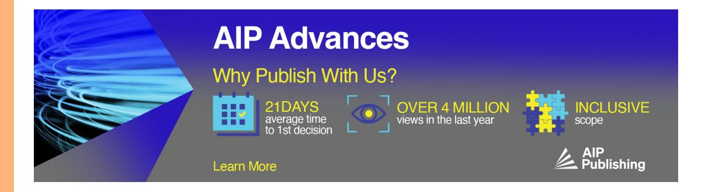
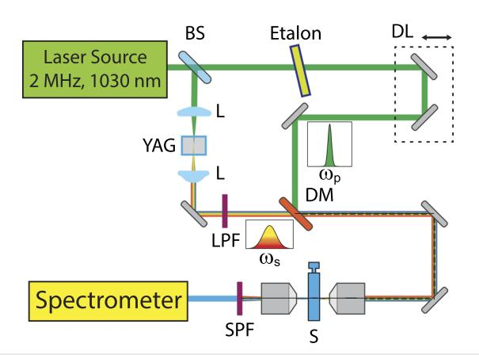
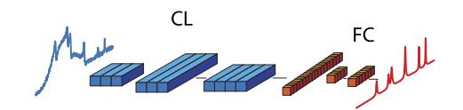
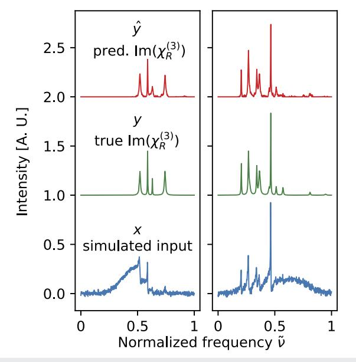
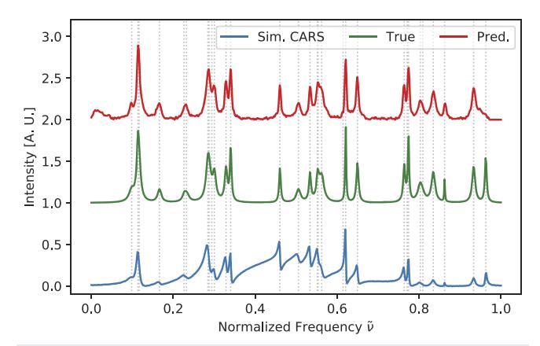
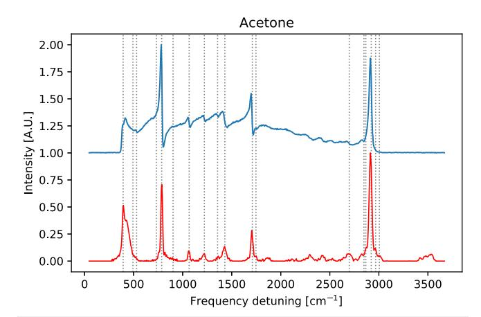
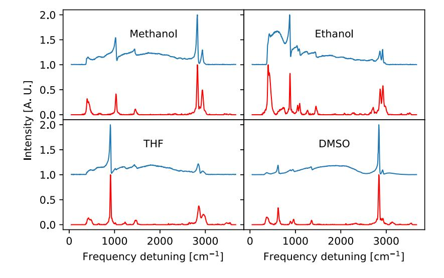
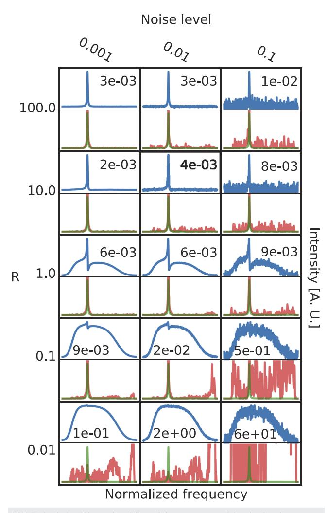

LETTER | JUNE 25 2020

# Removing non-resonant background from CARS spectra via deep learning

C. M. Valensise; A. Giuseppi 💿 ; F. Vernuccio; A. De la Cadena; G. Cerullo 🗓 ; D. Polli 🗷 👵

APL Photonics 5, 061305 (2020) https://doi.org/10.1063/5.0007821

## Articles You May Be Interested In

Removing non-resonant background of CARS signal with generative adversarial network Appl. Phys. Lett. (June 2024)

Direct recognition of Raman spectra without baseline correction based on deep learning AIP Advances (August 2022)

Fast discrimination of tumor and blood cells by label-free surface-enhanced Raman scattering spectra and deep learning

J. Appl. Phys. (March 2021)

# Removing non-resonant background from CARS spectra via deep learning

Cite as: APL Photon. 5, 061305 (2020); doi: 10.1063/5.0007821 Submitted: 16 March 2020 • Accepted: 8 June 2020 •

Published Online: 25 June 2020

C. M. Valensise, 1,a) A. Giuseppi, 2,b) F. Vernuccio, A. De la Cadena, G. Cerullo, and D. Polli C. D. Polli C. D. Polli C. D. Polli C. D. Polli C. D. Polli C. D. Polli C. D. Polli C. D. Polli C. D. Polli C. D. Polli C. D. Polli C. D. Polli C. D. Polli C. D. Polli C. D. Polli C. D. Polli C. D. Polli C. D. Polli C. D. Polli C. D. Polli C. D. Polli C. D. Polli C. D. Polli C. D. Polli C. D. Polli C. D. Polli C. D. Polli C. D. Polli C. D. Polli C. D. Polli C. D. Polli C. D. Polli C. D. Polli C. D. Polli C. D. Polli C. D. Polli C. D. Polli C. D. Polli C. D. Polli C. D. Polli C. D. Polli C. D. Polli C. D. Polli C. D. Polli C. D. Polli C. D. Polli C. D. Polli C. D. Polli C. D. Polli C. D. Polli C. D. Polli C. D. Polli C. D. Polli C. D. Polli C. D. Polli C. D. Polli C. D. Polli C. D. Polli C. D. Polli C. D. Polli C. D. Polli C. D. Polli C. D. Polli C. D. Polli C. D. Polli C. D. Polli C. D. Polli C. D. Polli C. D. Polli C. D. Polli C. D. Polli C. D. Polli C. D. Polli C. D. Polli C. D. Polli C. D. Polli C. D. Polli C. D. Polli C. D. Polli C. D. Polli C. D. Polli C. D. Polli C. D. Polli C. D. Polli C. D. Polli C. D. Polli C. D. Polli C. D. Polli C. D. Polli C. D. Polli C. D. Polli C. D. Polli C. D. Polli C. D. Polli C. D. Polli C. D. Polli C. D. Polli C. D. Polli C. D. Polli C. D. Polli C. D. Polli C. D. Polli C. D. Polli C. D. Polli C. D. Polli C. D. Polli C. D. Polli C. D. Polli C. D. Polli C. D. Polli C. D. Polli C. D. Polli C. D. Polli C. D. Polli C. D. Polli C. D. Polli C. D. Polli C. D. Polli C. D. Polli C. D. Polli C. D. Polli C. D. Polli C. D. Polli C. D. Polli C. D. Polli C. D. Polli C. D. Polli C. D. Polli C. D. Polli C. D. Polli C. D. Polli C. D. Polli C. D. Polli C. D. Polli C. D. Polli C. D. Polli C. D. Polli C. D. Polli C. D. Polli C. D. Polli C. D. Polli C. D. Polli C. D. Polli C. D. Polli C. D. Polli C. D. Polli C. D. Polli C. D. Polli C. D. Polli C. D. Polli C. D. Polli C. D. Polli C. D. Polli C. D. Polli C. D. Polli C. D. Polli C. D. Polli C. D. Polli C. D. Polli C. D. Polli C. D. Polli C. D. Polli C

#### **AFFILIATIONS**

- Department of Physics, Politecnico di Milano, Piazza Leonardo da Vinci 32, 20133 Milan (IT), Italy
- 2University of Rome "La Sapienza", Department of Computer, Control and Management Engineering (DIAG) "Antonio Ruberti", Via Ariosto 25, 00185 Rome, Italy

**Note:** This article is part of the APL Photonics special topic on Photonics and AI.

- a) E-mail: carlo.valensise@polimi.it
- b) E-mail: giuseppi@diag.uniromal.it
- c) Author to whom correspondence should be addressed: dario.polli@polimi.it

#### **ABSTRACT**

Broadband Coherent Anti-Stokes Raman Scattering (B-CARS) is a powerful label-free nonlinear spectroscopy technique allowing one to measure the full vibrational spectrum of molecules and solids. B-CARS spectra, however, suffer from the presence of a spurious signal, called non-resonant background (NRB), which interferes with the resonant vibrational one, distorting the line shapes and degrading the chemical information. While several numerical techniques are available to remove this unwanted contribution and extract the resonant vibrational signal of interest, they all require the user's intervention and sensitively depend on the spectral shape of the NRB, which needs to be measured independently. In this work, we present a novel approach to remove NRB from B-CARS spectra based on deep learning. Thanks to the high generalization capability offered by the deep architecture of the designed neural network, trained through realistic simulated spectra, our fully automated model is able to process B-CARS spectra in real time and independently of the detailed shape of the NRB spectrum. This results in fast extraction of vibrational spectra without requiring user intervention or the measurement of reference spectra. We expect that this model will significantly simplify and speed-up the analysis of B-CARS spectra in spectroscopy and microscopy.

© 2020 Author(s). All article content, except where otherwise noted, is licensed under a Creative Commons Attribution (CC BY) license (http://creativecommons.org/licenses/by/4.0/). https://doi.org/10.1063/5.0007821

#### I. INTRODUCTION

In the last two decades, Coherent Raman Scattering (CRS)1 has emerged as a class of powerful third-order nonlinear spectroscopy techniques capable of measuring the vibrational response of molecules and solids. CRS has found applications in biomedical optics, for label-free imaging of cells and tissues,2,3 as well as in materials science and nanotechnology. 4 CRS uses two synchronized pulses, the pump (at frequency  $\omega_p$ ) and the Stokes (at frequency  $\omega_S$ ), detuned by  $\omega_P - \omega_S = \Omega$ , to create a coherent superposition of vibrational oscillators at a frequency  $\Omega$ . The two most common CRS techniques, which correspond to different ways of reading the vibrational coherence, are Coherent Anti-Stokes Raman Scattering5 (CARS) and Stimulated Raman Scattering (SRS).6-8 In CARS, a further interaction with the pump pulse generates a signal at the

anti-Stokes frequency  $\omega_{aS} = \omega_p + \Omega = 2\omega_p - \omega_S$ . In SRS, the nonlinear signal is read as amplification of the Stokes beam (stimulated Raman gain) or depletion of the Stokes beam (stimulated Raman loss). Both CARS and SRS work very well in the narrowband mode, where the signal at only one vibrational frequency is detected, reaching imaging speeds up to the video rate.9,10 However, the limited amount of spectroscopic information available with narrowband CRS has prompted efforts to extend it to broadband operation.

Broadband CARS (B-CARS) combines a narrow-band (10-20 cm-1 bandwidth) pump pulse with a broadband (≈3000 cm-1 bandwidth) Stokes pulse in order to generate a coherence in an ensemble of vibrational levels simultaneously. The two pulses, spatially and temporally overlapped, are focused onto the sample. The CARS signal is detected with a spectrometer after removal of pump and Stokes light, through steep-edge short-pass filters. Since CARS is a homodyne technique, 12 the measured signal is proportional to

$$I_{CARS}(\omega) \propto \left| \chi^{(3)}(\omega) \right|^{2}$$

$$= \left| \chi_{R}^{(3)}(\omega) + \chi_{NR}^{(3)}(\omega) \right|^{2}$$

$$= \left| \chi_{R}^{(3)}(\omega) \right|^{2} + \chi_{NR}^{(3)}(\omega)^{2} + 2 \operatorname{Re} \left( \chi_{R}^{(3)}(\omega) \right) \chi_{NR}^{(3)}(\omega), \quad (1)$$

where  $\chi_R^{(3)}(\omega)$  is the complex vibrational susceptibility that contains the chemical information about the sample. This quantity can be modeled as

$$\chi_R^{(3)}(\omega) = \sum_i \frac{A_i}{\Omega_i - \omega - i\Gamma_i},$$
 (2)

where, for the *i*th resonance, the amplitude  $A_i \propto \sigma_i C_i$  is proportional to the cross section  $(\sigma_i)$  and to the concentration of scatterers  $(C_i)$ ,  $\Omega_i$  represents the vibrational frequency, and  $\Gamma_i$  represents the linewidth. On the other hand,  $\chi_{NR}^{(3)}(\omega)$  can generally be assumed as a purely real contribution that mediates the nonlinear interaction of the excitation beams with the sample and the surrounding environment. One should note that, for certain pigments or metabolites of biological tissues, this assumption may not hold, since two-photon absorption may occur, bringing also an imaginary contribution to  $\chi_{NR}^{(3)}$ .

To identify the vibrational frequencies, quantify their linewidths and amplitudes, and allow a direct comparison with spontaneous Raman spectra, one would like to retrieve the imaginary part of the resonant susceptibility,  $\operatorname{Im}(\chi_R^{(3)}(\omega))$ , which consists of a series of Lorentzian peaks at frequencies  $\Omega_i$ . Unfortunately,  $\chi_{NR}^{(3)}(\omega)$  (from here onward assumed for simplicity to be purely real) gives rise to a broadband optical signal, the non-resonant background (NRB), which mixes with the resonant one such that the resulting CARS spectrum shows a rather complicated profile, depending on the relative ratio of the two components. This effect is particularly relevant in the so-called low wavenumber (LWN) or *fingerprint* region (600–1800 cm-1), which is the most important frequency interval for chemical identification. In the LWN, very often, one has  $\chi_R^{(3)}(\omega) \ll \chi_{NR}^{(3)}(\omega)$  so that the B-CARS spectrum becomes

$$I_{CARS}(\omega) \propto \chi_{NR}^{(3)2}(\omega) + 2\text{Re}\left(\chi_R^{(3)}(\omega)\right)\chi_{NR}^{(3)}(\omega).$$
 (3)

In this case, the presence of the NRB has two effects: (i) it heavily distorts the vibrational peaks, which now become proportional to  $\text{Re}(\chi_R^{(3)}(\omega))$  and thus assume a dispersive line shape, and (ii) it acts as a local oscillator, phase-locked to the resonant signal, which results in its heterodyne amplification through the term  $2\text{Re}(\chi_R^{(3)}(\omega))\chi_{NR}^{(3)}(\omega)$  and allows the detection of comparatively weak vibrational peaks. 13

Several techniques have been adopted to deal with the NRB. For the narrowband operating mode, interferometric CARS, 14,15 frequency modulation CARS, 16 and polarization CARS17 allow suppressing the NRB but at the cost of a significant experimental complication and/or signal reduction. For the broadband mode, time-resolved CARS18 and Fourier transform CARS19–21 allow NRB suppression but again at the cost of increased experimental complexity

and reduced signal levels. An alternative approach is to use numerical techniques to extract  $\mathrm{Im}(\chi_R^{(3)}(\omega))$  from the measured B-CARS spectra. Among them, the maximum entropy method (MEM $^{22,23}$ ) and the Time-Domain Kramers–Kronig transform (TDKK $^{24}$ ) tackle the problem from different standpoints but were demonstrated to be functionally equivalent.  $^{25}$ 

The MEM method requires measuring the CARS spectrum of a reference sample without any vibrational resonances to obtain the normalized spectrum

$$S(\omega) = \left| \frac{\chi_R^{(3)}(\omega) + \chi_{NR}^{(3)}(\omega)}{\chi_{NR \text{ ref}}^{(3)}(\omega)} \right|^2.$$
 (4)

This spectrum is then approximated as

$$S(\nu) = \left| \frac{\beta}{1 + \sum_{i=1}^{M} a_k \exp(-2\pi i \nu)} \right|^2 = \left| \frac{\beta}{A_M(\nu)} \right|^2, \tag{5}$$

where v is a normalized frequency and the complex coefficients  $\{\beta, a_i, i=1\dots M\}$  are retrieved by solving a Toeplitz set of linear equations with coefficients obtained by a discrete Fourier transform of the CARS spectrum at a set of frequencies. The spectral phase can be then retrieved as  $\psi(v)=\arg(A_M(v))$ . A polynomial fit of its baseline is then used to estimate the background phase  $\phi(v)$ , calculate the true vibrational phase as  $\theta(v)=\phi(v)+\psi(v)$ , and finally retrieve  $\mathrm{Im}(\chi_R^{(3)}(v))=\sqrt{S(v)}\sin(\theta(v))$ . The main issue of this method is related to the compromise in the choice of M, i.e., the order of the approximation, which has to be balanced between the contrasting requirements of large information content (large M) and low noise (small M). Moreover, the assumption under which the phase correction is justified is rather restrictive, requiring  $\mathrm{Im}(\chi_R^{(3)}(\omega)) \ll (\chi_{NR}^{(3)}(\omega) + \mathrm{Re}(\chi_R^{(3)}(\omega)))$ , which is not always the case, especially for broad spectra, with a non-uniform  $\chi_{NR}^{(3)}(\omega)$  profile

The TDKK method is based on the Kramers–Kronig transform, which links the real and imaginary parts of a complex function. The method aims at estimating the spectral phase from  $\log(I_{CARS}(\omega))$ , through a discrete Hilbert transform, taking into account the causality condition. The TDKK approach is more suited to describe the case of the non-uniform spectral density of the NRB. Even TDKK requires an independent measurement of the NRB to be used as a reference, thus some *a priori* knowledge about the investigated sample, as well as pre-processing steps to be applied to the measured spectra, which may affect the computation speed. 26

Statistical Learning and related techniques (machine learning and deep learning) are experiencing an unprecedented growth in terms of application fields and accuracy of the results, thanks to the ever-increasing availability of computing capacities of modern hardware solutions and to their high generalization capabilities. Even in the broad field of spectroscopy, the applications of these techniques are numerous: molecular excitation spectroscopy, calibration invariant spectroscopy, vibrational spectroscopy, and scanning probe microscopy. Deep Learning (DL), in particular, is attracting a significant interest from the scientific community, thanks to its ability to address heavily nonlinear problems by automatically extracting information from big amounts of data,

requiring minimal feature extraction procedures, or even analyzing directly the raw data. Deep learning has also been applied to CARS microscopy34 to perform automated lung cancer diagnosis.

In this paper, we present a deep learning-based approach to extract  $\mathrm{Im}(\chi_R^{(3)}(\omega))$  directly from a measured B-CARS spectrum, without the need of external measurements or complex preprocessing. Our model, built as a convolutional neural network (CNN) with seven hidden layers, is tested on a series of solvents and accurately retrieves their Raman spectra. After suitable training, the program is able to autonomously process a B-CARS spectrum in a time as short as 0.1 ms.

#### II. EXPERIMENTAL SETUP

The scheme of our B-CARS setup is shown in Fig. 1. A fiberbased ytterbium laser system (Monaco, Coherent) provides ≈300 fs pulses at 1030 nm at 2 MHz repetition rate and an average power, for this experiment, of ≈5 W. A fraction of the fundamental beam is used to generate the narrow-band pump beam. In order to achieve enough spectral resolution, the beam is frequency filtered by passing it through an etalon (TecOptics), which narrows its bandwidth down to  $10 \text{ cm}^{-1}$  ( $\approx 1.1 \text{ nm}$ ), to match the typical linewidths of vibrational peaks. Another portion of the fundamental beam produces the broadband Stokes pulse via bulk White Light Continuum (WLC) generation35 in a 6-mm-thick YAG crystal. The red shifted portion of the WLC, selected by a long-pass filter and covering the 1050-1500 nm wavelength range, acts as a broadband Stokes pulse. The pump-Stokes frequency detuning thus spans 450 cm-1-3050 cm- and is sufficient to cover both the LWN (600 cm-1-1800 cm- and the High Wavenumber (HWN) region (2500 cm-1-3000 cm-1). Pump and Stokes pulses are matched in space and time by a delay line and a dichroic combiner and focused through a pair of objectives (20×, 0.3 NA, ≈1 cm working distance) on the sample; the power is ≈60 mW for the pump pulse and ≈30 mW for the Stokes pulse. After the interaction, the CARS signal is spectrally selected by a pair of short-pass filters and focused into a spectrometer (OceanInsight, USB2000) with a 50 mm lens. The acquisition time for the B-CARS spectra is 3 ms, limited by the minimum exposure time of

**FIG. 1.** Scheme of the experimental setup. BS: beam splitter; DL: delay line; L: lens; L(S)PF: long(short)-pass filter; DM: dichroic mirror; S: sample.

the spectrometer. The detected signal is then processed by the neural network presented in Sec.  $\overline{\text{III}}$ .

#### III. DEEP LEARNING CARS

A neural network (NN) is a nonlinear mathematical model able to approximate a map between a set of given inputs x and a set of given outputs y, which constitute a dataset  $D = \{(x_i, y_i), i = 1 \dots M\}$ . In general, NNs are composed by a group of *nodes*, or *neurons*, stacked together into *layers*. Each neuron takes as input a weighted sum of the output of the neurons of the previous layer and applies to it a nonlinear *activation function* to compute its output, which is then propagated to the following layers. Layers between the input and the output are called *hidden* layers, and their number determines the depth of the network. NNs learn from the data they are provided by a training process, in which a given functional cost (loss) of the network output is optimized, over the given dataset D, through the so-called *backpropagation* 36 algorithm.

Several specialized NN architectures and layers were proposed in the literature37 to address different problems, ranging from time-series prediction38 to image recognition39 and synthetic data generation.40 For our purposes, a Convolutional Neural Network41 (CNN) has been developed, as illustrated schematically in Fig. 2, with the task of removing NRB from CARS spectra.

A CNN comprises, in its most basic form, two main types of layers: convolutional layers (CLs) followed by fully connected layers (FCs). CLs are generally used in image analysis to recognize patterns regardless of their positioning in the input (e.g., identify if a certain object is in any position of the input picture). In CLs, each neuron (also called filter in CNNs) is connected only to a limited subset of neighboring neurons from the previous layer and shares its weights with all the other neurons of the layer. The main advantage of such a kind of layer is the significant reduction in the number of network parameters, which in turn simplifies the back propagation. Another advantage, derived from the shared weights among filters, is the ability to extract information from the input in a spatially invariant way and is of particular interest for the problem presented in this paper as Raman peaks can appear in any location of the spectrum. CNNs were observed to be able to automatically generate different representations of the input data,42 referred to as feature maps in the literature, whose complexity increases with the number of layers and the depth of the network. On the other hand, FCs have no restrictions on the connections to the previous layer and their corresponding weights; they are utilized to generalize the information discovered previously by CLs and to correlate the feature maps derived from the input. The importance of FCs is related to the corner stone of deep-learning modeling: the universal approximation theorem. 43 According to such a theorem, a NN with a single hidden FC with an

**FIG. 2**. Concept of the neural network used to remove NRB from a B-CARS spectrum (blue curve). CL: convolutional layers, with different kernel size and number of filters; FC: fully connected layers. The output is a clean spectrum (red curve).

infinite number of neurons and a non-polynomial activation function is a universal approximator. To mimic such an infinitely large hidden layer, more finite layers can be stacked sequentially into deep architectures. The complexity of a model can be tuned by acting on its *hyperparameters*, 44 e.g., by choosing the amount of nodes and layers, to achieve a high prediction accuracy while avoiding overfitting, which is the tendency of the model to specialize too much its weights to the training dataset only and losing generalization capability.

We developed a DL model called *SpecNet* to extract vibrational information from B-CARS spectra. Its architecture is inspired from the most classical CNN architectures, such as LeNets, 45 and exploits both the richness of representations obtained by the CLs and the correlating capabilities of FCs. The related code is entirely available online.46 The training of the model (described in Appendix A) is performed exploiting a large dataset of simulated spectra, based on Eqs. (1) and (2). Each element of the training dataset is built by randomly sampling the number of Lorentzian components N (up to 15) and, for each of them, the corresponding amplitude, resonance frequency, and linewidth. The NRB is simulated by the combination of two sigmoid functions (see Appendix A) whose parameters are also randomly sampled. This allows us to produce a model with high generalization capability, by learning from a dataset that encompasses a rather large number of experimental scenarios, especially for what concerns the NRB spectral contribution. In fact, although it is often modeled as frequency independent, the NRB displays a far from trivial frequency dependence  $\chi_{NR}^{(3)}(\omega)$ , which is determined by the specific characteristics of each experimental setup. Such a spectrum, to which also Gaussian noise is added to simulate a realistic B-CARS spectrum, is the input vector x for the neural network [see Eq. (A2)]. The target vector, y, which the model aims to reproduce, is y  $\equiv \operatorname{Im}(\chi_R^{(3)}(\omega))$ . Model's prediction is named as  $\hat{y}$ . Figure 3 reports

**FIG. 3**. Examples of simulated spectra (x, blue curves) together with the corresponding true  $\operatorname{Im}(\chi_R^{(3)}(\omega))$  (y, green curves) and the predicted output by the model  $(\hat{y},$  red curves).

two simulated spectra together with the corresponding imaginary components and model predictions. Note how the frequencydependent background contribution produces different levels of spectral distortion, depending on the local ratio  $\chi_R^{(3)}(\omega)/\chi_{NR}^{(3)}(\omega)$ . Note also how the NRB contribution is different between the two examples, in terms of spectral shape. The capability of a model to generalize with respect to different background conditions is crucial for B-CARS experiments performed with WLC, generated either in bulk or in a fiber, 47-49 since the optimal condition for the generation of the broadband pulse and its detailed spectral content may vary with time according to the environmental conditions. Finally, note that the normalization of the spectrum does not fix its maximum value to be 1. This is crucial in order to be able to use the model to process a batch of spectra, as, for example, in a B-CARS image, whose intensities have to be compared, by normalizing all the curves to the global maximum of the batch such that all the other amplitudes are in the (0, 1) range.

Thanks to the capability of convolutional layers to handle spatial invariance, i.e., to recognize similar structures in different locations of the input, although the model was trained with a maximum number of features N=15, it performs well even if the number of features is larger. In Fig. 4, a simulated B-CARS spectrum with 30 vibrational features is processed with our CNN. The predicted  $\operatorname{Im}(\chi_R^{(3)}(\omega))$  shows a very good agreement with the true one.

The final architecture was obtained after a model selection procedure based on a 10-fold cross-validation on a training dataset of 30 000 simulated spectra of 640 points each. SpecNet consists of five 1-dimensional CLs with 128, 64, 16, 16, and 16 filters of dimensions 32, 16, 8, 8, and 8, respectively, followed by three FCs of 32, 16, and 640 neurons (as the output is expected to have the same dimensions as the input). All layers had a  $ReLU^{44}$  (rectified Linear Unit) activation function. The resulting total number of trainable parameters was approximately six  $\times$  106. The loss function chosen was the mean squared error (MSE) between the true target vector y and the predicted one  $\hat{y}$ . To avoid overfitting and reduce the sensitivity of the model to noise, we utilized L2 weight regularization  $\frac{44}{y}$ 

**FIG. 4.** Simulated spectrum with 30 vibrational features. The resonant frequencies are indicated by the vertical dotted lines. Top panel: simulated B-CARS spectrum. Bottom panel: true corresponding imaginary  $\operatorname{Im}(\chi_R^{(3)}(\omega))$  (green curve); model prediction (red curve).

on the weights of the first fully connected layer with a weight of  $5 \cdot 10^{-4}$ . The back propagation was performed using Adam44 with a batch size of 256 examples. The entire training procedure required 10 epochs, each taking about 5 s [running on an RTX 2060 graphics processing unit (GPU)]. The computing time required to process a spectrum, averaged over 100 000 examples, is about 0.1 ms, which is much shorter than the current state of the art for the acquisition time of a B-CARS spectrum, around 3.5 ms for a biological tissue sample.26 The NN was implemented by Keras,50 and the reader is referred to the code available online,46 together with the trained model, for additional details on the network implementation.

#### **IV. EXPERIMENTAL RESULTS**

In this section, we demonstrate the ability of our model to extract the vibrational spectrum,  $\operatorname{Im}(\chi_{\scriptscriptstyle R}^{(3)}(\omega))$ , from measured B-CARS spectra. We used pure solvents, held in a 1 mm-thick quartz cuvette, as test samples. Figure 5 reports the B-CARS measurement on acetone. From the spectrum, it is clear that the vibrational features in the LWN region are heavily distorted by the NRB contribution, while in the HWN region, around 2900  $\,\mathrm{cm}^{-1}$ , its contribution is reduced. These vibrations, in fact, are excited by the 1500 nm component of the Stokes beam, which lies in the tail of the WLC spectral lobe and therefore has a lower spectral density. The red curve in Fig. 5 corresponds to  $\operatorname{Im}(\chi_R^{(3)}(\omega))$ , predicted by the Spec-Net. The model is able to accurately retrieve all the vibrational features present in the spectrum. Notably, some of the peaks in the fingerprint region are very small, even if their presence is clear by looking at the CARS spectrum. This effect is due to the interference term of Eq. (1) that results in a heterodyne amplification to the signal. All the retrieved peaks are in agreement with spontaneous Raman spectra in the literature.51,52 The correspondence for the most clear peaks is reported in Table I. Due to the limited spectral resolution, not all the features are clearly resolved, especially in congested regions (e.g., around 2900 cm-1). Nevertheless, it is possible to see the shoulder-like shapes that correspond to those vibrational modes. Some spurious contributions are retrieved in the so-called "silent-region" of the vibrational spectrum, between 2000 cm-1 and

FIG. 5. Measured B-CARS (blue) and retrieved (red) vibrational spectrum of acetone. Gray vertical lines represent the Raman resonances for acetone reported in Ref. 51.

**TABLE I.** Amplitude, resonance, and linewidths of the retrieved vibrational features of acetone.

| Frequency (cm -1 ) | Amplitude (a.u.) | $\begin{array}{c} \text{Linewidth} \\ (\text{cm}^{-1}) \end{array}$ | Assignment                               |
|-------------------------------|------------------|---------------------------------------------------------------------|------------------------------------------|
| 787                           | 0.71             | 23                                                                  | CC 2 symmetrical stretch      |
| 1066                          | 0.09             | 25                                                                  | CH 3 rock                     |
| 1217                          | 0.07             | 36                                                                  | CC 2 anti-symmetrical stretch |
| 1427                          | 0.13             | 43                                                                  | CH 3 asymmetrical stretch     |
| 1703                          | 0.28             | 28                                                                  | C=O stretch                              |
| 2914                          | 1                | 35                                                                  | CH 3 stretch                  |

2500 cm-1, due to some oscillatory features in the WLC spectrum that are translated to the NRB shape. The small peaks expected at 393 cm-1, 493 cm-1, and 530 cm-1 are overwhelmed by a strong contribution around 467 cm-1, which is attributed to the quartz53,54

**FIG. 6.** Measured B-CARS spectra of different solvents (blue curves) reported with a small vertical offset and retrieved  $\operatorname{Im}(\chi_{\mathbb{R}}^{(3)}(\omega))$  (red curves).

of the cuvette, excited together with the sample due to the long working distance (≈1 cm) of the employed objectives, resulting in a long Rayleigh range. This contribution is also present in the measurements performed on other solvents (shown in Fig. 6) with different amplitudes due to variations in the alignment of the B-CARS signal in the spectrometer.

To validate the capability of SpecNet to handle different NRB spectral shapes, the experimental conditions under which each solvent was measured were slightly modified (e.g., by longitudinal translation of the YAG crystal used for WLC generation). The results show that the model is able to correctly retrieve  $\operatorname{Im}(\chi_{\scriptscriptstyle R}^{(3)}(\omega))$ independently of the details of the NRB.

#### V. CONCLUSIONS

We presented a deep learning model called SpecNet that enables one to remove the non-resonant background contribution from broadband CARS spectra. The model is built as a convolutional neural network with seven hidden layers. The training was performed on a simulated dataset that allows a high generalization capability to different spectral shapes of the non-resonant background. We presented an experimental setup for broadband CARS, covering both the fingerprint region and the high wavenumber region. The performances of SpecNet were assessed on real measured data, which the model was able to correctly process retrieving all the relevant vibrational peaks of different solvent specimens. Once trained, the model retrieves  $\operatorname{Im}(\chi_R^{(3)}(\omega))$  from the CARS spectrum in a time of 0.1 ms, which is faster than the time required to record the spectrum, and does not need the independent measurement of a reference sample or any manual intervention by the operator. We believe that our approach will significantly speed-up B-CARS imaging, allowing for an on-line retrieval of the vibrational features. This could be implemented, for example, in parallel during the integration time of the next pixel so that no time is lost for the spectral processing at all, thus considerably reducing the processing time24 of CARS hyperspectral images.

### **ACKNOWLEDGMENTS**

This work was supported by the European Research Council Consolidator Grant VIBRA (Grant No. ERC-2014-CoG 648615), the Horizon2020 GRAPHENE Flagship (881603), the Regione Lombardia project NEWMED (Grant No. POR FESR 2014-2020), and "Coherent H2 Raman Metrology" CH2ROME project (R164WYYR8N).

#### APPENDIX A: SIMULATED SPECTRA

The procedure to build the input vector *x* is here described in some detail. The SpecNet model accepts simulated and measured CARS spectra whose intensity  $I \in [0, 1]$ . The frequencies are defined in a normalized interval  $\tilde{v} \in [0, 1]$ , where

$$\tilde{v} = \frac{v - v_{max}}{v_{max} - v_{min}},$$

where  $v_{mix}$  and  $v_{max}$  are the frequencies corresponding to the extrema of the CARS spectrum (see Sec. II). The generation of a

simulated broadband CARS spectrum requires the sampling of several random numbers, starting from the number N of Lorentzian peaks that are present in the spectrum, whose maximum is fixed to

$$N \sim U(1, 15),$$

where U denotes the uniform distribution. For each Lorentzian component, the amplitude, the resonance frequency, and the linewidth are sampled from the following distributions:

$$A_i \sim U(0.01, 1),$$
  
 $\Omega_i \sim U(0, 1),$   
 $\Gamma_i \sim U(0.001, 0.008)$ 

with  $i = 1 \dots N$ . The range for the linewidths is chosen to cover the typical vibrational linewidth range 1 cm-1-20 cm-1 to the normalized frequency axis. Next, the simulated  $\chi_R^{(3)}(\tilde{\nu})$  is computed through Eq. (2) and normalized by  $\max |\chi_R(\tilde{\nu})|$ . The normalization ensures that

$$\max\Bigl(\mathrm{Im}\Bigl(\chi_R^{(3)}\Bigr)\Bigr)=1.$$

To avoid restrictions to the flexibility of the model,  $\chi_R^{(3)}$  is multiplied by a random number  $r \sim U(0.3, 1)$  to ensure that diverse examples of vibrational amplitudes are present in the training set.

 $\chi_{NR}(\tilde{\nu})$  is simulated as the product of two sigmoid functions,

$$\chi_{NR}(\tilde{\nu}) = \sigma_1(\tilde{\nu}) \, \sigma_2(\tilde{\nu}) \tag{A1}$$

with

$$\sigma_i(\tilde{v}) = \frac{1}{1 + \exp(-(\tilde{v} - c_i) s_i)}.$$

The parameters  $\{c_i, s_i, i = 1, 2\}$  are randomly sampled in order to generate a non-uniform background distribution across the spectral range, whose amplitude is in the (0, 1) range. The variability of the background shapes that are generated through Eq. (A1) ensures a high generalization capability of the model. Refer to the code46 for full numerical details.

Finally, the input vector *x* is computed as

$$x = \frac{\left| r \chi_R^{(3)}(\tilde{v}) + \chi_{NR}^{(3)}(\tilde{v}) \right|^2}{2} + \varepsilon(\tilde{v}), \tag{A2}$$

where  $\varepsilon$  is the noise component, normally distributed  $\varepsilon \sim N(0, 1)$ s), where s is chosen to properly mimic real experimental noise. The factor 2 normalizes the simulated spectrum to the maximum possible value, which is obtained for a vibrational resonance  $\tilde{v}_{res}$  if

$$\max\Bigl(\mathrm{Im}\Bigl(\chi_R^{(3)}\bigl(\tilde{\nu}_{res}\bigr)\Bigr)\Bigr)=1$$

and

$$\max\left(\chi_{NR}^{(3)}\right)=1,$$

being  $\operatorname{Re}(\chi_R^{(3)}(\tilde{\nu}_{res})) = 0$ . This normalization ensures that the spectrum intensity is comprised in the (0, 1) range without fixing the maximum value of each spectrum to 1. This is crucial to make the model be able to extract  $\operatorname{Im}(\chi_R)$  from intensity-related spectra, without losing the information encoded in the peak relative intensities.

The corresponding imaginary part, which represents the quantity to be output by the model, is given by

$$y = \operatorname{Im}(r \, \chi_R). \tag{A3}$$

#### **APPENDIX B: SNR ANALYSIS**

The SpecNet model is able to retrieve small vibrational features, as shown in Figs. 5 and 6. There are two factors that limit the correct retrieval, namely, the amount of NRB and the random noise that affects the measurements. If  $\chi_{NR}^{(3)} \gg \chi_R^{(3)}$ , then the shape of the vibrational feature may be completely overwhelmed, preventing the correct retrieval. On the other hand, noisy environmental conditions may cause the model to detect false peaks, producing a noisy outcome. To quantitatively assess the incidence of these two

FIG. 7. Analysis of the retrieval. In each box are reported the simulated spectrum (blue curve), the true corresponding spontaneous Raman spectrum (green curve), and the one retrieved by the model (red curve). The Mean Square Error (MSE) is reported in each panel to evaluate the performances of the model for each noise configuration.

factors on the retrieval capability of the deep learning model, we performed a study on a simulated spectrum with a single feature as a function of the ratio  $R = \chi_R^{(3)}/\chi_{NR}^{(3)}$ , computed in resonance ( $\omega = \Omega$ ), and the rms noise added to the spectrum. The goodness of the predicted outcome is evaluated as the mean square error (MSE). In Fig. 7 are reported the results. The Gaussian noise varies along the columns, while *R* varies along the rows. For each configuration, the corresponding MSE between the true and retrieved spectra is reported. This analysis shows that even for very noisy spectral traces, the retrieval works fine, provided that the vibrational signal is not completely overwhelmed by NRB.

#### **DATA AVAILABILITY**

The data that support the findings of this study are available from the corresponding author upon reasonable request.

#### REFERENCES

1 J.-X. Cheng and X. S. Xie, "Vibrational spectroscopic imaging of living systems: An emerging platform for biology and medicine," Science 350, aaa8870 (2015).

2M. Ji, D. A. Orringer, C. W. Freudiger, S. Ramkissoon, X. Liu, D. Lau, A. J. Golby, I. Norton, M. Hayashi, N. Y. R. Agar, G. S. Young, C. Spino, S. Santagata, S. Camelo-Piragua, K. L. Ligon, O. Sagher, and X. S. Xie, "Rapid, label-free detection of brain tumors with stimulated Raman scattering microscopy," Sci. Transl. Med. 5, 201ra119 (2013).

3T. C. Hollon, B. Pandian, A. R. Adapa, E. Urias, A. V. Save, S. S. S. Khalsa, D. G. Eichberg, R. S. D'Amico, Z. U. Farooq, S. Lewis, P. D. Petridis, T. Marie, A. H. Shah, H. J. L. Garton, C. O. Maher, J. A. Heth, E. L. McKean, S. E. Sullivan, S. L. Hervey-Jumper, P. G. Patil, B. G. Thompson, O. Sagher, G. M. McKhann, R. J. Komotar, M. E. Ivan, M. Snuderl, M. L. Otten, T. D. Johnson, M. B. Sisti, J. N. Bruce, K. M. Muraszko, J. Trautman, C. W. Freudiger, P. Canoll, H. Lee, S. Camelo-Piragua, and D. A. Orringer, "Near real-time intraoperative brain tumor diagnosis using stimulated Raman histology and deep neural networks," Nat. Med. 26, 52 (2020).

4I. Pope, L. Payne, G. Zoriniants, E. Thomas, O. Williams, P. Watson, W. Langbein, and P. Borri, "Coherent anti-Stokes Raman scattering microscopy of single nanodiamonds," Nat. Nanotechnol. 9, 940 (2014).

5A. Zumbusch, G. R. Holtom, and X. S. Xie, "Three-dimensional vibrational imaging by coherent anti-Stokes Raman scattering," Phys. Rev. Lett. 82, 4142

6C. W. Freudiger, W. Min, B. G. Saar, S. Lu, G. R. Holtom, C. He, J. C. Tsai, J. X. Kang, and X. S. Xie, "Label-free biomedical imaging with high sensitivity by stimulated Raman scattering microscopy," Science 322, 1857 (2008).

7P. Nandakumar, A. Kovalev, and A. Volkmer, "Vibrational imaging based on stimulated Raman scattering microscopy," New J. Phys. 11, 033026 (2009).

8H. Rigneault and P. Berto, "Tutorial: Coherent Raman light matter interaction processes," APL Photonics 3, 091101 (2018).

9R. C. Prince and E. O. Potma, "Crossing the arterial wall with CARS," Proc. Natl. Acad. Sci. U. S. A. 114, 4574 (2017).

10B. G. Saar, C. W. Freudiger, J. Reichman, C. M. Stanley, G. R. Holtom, and X. S. Xie, "Video-rate molecular imaging in vivo with stimulated Raman scattering," Science 330, 1368 (2010).

11 D. Polli, V. Kumar, C. M. Valensise, M. Marangoni, and G. Cerullo, "Broadband coherent Raman scattering microscopy," Laser Photonics Rev. 12, 1800020

12J. Cheng and X. Xie, Coherent Raman Scattering Microscopy, Series in Cellular and Clinical Imaging (CRC Press, 2016).

13C. H. Camp, Jr., Y. J. Lee, J. M. Heddleston, C. M. Hartshorn, A. R. H. Walker, J. N. Rich, J. D. Lathia, and M. T. Cicerone, "High-speed coherent Raman fingerprint imaging of biological tissues," Nat. Photonics 8, 627 (2014).

14E. O. Potma, C. L. Evans, and X. S. Xie, "Heterodyne coherent anti-Stokes Raman scattering (CARS) imaging," Opt. Lett. 31, 241 (2006).

- 15M. Jurna, J. P. Korterik, C. Otto, J. L. Herek, and H. L. Offerhaus, "Background free CARS imaging by phase sensitive heterodyne CARS," [Opt. Express](https://doi.org/10.1364/oe.16.015863) **16**, 15863 (2008).
- 16F. Ganikhanov, C. L. Evans, B. G. Saar, and X. S. Xie, "High-sensitivity vibrational imaging with frequency modulation coherent anti-Stokes Raman scattering (FM CARS) microscopy," [Opt. Lett.](https://doi.org/10.1364/ol.31.001872) **31**, 1872 (2006).
- 17J.-X. Cheng, L. D. Book, and X. S. Xie, "Polarization coherent anti-Stokes Raman scattering microscopy," [Opt. Lett.](https://doi.org/10.1364/ol.26.001341) **26**, 1341 (2001).
- 18A. Volkmer, L. D. Book, and X. S. Xie, "Time-resolved coherent anti-Stokes Raman scattering microscopy: Imaging based on Raman free induction decay," [Appl. Phys. Lett.](https://doi.org/10.1063/1.1456262) **80**, 1505 (2002).
- 19J. P. Ogilvie, E. Beaurepaire, A. Alexandrou, and M. Joffre, "Fouriertransform coherent anti-Stokes Raman scattering microscopy," [Opt. Lett.](https://doi.org/10.1364/ol.31.000480) **31**, 480 (2006).
- 20M. Cui, M. Joffre, J. Skodack, and J. P. Ogilvie, "Interferometric Fourier transform coherent anti-Stokes Raman scattering," [Opt. Express](https://doi.org/10.1364/oe.14.008448) **14**, 8448 (2006).
- 21S. Takizawa, K. Hiramatsu, and K. Goda, "Compressed time-domain coherent Raman spectroscopy with real-time random sampling," [Vib. Spectrosc.](https://doi.org/10.1016/j.vibspec.2020.103042) **107**, 103042 (2020).
- 22E. M. Vartiainen, "Phase retrieval approach for coherent anti-Stokes Raman scattering spectrum analysis," [J. Opt. Soc. Am. B](https://doi.org/10.1364/josab.9.001209) **9**, 1209 (1992).
- 23E. M. Vartiainen, H. A. Rinia, M. Müller, and M. Bonn, "Direct extraction of Raman line-shapes from congested CARS spectra," [Opt. Express](https://doi.org/10.1364/oe.14.003622) **14**, 3622 (2006).
- 24Y. Liu, Y. J. Lee, and M. T. Cicerone, "Broadband CARS spectral phase retrieval using a time-domain Kramers–Kronig transform," [Opt. Lett.](https://doi.org/10.1364/ol.34.001363) **34**, 1363 (2009).
- 25M. T. Cicerone, K. A. Aamer, Y. J. Lee, and E. Vartiainen, "Maximum entropy and time-domain Kramers-Kronig phase retrieval approaches are functionally equivalent for CARS microspectroscopy," [J. Raman Spectrosc.](https://doi.org/10.1002/jrs.3169) **43**, 637 (2012).
- 26C. H. Camp, Y. J. Lee, and M. T. Cicerone, "Quantitative, comparable coherent anti-Stokes Raman scattering (CARS) spectroscopy: Correcting errors in phase retrieval," [J. Raman Spectrosc.](https://doi.org/10.1002/jrs.4824) **47**, 408 (2015).
- 27Y. LeCun, Y. Bengio, and G. Hinton, "Deep learning," [Nature](https://doi.org/10.1038/nature14539) **521**, 436 (2015).
- 28K. Ghosh, A. Stuke, M. Todorovic, P. B. Jørgensen, M. N. Schmidt, A. Vehtari, ´ and P. Rinke, "Deep learning spectroscopy: Neural networks for molecular excitation spectra," [Adv. Sci.](https://doi.org/10.1002/advs.201801367) **6**, 1801367 (2019).
- 29M. Chatzidakis and G. A. Botton, "Towards calibration-invariant spectroscopy using deep learning," [Sci. Rep.](https://doi.org/10.1038/s41598-019-38482-1) **9**, 2126 (2019).
- 30J. Yang, J. Xu, X. Zhang, C. Wu, T. Lin, and Y. Ying, "Deep learning for vibrational spectral analysis: Recent progress and a practical guide," [Anal. Chim. Acta](https://doi.org/10.1016/j.aca.2019.06.012) **1081**, 6 (2019).
- 31X. Fan, W. Ming, H. Zeng, Z. Zhang, and H. Lu, "Deep learning-based component identification for the Raman spectra of mixtures," [Analyst](https://doi.org/10.1039/c8an02212g) **144**, 1789 (2019).
- 32N. Borodinov, S. Neumayer, S. V. Kalinin, O. S. Ovchinnikova, R. K. Vasudevan, and S. Jesse, "Deep neural networks for understanding noisy data applied to physical property extraction in scanning probe microscopy," [npj Comput. Mater.](https://doi.org/10.1038/s41524-019-0148-5) **5**, 25 (2019).

- 33Q. Zhang, L. T. Yang, Z. Chen, and P. Li, "A survey on deep learning for big data," [Inform. Fusion](https://doi.org/10.1016/j.inffus.2017.10.006) **42**, 146 (2018).
- 34S. Weng, X. Xu, J. Li, and S. T. C. Wong, "Combining deep learning and coherent anti-Stokes Raman scattering imaging for automated differential diagnosis of lung cancer," [J. Biomed. Opt.](https://doi.org/10.1117/1.jbo.22.10.106017) **22**, 1 (2017).
- 35P. Polynkin and M. Kolesik, "Critical power for self-focusing in the case of ultrashort laser pulses," [Phys. Rev. A](https://doi.org/10.1103/physreva.87.053829) **87**, 053829 (2013).
- 36R. Hecht-Nielsen, "Theory of the backpropagation neural network," in International Joint Conference on Neural Networks (IEEE, 1989), p. 593.
- 37W. Liu, Z. Wang, X. Liu, N. Zeng, Y. Liu, and F. E. Alsaadi, "A survey of deep neural network architectures and their applications," [Neurocomputing](https://doi.org/10.1016/j.neucom.2016.12.038) **234**, 11 (2017).
- 38S. Hochreiter and J. Schmidhuber, "Long short-term memory," [Neural Comput.](https://doi.org/10.1162/neco.1997.9.8.1735) **9**, 1735 (1997).
- 39K. He, X. Zhang, S. Ren, and J. Sun, "Deep residual learning for image recognition," in 2016 IEEE Conference on Computer Vision and Pattern Recognition (CVPR) (IEEE, 2016).
- 40A. Creswell, T. White, V. Dumoulin, K. Arulkumaran, B. Sengupta, and A. A. Bharath, "Generative adversarial networks: An overview," [IEEE Signal](https://doi.org/10.1109/msp.2017.2765202) [Process. Mag.](https://doi.org/10.1109/msp.2017.2765202) **35**, 53 (2018).
- 41A. Krizhevsky, I. Sutskever, and G. E. Hinton, "ImageNet classification with deep convolutional neural networks," [Commun. ACM](https://doi.org/10.1145/3065386) **60**, 84 (2017).
- 42L. A. Gatys, A. S. Ecker, and M. Bethge, "Image style transfer using convolutional neural networks," in 2016 IEEE Conference on Computer Vision and Pattern Recognition (CVPR) (IEEE, 2016).
- 43B. C. Csáji et al., Approximation with Artificial Neural Networks, Faculty of Sciences (Etvs Lornd University, Hungary, 2001), Vol. 24, p. 7.
- 44I. Goodfellow, Y. Bengio, and A. Courville, Deep Learning (MIT Press, 2016).
- 45Y. Lecun, L. Bottou, Y. Bengio, and P. Haffner, "Gradient-based learning applied to document recognition," [Proc. IEEE](https://doi.org/10.1109/5.726791) **86**, 2278 (1998).
- 46See <https://github.com/Valensicv/SpecNet> for the full code of the neural network model.
- 47T. W. Kee and M. T. Cicerone, "Simple approach to one-laser, broadband coherent anti-Stokes Raman scattering microscopy," [Opt. Lett.](https://doi.org/10.1364/ol.29.002701) **29**, 2701 (2004).
- 48B. von Vacano, L. Meyer, and M. Motzkus, "Rapid polymer blend imaging with quantitative broadband multiplex CARS microscopy," [J. Raman Spectrosc.](https://doi.org/10.1002/jrs.1704) **38**, 916 (2007).
- 49H. Kano, T. Maruyama, J. Kano, Y. Oka, D. Kaneta, T. Guerenne, P. Leproux, V. Couderc, and M. Noguchi, "Ultra-multiplex CARS spectroscopic imaging with 1-millisecond pixel dwell time," [OSA Continuum](https://doi.org/10.1364/osac.2.001693) **2**, 1693 (2019).
- 50See <https://keras.io/> for a complete description of the neural network layers.
- 51G. Dellepiane and J. Overend, "Vibrational spectra and assignment of acetone, *ααα* acetone-d3 and acetone-d6," [Spectrochim. Acta](https://doi.org/10.1016/0371-1951(66)80091-7) **22**, 593 (1966).
- 52P. Samyn and G. Schoukens, "Morphologies and thermal variability of patterned polymer films with poly(styrene-co-maleic anhydride)," [Polymers](https://doi.org/10.3390/polym6030820) **6**, 820 (2014).
- 53R. S. Krishnan, "Raman spectrum of quartz," [Nature](https://doi.org/10.1038/155452a0) **155**, 452 (1945).
- 54B. Lafuente, R. T. Downs, H. Yang, and N. Stone, "The power of databases: The RRUFF project," in Highlights in Mineralogical Crystallography (DE GRUYTER, 2016), Chap. 1.